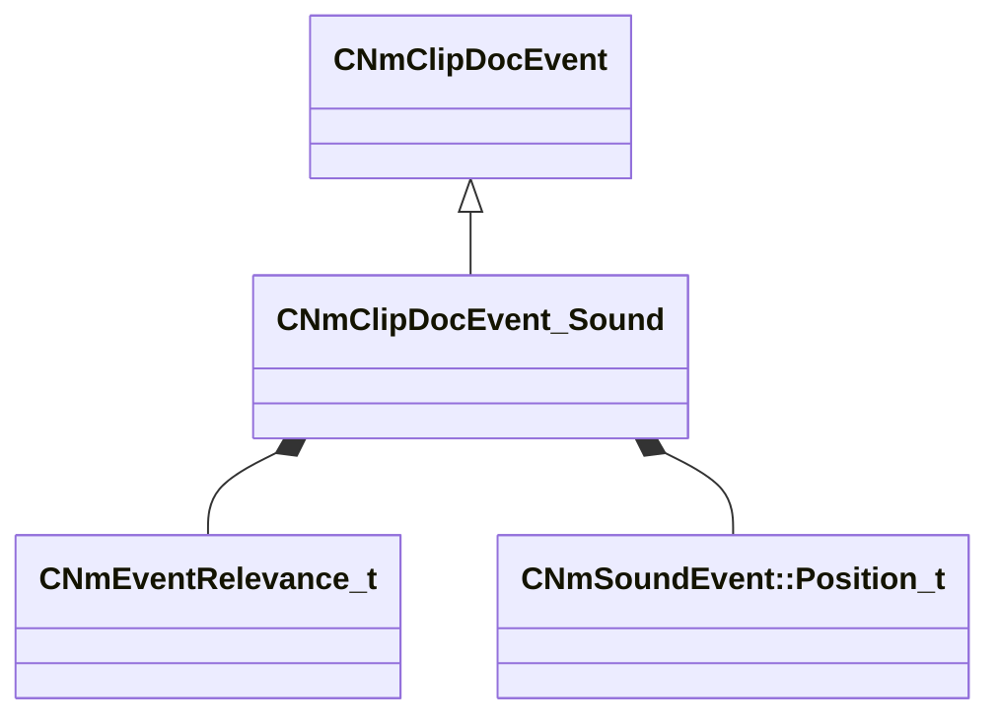

[Schemas](../../schemas.md) / [animdoclib](../animdoclib.md) / CNmClipDocEvent_Sound

# CNmClipDocEvent_Sound

> Source: **Build 25000182** · 2026-08-28 · `windows-x86_64` · schema `0.10.0`

**Kind:** class · **Size:** 64 bytes (`0x40`) · **Align:** 8 · **Module:** animdoclib

**Inherits from:** [CNmClipDocEvent](../animdoclib/CNmClipDocEvent.md)

**Relationships:**

## Memory layout

9 fields (7 declared here, 2 inherited). Offsets are absolute from the object base.

| Offset | Field | Type | From | Annotations |
|--------|-------|------|------|-------------|
| `0x8` | `m_flStartTime` | float32 | [CNmClipDocEvent](../animdoclib/CNmClipDocEvent.md) |  |
| `0xc` | `m_flDuration` | float32 | [CNmClipDocEvent](../animdoclib/CNmClipDocEvent.md) |  |
| `0x10` | `m_relevance` | [CNmEventRelevance_t](../animlib/CNmEventRelevance_t.md) |  |  |
| `0x14` | `m_bContinuePlayingSoundAtDurationEnd` | bool |  | `MPropertyAttrStateCallback` |
| `0x18` | `m_flDurationInterruptionThreshold` | float32 |  | `MPropertyAttrStateCallback` |
| `0x20` | `m_name` | CUtlString |  | `MPropertyAttributeEditor SoundPicker()` `MPropertyStartGroup +Sound` |
| `0x28` | `m_position` | [CNmSoundEvent::Position_t](../animlib/CNmSoundEvent.Position_t.md) |  | `MPropertyStartGroup +Position` |
| `0x30` | `m_attachmentName` | CUtlString |  |  |
| `0x38` | `m_tags` | CUtlString |  | `MPropertyStartGroup +Metadata` |

KV3 class defaults

<pre>{
	&quot;_class&quot;: &quot;CNmClipDocEvent_Sound&quot;,
	&quot;m_flStartTime&quot;: 0.000000,
	&quot;m_flDuration&quot;: 0.000000,
	&quot;m_relevance&quot;: &quot;ClientAndServer&quot;,
	&quot;m_bContinuePlayingSoundAtDurationEnd&quot;: false,
	&quot;m_flDurationInterruptionThreshold&quot;: 0.900000,
	&quot;m_name&quot;: &quot;&quot;,
	&quot;m_position&quot;: &quot;None&quot;,
	&quot;m_attachmentName&quot;: &quot;&quot;,
	&quot;m_tags&quot;: &quot;&quot;
}</pre>

