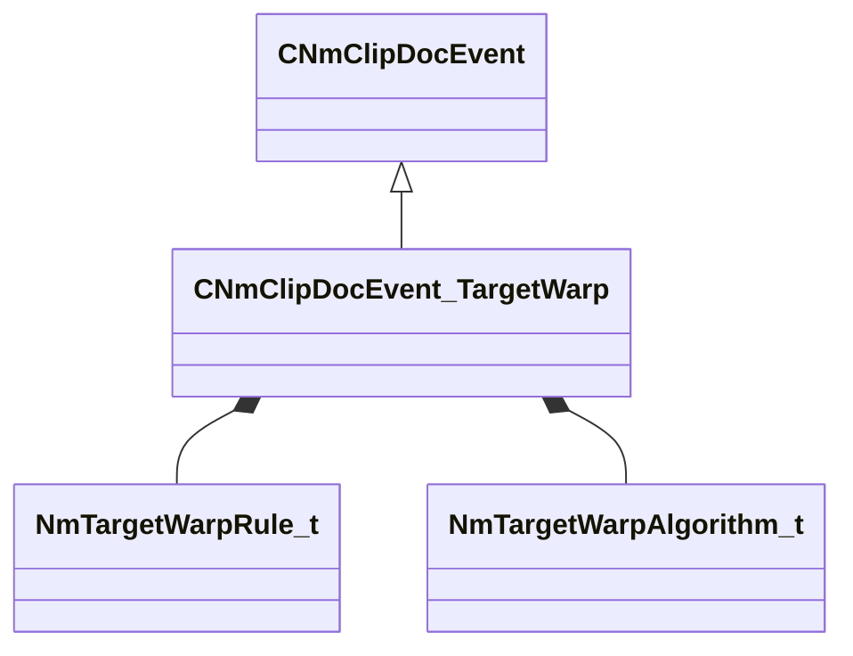

[Schemas](../../schemas.md) / [animdoclib](../animdoclib.md) / CNmClipDocEvent_TargetWarp

# CNmClipDocEvent_TargetWarp

**Kind:** class · **Size:** 24 bytes (`0x18`) · **Align:** 8 · **Module:** animdoclib

**Inherits from:** [CNmClipDocEvent](../animdoclib/CNmClipDocEvent.md)

**Relationships:**

## Memory layout

4 fields (2 declared here, 2 inherited). Offsets are absolute from the object base.

| Offset | Field | Type | From | Annotations |
|--------|-------|------|------|-------------|
| `0x8` | `m_flStartTime` | float32 | [CNmClipDocEvent](../animdoclib/CNmClipDocEvent.md) |  |
| `0xc` | `m_flDuration` | float32 | [CNmClipDocEvent](../animdoclib/CNmClipDocEvent.md) |  |
| `0x10` | `m_rule` | [NmTargetWarpRule_t](../animlib/NmTargetWarpRule_t.md) |  |  |
| `0x11` | `m_algorithm` | [NmTargetWarpAlgorithm_t](../animlib/NmTargetWarpAlgorithm_t.md) |  |  |

KV3 class defaults

<pre>{
	&quot;_class&quot;: &quot;CNmClipDocEvent_TargetWarp&quot;,
	&quot;m_flStartTime&quot;: 0.000000,
	&quot;m_flDuration&quot;: 0.000000,
	&quot;m_rule&quot;: &quot;WarpXYZ&quot;,
	&quot;m_algorithm&quot;: &quot;Bezier&quot;
}</pre>

