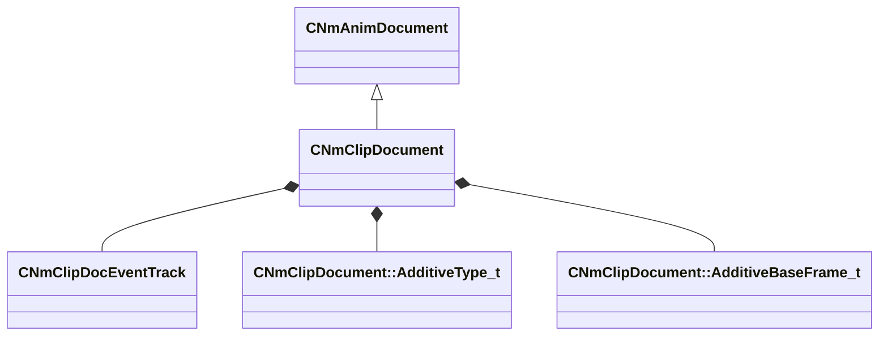

[Schemas](../../schemas.md) / [animdoclib](../animdoclib.md) / CNmClipDocument

# CNmClipDocument

> Source: **Build 25000182** · 2026-08-28 · `windows-x86_64` · schema `0.10.0`

**Kind:** class · **Size:** 248 bytes (`0xf8`) · **Align:** 8 · **Module:** animdoclib

**Inherits from:** [CNmAnimDocument](../animdoclib/CNmAnimDocument.md)

**Relationships:**

## Memory layout

14 fields (13 declared here, 1 inherited). Offsets are absolute from the object base.

| Offset | Field | Type | From | Annotations |
|--------|-------|------|------|-------------|
| `0x68` | `m_nVersion` | int32 | [CNmAnimDocument](../animdoclib/CNmAnimDocument.md) | `MPropertySuppressField` |
| `0x70` | `m_sourceFilename` | CUtlString |  | `MPropertyAttributeEditor ModelDocAssetBrowse( dmx, fbx, smd, *requiredoubleclick, *ShowRelatedFile )` |
| `0x78` | `m_animationSkeletonName` | CUtlString |  | `MPropertyAttributeEditor AssetBrowse( vnmskel, *requiredoubleclick )` |
| `0x80` | `m_secondaryAnimationSkeletonNames` | CUtlVector< CUtlString > |  | `MPropertyAttributeEditor AssetBrowse( vnmskel, *requiredoubleclick )` `MPropertyAutoExpandSelf` |
| `0x98` | `m_eventTracks` | CUtlLeanVector< [CNmClipDocEventTrack](../animdoclib/CNmClipDocEventTrack.md) > |  | `MPropertySuppressField` |
| `0xa8` | `m_nStartFrame` | int32 |  | `MPropertyDescription Specify the import start frame (0 or a negative value means use the first frame in the authored animation)` `MPropertyGroupName +Import Options` |
| `0xac` | `m_nEndFrame` | int32 |  | `MPropertyDescription Specify the import end frame (0 or a negative value means use the last frame in the authored animation)` `MPropertyGroupName +Import Options` |
| `0xb0` | `m_flDurationOverrideSeconds` | float32 |  | `MPropertyDescription Override the final duration of this clip in seconds (0 or a negative value means use the authored duration)` `MPropertyGroupName +Import Options` |
| `0xb4` | `m_additiveType` | [CNmClipDocument::AdditiveType_t](../animdoclib/CNmClipDocument.AdditiveType_t.md) |  | `MPropertyGroupName +Additive` |
| `0xb8` | `m_additiveBaseFilename` | CUtlString |  | `MPropertyAttrStateCallback` `MPropertyAttributeEditor AssetBrowse( dmx, fbx, *requiredoubleclick )` `MPropertyDescription The source file to use as the base of the additive` `MPropertyGroupName +Additive` |
| `0xc0` | `m_additiveBaseFrame` | [CNmClipDocument::AdditiveBaseFrame_t](../animdoclib/CNmClipDocument.AdditiveBaseFrame_t.md) |  | `MPropertyAttrStateCallback` `MPropertyDescription The frame to use when generating an additive, if you are generating relative to another animation and this is set to -1, we will extract each frame from it's corresponding frame in the base anim` `MPropertyGroupName +Additive` |
| `0xc4` | `m_nAdditiveBaseFrameIdx` | int32 |  | `MPropertyAttrStateCallback` `MPropertyDescription The frame to use when generating an additive, only valid for 'RelativeToFrame' and 'RelativeToAnimationFrame'` `MPropertyGroupName +Additive` |
| `0xc8` | `m_bUseReferencePoseForSecondaryAnimAdditives` | bool |  | `MPropertyAttrStateCallback` `MPropertyDescription Should we calculate the additives for the secondary weapons from their reference pose or try to look up a pose in the specified animation` `MPropertyGroupName +Additive` |
| `0xd0` | `m_bonesToSampleInModelSpace` | CUtlVector< CUtlString > |  | `MPropertyAutoExpandSelf` `MPropertyDescription List the set of bones that need to be sampled in model space for sub-frames. Warning! This can be REALLY expensive so be careful with this!` `MPropertyGroupName Advanced` |

KV3 class defaults

<pre>{
	&quot;_class&quot;: &quot;CNmClipDocument&quot;,
	&quot;m_nVersion&quot;: 0,
	&quot;m_sourceFilename&quot;: &quot;&quot;,
	&quot;m_animationSkeletonName&quot;: &quot;&quot;,
	&quot;m_secondaryAnimationSkeletonNames&quot;:
	[
	],
	&quot;m_eventTracks&quot;:
	[
	],
	&quot;m_nStartFrame&quot;: -1,
	&quot;m_nEndFrame&quot;: -1,
	&quot;m_flDurationOverrideSeconds&quot;: -1.000000,
	&quot;m_additiveType&quot;: &quot;None&quot;,
	&quot;m_additiveBaseFilename&quot;: &quot;&quot;,
	&quot;m_additiveBaseFrame&quot;: &quot;FirstFrame&quot;,
	&quot;m_nAdditiveBaseFrameIdx&quot;: -1,
	&quot;m_bUseReferencePoseForSecondaryAnimAdditives&quot;: false,
	&quot;m_bonesToSampleInModelSpace&quot;:
	[
	]
}</pre>

