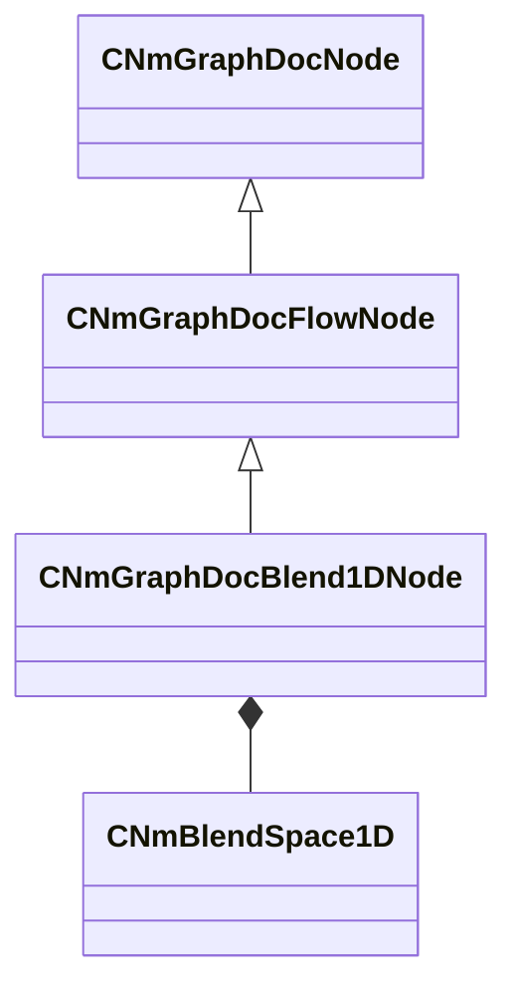

[Schemas](../../schemas.md) / [animdoclib](../animdoclib.md) / CNmGraphDocBlend1DNode

# CNmGraphDocBlend1DNode

**Kind:** class · **Size:** 288 bytes (`0x120`) · **Align:** 8 · **Module:** animdoclib

**Inherits from:** [CNmGraphDocFlowNode](../animdoclib/CNmGraphDocFlowNode.md)

**Relationships:**

## Memory layout

10 fields (2 declared here, 8 inherited). Offsets are absolute from the object base.

| Offset | Field | Type | From | Annotations |
|--------|-------|------|------|-------------|
| `0x8` | `m_ID` | V_uuid_t | [CNmGraphDocNode](../animdoclib/CNmGraphDocNode.md) | `MPropertySuppressField` |
| `0x18` | `m_name` | CUtlString | [CNmGraphDocNode](../animdoclib/CNmGraphDocNode.md) | `MPropertyHideField` |
| `0x20` | `m_floatingComment` | CUtlString | [CNmGraphDocNode](../animdoclib/CNmGraphDocNode.md) | `MPropertyAttributeEditor TextBlock()` |
| `0x28` | `m_position` | Vector2D | [CNmGraphDocNode](../animdoclib/CNmGraphDocNode.md) | `MPropertySuppressField` |
| `0x40` | `m_pChildGraph` | [CNmGraphDocGraph](../animdoclib/CNmGraphDocGraph.md)* | [CNmGraphDocNode](../animdoclib/CNmGraphDocNode.md) | `MPropertySuppressField` |
| `0x48` | `m_pSecondaryGraph` | [CNmGraphDocGraph](../animdoclib/CNmGraphDocGraph.md)* | [CNmGraphDocNode](../animdoclib/CNmGraphDocNode.md) | `MPropertySuppressField` |
| `0x50` | `m_inputPins` | CUtlLeanVectorFixedGrowable< [NmGraphDocPin_t](../animdoclib/NmGraphDocPin_t.md), 4 > | [CNmGraphDocFlowNode](../animdoclib/CNmGraphDocFlowNode.md) |  |
| `0xd8` | `m_outputPins` | CUtlLeanVectorFixedGrowable< [NmGraphDocPin_t](../animdoclib/NmGraphDocPin_t.md), 1 > | [CNmGraphDocFlowNode](../animdoclib/CNmGraphDocFlowNode.md) |  |
| `0x100` | `m_blendSpace` | [CNmBlendSpace1D](../animdoclib/CNmBlendSpace1D.md) |  | `MPropertyAttributeEditor BlendSpace1D()` |
| `0x118` | `m_bAllowLooping` | bool |  | `MPropertyDescription When not being driven by a sync time, control looping behavior ` |

KV3 class defaults

<pre>{
	&quot;_class&quot;: &quot;CNmGraphDocBlend1DNode&quot;,
	&quot;m_ID&quot;: &lt;HIDDEN FOR DIFF&gt;,
	&quot;m_name&quot;: &quot;&quot;,
	&quot;m_floatingComment&quot;: &quot;&quot;,
	&quot;m_position&quot;:
	[
		0.000000,
		0.000000
	],
	&quot;m_pChildGraph&quot;: null,
	&quot;m_pSecondaryGraph&quot;: null,
	&quot;m_inputPins&quot;:
	[
		{
			&quot;m_ID&quot;: &lt;HIDDEN FOR DIFF&gt;,
			&quot;m_name&quot;: &quot;Parameter&quot;,
			&quot;m_type&quot;: &quot;Float&quot;,
			&quot;m_bIsDynamicPin&quot;: false,
			&quot;m_bAllowMultipleOutConnections&quot;: false
		},
		{
			&quot;m_ID&quot;: &lt;HIDDEN FOR DIFF&gt;,
			&quot;m_name&quot;: &quot;Option (0.00)&quot;,
			&quot;m_type&quot;: &quot;Pose&quot;,
			&quot;m_bIsDynamicPin&quot;: true,
			&quot;m_bAllowMultipleOutConnections&quot;: false
		},
		{
			&quot;m_ID&quot;: &lt;HIDDEN FOR DIFF&gt;,
			&quot;m_name&quot;: &quot;Option (0.00)&quot;,
			&quot;m_type&quot;: &quot;Pose&quot;,
			&quot;m_bIsDynamicPin&quot;: true,
			&quot;m_bAllowMultipleOutConnections&quot;: false
		}
	],
	&quot;m_outputPins&quot;:
	[
		{
			&quot;m_ID&quot;: &lt;HIDDEN FOR DIFF&gt;,
			&quot;m_name&quot;: &quot;Pose&quot;,
			&quot;m_type&quot;: &quot;Pose&quot;,
			&quot;m_bIsDynamicPin&quot;: false,
			&quot;m_bAllowMultipleOutConnections&quot;: false
		}
	],
	&quot;m_blendSpace&quot;:
	{
		&quot;m_points&quot;:
		[
			{
				&quot;m_name&quot;: &quot;Option&quot;,
				&quot;m_flValue&quot;: 0.000000,
				&quot;m_pinID&quot;: &lt;HIDDEN FOR DIFF&gt;,
			},
			{
				&quot;m_name&quot;: &quot;Option&quot;,
				&quot;m_flValue&quot;: 0.000000,
				&quot;m_pinID&quot;: &lt;HIDDEN FOR DIFF&gt;,
			}
		]
	},
	&quot;m_bAllowLooping&quot;: true
}</pre>

