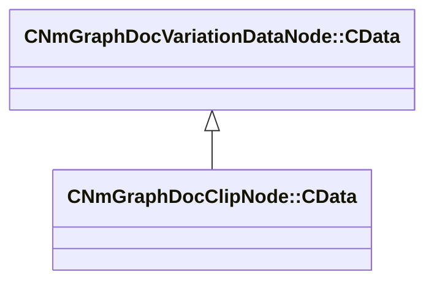

[Schemas](../../schemas.md) / [animdoclib](../animdoclib.md) / CNmGraphDocClipNode::CData

# CNmGraphDocClipNode::CData

> Source: **Build 25000182** · 2026-08-28 · `windows-x86_64` · schema `0.10.0`

**Kind:** class · **Size:** 24 bytes (`0x18`) · **Align:** 8 · **Module:** animdoclib

**Inherits from:** [CNmGraphDocVariationDataNode::CData](../animdoclib/CNmGraphDocVariationDataNode.CData.md)

**Relationships:**

## Memory layout

3 fields (3 declared here, 0 inherited). Offsets are absolute from the object base.

| Offset | Field | Type | From | Annotations |
|--------|-------|------|------|-------------|
| `0x8` | `m_clip` | CUtlString |  | `MPropertyAttributeEditor AssetBrowse( vnmclip, *requiredoubleclick )` |
| `0x10` | `m_flSpeedMultiplier` | float32 |  | `MPropertyAttributeRange 0.01 5.0` |
| `0x14` | `m_nStartSyncEventOffset` | int32 |  |  |

KV3 class defaults

<pre>{
	&quot;_class&quot;: &quot;CNmGraphDocClipNode::CData&quot;,
	&quot;m_clip&quot;: &quot;&quot;,
	&quot;m_flSpeedMultiplier&quot;: 1.000000,
	&quot;m_nStartSyncEventOffset&quot;: 0
}</pre>

