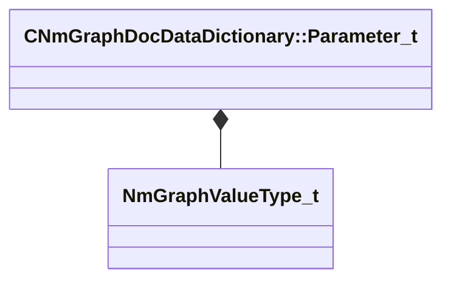

[Schemas](../../schemas.md) / [animdoclib](../animdoclib.md) / CNmGraphDocDataDictionary::Parameter_t

# CNmGraphDocDataDictionary::Parameter_t

> Source: **Build 25000182** · 2026-08-28 · `windows-x86_64` · schema `0.10.0`

**Kind:** class · **Size:** 64 bytes (`0x40`) · **Align:** 8 · **Module:** animdoclib

**Metadata:** `MPropertyAutoExpandSelf`

**Relationships:**

## Memory layout

5 fields (5 declared here, 0 inherited). Offsets are absolute from the object base.

| Offset | Field | Type | From | Annotations |
|--------|-------|------|------|-------------|
| `0x0` | `m_ID` | V_uuid_t |  | `MPropertySuppressField` |
| `0x10` | `m_name` | CUtlString |  | `MPropertyFlattenIntoParentRow` |
| `0x18` | `m_groupName` | CUtlString |  |  |
| `0x20` | `m_valueType` | [NmGraphValueType_t](../animlib/NmGraphValueType_t.md) |  |  |
| `0x28` | `m_expectedValues` | CUtlVector< CGlobalSymbol > |  | `MPropertyAttrStateCallback` `MPropertyAutoExpandSelf` |

KV3 class defaults

<pre>{
	&quot;m_ID&quot;: &lt;HIDDEN FOR DIFF&gt;,
	&quot;m_name&quot;: &quot;&quot;,
	&quot;m_groupName&quot;: &quot;&quot;,
	&quot;m_valueType&quot;: &quot;ID&quot;,
	&quot;m_expectedValues&quot;:
	[
	]
}</pre>

