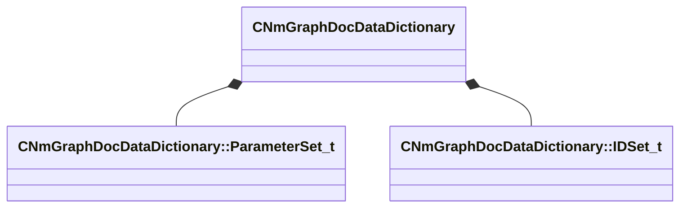

[Schemas](../../schemas.md) / [animdoclib](../animdoclib.md) / CNmGraphDocDataDictionary

# CNmGraphDocDataDictionary

> Source: **Build 25000182** · 2026-08-28 · `windows-x86_64` · schema `0.10.0`

**Kind:** class · **Size:** 48 bytes (`0x30`) · **Align:** 8 · **Module:** animdoclib

**Metadata:** `MPropertyAutoExpandSelf`

**Relationships:**

## Memory layout

2 fields (2 declared here, 0 inherited). Offsets are absolute from the object base.

| Offset | Field | Type | From | Annotations |
|--------|-------|------|------|-------------|
| `0x0` | `m_parameterSets` | CUtlVector< [CNmGraphDocDataDictionary::ParameterSet_t](../animdoclib/CNmGraphDocDataDictionary.ParameterSet_t.md) > |  | `MPropertyAutoExpandSelf` |
| `0x18` | `m_IDSets` | CUtlVector< [CNmGraphDocDataDictionary::IDSet_t](../animdoclib/CNmGraphDocDataDictionary.IDSet_t.md) > |  | `MPropertyAutoExpandSelf` |

KV3 class defaults

<pre>{
	&quot;m_parameterSets&quot;:
	[
	],
	&quot;m_IDSets&quot;:
	[
	]
}</pre>

