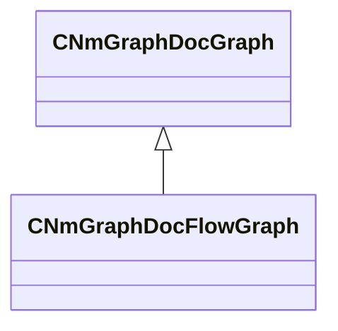

[Schemas](../../schemas.md) / [animdoclib](../animdoclib.md) / CNmGraphDocFlowGraph

# CNmGraphDocFlowGraph

**Kind:** class · **Size:** 104 bytes (`0x68`) · **Align:** 8 · **Module:** animdoclib

**Inherits from:** [CNmGraphDocGraph](../animdoclib/CNmGraphDocGraph.md)

**Relationships:**

## Memory layout

6 fields (1 declared here, 5 inherited). Offsets are absolute from the object base.

| Offset | Field | Type | From | Annotations |
|--------|-------|------|------|-------------|
| `0x8` | `m_ID` | V_uuid_t | [CNmGraphDocGraph](../animdoclib/CNmGraphDocGraph.md) |  |
| `0x20` | `m_nodes` | CUtlVector< [CNmGraphDocNode](../animdoclib/CNmGraphDocNode.md)* > | [CNmGraphDocGraph](../animdoclib/CNmGraphDocGraph.md) |  |
| `0x38` | `m_graphType` | [NmGraphDocGraphType_t](../!GlobalTypes/NmGraphDocGraphType_t.md) | [CNmGraphDocGraph](../animdoclib/CNmGraphDocGraph.md) |  |
| `0x3c` | `m_viewOffset` | Vector2D | [CNmGraphDocGraph](../animdoclib/CNmGraphDocGraph.md) |  |
| `0x44` | `m_flViewZoom` | float32 | [CNmGraphDocGraph](../animdoclib/CNmGraphDocGraph.md) |  |
| `0x50` | `m_connections` | CUtlVector< [CNmGraphDocFlowGraph](../animdoclib/CNmGraphDocFlowGraph.md)::Connection_t > |  |  |

KV3 class defaults

<pre>{
	&quot;_class&quot;: &quot;CNmGraphDocFlowGraph&quot;,
	&quot;m_ID&quot;: &lt;HIDDEN FOR DIFF&gt;,
	&quot;m_nodes&quot;:
	[
	],
	&quot;m_graphType&quot;: &quot;Invalid&quot;,
	&quot;m_viewOffset&quot;:
	[
		0.000000,
		0.000000
	],
	&quot;m_flViewZoom&quot;: 1.000000,
	&quot;m_connections&quot;:
	[
	]
}</pre>

