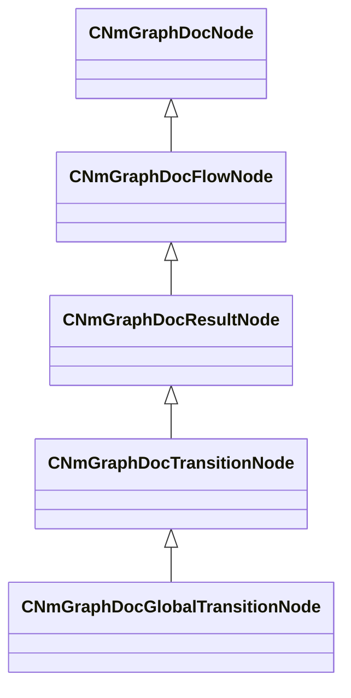

[Schemas](../../schemas.md) / [animdoclib](../animdoclib.md) / CNmGraphDocGlobalTransitionNode

# CNmGraphDocGlobalTransitionNode

**Kind:** class · **Size:** 304 bytes (`0x130`) · **Align:** 8 · **Module:** animdoclib

**Inherits from:** [CNmGraphDocTransitionNode](../animdoclib/CNmGraphDocTransitionNode.md)

**Relationships:**

## Memory layout

18 fields (1 declared here, 17 inherited). Offsets are absolute from the object base.

| Offset | Field | Type | From | Annotations |
|--------|-------|------|------|-------------|
| `0x8` | `m_ID` | V_uuid_t | [CNmGraphDocNode](../animdoclib/CNmGraphDocNode.md) | `MPropertySuppressField` |
| `0x18` | `m_name` | CUtlString | [CNmGraphDocNode](../animdoclib/CNmGraphDocNode.md) | `MPropertyHideField` |
| `0x20` | `m_floatingComment` | CUtlString | [CNmGraphDocNode](../animdoclib/CNmGraphDocNode.md) | `MPropertyAttributeEditor TextBlock()` |
| `0x28` | `m_position` | Vector2D | [CNmGraphDocNode](../animdoclib/CNmGraphDocNode.md) | `MPropertySuppressField` |
| `0x40` | `m_pChildGraph` | [CNmGraphDocGraph](../animdoclib/CNmGraphDocGraph.md)* | [CNmGraphDocNode](../animdoclib/CNmGraphDocNode.md) | `MPropertySuppressField` |
| `0x48` | `m_pSecondaryGraph` | [CNmGraphDocGraph](../animdoclib/CNmGraphDocGraph.md)* | [CNmGraphDocNode](../animdoclib/CNmGraphDocNode.md) | `MPropertySuppressField` |
| `0x50` | `m_inputPins` | CUtlLeanVectorFixedGrowable< [NmGraphDocPin_t](../animdoclib/NmGraphDocPin_t.md), 4 > | [CNmGraphDocFlowNode](../animdoclib/CNmGraphDocFlowNode.md) |  |
| `0xd8` | `m_outputPins` | CUtlLeanVectorFixedGrowable< [NmGraphDocPin_t](../animdoclib/NmGraphDocPin_t.md), 1 > | [CNmGraphDocFlowNode](../animdoclib/CNmGraphDocFlowNode.md) |  |
| `0x100` | `m_resultType` | [NmGraphValueType_t](../animlib/NmGraphValueType_t.md) | [CNmGraphDocResultNode](../animdoclib/CNmGraphDocResultNode.md) |  |
| `0x108` | `m_flDurationSeconds` | float32 | [CNmGraphDocTransitionNode](../animdoclib/CNmGraphDocTransitionNode.md) | `MPropertyGroupName +Transition` |
| `0x10c` | `m_bClampDurationToSource` | bool | [CNmGraphDocTransitionNode](../animdoclib/CNmGraphDocTransitionNode.md) | `MPropertyGroupName +Transition` |
| `0x10d` | `m_rootMotionBlend` | [NmRootMotionBlendMode_t](../animlib/NmRootMotionBlendMode_t.md) | [CNmGraphDocTransitionNode](../animdoclib/CNmGraphDocTransitionNode.md) | `MPropertyGroupName +Transition` |
| `0x10e` | `m_blendWeightEasing` | [NmEasingOperation_t](../animlib/NmEasingOperation_t.md) | [CNmGraphDocTransitionNode](../animdoclib/CNmGraphDocTransitionNode.md) | `MPropertyGroupName +Transition` |
| `0x110` | `m_flBoneMaskBlendInTimePercentage` | float32 | [CNmGraphDocTransitionNode](../animdoclib/CNmGraphDocTransitionNode.md) | `MPropertyGroupName +Transition` |
| `0x114` | `m_timeMatchMode` | [CNmGraphDocTransitionNode](../animdoclib/CNmGraphDocTransitionNode.md)::TimeMatchMode_t | [CNmGraphDocTransitionNode](../animdoclib/CNmGraphDocTransitionNode.md) | `MPropertyGroupName +Target Time` |
| `0x118` | `m_flTimeOffset` | float32 | [CNmGraphDocTransitionNode](../animdoclib/CNmGraphDocTransitionNode.md) | `MPropertyGroupName +Target Time` |
| `0x11c` | `m_bCanBeForced` | bool | [CNmGraphDocTransitionNode](../animdoclib/CNmGraphDocTransitionNode.md) | `MPropertyGroupName Advanced` |
| `0x120` | `m_stateID` | V_uuid_t |  | `MPropertySuppressField` |

KV3 class defaults

<pre>{
	&quot;_class&quot;: &quot;CNmGraphDocGlobalTransitionNode&quot;,
	&quot;m_ID&quot;: &lt;HIDDEN FOR DIFF&gt;,
	&quot;m_name&quot;: &quot;&quot;,
	&quot;m_floatingComment&quot;: &quot;&quot;,
	&quot;m_position&quot;:
	[
		0.000000,
		0.000000
	],
	&quot;m_pChildGraph&quot;: null,
	&quot;m_pSecondaryGraph&quot;: null,
	&quot;m_inputPins&quot;:
	[
		{
			&quot;m_ID&quot;: &lt;HIDDEN FOR DIFF&gt;,
			&quot;m_name&quot;: &quot;Condition&quot;,
			&quot;m_type&quot;: &quot;Bool&quot;,
			&quot;m_bIsDynamicPin&quot;: false,
			&quot;m_bAllowMultipleOutConnections&quot;: false
		},
		{
			&quot;m_ID&quot;: &lt;HIDDEN FOR DIFF&gt;,
			&quot;m_name&quot;: &quot;Duration Override&quot;,
			&quot;m_type&quot;: &quot;Float&quot;,
			&quot;m_bIsDynamicPin&quot;: false,
			&quot;m_bAllowMultipleOutConnections&quot;: false
		},
		{
			&quot;m_ID&quot;: &lt;HIDDEN FOR DIFF&gt;,
			&quot;m_name&quot;: &quot;Time Offset Override&quot;,
			&quot;m_type&quot;: &quot;Float&quot;,
			&quot;m_bIsDynamicPin&quot;: false,
			&quot;m_bAllowMultipleOutConnections&quot;: false
		},
		{
			&quot;m_ID&quot;: &lt;HIDDEN FOR DIFF&gt;,
			&quot;m_name&quot;: &quot;Start Bone Mask&quot;,
			&quot;m_type&quot;: &quot;BoneMask&quot;,
			&quot;m_bIsDynamicPin&quot;: false,
			&quot;m_bAllowMultipleOutConnections&quot;: false
		},
		{
			&quot;m_ID&quot;: &lt;HIDDEN FOR DIFF&gt;,
			&quot;m_name&quot;: &quot;Target Sync ID&quot;,
			&quot;m_type&quot;: &quot;ID&quot;,
			&quot;m_bIsDynamicPin&quot;: false,
			&quot;m_bAllowMultipleOutConnections&quot;: false
		}
	],
	&quot;m_outputPins&quot;:
	[
	],
	&quot;m_resultType&quot;: &quot;Special&quot;,
	&quot;m_flDurationSeconds&quot;: 0.200000,
	&quot;m_bClampDurationToSource&quot;: false,
	&quot;m_rootMotionBlend&quot;: &quot;Blend&quot;,
	&quot;m_blendWeightEasing&quot;: &quot;Linear&quot;,
	&quot;m_flBoneMaskBlendInTimePercentage&quot;: 0.330000,
	&quot;m_timeMatchMode&quot;: &quot;None&quot;,
	&quot;m_flTimeOffset&quot;: 0.000000,
	&quot;m_bCanBeForced&quot;: false,
	&quot;m_stateID&quot;: &lt;HIDDEN FOR DIFF&gt;,
}</pre>

