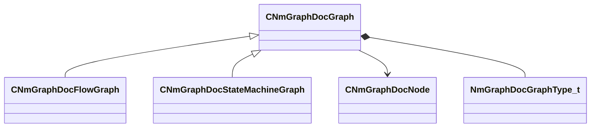

[Schemas](../../schemas.md) / [animdoclib](../animdoclib.md) / CNmGraphDocGraph

# CNmGraphDocGraph

**Kind:** class · **Size:** 80 bytes (`0x50`) · **Align:** 8 · **Module:** animdoclib

**Derived by:** [CNmGraphDocFlowGraph](../animdoclib/CNmGraphDocFlowGraph.md), [CNmGraphDocStateMachineGraph](../animdoclib/CNmGraphDocStateMachineGraph.md)

**Relationships:**

## Memory layout

5 fields (5 declared here, 0 inherited). Offsets are absolute from the object base.

| Offset | Field | Type | From | Annotations |
|--------|-------|------|------|-------------|
| `0x8` | `m_ID` | V_uuid_t |  |  |
| `0x20` | `m_nodes` | CUtlVector< [CNmGraphDocNode](../animdoclib/CNmGraphDocNode.md)* > |  |  |
| `0x38` | `m_graphType` | [NmGraphDocGraphType_t](../!GlobalTypes/NmGraphDocGraphType_t.md) |  |  |
| `0x3c` | `m_viewOffset` | Vector2D |  |  |
| `0x44` | `m_flViewZoom` | float32 |  |  |

KV3 class defaults

<pre>{
	&quot;_class&quot;: &quot;CNmGraphDocGraph&quot;,
	&quot;m_ID&quot;: &lt;HIDDEN FOR DIFF&gt;,
	&quot;m_nodes&quot;:
	[
	],
	&quot;m_graphType&quot;: &quot;Invalid&quot;,
	&quot;m_viewOffset&quot;:
	[
		0.000000,
		0.000000
	],
	&quot;m_flViewZoom&quot;: 1.000000
}</pre>

