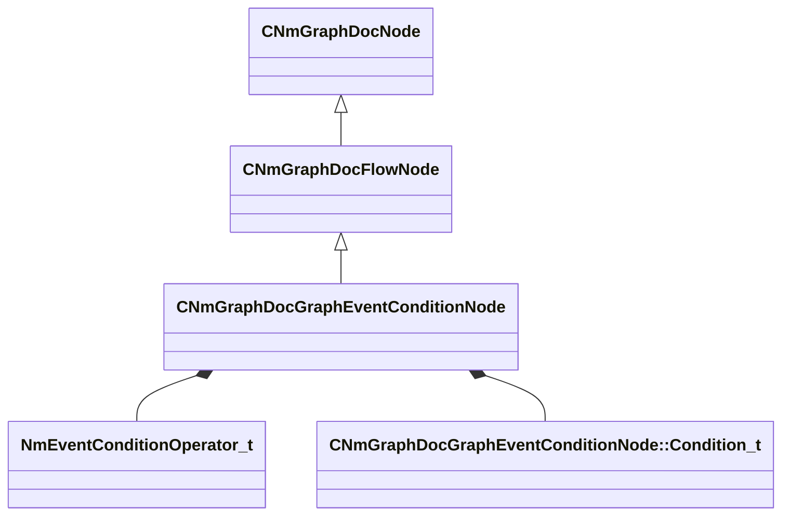

[Schemas](../../schemas.md) / [animdoclib](../animdoclib.md) / CNmGraphDocGraphEventConditionNode

# CNmGraphDocGraphEventConditionNode

> Source: **Build 25000182** · 2026-08-28 · `windows-x86_64` · schema `0.10.0`

**Kind:** class · **Size:** 288 bytes (`0x120`) · **Align:** 8 · **Module:** animdoclib

**Inherits from:** [CNmGraphDocFlowNode](../animdoclib/CNmGraphDocFlowNode.md)

**Relationships:**

## Memory layout

12 fields (4 declared here, 8 inherited). Offsets are absolute from the object base.

| Offset | Field | Type | From | Annotations |
|--------|-------|------|------|-------------|
| `0x8` | `m_ID` | V_uuid_t | [CNmGraphDocNode](../animdoclib/CNmGraphDocNode.md) | `MPropertySuppressField` |
| `0x18` | `m_name` | CUtlString | [CNmGraphDocNode](../animdoclib/CNmGraphDocNode.md) | `MPropertyHideField` |
| `0x20` | `m_floatingComment` | CUtlString | [CNmGraphDocNode](../animdoclib/CNmGraphDocNode.md) | `MPropertyAttributeEditor TextBlock()` |
| `0x28` | `m_position` | Vector2D | [CNmGraphDocNode](../animdoclib/CNmGraphDocNode.md) | `MPropertySuppressField` |
| `0x40` | `m_pChildGraph` | [CNmGraphDocGraph](../animdoclib/CNmGraphDocGraph.md)* | [CNmGraphDocNode](../animdoclib/CNmGraphDocNode.md) | `MPropertySuppressField` |
| `0x48` | `m_pSecondaryGraph` | [CNmGraphDocGraph](../animdoclib/CNmGraphDocGraph.md)* | [CNmGraphDocNode](../animdoclib/CNmGraphDocNode.md) | `MPropertySuppressField` |
| `0x50` | `m_inputPins` | CUtlLeanVectorFixedGrowable< [NmGraphDocPin_t](../animdoclib/NmGraphDocPin_t.md), 4 > | [CNmGraphDocFlowNode](../animdoclib/CNmGraphDocFlowNode.md) |  |
| `0xd8` | `m_outputPins` | CUtlLeanVectorFixedGrowable< [NmGraphDocPin_t](../animdoclib/NmGraphDocPin_t.md), 1 > | [CNmGraphDocFlowNode](../animdoclib/CNmGraphDocFlowNode.md) |  |
| `0x100` | `m_operator` | [NmEventConditionOperator_t](../animdoclib/NmEventConditionOperator_t.md) |  |  |
| `0x101` | `m_bLimitSearchToSourceState` | bool |  | `MPropertyGroupName +Advanced Search Rules` |
| `0x102` | `m_bIgnoreInactiveBranchEvents` | bool |  | `MPropertyGroupName +Advanced Search Rules` |
| `0x108` | `m_conditions` | CUtlVector< [CNmGraphDocGraphEventConditionNode::Condition_t](../animdoclib/CNmGraphDocGraphEventConditionNode.Condition_t.md) > |  | `MPropertyAutoExpandSelf` `MPropertyGroupName +Conditions` |

KV3 class defaults

<pre>{
	&quot;_class&quot;: &quot;CNmGraphDocGraphEventConditionNode&quot;,
	&quot;m_ID&quot;: &lt;HIDDEN FOR DIFF&gt;,
	&quot;m_name&quot;: &quot;&quot;,
	&quot;m_floatingComment&quot;: &quot;&quot;,
	&quot;m_position&quot;:
	[
		0.000000,
		0.000000
	],
	&quot;m_pChildGraph&quot;: null,
	&quot;m_pSecondaryGraph&quot;: null,
	&quot;m_inputPins&quot;:
	[
	],
	&quot;m_outputPins&quot;:
	[
		{
			&quot;m_ID&quot;: &lt;HIDDEN FOR DIFF&gt;,
			&quot;m_name&quot;: &quot;Result&quot;,
			&quot;m_type&quot;: &quot;Bool&quot;,
			&quot;m_bIsDynamicPin&quot;: false,
			&quot;m_bAllowMultipleOutConnections&quot;: true
		}
	],
	&quot;m_operator&quot;: &quot;Or&quot;,
	&quot;m_bLimitSearchToSourceState&quot;: false,
	&quot;m_bIgnoreInactiveBranchEvents&quot;: false,
	&quot;m_conditions&quot;:
	[
		{
			&quot;m_eventID&quot;: &quot;&quot;,
			&quot;m_type&quot;: &quot;Any&quot;
		}
	]
}</pre>

