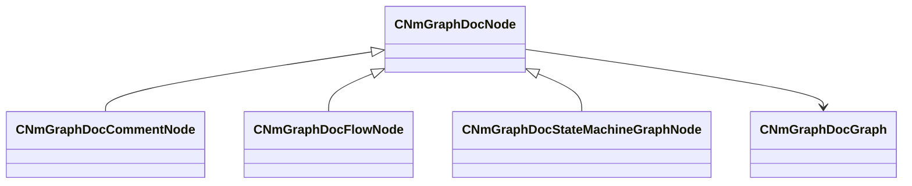

[Schemas](../../schemas.md) / [animdoclib](../animdoclib.md) / CNmGraphDocNode

# CNmGraphDocNode

**Kind:** class · **Size:** 80 bytes (`0x50`) · **Align:** 255 · **Module:** animdoclib

**Derived by:** [CNmGraphDocCommentNode](../animdoclib/CNmGraphDocCommentNode.md), [CNmGraphDocFlowNode](../animdoclib/CNmGraphDocFlowNode.md), [CNmGraphDocStateMachineGraphNode](../animdoclib/CNmGraphDocStateMachineGraphNode.md)

**Relationships:**

## Memory layout

6 fields (6 declared here, 0 inherited). Offsets are absolute from the object base.

| Offset | Field | Type | From | Annotations |
|--------|-------|------|------|-------------|
| `0x8` | `m_ID` | V_uuid_t |  | `MPropertySuppressField` |
| `0x18` | `m_name` | CUtlString |  | `MPropertyHideField` |
| `0x20` | `m_floatingComment` | CUtlString |  | `MPropertyAttributeEditor TextBlock()` |
| `0x28` | `m_position` | Vector2D |  | `MPropertySuppressField` |
| `0x40` | `m_pChildGraph` | [CNmGraphDocGraph](../animdoclib/CNmGraphDocGraph.md)* |  | `MPropertySuppressField` |
| `0x48` | `m_pSecondaryGraph` | [CNmGraphDocGraph](../animdoclib/CNmGraphDocGraph.md)* |  | `MPropertySuppressField` |
