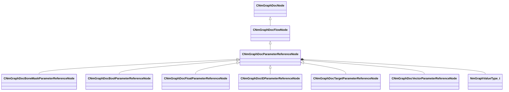

[Schemas](../../schemas.md) / [animdoclib](../animdoclib.md) / CNmGraphDocParameterReferenceNode

# CNmGraphDocParameterReferenceNode

**Kind:** class · **Size:** 304 bytes (`0x130`) · **Align:** 8 · **Module:** animdoclib

**Inherits from:** [CNmGraphDocFlowNode](../animdoclib/CNmGraphDocFlowNode.md)

**Derived by:** [CNmGraphDocBoneMaskParameterReferenceNode](../animdoclib/CNmGraphDocBoneMaskParameterReferenceNode.md), [CNmGraphDocBoolParameterReferenceNode](../animdoclib/CNmGraphDocBoolParameterReferenceNode.md), [CNmGraphDocFloatParameterReferenceNode](../animdoclib/CNmGraphDocFloatParameterReferenceNode.md), [CNmGraphDocIDParameterReferenceNode](../animdoclib/CNmGraphDocIDParameterReferenceNode.md), [CNmGraphDocTargetParameterReferenceNode](../animdoclib/CNmGraphDocTargetParameterReferenceNode.md), [CNmGraphDocVectorParameterReferenceNode](../animdoclib/CNmGraphDocVectorParameterReferenceNode.md)

**Relationships:**

## Memory layout

12 fields (4 declared here, 8 inherited). Offsets are absolute from the object base.

| Offset | Field | Type | From | Annotations |
|--------|-------|------|------|-------------|
| `0x8` | `m_ID` | V_uuid_t | [CNmGraphDocNode](../animdoclib/CNmGraphDocNode.md) | `MPropertySuppressField` |
| `0x18` | `m_name` | CUtlString | [CNmGraphDocNode](../animdoclib/CNmGraphDocNode.md) | `MPropertyHideField` |
| `0x20` | `m_floatingComment` | CUtlString | [CNmGraphDocNode](../animdoclib/CNmGraphDocNode.md) | `MPropertyAttributeEditor TextBlock()` |
| `0x28` | `m_position` | Vector2D | [CNmGraphDocNode](../animdoclib/CNmGraphDocNode.md) | `MPropertySuppressField` |
| `0x40` | `m_pChildGraph` | [CNmGraphDocGraph](../animdoclib/CNmGraphDocGraph.md)* | [CNmGraphDocNode](../animdoclib/CNmGraphDocNode.md) | `MPropertySuppressField` |
| `0x48` | `m_pSecondaryGraph` | [CNmGraphDocGraph](../animdoclib/CNmGraphDocGraph.md)* | [CNmGraphDocNode](../animdoclib/CNmGraphDocNode.md) | `MPropertySuppressField` |
| `0x50` | `m_inputPins` | CUtlLeanVectorFixedGrowable< [NmGraphDocPin_t](../animdoclib/NmGraphDocPin_t.md), 4 > | [CNmGraphDocFlowNode](../animdoclib/CNmGraphDocFlowNode.md) |  |
| `0xd8` | `m_outputPins` | CUtlLeanVectorFixedGrowable< [NmGraphDocPin_t](../animdoclib/NmGraphDocPin_t.md), 1 > | [CNmGraphDocFlowNode](../animdoclib/CNmGraphDocFlowNode.md) |  |
| `0x108` | `m_parameterUUID` | V_uuid_t |  |  |
| `0x118` | `m_parameterValueType` | [NmGraphValueType_t](../!GlobalTypes/NmGraphValueType_t.md) |  |  |
| `0x120` | `m_parameterName` | CUtlString |  |  |
| `0x128` | `m_parameterGroupName` | CUtlString |  |  |

KV3 class defaults

<pre>{
	&quot;_class&quot;: &quot;CNmGraphDocParameterReferenceNode&quot;,
	&quot;m_ID&quot;: &lt;HIDDEN FOR DIFF&gt;,
	&quot;m_name&quot;: &quot;&quot;,
	&quot;m_floatingComment&quot;: &quot;&quot;,
	&quot;m_position&quot;:
	[
		0.000000,
		0.000000
	],
	&quot;m_pChildGraph&quot;: null,
	&quot;m_pSecondaryGraph&quot;: null,
	&quot;m_inputPins&quot;:
	[
	],
	&quot;m_outputPins&quot;:
	[
	],
	&quot;m_parameterUUID&quot;: &quot;00000000-0000-0000-0000-000000000000&quot;,
	&quot;m_parameterValueType&quot;: &quot;Unknown&quot;,
	&quot;m_parameterName&quot;: &quot;&quot;,
	&quot;m_parameterGroupName&quot;: &quot;&quot;
}</pre>

