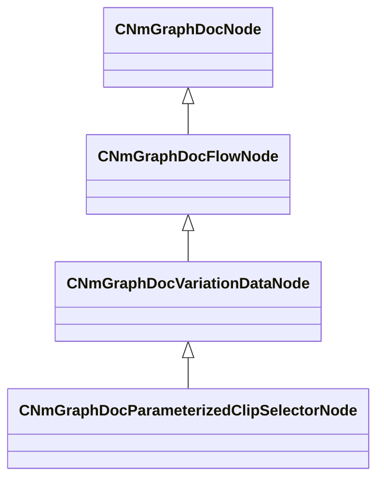

[Schemas](../../schemas.md) / [animdoclib](../animdoclib.md) / CNmGraphDocParameterizedClipSelectorNode

# CNmGraphDocParameterizedClipSelectorNode

> Source: **Build 25000182** · 2026-08-28 · `windows-x86_64` · schema `0.10.0`

**Kind:** class · **Size:** 544 bytes (`0x220`) · **Align:** 8 · **Module:** animdoclib

**Inherits from:** [CNmGraphDocVariationDataNode](../animdoclib/CNmGraphDocVariationDataNode.md)

**Relationships:**

## Memory layout

13 fields (2 declared here, 11 inherited). Offsets are absolute from the object base.

| Offset | Field | Type | From | Annotations |
|--------|-------|------|------|-------------|
| `0x8` | `m_ID` | V_uuid_t | [CNmGraphDocNode](../animdoclib/CNmGraphDocNode.md) | `MPropertySuppressField` |
| `0x18` | `m_name` | CUtlString | [CNmGraphDocNode](../animdoclib/CNmGraphDocNode.md) | `MPropertyHideField` |
| `0x20` | `m_floatingComment` | CUtlString | [CNmGraphDocNode](../animdoclib/CNmGraphDocNode.md) | `MPropertyAttributeEditor TextBlock()` |
| `0x28` | `m_position` | Vector2D | [CNmGraphDocNode](../animdoclib/CNmGraphDocNode.md) | `MPropertySuppressField` |
| `0x40` | `m_pChildGraph` | [CNmGraphDocGraph](../animdoclib/CNmGraphDocGraph.md)* | [CNmGraphDocNode](../animdoclib/CNmGraphDocNode.md) | `MPropertySuppressField` |
| `0x48` | `m_pSecondaryGraph` | [CNmGraphDocGraph](../animdoclib/CNmGraphDocGraph.md)* | [CNmGraphDocNode](../animdoclib/CNmGraphDocNode.md) | `MPropertySuppressField` |
| `0x50` | `m_inputPins` | CUtlLeanVectorFixedGrowable< [NmGraphDocPin_t](../animdoclib/NmGraphDocPin_t.md), 4 > | [CNmGraphDocFlowNode](../animdoclib/CNmGraphDocFlowNode.md) |  |
| `0xd8` | `m_outputPins` | CUtlLeanVectorFixedGrowable< [NmGraphDocPin_t](../animdoclib/NmGraphDocPin_t.md), 1 > | [CNmGraphDocFlowNode](../animdoclib/CNmGraphDocFlowNode.md) |  |
| `0x100` | `m_pDefaultVariationData` | [CNmGraphDocVariationDataNode::CData](../animdoclib/CNmGraphDocVariationDataNode.CData.md)* | [CNmGraphDocVariationDataNode](../animdoclib/CNmGraphDocVariationDataNode.md) | `MPropertySuppressField` |
| `0x108` | `m_overrides` | CUtlVector< [CNmGraphDocVariationDataNode::OverrideValue_t](../animdoclib/CNmGraphDocVariationDataNode.OverrideValue_t.md) > | [CNmGraphDocVariationDataNode](../animdoclib/CNmGraphDocVariationDataNode.md) | `MPropertySuppressField` |
| `0x120` | `m_defaultResourceName` | CResourceName | [CNmGraphDocVariationDataNode](../animdoclib/CNmGraphDocVariationDataNode.md) | `MPropertySuppressField` |
| `0x200` | `m_optionLabels` | CUtlVector< CUtlString > |  | `MPropertyAutoExpandSelf` `MPropertyResizable` |
| `0x218` | `m_bIgnoreInvalidOptions` | bool |  | `MPropertyDescription Should we ignore any invalid option and remove them from the selection. This is useful if different variations has different sets of options filled` `MPropertyGroupName Advanced` |

KV3 class defaults

<pre>{
	&quot;_class&quot;: &quot;CNmGraphDocParameterizedClipSelectorNode&quot;,
	&quot;m_ID&quot;: &lt;HIDDEN FOR DIFF&gt;,
	&quot;m_name&quot;: &quot;&quot;,
	&quot;m_floatingComment&quot;: &quot;&quot;,
	&quot;m_position&quot;:
	[
		0.000000,
		0.000000
	],
	&quot;m_pChildGraph&quot;: null,
	&quot;m_pSecondaryGraph&quot;: null,
	&quot;m_inputPins&quot;:
	[
		{
			&quot;m_ID&quot;: &lt;HIDDEN FOR DIFF&gt;,
			&quot;m_name&quot;: &quot;Parameter&quot;,
			&quot;m_type&quot;: &quot;Float&quot;,
			&quot;m_bIsDynamicPin&quot;: false,
			&quot;m_bAllowMultipleOutConnections&quot;: false
		},
		{
			&quot;m_ID&quot;: &lt;HIDDEN FOR DIFF&gt;,
			&quot;m_name&quot;: &quot;Option&quot;,
			&quot;m_type&quot;: &quot;Pose&quot;,
			&quot;m_bIsDynamicPin&quot;: true,
			&quot;m_bAllowMultipleOutConnections&quot;: false
		},
		{
			&quot;m_ID&quot;: &lt;HIDDEN FOR DIFF&gt;,
			&quot;m_name&quot;: &quot;Option&quot;,
			&quot;m_type&quot;: &quot;Pose&quot;,
			&quot;m_bIsDynamicPin&quot;: true,
			&quot;m_bAllowMultipleOutConnections&quot;: false
		}
	],
	&quot;m_outputPins&quot;:
	[
		{
			&quot;m_ID&quot;: &lt;HIDDEN FOR DIFF&gt;,
			&quot;m_name&quot;: &quot;Pose&quot;,
			&quot;m_type&quot;: &quot;Pose&quot;,
			&quot;m_bIsDynamicPin&quot;: false,
			&quot;m_bAllowMultipleOutConnections&quot;: false
		}
	],
	&quot;m_pDefaultVariationData&quot;:
	{
		&quot;_class&quot;: &quot;CNmGraphDocParameterizedClipSelectorNode::CData&quot;,
		&quot;m_optionWeights&quot;:
		[
			0,
			0
		]
	},
	&quot;m_overrides&quot;:
	[
	],
	&quot;m_defaultResourceName&quot;: &quot;&quot;,
	&quot;m_optionLabels&quot;:
	[
		&quot;Option&quot;,
		&quot;Option&quot;
	],
	&quot;m_bIgnoreInvalidOptions&quot;: false
}</pre>

