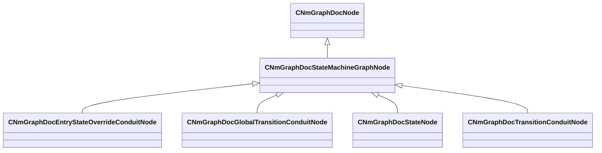

[Schemas](../../schemas.md) / [animdoclib](../animdoclib.md) / CNmGraphDocStateMachineGraphNode

# CNmGraphDocStateMachineGraphNode

> Source: **Build 25000182** · 2026-08-28 · `windows-x86_64` · schema `0.10.0`

**Kind:** class · **Size:** 80 bytes (`0x50`) · **Align:** n/a (unspecified) · **Module:** animdoclib

**Inherits from:** [CNmGraphDocNode](../animdoclib/CNmGraphDocNode.md)

**Derived by:** [CNmGraphDocEntryStateOverrideConduitNode](../animdoclib/CNmGraphDocEntryStateOverrideConduitNode.md), [CNmGraphDocGlobalTransitionConduitNode](../animdoclib/CNmGraphDocGlobalTransitionConduitNode.md), [CNmGraphDocStateNode](../animdoclib/CNmGraphDocStateNode.md), [CNmGraphDocTransitionConduitNode](../animdoclib/CNmGraphDocTransitionConduitNode.md)

**Relationships:**

## Memory layout

6 fields (0 declared here, 6 inherited). Offsets are absolute from the object base.

| Offset | Field | Type | From | Annotations |
|--------|-------|------|------|-------------|
| `0x8` | `m_ID` | V_uuid_t | [CNmGraphDocNode](../animdoclib/CNmGraphDocNode.md) | `MPropertySuppressField` |
| `0x18` | `m_name` | CUtlString | [CNmGraphDocNode](../animdoclib/CNmGraphDocNode.md) | `MPropertyHideField` |
| `0x20` | `m_floatingComment` | CUtlString | [CNmGraphDocNode](../animdoclib/CNmGraphDocNode.md) | `MPropertyAttributeEditor TextBlock()` |
| `0x28` | `m_position` | Vector2D | [CNmGraphDocNode](../animdoclib/CNmGraphDocNode.md) | `MPropertySuppressField` |
| `0x40` | `m_pChildGraph` | [CNmGraphDocGraph](../animdoclib/CNmGraphDocGraph.md)* | [CNmGraphDocNode](../animdoclib/CNmGraphDocNode.md) | `MPropertySuppressField` |
| `0x48` | `m_pSecondaryGraph` | [CNmGraphDocGraph](../animdoclib/CNmGraphDocGraph.md)* | [CNmGraphDocNode](../animdoclib/CNmGraphDocNode.md) | `MPropertySuppressField` |
