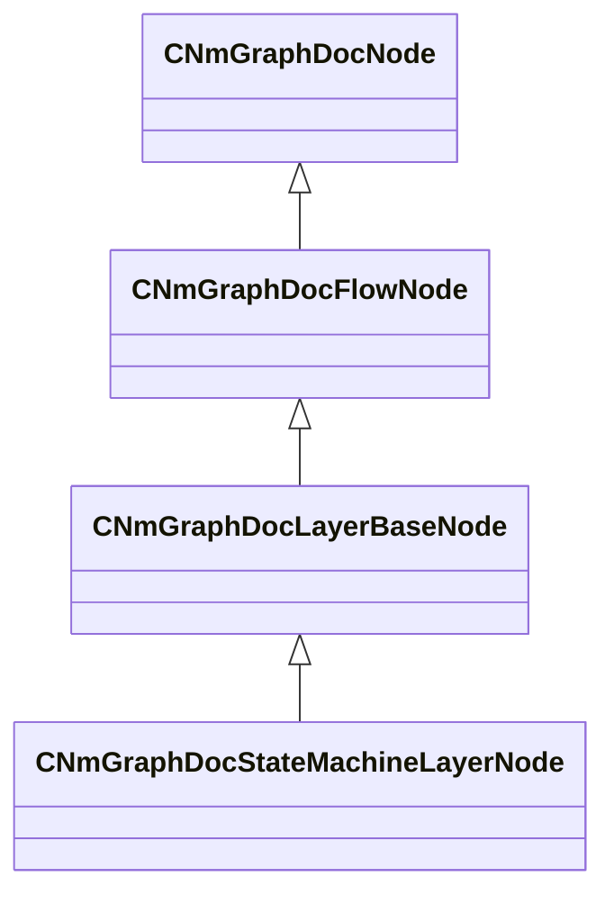

[Schemas](../../schemas.md) / [animdoclib](../animdoclib.md) / CNmGraphDocStateMachineLayerNode

# CNmGraphDocStateMachineLayerNode

**Kind:** class · **Size:** 264 bytes (`0x108`) · **Align:** 8 · **Module:** animdoclib

**Inherits from:** [CNmGraphDocLayerBaseNode](../animdoclib/CNmGraphDocLayerBaseNode.md)

**Relationships:**

## Memory layout

11 fields (0 declared here, 11 inherited). Offsets are absolute from the object base.

| Offset | Field | Type | From | Annotations |
|--------|-------|------|------|-------------|
| `0x8` | `m_ID` | V_uuid_t | [CNmGraphDocNode](../animdoclib/CNmGraphDocNode.md) | `MPropertySuppressField` |
| `0x18` | `m_name` | CUtlString | [CNmGraphDocNode](../animdoclib/CNmGraphDocNode.md) | `MPropertyHideField` |
| `0x20` | `m_floatingComment` | CUtlString | [CNmGraphDocNode](../animdoclib/CNmGraphDocNode.md) | `MPropertyAttributeEditor TextBlock()` |
| `0x28` | `m_position` | Vector2D | [CNmGraphDocNode](../animdoclib/CNmGraphDocNode.md) | `MPropertySuppressField` |
| `0x40` | `m_pChildGraph` | [CNmGraphDocGraph](../animdoclib/CNmGraphDocGraph.md)* | [CNmGraphDocNode](../animdoclib/CNmGraphDocNode.md) | `MPropertySuppressField` |
| `0x48` | `m_pSecondaryGraph` | [CNmGraphDocGraph](../animdoclib/CNmGraphDocGraph.md)* | [CNmGraphDocNode](../animdoclib/CNmGraphDocNode.md) | `MPropertySuppressField` |
| `0x50` | `m_inputPins` | CUtlLeanVectorFixedGrowable< [NmGraphDocPin_t](../animdoclib/NmGraphDocPin_t.md), 4 > | [CNmGraphDocFlowNode](../animdoclib/CNmGraphDocFlowNode.md) |  |
| `0xd8` | `m_outputPins` | CUtlLeanVectorFixedGrowable< [NmGraphDocPin_t](../animdoclib/NmGraphDocPin_t.md), 1 > | [CNmGraphDocFlowNode](../animdoclib/CNmGraphDocFlowNode.md) |  |
| `0x100` | `m_isSynchronized` | bool | [CNmGraphDocLayerBaseNode](../animdoclib/CNmGraphDocLayerBaseNode.md) |  |
| `0x101` | `m_ignoreEvents` | bool | [CNmGraphDocLayerBaseNode](../animdoclib/CNmGraphDocLayerBaseNode.md) |  |
| `0x102` | `m_blendMode` | [NmPoseBlendMode_t](../animlib/NmPoseBlendMode_t.md) | [CNmGraphDocLayerBaseNode](../animdoclib/CNmGraphDocLayerBaseNode.md) |  |

KV3 class defaults

<pre>{
	&quot;_class&quot;: &quot;CNmGraphDocStateMachineLayerNode&quot;,
	&quot;m_ID&quot;: &lt;HIDDEN FOR DIFF&gt;,
	&quot;m_name&quot;: &quot;&quot;,
	&quot;m_floatingComment&quot;: &quot;&quot;,
	&quot;m_position&quot;:
	[
		0.000000,
		0.000000
	],
	&quot;m_pChildGraph&quot;: null,
	&quot;m_pSecondaryGraph&quot;: null,
	&quot;m_inputPins&quot;:
	[
		{
			&quot;m_ID&quot;: &lt;HIDDEN FOR DIFF&gt;,
			&quot;m_name&quot;: &quot;State Machine&quot;,
			&quot;m_type&quot;: &quot;Pose&quot;,
			&quot;m_bIsDynamicPin&quot;: false,
			&quot;m_bAllowMultipleOutConnections&quot;: false
		}
	],
	&quot;m_outputPins&quot;:
	[
		{
			&quot;m_ID&quot;: &lt;HIDDEN FOR DIFF&gt;,
			&quot;m_name&quot;: &quot;Layer&quot;,
			&quot;m_type&quot;: &quot;Special&quot;,
			&quot;m_bIsDynamicPin&quot;: false,
			&quot;m_bAllowMultipleOutConnections&quot;: false
		}
	],
	&quot;m_isSynchronized&quot;: false,
	&quot;m_ignoreEvents&quot;: false,
	&quot;m_blendMode&quot;: &quot;Overlay&quot;
}</pre>

