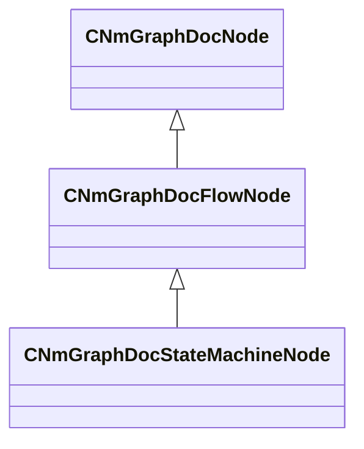

[Schemas](../../schemas.md) / [animdoclib](../animdoclib.md) / CNmGraphDocStateMachineNode

# CNmGraphDocStateMachineNode

> Source: **Build 25000182** · 2026-08-28 · `windows-x86_64` · schema `0.10.0`

**Kind:** class · **Size:** 256 bytes (`0x100`) · **Align:** 8 · **Module:** animdoclib

**Inherits from:** [CNmGraphDocFlowNode](../animdoclib/CNmGraphDocFlowNode.md)

**Relationships:**

## Memory layout

8 fields (0 declared here, 8 inherited). Offsets are absolute from the object base.

| Offset | Field | Type | From | Annotations |
|--------|-------|------|------|-------------|
| `0x8` | `m_ID` | V_uuid_t | [CNmGraphDocNode](../animdoclib/CNmGraphDocNode.md) | `MPropertySuppressField` |
| `0x18` | `m_name` | CUtlString | [CNmGraphDocNode](../animdoclib/CNmGraphDocNode.md) | `MPropertyHideField` |
| `0x20` | `m_floatingComment` | CUtlString | [CNmGraphDocNode](../animdoclib/CNmGraphDocNode.md) | `MPropertyAttributeEditor TextBlock()` |
| `0x28` | `m_position` | Vector2D | [CNmGraphDocNode](../animdoclib/CNmGraphDocNode.md) | `MPropertySuppressField` |
| `0x40` | `m_pChildGraph` | [CNmGraphDocGraph](../animdoclib/CNmGraphDocGraph.md)* | [CNmGraphDocNode](../animdoclib/CNmGraphDocNode.md) | `MPropertySuppressField` |
| `0x48` | `m_pSecondaryGraph` | [CNmGraphDocGraph](../animdoclib/CNmGraphDocGraph.md)* | [CNmGraphDocNode](../animdoclib/CNmGraphDocNode.md) | `MPropertySuppressField` |
| `0x50` | `m_inputPins` | CUtlLeanVectorFixedGrowable< [NmGraphDocPin_t](../animdoclib/NmGraphDocPin_t.md), 4 > | [CNmGraphDocFlowNode](../animdoclib/CNmGraphDocFlowNode.md) |  |
| `0xd8` | `m_outputPins` | CUtlLeanVectorFixedGrowable< [NmGraphDocPin_t](../animdoclib/NmGraphDocPin_t.md), 1 > | [CNmGraphDocFlowNode](../animdoclib/CNmGraphDocFlowNode.md) |  |

KV3 class defaults

<pre>{
	&quot;_class&quot;: &quot;CNmGraphDocStateMachineNode&quot;,
	&quot;m_ID&quot;: &lt;HIDDEN FOR DIFF&gt;,
	&quot;m_name&quot;: &quot;SM&quot;,
	&quot;m_floatingComment&quot;: &quot;&quot;,
	&quot;m_position&quot;:
	[
		0.000000,
		0.000000
	],
	&quot;m_pChildGraph&quot;:
	{
		&quot;_class&quot;: &quot;CNmGraphDocStateMachineGraph&quot;,
		&quot;m_ID&quot;: &lt;HIDDEN FOR DIFF&gt;,
		&quot;m_nodes&quot;:
		[
			{
				&quot;_class&quot;: &quot;CNmGraphDocEntryStateOverrideConduitNode&quot;,
				&quot;m_ID&quot;: &lt;HIDDEN FOR DIFF&gt;,
				&quot;m_name&quot;: &quot;&quot;,
				&quot;m_floatingComment&quot;: &quot;&quot;,
				&quot;m_position&quot;:
				[
					0.000000,
					0.000000
				],
				&quot;m_pChildGraph&quot;: null,
				&quot;m_pSecondaryGraph&quot;:
				{
					&quot;_class&quot;: &quot;CNmGraphDocFlowGraph&quot;,
					&quot;m_ID&quot;: &lt;HIDDEN FOR DIFF&gt;,
					&quot;m_nodes&quot;:
					[
						{
							&quot;_class&quot;: &quot;CNmGraphDocEntryStateOverrideConditionsNode&quot;,
							&quot;m_ID&quot;: &lt;HIDDEN FOR DIFF&gt;,
							&quot;m_name&quot;: &quot;&quot;,
							&quot;m_floatingComment&quot;: &quot;&quot;,
							&quot;m_position&quot;:
							[
								0.000000,
								0.000000
							],
							&quot;m_pChildGraph&quot;: null,
							&quot;m_pSecondaryGraph&quot;: null,
							&quot;m_inputPins&quot;:
							[
							],
							&quot;m_outputPins&quot;:
							[
							],
							&quot;m_resultType&quot;: &quot;Special&quot;,
							&quot;m_pinToStateMapping&quot;:
							[
							]
						},
						{
							&quot;_class&quot;: &quot;CNmGraphDocEntryOverrideNode&quot;,
							&quot;m_ID&quot;: &lt;HIDDEN FOR DIFF&gt;,
							&quot;m_name&quot;: &quot;State&quot;,
							&quot;m_floatingComment&quot;: &quot;&quot;,
							&quot;m_position&quot;:
							[
								0.000000,
								200.000000
							],
							&quot;m_pChildGraph&quot;: null,
							&quot;m_pSecondaryGraph&quot;: null,
							&quot;m_inputPins&quot;:
							[
								{
									&quot;m_ID&quot;: &lt;HIDDEN FOR DIFF&gt;,
									&quot;m_name&quot;: &quot;Condition&quot;,
									&quot;m_type&quot;: &quot;Bool&quot;,
									&quot;m_bIsDynamicPin&quot;: false,
									&quot;m_bAllowMultipleOutConnections&quot;: false
								}
							],
							&quot;m_outputPins&quot;:
							[
							],
							&quot;m_resultType&quot;: &quot;Special&quot;,
							&quot;m_stateID&quot;: &lt;HIDDEN FOR DIFF&gt;,
						}
					],
					&quot;m_graphType&quot;: &quot;EntryOverrideTree&quot;,
					&quot;m_viewOffset&quot;:
					[
						0.000000,
						0.000000
					],
					&quot;m_flViewZoom&quot;: 1.000000,
					&quot;m_connections&quot;:
					[
					]
				}
			},
			{
				&quot;_class&quot;: &quot;CNmGraphDocGlobalTransitionConduitNode&quot;,
				&quot;m_ID&quot;: &lt;HIDDEN FOR DIFF&gt;,
				&quot;m_name&quot;: &quot;&quot;,
				&quot;m_floatingComment&quot;: &quot;&quot;,
				&quot;m_position&quot;:
				[
					0.000000,
					0.000000
				],
				&quot;m_pChildGraph&quot;: null,
				&quot;m_pSecondaryGraph&quot;:
				{
					&quot;_class&quot;: &quot;CNmGraphDocFlowGraph&quot;,
					&quot;m_ID&quot;: &lt;HIDDEN FOR DIFF&gt;,
					&quot;m_nodes&quot;:
					[
						{
							&quot;_class&quot;: &quot;CNmGraphDocGlobalTransitionNode&quot;,
							&quot;m_ID&quot;: &lt;HIDDEN FOR DIFF&gt;,
							&quot;m_name&quot;: &quot;State&quot;,
							&quot;m_floatingComment&quot;: &quot;&quot;,
							&quot;m_position&quot;:
							[
								0.000000,
								200.000000
							],
							&quot;m_pChildGraph&quot;: null,
							&quot;m_pSecondaryGraph&quot;: null,
							&quot;m_inputPins&quot;:
							[
								{
									&quot;m_ID&quot;: &lt;HIDDEN FOR DIFF&gt;,
									&quot;m_name&quot;: &quot;Condition&quot;,
									&quot;m_type&quot;: &quot;Bool&quot;,
									&quot;m_bIsDynamicPin&quot;: false,
									&quot;m_bAllowMultipleOutConnections&quot;: false
								},
								{
									&quot;m_ID&quot;: &lt;HIDDEN FOR DIFF&gt;,
									&quot;m_name&quot;: &quot;Duration Override&quot;,
									&quot;m_type&quot;: &quot;Float&quot;,
									&quot;m_bIsDynamicPin&quot;: false,
									&quot;m_bAllowMultipleOutConnections&quot;: false
								},
								{
									&quot;m_ID&quot;: &lt;HIDDEN FOR DIFF&gt;,
									&quot;m_name&quot;: &quot;Time Offset Override&quot;,
									&quot;m_type&quot;: &quot;Float&quot;,
									&quot;m_bIsDynamicPin&quot;: false,
									&quot;m_bAllowMultipleOutConnections&quot;: false
								},
								{
									&quot;m_ID&quot;: &lt;HIDDEN FOR DIFF&gt;,
									&quot;m_name&quot;: &quot;Start Bone Mask&quot;,
									&quot;m_type&quot;: &quot;BoneMask&quot;,
									&quot;m_bIsDynamicPin&quot;: false,
									&quot;m_bAllowMultipleOutConnections&quot;: false
								},
								{
									&quot;m_ID&quot;: &lt;HIDDEN FOR DIFF&gt;,
									&quot;m_name&quot;: &quot;Target Sync ID&quot;,
									&quot;m_type&quot;: &quot;ID&quot;,
									&quot;m_bIsDynamicPin&quot;: false,
									&quot;m_bAllowMultipleOutConnections&quot;: false
								}
							],
							&quot;m_outputPins&quot;:
							[
							],
							&quot;m_resultType&quot;: &quot;Special&quot;,
							&quot;m_flDurationSeconds&quot;: 0.200000,
							&quot;m_bClampDurationToSource&quot;: false,
							&quot;m_rootMotionBlend&quot;: &quot;Blend&quot;,
							&quot;m_blendWeightEasing&quot;: &quot;Linear&quot;,
							&quot;m_flBoneMaskBlendInTimePercentage&quot;: 0.330000,
							&quot;m_timeMatchMode&quot;: &quot;None&quot;,
							&quot;m_flTimeOffset&quot;: 0.000000,
							&quot;m_bCanBeForced&quot;: false,
							&quot;m_stateID&quot;: &lt;HIDDEN FOR DIFF&gt;,
						}
					],
					&quot;m_graphType&quot;: &quot;GlobalTransitionConduit&quot;,
					&quot;m_viewOffset&quot;:
					[
						0.000000,
						0.000000
					],
					&quot;m_flViewZoom&quot;: 1.000000,
					&quot;m_connections&quot;:
					[
					]
				}
			},
			{
				&quot;_class&quot;: &quot;CNmGraphDocStateNode&quot;,
				&quot;m_ID&quot;: &lt;HIDDEN FOR DIFF&gt;,
				&quot;m_name&quot;: &quot;State&quot;,
				&quot;m_floatingComment&quot;: &quot;&quot;,
				&quot;m_position&quot;:
				[
					0.000000,
					150.000000
				],
				&quot;m_pChildGraph&quot;:
				{
					&quot;_class&quot;: &quot;CNmGraphDocFlowGraph&quot;,
					&quot;m_ID&quot;: &lt;HIDDEN FOR DIFF&gt;,
					&quot;m_nodes&quot;:
					[
						{
							&quot;_class&quot;: &quot;CNmGraphDocPoseResultNode&quot;,
							&quot;m_ID&quot;: &lt;HIDDEN FOR DIFF&gt;,
							&quot;m_name&quot;: &quot;&quot;,
							&quot;m_floatingComment&quot;: &quot;&quot;,
							&quot;m_position&quot;:
							[
								0.000000,
								0.000000
							],
							&quot;m_pChildGraph&quot;: null,
							&quot;m_pSecondaryGraph&quot;: null,
							&quot;m_inputPins&quot;:
							[
								{
									&quot;m_ID&quot;: &lt;HIDDEN FOR DIFF&gt;,
									&quot;m_name&quot;: &quot;Out&quot;,
									&quot;m_type&quot;: &quot;Pose&quot;,
									&quot;m_bIsDynamicPin&quot;: false,
									&quot;m_bAllowMultipleOutConnections&quot;: false
								}
							],
							&quot;m_outputPins&quot;:
							[
							],
							&quot;m_resultType&quot;: &quot;Pose&quot;
						}
					],
					&quot;m_graphType&quot;: &quot;BlendTree&quot;,
					&quot;m_viewOffset&quot;:
					[
						0.000000,
						0.000000
					],
					&quot;m_flViewZoom&quot;: 1.000000,
					&quot;m_connections&quot;:
					[
					]
				},
				&quot;m_pSecondaryGraph&quot;:
				{
					&quot;_class&quot;: &quot;CNmGraphDocFlowGraph&quot;,
					&quot;m_ID&quot;: &lt;HIDDEN FOR DIFF&gt;,
					&quot;m_nodes&quot;:
					[
						{
							&quot;_class&quot;: &quot;CNmGraphDocStateLayerDataNode&quot;,
							&quot;m_ID&quot;: &lt;HIDDEN FOR DIFF&gt;,
							&quot;m_name&quot;: &quot;&quot;,
							&quot;m_floatingComment&quot;: &quot;&quot;,
							&quot;m_position&quot;:
							[
								0.000000,
								0.000000
							],
							&quot;m_pChildGraph&quot;: null,
							&quot;m_pSecondaryGraph&quot;: null,
							&quot;m_inputPins&quot;:
							[
								{
									&quot;m_ID&quot;: &lt;HIDDEN FOR DIFF&gt;,
									&quot;m_name&quot;: &quot;Layer Weight&quot;,
									&quot;m_type&quot;: &quot;Float&quot;,
									&quot;m_bIsDynamicPin&quot;: false,
									&quot;m_bAllowMultipleOutConnections&quot;: false
								},
								{
									&quot;m_ID&quot;: &lt;HIDDEN FOR DIFF&gt;,
									&quot;m_name&quot;: &quot;Root Motion Weight&quot;,
									&quot;m_type&quot;: &quot;Float&quot;,
									&quot;m_bIsDynamicPin&quot;: false,
									&quot;m_bAllowMultipleOutConnections&quot;: false
								},
								{
									&quot;m_ID&quot;: &lt;HIDDEN FOR DIFF&gt;,
									&quot;m_name&quot;: &quot;Layer Mask&quot;,
									&quot;m_type&quot;: &quot;BoneMask&quot;,
									&quot;m_bIsDynamicPin&quot;: false,
									&quot;m_bAllowMultipleOutConnections&quot;: false
								}
							],
							&quot;m_outputPins&quot;:
							[
							],
							&quot;m_resultType&quot;: &quot;Special&quot;
						}
					],
					&quot;m_graphType&quot;: &quot;ValueTree&quot;,
					&quot;m_viewOffset&quot;:
					[
						0.000000,
						0.000000
					],
					&quot;m_flViewZoom&quot;: 1.000000,
					&quot;m_connections&quot;:
					[
					]
				},
				&quot;m_type&quot;: &quot;BlendTreeState&quot;,
				&quot;m_cloneSourceStateID&quot;: &quot;00000000-0000-0000-0000-000000000000&quot;,
				&quot;m_stateEvents&quot;:
				[
				],
				&quot;m_timedStateEvents&quot;:
				[
				],
				&quot;m_events&quot;:
				[
				],
				&quot;m_entryEvents&quot;:
				[
				],
				&quot;m_executeEvents&quot;:
				[
				],
				&quot;m_exitEvents&quot;:
				[
				],
				&quot;m_timeRemainingEvents&quot;:
				[
				],
				&quot;m_timeElapsedEvents&quot;:
				[
				],
				&quot;m_bUseActualElapsedTimeInStateForTimedEvents&quot;: false
			}
		],
		&quot;m_graphType&quot;: &quot;StateMachine&quot;,
		&quot;m_viewOffset&quot;:
		[
			0.000000,
			0.000000
		],
		&quot;m_flViewZoom&quot;: 1.000000,
		&quot;m_entryStateID&quot;: &lt;HIDDEN FOR DIFF&gt;,
	},
	&quot;m_pSecondaryGraph&quot;: null,
	&quot;m_inputPins&quot;:
	[
	],
	&quot;m_outputPins&quot;:
	[
		{
			&quot;m_ID&quot;: &lt;HIDDEN FOR DIFF&gt;,
			&quot;m_name&quot;: &quot;Pose&quot;,
			&quot;m_type&quot;: &quot;Pose&quot;,
			&quot;m_bIsDynamicPin&quot;: false,
			&quot;m_bAllowMultipleOutConnections&quot;: false
		}
	]
}</pre>

