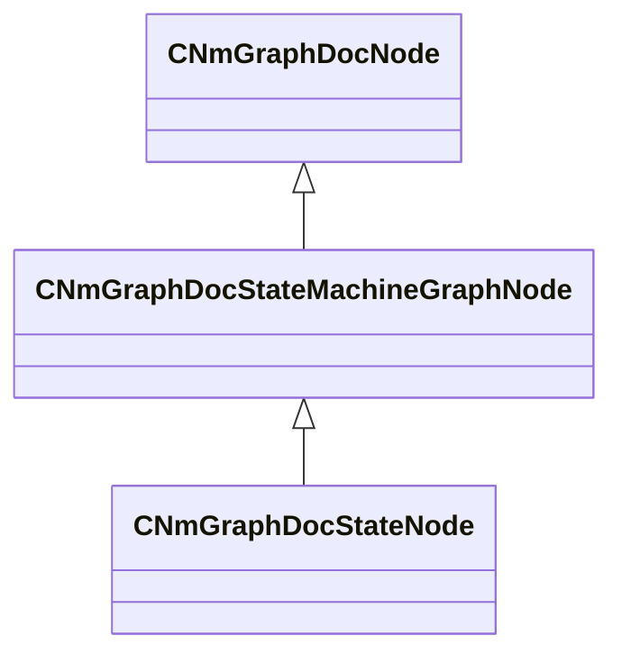

[Schemas](../../schemas.md) / [animdoclib](../animdoclib.md) / CNmGraphDocStateNode

# CNmGraphDocStateNode

**Kind:** class · **Size:** 304 bytes (`0x130`) · **Align:** 8 · **Module:** animdoclib

**Inherits from:** [CNmGraphDocStateMachineGraphNode](../animdoclib/CNmGraphDocStateMachineGraphNode.md)

**Relationships:**

## Memory layout

17 fields (11 declared here, 6 inherited). Offsets are absolute from the object base.

| Offset | Field | Type | From | Annotations |
|--------|-------|------|------|-------------|
| `0x8` | `m_ID` | V_uuid_t | [CNmGraphDocNode](../animdoclib/CNmGraphDocNode.md) | `MPropertySuppressField` |
| `0x18` | `m_name` | CUtlString | [CNmGraphDocNode](../animdoclib/CNmGraphDocNode.md) | `MPropertyHideField` |
| `0x20` | `m_floatingComment` | CUtlString | [CNmGraphDocNode](../animdoclib/CNmGraphDocNode.md) | `MPropertyAttributeEditor TextBlock()` |
| `0x28` | `m_position` | Vector2D | [CNmGraphDocNode](../animdoclib/CNmGraphDocNode.md) | `MPropertySuppressField` |
| `0x40` | `m_pChildGraph` | [CNmGraphDocGraph](../animdoclib/CNmGraphDocGraph.md)* | [CNmGraphDocNode](../animdoclib/CNmGraphDocNode.md) | `MPropertySuppressField` |
| `0x48` | `m_pSecondaryGraph` | [CNmGraphDocGraph](../animdoclib/CNmGraphDocGraph.md)* | [CNmGraphDocNode](../animdoclib/CNmGraphDocNode.md) | `MPropertySuppressField` |
| `0x50` | `m_type` | [CNmGraphDocStateNode](../animdoclib/CNmGraphDocStateNode.md)::StateType_t |  | `MPropertyHideField` |
| `0x54` | `m_cloneSourceStateID` | V_uuid_t |  | `MPropertySuppressField` |
| `0x68` | `m_stateEvents` | CUtlVector< [CNmGraphDocStateNode](../animdoclib/CNmGraphDocStateNode.md)::StateEvent_t > |  | `MPropertyAutoExpandSelf` |
| `0x80` | `m_timedStateEvents` | CUtlVector< [CNmGraphDocStateNode](../animdoclib/CNmGraphDocStateNode.md)::TimedStateEvent_t > |  | `MPropertyAutoExpandSelf` |
| `0x98` | `m_events` | CUtlVector< CGlobalSymbol > |  | `MPropertySuppressField` |
| `0xb0` | `m_entryEvents` | CUtlVector< CGlobalSymbol > |  | `MPropertySuppressField` |
| `0xc8` | `m_executeEvents` | CUtlVector< CGlobalSymbol > |  | `MPropertySuppressField` |
| `0xe0` | `m_exitEvents` | CUtlVector< CGlobalSymbol > |  | `MPropertySuppressField` |
| `0xf8` | `m_timeRemainingEvents` | CUtlVector< [CNmGraphDocStateNode](../animdoclib/CNmGraphDocStateNode.md)::TimedStateEvent_t > |  | `MPropertySuppressField` |
| `0x110` | `m_timeElapsedEvents` | CUtlVector< [CNmGraphDocStateNode](../animdoclib/CNmGraphDocStateNode.md)::TimedStateEvent_t > |  | `MPropertySuppressField` |
| `0x128` | `m_bUseActualElapsedTimeInStateForTimedEvents` | bool |  | `MPropertyGroupName Advanced` |

KV3 class defaults

<pre>{
	&quot;_class&quot;: &quot;CNmGraphDocStateNode&quot;,
	&quot;m_ID&quot;: &lt;HIDDEN FOR DIFF&gt;,
	&quot;m_name&quot;: &quot;&quot;,
	&quot;m_floatingComment&quot;: &quot;&quot;,
	&quot;m_position&quot;:
	[
		0.000000,
		0.000000
	],
	&quot;m_pChildGraph&quot;:
	{
		&quot;_class&quot;: &quot;CNmGraphDocFlowGraph&quot;,
		&quot;m_ID&quot;: &lt;HIDDEN FOR DIFF&gt;,
		&quot;m_nodes&quot;:
		[
			{
				&quot;_class&quot;: &quot;CNmGraphDocPoseResultNode&quot;,
				&quot;m_ID&quot;: &lt;HIDDEN FOR DIFF&gt;,
				&quot;m_name&quot;: &quot;&quot;,
				&quot;m_floatingComment&quot;: &quot;&quot;,
				&quot;m_position&quot;:
				[
					0.000000,
					0.000000
				],
				&quot;m_pChildGraph&quot;: null,
				&quot;m_pSecondaryGraph&quot;: null,
				&quot;m_inputPins&quot;:
				[
					{
						&quot;m_ID&quot;: &lt;HIDDEN FOR DIFF&gt;,
						&quot;m_name&quot;: &quot;Out&quot;,
						&quot;m_type&quot;: &quot;Pose&quot;,
						&quot;m_bIsDynamicPin&quot;: false,
						&quot;m_bAllowMultipleOutConnections&quot;: false
					}
				],
				&quot;m_outputPins&quot;:
				[
				],
				&quot;m_resultType&quot;: &quot;Pose&quot;
			}
		],
		&quot;m_graphType&quot;: &quot;BlendTree&quot;,
		&quot;m_viewOffset&quot;:
		[
			0.000000,
			0.000000
		],
		&quot;m_flViewZoom&quot;: 1.000000,
		&quot;m_connections&quot;:
		[
		]
	},
	&quot;m_pSecondaryGraph&quot;:
	{
		&quot;_class&quot;: &quot;CNmGraphDocFlowGraph&quot;,
		&quot;m_ID&quot;: &lt;HIDDEN FOR DIFF&gt;,
		&quot;m_nodes&quot;:
		[
			{
				&quot;_class&quot;: &quot;CNmGraphDocStateLayerDataNode&quot;,
				&quot;m_ID&quot;: &lt;HIDDEN FOR DIFF&gt;,
				&quot;m_name&quot;: &quot;&quot;,
				&quot;m_floatingComment&quot;: &quot;&quot;,
				&quot;m_position&quot;:
				[
					0.000000,
					0.000000
				],
				&quot;m_pChildGraph&quot;: null,
				&quot;m_pSecondaryGraph&quot;: null,
				&quot;m_inputPins&quot;:
				[
					{
						&quot;m_ID&quot;: &lt;HIDDEN FOR DIFF&gt;,
						&quot;m_name&quot;: &quot;Layer Weight&quot;,
						&quot;m_type&quot;: &quot;Float&quot;,
						&quot;m_bIsDynamicPin&quot;: false,
						&quot;m_bAllowMultipleOutConnections&quot;: false
					},
					{
						&quot;m_ID&quot;: &lt;HIDDEN FOR DIFF&gt;,
						&quot;m_name&quot;: &quot;Root Motion Weight&quot;,
						&quot;m_type&quot;: &quot;Float&quot;,
						&quot;m_bIsDynamicPin&quot;: false,
						&quot;m_bAllowMultipleOutConnections&quot;: false
					},
					{
						&quot;m_ID&quot;: &lt;HIDDEN FOR DIFF&gt;,
						&quot;m_name&quot;: &quot;Layer Mask&quot;,
						&quot;m_type&quot;: &quot;BoneMask&quot;,
						&quot;m_bIsDynamicPin&quot;: false,
						&quot;m_bAllowMultipleOutConnections&quot;: false
					}
				],
				&quot;m_outputPins&quot;:
				[
				],
				&quot;m_resultType&quot;: &quot;Special&quot;
			}
		],
		&quot;m_graphType&quot;: &quot;ValueTree&quot;,
		&quot;m_viewOffset&quot;:
		[
			0.000000,
			0.000000
		],
		&quot;m_flViewZoom&quot;: 1.000000,
		&quot;m_connections&quot;:
		[
		]
	},
	&quot;m_type&quot;: &quot;BlendTreeState&quot;,
	&quot;m_cloneSourceStateID&quot;: &quot;00000000-0000-0000-0000-000000000000&quot;,
	&quot;m_stateEvents&quot;:
	[
	],
	&quot;m_timedStateEvents&quot;:
	[
	],
	&quot;m_events&quot;:
	[
	],
	&quot;m_entryEvents&quot;:
	[
	],
	&quot;m_executeEvents&quot;:
	[
	],
	&quot;m_exitEvents&quot;:
	[
	],
	&quot;m_timeRemainingEvents&quot;:
	[
	],
	&quot;m_timeElapsedEvents&quot;:
	[
	],
	&quot;m_bUseActualElapsedTimeInStateForTimedEvents&quot;: false
}</pre>

