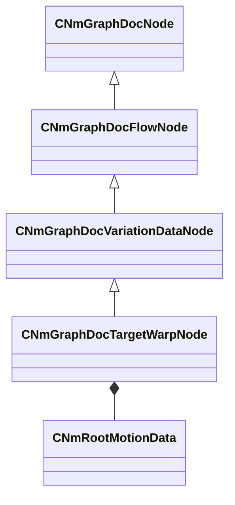

[Schemas](../../schemas.md) / [animdoclib](../animdoclib.md) / CNmGraphDocTargetWarpNode

# CNmGraphDocTargetWarpNode

**Kind:** class · **Size:** 536 bytes (`0x218`) · **Align:** 8 · **Module:** animdoclib

**Inherits from:** [CNmGraphDocVariationDataNode](../animdoclib/CNmGraphDocVariationDataNode.md)

**Relationships:**

## Memory layout

20 fields (9 declared here, 11 inherited). Offsets are absolute from the object base.

| Offset | Field | Type | From | Annotations |
|--------|-------|------|------|-------------|
| `0x8` | `m_ID` | V_uuid_t | [CNmGraphDocNode](../animdoclib/CNmGraphDocNode.md) | `MPropertySuppressField` |
| `0x18` | `m_name` | CUtlString | [CNmGraphDocNode](../animdoclib/CNmGraphDocNode.md) | `MPropertyHideField` |
| `0x20` | `m_floatingComment` | CUtlString | [CNmGraphDocNode](../animdoclib/CNmGraphDocNode.md) | `MPropertyAttributeEditor TextBlock()` |
| `0x28` | `m_position` | Vector2D | [CNmGraphDocNode](../animdoclib/CNmGraphDocNode.md) | `MPropertySuppressField` |
| `0x40` | `m_pChildGraph` | [CNmGraphDocGraph](../animdoclib/CNmGraphDocGraph.md)* | [CNmGraphDocNode](../animdoclib/CNmGraphDocNode.md) | `MPropertySuppressField` |
| `0x48` | `m_pSecondaryGraph` | [CNmGraphDocGraph](../animdoclib/CNmGraphDocGraph.md)* | [CNmGraphDocNode](../animdoclib/CNmGraphDocNode.md) | `MPropertySuppressField` |
| `0x50` | `m_inputPins` | CUtlLeanVectorFixedGrowable< [NmGraphDocPin_t](../animdoclib/NmGraphDocPin_t.md), 4 > | [CNmGraphDocFlowNode](../animdoclib/CNmGraphDocFlowNode.md) |  |
| `0xd8` | `m_outputPins` | CUtlLeanVectorFixedGrowable< [NmGraphDocPin_t](../animdoclib/NmGraphDocPin_t.md), 1 > | [CNmGraphDocFlowNode](../animdoclib/CNmGraphDocFlowNode.md) |  |
| `0x100` | `m_pDefaultVariationData` | [CNmGraphDocVariationDataNode](../animdoclib/CNmGraphDocVariationDataNode.md)::CData* | [CNmGraphDocVariationDataNode](../animdoclib/CNmGraphDocVariationDataNode.md) | `MPropertySuppressField` |
| `0x108` | `m_overrides` | CUtlVector< [CNmGraphDocVariationDataNode](../animdoclib/CNmGraphDocVariationDataNode.md)::OverrideValue_t > | [CNmGraphDocVariationDataNode](../animdoclib/CNmGraphDocVariationDataNode.md) | `MPropertySuppressField` |
| `0x120` | `m_defaultResourceName` | CResourceName | [CNmGraphDocVariationDataNode](../animdoclib/CNmGraphDocVariationDataNode.md) | `MPropertySuppressField` |
| `0x200` | `m_targetUpdateRule` | CNmTargetWarpNode::TargetUpdateRule_t |  |  |
| `0x201` | `m_bAllowTargetUpdate` | bool |  | `MPropertySuppressField` |
| `0x202` | `m_bAlignWithTargetAtLastWarpEvent` | bool |  |  |
| `0x203` | `m_samplingMode` | [CNmRootMotionData](../animlib/CNmRootMotionData.md)::SamplingMode_t |  |  |
| `0x204` | `m_flSamplingPositionErrorThreshold` | float32 |  |  |
| `0x208` | `m_flMaxTangentLength` | float32 |  |  |
| `0x20c` | `m_flLerpFallbackDistanceThreshold` | float32 |  |  |
| `0x210` | `m_flTargetUpdateDistanceThresholdDegrees` | float32 |  |  |
| `0x214` | `m_flTargetUpdateAngleThresholdDegrees` | float32 |  |  |

KV3 class defaults

<pre>{
	&quot;_class&quot;: &quot;CNmGraphDocTargetWarpNode&quot;,
	&quot;m_ID&quot;: &lt;HIDDEN FOR DIFF&gt;,
	&quot;m_name&quot;: &quot;&quot;,
	&quot;m_floatingComment&quot;: &quot;&quot;,
	&quot;m_position&quot;:
	[
		0.000000,
		0.000000
	],
	&quot;m_pChildGraph&quot;: null,
	&quot;m_pSecondaryGraph&quot;: null,
	&quot;m_inputPins&quot;:
	[
		{
			&quot;m_ID&quot;: &lt;HIDDEN FOR DIFF&gt;,
			&quot;m_name&quot;: &quot;Input&quot;,
			&quot;m_type&quot;: &quot;Pose&quot;,
			&quot;m_bIsDynamicPin&quot;: false,
			&quot;m_bAllowMultipleOutConnections&quot;: false
		},
		{
			&quot;m_ID&quot;: &lt;HIDDEN FOR DIFF&gt;,
			&quot;m_name&quot;: &quot;World Target&quot;,
			&quot;m_type&quot;: &quot;Target&quot;,
			&quot;m_bIsDynamicPin&quot;: false,
			&quot;m_bAllowMultipleOutConnections&quot;: false
		}
	],
	&quot;m_outputPins&quot;:
	[
		{
			&quot;m_ID&quot;: &lt;HIDDEN FOR DIFF&gt;,
			&quot;m_name&quot;: &quot;Result&quot;,
			&quot;m_type&quot;: &quot;Pose&quot;,
			&quot;m_bIsDynamicPin&quot;: false,
			&quot;m_bAllowMultipleOutConnections&quot;: false
		}
	],
	&quot;m_pDefaultVariationData&quot;:
	{
		&quot;_class&quot;: &quot;CNmGraphDocTargetWarpNode::CData&quot;,
		&quot;m_strAlignmentBoneName&quot;: &quot;&quot;
	},
	&quot;m_overrides&quot;:
	[
	],
	&quot;m_defaultResourceName&quot;: &quot;&quot;,
	&quot;m_targetUpdateRule&quot;: &quot;None&quot;,
	&quot;m_bAllowTargetUpdate&quot;: false,
	&quot;m_bAlignWithTargetAtLastWarpEvent&quot;: false,
	&quot;m_samplingMode&quot;: &quot;WorldSpace&quot;,
	&quot;m_flSamplingPositionErrorThreshold&quot;: 2.000000,
	&quot;m_flMaxTangentLength&quot;: 49.000000,
	&quot;m_flLerpFallbackDistanceThreshold&quot;: 4.000000,
	&quot;m_flTargetUpdateDistanceThresholdDegrees&quot;: 4.000000,
	&quot;m_flTargetUpdateAngleThresholdDegrees&quot;: 5.000000
}</pre>

