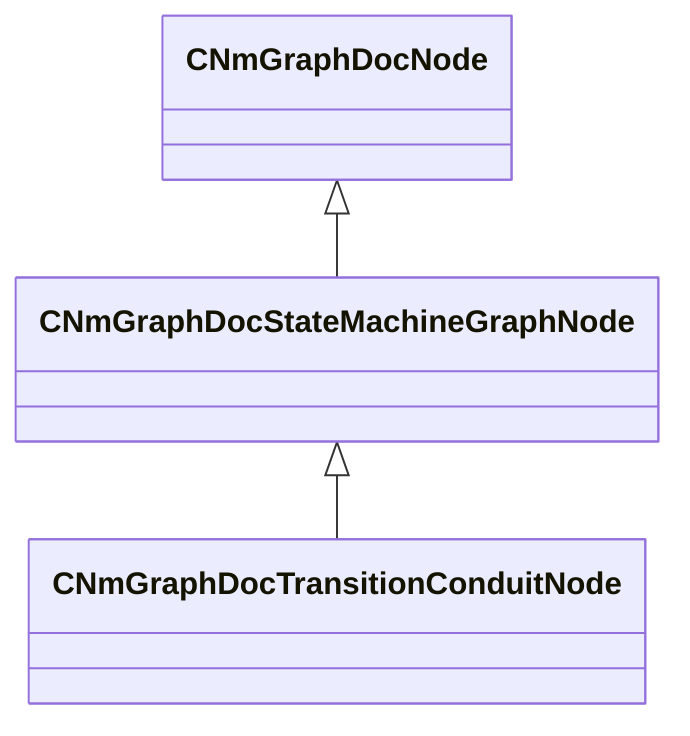

[Schemas](../../schemas.md) / [animdoclib](../animdoclib.md) / CNmGraphDocTransitionConduitNode

# CNmGraphDocTransitionConduitNode

**Kind:** class · **Size:** 112 bytes (`0x70`) · **Align:** 8 · **Module:** animdoclib

**Inherits from:** [CNmGraphDocStateMachineGraphNode](../animdoclib/CNmGraphDocStateMachineGraphNode.md)

**Relationships:**

## Memory layout

8 fields (2 declared here, 6 inherited). Offsets are absolute from the object base.

| Offset | Field | Type | From | Annotations |
|--------|-------|------|------|-------------|
| `0x8` | `m_ID` | V_uuid_t | [CNmGraphDocNode](../animdoclib/CNmGraphDocNode.md) | `MPropertySuppressField` |
| `0x18` | `m_name` | CUtlString | [CNmGraphDocNode](../animdoclib/CNmGraphDocNode.md) | `MPropertyHideField` |
| `0x20` | `m_floatingComment` | CUtlString | [CNmGraphDocNode](../animdoclib/CNmGraphDocNode.md) | `MPropertyAttributeEditor TextBlock()` |
| `0x28` | `m_position` | Vector2D | [CNmGraphDocNode](../animdoclib/CNmGraphDocNode.md) | `MPropertySuppressField` |
| `0x40` | `m_pChildGraph` | [CNmGraphDocGraph](../animdoclib/CNmGraphDocGraph.md)* | [CNmGraphDocNode](../animdoclib/CNmGraphDocNode.md) | `MPropertySuppressField` |
| `0x48` | `m_pSecondaryGraph` | [CNmGraphDocGraph](../animdoclib/CNmGraphDocGraph.md)* | [CNmGraphDocNode](../animdoclib/CNmGraphDocNode.md) | `MPropertySuppressField` |
| `0x50` | `m_startStateID` | V_uuid_t |  |  |
| `0x60` | `m_endStateID` | V_uuid_t |  |  |

KV3 class defaults

<pre>{
	&quot;_class&quot;: &quot;CNmGraphDocTransitionConduitNode&quot;,
	&quot;m_ID&quot;: &lt;HIDDEN FOR DIFF&gt;,
	&quot;m_name&quot;: &quot;&quot;,
	&quot;m_floatingComment&quot;: &quot;&quot;,
	&quot;m_position&quot;:
	[
		0.000000,
		0.000000
	],
	&quot;m_pChildGraph&quot;: null,
	&quot;m_pSecondaryGraph&quot;:
	{
		&quot;_class&quot;: &quot;CNmGraphDocFlowGraph&quot;,
		&quot;m_ID&quot;: &lt;HIDDEN FOR DIFF&gt;,
		&quot;m_nodes&quot;:
		[
		],
		&quot;m_graphType&quot;: &quot;TransitionConduit&quot;,
		&quot;m_viewOffset&quot;:
		[
			0.000000,
			0.000000
		],
		&quot;m_flViewZoom&quot;: 1.000000,
		&quot;m_connections&quot;:
		[
		]
	},
	&quot;m_startStateID&quot;: &quot;00000000-0000-0000-0000-000000000000&quot;,
	&quot;m_endStateID&quot;: &quot;00000000-0000-0000-0000-000000000000&quot;
}</pre>

