[Schemas](../../schemas.md) / [animdoclib](../animdoclib.md) / CNmGraphDocVariationDataNode::CData

# CNmGraphDocVariationDataNode::CData

> Source: **Build 25000182** · 2026-08-28 · `windows-x86_64` · schema `0.10.0`

**Kind:** class · **Size:** 8 bytes (`0x8`) · **Align:** 8 · **Module:** animdoclib

**Derived by:** [CNmGraphDocAnimationPoseNode::CData](../animdoclib/CNmGraphDocAnimationPoseNode.CData.md), [CNmGraphDocBoneMaskNode::CData](../animdoclib/CNmGraphDocBoneMaskNode.CData.md), [CNmGraphDocClipNode::CData](../animdoclib/CNmGraphDocClipNode.CData.md), [CNmGraphDocParameterizedClipSelectorNode::CData](../animdoclib/CNmGraphDocParameterizedClipSelectorNode.CData.md), [CNmGraphDocParameterizedSelectorNode::CData](../animdoclib/CNmGraphDocParameterizedSelectorNode.CData.md), [CNmGraphDocReferencedGraphNode::CData](../animdoclib/CNmGraphDocReferencedGraphNode.CData.md), [CNmGraphDocTargetWarpNode::CData](../animdoclib/CNmGraphDocTargetWarpNode.CData.md), [CNmGraphDocVariationIDComparisonNode::CData](../animdoclib/CNmGraphDocVariationIDComparisonNode.CData.md), [CnmGraphDocChainLookatNode::CData](../animdoclib/CnmGraphDocChainLookatNode.CData.md), [CnmGraphDocFollowBoneNode::CData](../animdoclib/CnmGraphDocFollowBoneNode.CData.md), [CnmGraphDocFootIKNode::CData](../animdoclib/CnmGraphDocFootIKNode.CData.md), [CnmGraphDocTwoBoneIKNode::CData](../animdoclib/CnmGraphDocTwoBoneIKNode.CData.md), [CnmGraphDocVariationConstFloatNode::CData](../animdoclib/CnmGraphDocVariationConstFloatNode.CData.md)

**Relationships:**

```mermaid
classDiagram
    `CNmGraphDocVariationDataNode::CData` <|-- `CNmGraphDocAnimationPoseNode::CData`
    `CNmGraphDocVariationDataNode::CData` <|-- `CNmGraphDocBoneMaskNode::CData`
    `CNmGraphDocVariationDataNode::CData` <|-- `CNmGraphDocClipNode::CData`
    `CNmGraphDocVariationDataNode::CData` <|-- `CNmGraphDocParameterizedClipSelectorNode::CData`
    `CNmGraphDocVariationDataNode::CData` <|-- `CNmGraphDocParameterizedSelectorNode::CData`
    `CNmGraphDocVariationDataNode::CData` <|-- `CNmGraphDocReferencedGraphNode::CData`
    `CNmGraphDocVariationDataNode::CData` <|-- `CNmGraphDocTargetWarpNode::CData`
    `CNmGraphDocVariationDataNode::CData` <|-- `CNmGraphDocVariationIDComparisonNode::CData`
    `CNmGraphDocVariationDataNode::CData` <|-- `CnmGraphDocChainLookatNode::CData`
    `CNmGraphDocVariationDataNode::CData` <|-- `CnmGraphDocFollowBoneNode::CData`
    `CNmGraphDocVariationDataNode::CData` <|-- `CnmGraphDocFootIKNode::CData`
    `CNmGraphDocVariationDataNode::CData` <|-- `CnmGraphDocTwoBoneIKNode::CData`
    `CNmGraphDocVariationDataNode::CData` <|-- `CnmGraphDocVariationConstFloatNode::CData`
```

## Memory layout

No schema-visible fields (8 bytes of opaque storage).

KV3 class defaults

<pre>{
	&quot;_class&quot;: &quot;CNmGraphDocVariationDataNode::CData&quot;
}</pre>

