[Schemas](../../schemas.md) / [animdoclib](../animdoclib.md) / CNmGraphDocVariationDataNode

# CNmGraphDocVariationDataNode

> Source: **Build 25000182** · 2026-08-28 · `windows-x86_64` · schema `0.10.0`

**Kind:** class · **Size:** 512 bytes (`0x200`) · **Align:** n/a (unspecified) · **Module:** animdoclib

**Inherits from:** [CNmGraphDocFlowNode](../animdoclib/CNmGraphDocFlowNode.md)

**Derived by:** [CNmGraphDocAnimationPoseNode](../animdoclib/CNmGraphDocAnimationPoseNode.md), [CNmGraphDocBoneMaskNode](../animdoclib/CNmGraphDocBoneMaskNode.md), [CNmGraphDocClipNode](../animdoclib/CNmGraphDocClipNode.md), [CNmGraphDocParameterizedClipSelectorNode](../animdoclib/CNmGraphDocParameterizedClipSelectorNode.md), [CNmGraphDocParameterizedSelectorNode](../animdoclib/CNmGraphDocParameterizedSelectorNode.md), [CNmGraphDocReferencedGraphNode](../animdoclib/CNmGraphDocReferencedGraphNode.md), [CNmGraphDocTargetWarpNode](../animdoclib/CNmGraphDocTargetWarpNode.md), [CNmGraphDocVariationIDComparisonNode](../animdoclib/CNmGraphDocVariationIDComparisonNode.md), [CnmGraphDocChainLookatNode](../animdoclib/CnmGraphDocChainLookatNode.md), [CnmGraphDocFollowBoneNode](../animdoclib/CnmGraphDocFollowBoneNode.md), [CnmGraphDocFootIKNode](../animdoclib/CnmGraphDocFootIKNode.md), [CnmGraphDocTwoBoneIKNode](../animdoclib/CnmGraphDocTwoBoneIKNode.md), [CnmGraphDocVariationConstFloatNode](../animdoclib/CnmGraphDocVariationConstFloatNode.md)

**Relationships:**

```mermaid
classDiagram
    CNmGraphDocFlowNode <|-- CNmGraphDocVariationDataNode
    CNmGraphDocNode <|-- CNmGraphDocFlowNode
    CNmGraphDocVariationDataNode <|-- CNmGraphDocAnimationPoseNode
    CNmGraphDocVariationDataNode <|-- CNmGraphDocBoneMaskNode
    CNmGraphDocVariationDataNode <|-- CNmGraphDocClipNode
    CNmGraphDocVariationDataNode <|-- CNmGraphDocParameterizedClipSelectorNode
    CNmGraphDocVariationDataNode <|-- CNmGraphDocParameterizedSelectorNode
    CNmGraphDocVariationDataNode <|-- CNmGraphDocReferencedGraphNode
    CNmGraphDocVariationDataNode <|-- CNmGraphDocTargetWarpNode
    CNmGraphDocVariationDataNode <|-- CNmGraphDocVariationIDComparisonNode
    CNmGraphDocVariationDataNode <|-- CnmGraphDocChainLookatNode
    CNmGraphDocVariationDataNode <|-- CnmGraphDocFollowBoneNode
    CNmGraphDocVariationDataNode <|-- CnmGraphDocFootIKNode
    CNmGraphDocVariationDataNode <|-- CnmGraphDocTwoBoneIKNode
    CNmGraphDocVariationDataNode <|-- CnmGraphDocVariationConstFloatNode
    CNmGraphDocVariationDataNode --> `CNmGraphDocVariationDataNode::CData`
    CNmGraphDocVariationDataNode *-- `CNmGraphDocVariationDataNode::OverrideValue_t`
```

## Memory layout

11 fields (3 declared here, 8 inherited). Offsets are absolute from the object base.

| Offset | Field | Type | From | Annotations |
|--------|-------|------|------|-------------|
| `0x8` | `m_ID` | V_uuid_t | [CNmGraphDocNode](../animdoclib/CNmGraphDocNode.md) | `MPropertySuppressField` |
| `0x18` | `m_name` | CUtlString | [CNmGraphDocNode](../animdoclib/CNmGraphDocNode.md) | `MPropertyHideField` |
| `0x20` | `m_floatingComment` | CUtlString | [CNmGraphDocNode](../animdoclib/CNmGraphDocNode.md) | `MPropertyAttributeEditor TextBlock()` |
| `0x28` | `m_position` | Vector2D | [CNmGraphDocNode](../animdoclib/CNmGraphDocNode.md) | `MPropertySuppressField` |
| `0x40` | `m_pChildGraph` | [CNmGraphDocGraph](../animdoclib/CNmGraphDocGraph.md)* | [CNmGraphDocNode](../animdoclib/CNmGraphDocNode.md) | `MPropertySuppressField` |
| `0x48` | `m_pSecondaryGraph` | [CNmGraphDocGraph](../animdoclib/CNmGraphDocGraph.md)* | [CNmGraphDocNode](../animdoclib/CNmGraphDocNode.md) | `MPropertySuppressField` |
| `0x50` | `m_inputPins` | CUtlLeanVectorFixedGrowable< [NmGraphDocPin_t](../animdoclib/NmGraphDocPin_t.md), 4 > | [CNmGraphDocFlowNode](../animdoclib/CNmGraphDocFlowNode.md) |  |
| `0xd8` | `m_outputPins` | CUtlLeanVectorFixedGrowable< [NmGraphDocPin_t](../animdoclib/NmGraphDocPin_t.md), 1 > | [CNmGraphDocFlowNode](../animdoclib/CNmGraphDocFlowNode.md) |  |
| `0x100` | `m_pDefaultVariationData` | [CNmGraphDocVariationDataNode::CData](../animdoclib/CNmGraphDocVariationDataNode.CData.md)* |  | `MPropertySuppressField` |
| `0x108` | `m_overrides` | CUtlVector< [CNmGraphDocVariationDataNode::OverrideValue_t](../animdoclib/CNmGraphDocVariationDataNode.OverrideValue_t.md) > |  | `MPropertySuppressField` |
| `0x120` | `m_defaultResourceName` | CResourceName |  | `MPropertySuppressField` |
