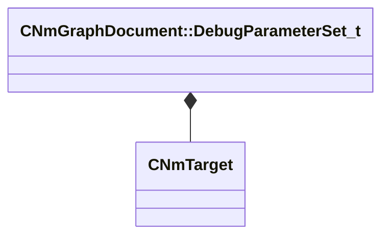

[Schemas](../../schemas.md) / [animdoclib](../animdoclib.md) / CNmGraphDocument::DebugParameterSet_t

# CNmGraphDocument::DebugParameterSet_t

> Source: **Build 25000182** · 2026-08-28 · `windows-x86_64` · schema `0.10.0`

**Kind:** class · **Size:** 88 bytes (`0x58`) · **Align:** 8 · **Module:** animdoclib

**Relationships:**

## Memory layout

6 fields (6 declared here, 0 inherited). Offsets are absolute from the object base.

| Offset | Field | Type | From | Annotations |
|--------|-------|------|------|-------------|
| `0x0` | `m_ID` | CGlobalSymbol |  |  |
| `0x8` | `m_boolValues` | CUtlLeanVector< std::pair< CGlobalSymbol, bool > > |  |  |
| `0x18` | `m_floatValues` | CUtlLeanVector< std::pair< CGlobalSymbol, float32 > > |  |  |
| `0x28` | `m_IDValues` | CUtlLeanVector< std::pair< CGlobalSymbol, CGlobalSymbol > > |  |  |
| `0x38` | `m_vectorValues` | CUtlLeanVector< std::pair< CGlobalSymbol, Vector > > |  |  |
| `0x48` | `m_targetValues` | CUtlLeanVector< std::pair< CGlobalSymbol, [CNmTarget](../animlib/CNmTarget.md) > > |  |  |

KV3 class defaults

<pre>{
	&quot;m_ID&quot;: &lt;HIDDEN FOR DIFF&gt;,
	&quot;m_boolValues&quot;:
	[
	],
	&quot;m_floatValues&quot;:
	[
	],
	&quot;m_IDValues&quot;:
	[
	],
	&quot;m_vectorValues&quot;:
	[
	],
	&quot;m_targetValues&quot;:
	[
	]
}</pre>

