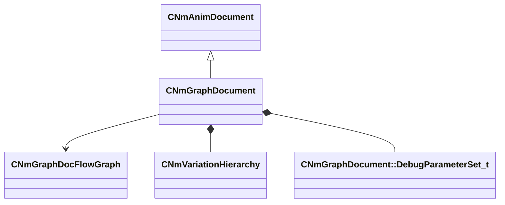

[Schemas](../../schemas.md) / [animdoclib](../animdoclib.md) / CNmGraphDocument

# CNmGraphDocument

> Source: **Build 25000182** · 2026-08-28 · `windows-x86_64` · schema `0.10.0`

**Kind:** class · **Size:** 184 bytes (`0xb8`) · **Align:** 8 · **Module:** animdoclib

**Inherits from:** [CNmAnimDocument](../animdoclib/CNmAnimDocument.md)

**Relationships:**

## Memory layout

5 fields (4 declared here, 1 inherited). Offsets are absolute from the object base.

| Offset | Field | Type | From | Annotations |
|--------|-------|------|------|-------------|
| `0x68` | `m_nVersion` | int32 | [CNmAnimDocument](../animdoclib/CNmAnimDocument.md) | `MPropertySuppressField` |
| `0x70` | `m_pRootGraph` | [CNmGraphDocFlowGraph](../animdoclib/CNmGraphDocFlowGraph.md)* |  |  |
| `0x78` | `m_variationHierarchy` | [CNmVariationHierarchy](../animdoclib/CNmVariationHierarchy.md) |  |  |
| `0x90` | `m_debugParameterSets` | CUtlLeanVector< [CNmGraphDocument::DebugParameterSet_t](../animdoclib/CNmGraphDocument.DebugParameterSet_t.md) > |  |  |
| `0xa0` | `m_dictionaryIDSetIDs` | CUtlVector< V_uuid_t > |  |  |

KV3 class defaults

<pre>{
	&quot;_class&quot;: &quot;CNmGraphDocument&quot;,
	&quot;m_nVersion&quot;: 0,
	&quot;m_pRootGraph&quot;: null,
	&quot;m_variationHierarchy&quot;:
	{
		&quot;m_variations&quot;:
		[
			{
				&quot;m_ID&quot;: &lt;HIDDEN FOR DIFF&gt;,
				&quot;m_parentID&quot;: &quot;&quot;,
				&quot;m_skeleton&quot;: &quot;&quot;,
				&quot;m_pUserData&quot;: null
			}
		]
	},
	&quot;m_debugParameterSets&quot;:
	[
	],
	&quot;m_dictionaryIDSetIDs&quot;:
	[
	]
}</pre>

