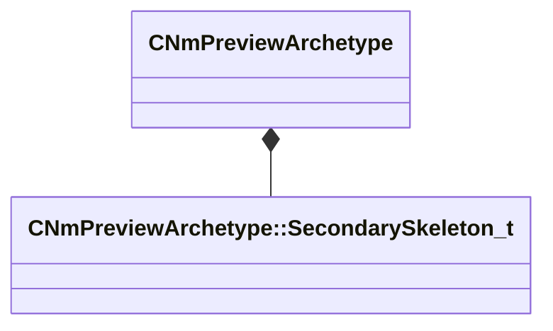

[Schemas](../../schemas.md) / [animdoclib](../animdoclib.md) / CNmPreviewArchetype

# CNmPreviewArchetype

> Source: **Build 25000182** · 2026-08-28 · `windows-x86_64` · schema `0.10.0`

**Kind:** class · **Size:** 64 bytes (`0x40`) · **Align:** 8 · **Module:** animdoclib

**Metadata:** `MVDataOverlayType 1`, `MVDataRoot`

**Relationships:**

## Memory layout

4 fields (4 declared here, 0 inherited). Offsets are absolute from the object base.

| Offset | Field | Type | From | Annotations |
|--------|-------|------|------|-------------|
| `0x0` | `m_primarySkeleton` | CUtlString |  | `MPropertyAttributeEditor AssetBrowse( vnmskel, *requiredoubleclick )` `MPropertyAutoExpandSelf` `MPropertyGroupName +Primary Skeleton` |
| `0x8` | `m_previewModel` | CUtlString |  | `MPropertyAttributeEditor AssetBrowse( vmdl, *requiredoubleclick )` `MPropertyAutoExpandSelf` `MPropertyGroupName +Primary Skeleton` |
| `0x10` | `m_bodyPartChoiceName` | CUtlString |  | `MPropertyAutoExpandSelf` `MPropertyGroupName +Primary Skeleton` |
| `0x18` | `m_secondarySkeletonSettings` | CUtlVector< [CNmPreviewArchetype::SecondarySkeleton_t](../animdoclib/CNmPreviewArchetype.SecondarySkeleton_t.md) > |  | `MPropertyAutoExpandSelf` `MPropertyGroupName +Secondary Skeletons` |

KV3 class defaults

<pre>{
	&quot;m_primarySkeleton&quot;: &quot;&quot;,
	&quot;m_previewModel&quot;: &quot;&quot;,
	&quot;m_bodyPartChoiceName&quot;: &quot;&quot;,
	&quot;m_secondarySkeletonSettings&quot;:
	[
	]
}</pre>

