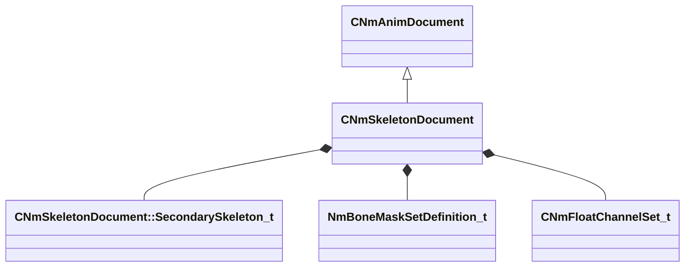

[Schemas](../../schemas.md) / [animdoclib](../animdoclib.md) / CNmSkeletonDocument

# CNmSkeletonDocument

> Source: **Build 25000182** · 2026-08-28 · `windows-x86_64` · schema `0.10.0`

**Kind:** class · **Size:** 288 bytes (`0x120`) · **Align:** 8 · **Module:** animdoclib

**Inherits from:** [CNmAnimDocument](../animdoclib/CNmAnimDocument.md)

**Relationships:**

## Memory layout

12 fields (11 declared here, 1 inherited). Offsets are absolute from the object base.

| Offset | Field | Type | From | Annotations |
|--------|-------|------|------|-------------|
| `0x68` | `m_nVersion` | int32 | [CNmAnimDocument](../animdoclib/CNmAnimDocument.md) | `MPropertySuppressField` |
| `0x70` | `m_sourceFilename` | CUtlString |  | `MPropertyAttributeEditor ModelDocAssetBrowse( dmx, fbx, smd, *requiredoubleclick, *ShowRelatedFile )` |
| `0x78` | `m_rootBoneName` | CUtlString |  |  |
| `0x80` | `m_flGlobalScale` | float32 |  |  |
| `0x84` | `m_bIsAttachableProp` | bool |  |  |
| `0x85` | `m_bIsCS_HACK` | bool |  |  |
| `0x88` | `m_secondarySkeletons` | CUtlVector< [CNmSkeletonDocument::SecondarySkeleton_t](../animdoclib/CNmSkeletonDocument.SecondarySkeleton_t.md) > |  | `MPropertyAutoExpandSelf` `MPropertyFriendlyName Expected secondary skeletons` |
| `0xa0` | `m_gameplayRelevantBones` | CUtlVector< CGlobalSymbol > |  | `MPropertyDescription The set of bones that need to be converted at import to match the S2 coordinate system (Z-up, X-forward)` |
| `0xb8` | `m_highLODBones` | CUtlVector< CGlobalSymbol > |  | `MPropertySuppressField` |
| `0xd0` | `m_boneMaskSetDefinitions` | CUtlVector< [NmBoneMaskSetDefinition_t](../animlib/NmBoneMaskSetDefinition_t.md) > |  | `MPropertySuppressField` |
| `0xe8` | `m_floatChannelSets` | CUtlVector< [CNmFloatChannelSet_t](../animlib/CNmFloatChannelSet_t.md) > |  | `MPropertySuppressField` |
| `0x100` | `m_previewModelName` | CUtlString |  | `MPropertyAttributeEditor AssetBrowse( vmdl, *requiredoubleclick )` `MPropertyGroupName +Preview` |

KV3 class defaults

<pre>{
	&quot;_class&quot;: &quot;CNmSkeletonDocument&quot;,
	&quot;m_nVersion&quot;: 0,
	&quot;m_sourceFilename&quot;: &quot;&quot;,
	&quot;m_rootBoneName&quot;: &quot;root_motion&quot;,
	&quot;m_flGlobalScale&quot;: 1.000000,
	&quot;m_bIsAttachableProp&quot;: false,
	&quot;m_bIsCS_HACK&quot;: false,
	&quot;m_secondarySkeletons&quot;:
	[
	],
	&quot;m_gameplayRelevantBones&quot;:
	[
	],
	&quot;m_highLODBones&quot;:
	[
	],
	&quot;m_boneMaskSetDefinitions&quot;:
	[
	],
	&quot;m_floatChannelSets&quot;:
	[
	],
	&quot;m_previewModelName&quot;: &quot;&quot;
}</pre>

