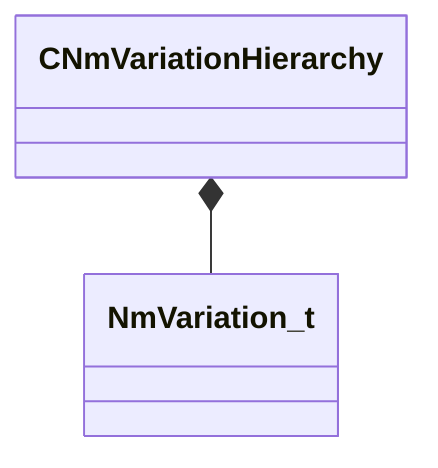

[Schemas](../../schemas.md) / [animdoclib](../animdoclib.md) / CNmVariationHierarchy

# CNmVariationHierarchy

> Source: **Build 25000182** · 2026-08-28 · `windows-x86_64` · schema `0.10.0`

**Kind:** class · **Size:** 24 bytes (`0x18`) · **Align:** 8 · **Module:** animdoclib

**Relationships:**

## Memory layout

1 field (1 declared here, 0 inherited). Offsets are absolute from the object base.

| Offset | Field | Type | From | Annotations |
|--------|-------|------|------|-------------|
| `0x0` | `m_variations` | CUtlVector< [NmVariation_t](../animdoclib/NmVariation_t.md) > |  |  |

KV3 class defaults

<pre>{
	&quot;m_variations&quot;:
	[
		{
			&quot;m_ID&quot;: &lt;HIDDEN FOR DIFF&gt;,
			&quot;m_parentID&quot;: &quot;&quot;,
			&quot;m_skeleton&quot;: &quot;&quot;,
			&quot;m_pUserData&quot;: null
		}
	]
}</pre>

