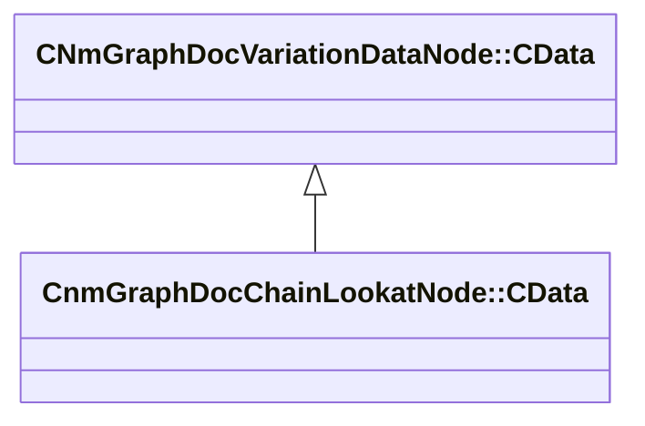

[Schemas](../../schemas.md) / [animdoclib](../animdoclib.md) / CnmGraphDocChainLookatNode::CData

# CnmGraphDocChainLookatNode::CData

> Source: **Build 25000182** · 2026-08-28 · `windows-x86_64` · schema `0.10.0`

**Kind:** class · **Size:** 72 bytes (`0x48`) · **Align:** 8 · **Module:** animdoclib

**Inherits from:** [CNmGraphDocVariationDataNode::CData](../animdoclib/CNmGraphDocVariationDataNode.CData.md)

**Relationships:**

## Memory layout

6 fields (6 declared here, 0 inherited). Offsets are absolute from the object base.

| Offset | Field | Type | From | Annotations |
|--------|-------|------|------|-------------|
| `0x8` | `m_endEffectorBoneName` | CUtlString |  |  |
| `0x10` | `m_endEffectorForwardAxis` | Vector |  | `MPropertyDescription The axis that you want to point at the target` |
| `0x1c` | `m_endEffectorOffset` | Vector |  | `MPropertyDescription Add an additional local space offset to the end effector to use for aiming the lookat` |
| `0x28` | `m_nChainLength` | uint8 |  | `MPropertyAttributeRange 2 7` `MPropertyDescription The length of the IK chain` |
| `0x2c` | `m_flBlendTimeSeconds` | float32 |  | `MPropertyDescription How long should the blend in/out take` |
| `0x30` | `m_chainWeights` | CUtlVector< float32 > |  | `MPropertyAutoExpandSelf` `MPropertyDescription The weights from the tip of the chain to the base. 0 is the effector/tip of the chain weight, N is the base of the chain.` |

KV3 class defaults

<pre>{
	&quot;_class&quot;: &quot;CnmGraphDocChainLookatNode::CData&quot;,
	&quot;m_endEffectorBoneName&quot;: &quot;&quot;,
	&quot;m_endEffectorForwardAxis&quot;:
	[
		0.000000,
		0.000000,
		0.000000
	],
	&quot;m_endEffectorOffset&quot;:
	[
		0.000000,
		0.000000,
		0.000000
	],
	&quot;m_nChainLength&quot;: 2,
	&quot;m_flBlendTimeSeconds&quot;: 0.000000,
	&quot;m_chainWeights&quot;:
	[
	]
}</pre>

