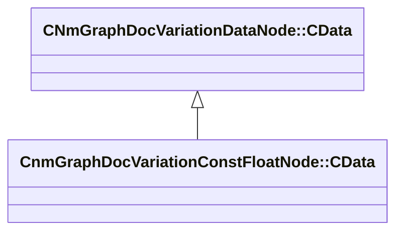

[Schemas](../../schemas.md) / [animdoclib](../animdoclib.md) / CnmGraphDocVariationConstFloatNode::CData

# CnmGraphDocVariationConstFloatNode::CData

> Source: **Build 25000182** · 2026-08-28 · `windows-x86_64` · schema `0.10.0`

**Kind:** class · **Size:** 16 bytes (`0x10`) · **Align:** 8 · **Module:** animdoclib

**Inherits from:** [CNmGraphDocVariationDataNode::CData](../animdoclib/CNmGraphDocVariationDataNode.CData.md)

**Relationships:**

## Memory layout

1 field (1 declared here, 0 inherited). Offsets are absolute from the object base.

| Offset | Field | Type | From | Annotations |
|--------|-------|------|------|-------------|
| `0x8` | `m_flValue` | float32 |  |  |

KV3 class defaults

<pre>{
	&quot;_class&quot;: &quot;CnmGraphDocVariationConstFloatNode::CData&quot;,
	&quot;m_flValue&quot;: 0.000000
}</pre>

