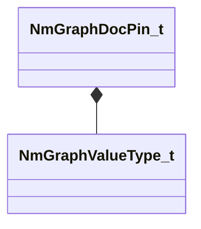

[Schemas](../../schemas.md) / [animdoclib](../animdoclib.md) / NmGraphDocPin_t

# NmGraphDocPin_t

> Source: **Build 25000182** · 2026-08-28 · `windows-x86_64` · schema `0.10.0`

**Kind:** class · **Size:** 32 bytes (`0x20`) · **Align:** 8 · **Module:** animdoclib

**Relationships:**

## Memory layout

5 fields (5 declared here, 0 inherited). Offsets are absolute from the object base.

| Offset | Field | Type | From | Annotations |
|--------|-------|------|------|-------------|
| `0x0` | `m_ID` | V_uuid_t |  |  |
| `0x10` | `m_name` | CUtlString |  |  |
| `0x18` | `m_type` | [NmGraphValueType_t](../animlib/NmGraphValueType_t.md) |  |  |
| `0x19` | `m_bIsDynamicPin` | bool |  |  |
| `0x1a` | `m_bAllowMultipleOutConnections` | bool |  |  |

KV3 class defaults

<pre>{
	&quot;m_ID&quot;: &lt;HIDDEN FOR DIFF&gt;,
	&quot;m_name&quot;: &quot;&quot;,
	&quot;m_type&quot;: &quot;Unknown&quot;,
	&quot;m_bIsDynamicPin&quot;: false,
	&quot;m_bAllowMultipleOutConnections&quot;: false
}</pre>

