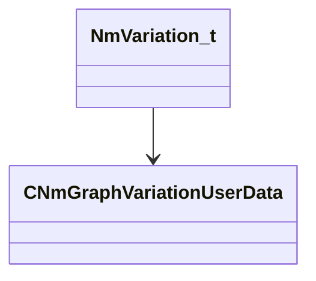

[Schemas](../../schemas.md) / [animdoclib](../animdoclib.md) / NmVariation_t

# NmVariation_t

**Kind:** class · **Size:** 248 bytes (`0xf8`) · **Align:** 8 · **Module:** animdoclib

**Relationships:**

## Memory layout

4 fields (4 declared here, 0 inherited). Offsets are absolute from the object base.

| Offset | Field | Type | From | Annotations |
|--------|-------|------|------|-------------|
| `0x0` | `m_ID` | CGlobalSymbol |  |  |
| `0x8` | `m_parentID` | CGlobalSymbol |  |  |
| `0x10` | `m_skeleton` | CResourceName |  |  |
| `0xf0` | `m_pUserData` | [CNmGraphVariationUserData](../animlib/CNmGraphVariationUserData.md)* |  |  |

KV3 class defaults

<pre>{
	&quot;m_ID&quot;: &lt;HIDDEN FOR DIFF&gt;,
	&quot;m_parentID&quot;: &quot;&quot;,
	&quot;m_skeleton&quot;: &quot;&quot;,
	&quot;m_pUserData&quot;: null
}</pre>

