# Module: animgraphdoclib

[📊 View UML Diagram](../diagrams/animgraphdoclib.md)

| Name | Kind | Bases | Fields |
|------|------|-------|--------|
| [AnimConflictType_t](#animconflicttype_t) | enum |  | 3 |
| [CActionComponent](#cactioncomponent) | class | CAnimGraphDoc_Component | 2 |
| [CAnimConflictBase](#canimconflictbase) | class |  | 4 |
| [CAnimConflictInfo_t](#canimconflictinfo_t) | class |  | 4 |
| [CAnimGraphDoc_Action](#canimgraphdoc_action) | class |  | 0 |
| [CAnimGraphDoc_AddNode](#canimgraphdoc_addnode) | class | CAnimGraphDoc_Node | 11 |
| [CAnimGraphDoc_AimCameraNode](#canimgraphdoc_aimcameranode) | class | CAnimGraphDoc_Node | 15 |
| [CAnimGraphDoc_AimCameraNode_PropJoint](#canimgraphdoc_aimcameranode_propjoint) | class |  | 1 |
| [CAnimGraphDoc_AimMatrixNode](#canimgraphdoc_aimmatrixnode) | class | CAnimGraphDoc_Node | 18 |
| [CAnimGraphDoc_AndCondition](#canimgraphdoc_andcondition) | class | CAnimGraphDoc_Condition, CAnimGraphDoc_ConditionContainer | 0 |
| [CAnimGraphDoc_BindPoseNode](#canimgraphdoc_bindposenode) | class | CAnimGraphDoc_Node | 0 |
| [CAnimGraphDoc_Blend2DItem](#canimgraphdoc_blend2ditem) | class |  | 3 |
| [CAnimGraphDoc_Blend2DNode](#canimgraphdoc_blend2dnode) | class | CAnimGraphDoc_Node | 16 |
| [CAnimGraphDoc_BlendNode](#canimgraphdoc_blendnode) | class | CAnimGraphDoc_Node | 12 |
| [CAnimGraphDoc_BlockSelectionMetric](#canimgraphdoc_blockselectionmetric) | class | CAnimGraphDoc_MotionMetric | 0 |
| [CAnimGraphDoc_BoneMaskNode](#canimgraphdoc_bonemasknode) | class | CAnimGraphDoc_Node | 14 |
| [CAnimGraphDoc_BonePositionMetric](#canimgraphdoc_bonepositionmetric) | class | CAnimGraphDoc_MotionMetric | 1 |
| [CAnimGraphDoc_BoneVelocityMetric](#canimgraphdoc_bonevelocitymetric) | class | CAnimGraphDoc_MotionMetric | 1 |
| [CAnimGraphDoc_ChoiceNode](#canimgraphdoc_choicenode) | class | CAnimGraphDoc_Node | 9 |
| [CAnimGraphDoc_ChoreoNode](#canimgraphdoc_choreonode) | class | CAnimGraphDoc_Node | 1 |
| [CAnimGraphDoc_ClipData](#canimgraphdoc_clipdata) | class |  | 2 |
| [CAnimGraphDoc_ClipDataManager](#canimgraphdoc_clipdatamanager) | class |  | 1 |
| [CAnimGraphDoc_CommentNode](#canimgraphdoc_commentnode) | class | CAnimGraphDoc_Node | 3 |
| [CAnimGraphDoc_Component](#canimgraphdoc_component) | class |  | 5 |
| [CAnimGraphDoc_ComponentManager](#canimgraphdoc_componentmanager) | class |  | 1 |
| [CAnimGraphDoc_ComponentState](#canimgraphdoc_componentstate) | class | CAnimGraphDoc_State | 0 |
| [CAnimGraphDoc_ComponentStateTransition](#canimgraphdoc_componentstatetransition) | class | CAnimGraphDoc_StateTransition | 0 |
| [CAnimGraphDoc_Condition](#canimgraphdoc_condition) | class |  | 0 |
| [CAnimGraphDoc_ConditionContainer](#canimgraphdoc_conditioncontainer) | class |  | 1 |
| [CAnimGraphDoc_ConflictManager](#canimgraphdoc_conflictmanager) | class |  | 1 |
| [CAnimGraphDoc_ContainerNodeBase](#canimgraphdoc_containernodebase) | class | CAnimGraphDoc_Node | 3 |
| [CAnimGraphDoc_CurrentRotationVelocityMetric](#canimgraphdoc_currentrotationvelocitymetric) | class | CAnimGraphDoc_MotionMetric | 0 |
| [CAnimGraphDoc_CurrentVelocityMetric](#canimgraphdoc_currentvelocitymetric) | class | CAnimGraphDoc_MotionMetric | 0 |
| [CAnimGraphDoc_CycleCondition](#canimgraphdoc_cyclecondition) | class | CAnimGraphDoc_Condition | 6 |
| [CAnimGraphDoc_CycleControlClipNode](#canimgraphdoc_cyclecontrolclipnode) | class | CAnimGraphDoc_Node | 6 |
| [CAnimGraphDoc_CycleControlNode](#canimgraphdoc_cyclecontrolnode) | class | CAnimGraphDoc_Node | 5 |
| [CAnimGraphDoc_DampedPathMotor](#canimgraphdoc_dampedpathmotor) | class | CAnimGraphDoc_PathMotorBase | 9 |
| [CAnimGraphDoc_DirectPlaybackNode](#canimgraphdoc_directplaybacknode) | class | CAnimGraphDoc_Node | 3 |
| [CAnimGraphDoc_DirectionalBlendNode](#canimgraphdoc_directionalblendnode) | class | CAnimGraphDoc_Node | 8 |
| [CAnimGraphDoc_DistanceRemainingMetric](#canimgraphdoc_distanceremainingmetric) | class | CAnimGraphDoc_MotionMetric | 7 |
| [CAnimGraphDoc_EmitTagAction](#canimgraphdoc_emittagaction) | class | CAnimGraphDoc_Action | 1 |
| [CAnimGraphDoc_ExpressionAction](#canimgraphdoc_expressionaction) | class | CAnimGraphDoc_Action | 3 |
| [CAnimGraphDoc_FinishedCondition](#canimgraphdoc_finishedcondition) | class | CAnimGraphDoc_Condition | 2 |
| [CAnimGraphDoc_FollowAttachmentNode](#canimgraphdoc_followattachmentnode) | class | CAnimGraphDoc_Node | 5 |
| [CAnimGraphDoc_FollowPathNode](#canimgraphdoc_followpathnode) | class | CAnimGraphDoc_Node | 15 |
| [CAnimGraphDoc_FollowTargetNode](#canimgraphdoc_followtargetnode) | class | CAnimGraphDoc_Node | 4 |
| [CAnimGraphDoc_FootAdjustmentNode](#canimgraphdoc_footadjustmentnode) | class | CAnimGraphDoc_Node | 11 |
| [CAnimGraphDoc_FootCycleMetric](#canimgraphdoc_footcyclemetric) | class | CAnimGraphDoc_MotionMetric | 1 |
| [CAnimGraphDoc_FootLockNode](#canimgraphdoc_footlocknode) | class | CAnimGraphDoc_Node | 38 |
| [CAnimGraphDoc_FootPinningNode](#canimgraphdoc_footpinningnode) | class | CAnimGraphDoc_Node | 11 |
| [CAnimGraphDoc_FootPositionMetric](#canimgraphdoc_footpositionmetric) | class | CAnimGraphDoc_MotionMetric | 2 |
| [CAnimGraphDoc_FootStepTriggerNode](#canimgraphdoc_footsteptriggernode) | class | CAnimGraphDoc_Node | 3 |
| [CAnimGraphDoc_FutureFacingMetric](#canimgraphdoc_futurefacingmetric) | class | CAnimGraphDoc_MotionMetric | 2 |
| [CAnimGraphDoc_FutureVelocityMetric](#canimgraphdoc_futurevelocitymetric) | class | CAnimGraphDoc_MotionMetric | 5 |
| [CAnimGraphDoc_Graph](#canimgraphdoc_graph) | class | CAnimGraphDoc_SubGraph | 4 |
| [CAnimGraphDoc_GraphMotionItem](#canimgraphdoc_graphmotionitem) | class | CAnimGraphDoc_MotionItem | 2 |
| [CAnimGraphDoc_GroupInputNode](#canimgraphdoc_groupinputnode) | class | CAnimGraphDoc_ProxyNodeBase | 0 |
| [CAnimGraphDoc_GroupNode](#canimgraphdoc_groupnode) | class | CAnimGraphDoc_ContainerNodeBase | 1 |
| [CAnimGraphDoc_GroupOutputNode](#canimgraphdoc_groupoutputnode) | class | CAnimGraphDoc_ProxyNodeBase | 0 |
| [CAnimGraphDoc_HitReactNode](#canimgraphdoc_hitreactnode) | class | CAnimGraphDoc_Node | 29 |
| [CAnimGraphDoc_InputStreamNode](#canimgraphdoc_inputstreamnode) | class | CAnimGraphDoc_Node | 0 |
| [CAnimGraphDoc_JiggleBoneNode](#canimgraphdoc_jigglebonenode) | class | CAnimGraphDoc_Node | 2 |
| [CAnimGraphDoc_JumpHelperNode](#canimgraphdoc_jumphelpernode) | class | CAnimGraphDoc_SequenceNode | 9 |
| [CAnimGraphDoc_LeanMatrixNode](#canimgraphdoc_leanmatrixnode) | class | CAnimGraphDoc_Node | 8 |
| [CAnimGraphDoc_LookAtNode](#canimgraphdoc_lookatnode) | class | CAnimGraphDoc_Node | 19 |
| [CAnimGraphDoc_MotionItem](#canimgraphdoc_motionitem) | class |  | 5 |
| [CAnimGraphDoc_MotionItemGroup](#canimgraphdoc_motionitemgroup) | class |  | 3 |
| [CAnimGraphDoc_MotionMatchingNode](#canimgraphdoc_motionmatchingnode) | class | CAnimGraphDoc_Node | 23 |
| [CAnimGraphDoc_MotionMetric](#canimgraphdoc_motionmetric) | class |  | 1 |
| [CAnimGraphDoc_MotionNodeManager](#canimgraphdoc_motionnodemanager) | class | CAnimGraphDoc_NodeManager | 0 |
| [CAnimGraphDoc_MotionParameter](#canimgraphdoc_motionparameter) | class |  | 5 |
| [CAnimGraphDoc_MotionParameterManager](#canimgraphdoc_motionparametermanager) | class |  | 1 |
| [CAnimGraphDoc_Motor](#canimgraphdoc_motor) | class |  | 2 |
| [CAnimGraphDoc_MoverNode](#canimgraphdoc_movernode) | class | CAnimGraphDoc_Node | 16 |
| [CAnimGraphDoc_Node](#canimgraphdoc_node) | class |  | 5 |
| [CAnimGraphDoc_NodeBlend2DItem](#canimgraphdoc_nodeblend2ditem) | class | CAnimGraphDoc_Blend2DItem | 2 |
| [CAnimGraphDoc_NodeConnection](#canimgraphdoc_nodeconnection) | class |  | 2 |
| [CAnimGraphDoc_NodeList](#canimgraphdoc_nodelist) | class |  | 1 |
| [CAnimGraphDoc_NodeManager](#canimgraphdoc_nodemanager) | class |  | 1 |
| [CAnimGraphDoc_NodeState](#canimgraphdoc_nodestate) | class | CAnimGraphDoc_State | 3 |
| [CAnimGraphDoc_NodeStateTransition](#canimgraphdoc_nodestatetransition) | class | CAnimGraphDoc_StateTransition | 5 |
| [CAnimGraphDoc_OrCondition](#canimgraphdoc_orcondition) | class | CAnimGraphDoc_Condition, CAnimGraphDoc_ConditionContainer | 0 |
| [CAnimGraphDoc_OrientationWarpNode](#canimgraphdoc_orientationwarpnode) | class | CAnimGraphDoc_Node | 14 |
| [CAnimGraphDoc_PairedSequenceNode](#canimgraphdoc_pairedsequencenode) | class | CAnimGraphDoc_Node | 4 |
| [CAnimGraphDoc_ParamSpan](#canimgraphdoc_paramspan) | class |  | 5 |
| [CAnimGraphDoc_ParamSpanSample](#canimgraphdoc_paramspansample) | class |  | 2 |
| [CAnimGraphDoc_ParameterCondition](#canimgraphdoc_parametercondition) | class | CAnimGraphDoc_Condition | 5 |
| [CAnimGraphDoc_ParameterManager](#canimgraphdoc_parametermanager) | class |  | 1 |
| [CAnimGraphDoc_PathHelperNode](#canimgraphdoc_pathhelpernode) | class | CAnimGraphDoc_Node | 3 |
| [CAnimGraphDoc_PathMetric](#canimgraphdoc_pathmetric) | class | CAnimGraphDoc_MotionMetric | 4 |
| [CAnimGraphDoc_PathMotor](#canimgraphdoc_pathmotor) | class | CAnimGraphDoc_PathMotorBase | 0 |
| [CAnimGraphDoc_PathMotorBase](#canimgraphdoc_pathmotorbase) | class | CAnimGraphDoc_Motor | 1 |
| [CAnimGraphDoc_PlayerInputMotor](#canimgraphdoc_playerinputmotor) | class | CAnimGraphDoc_Motor | 8 |
| [CAnimGraphDoc_ProxyNodeBase](#canimgraphdoc_proxynodebase) | class | CAnimGraphDoc_Node | 1 |
| [CAnimGraphDoc_RagdollNode](#canimgraphdoc_ragdollnode) | class | CAnimGraphDoc_Node | 3 |
| [CAnimGraphDoc_RigidBodyWeightList](#canimgraphdoc_rigidbodyweightlist) | class |  | 2 |
| [CAnimGraphDoc_RootNode](#canimgraphdoc_rootnode) | class | CAnimGraphDoc_Node | 1 |
| [CAnimGraphDoc_SelectorNode](#canimgraphdoc_selectornode) | class | CAnimGraphDoc_Node | 15 |
| [CAnimGraphDoc_SequenceBlend2DItem](#canimgraphdoc_sequenceblend2ditem) | class | CAnimGraphDoc_Blend2DItem | 2 |
| [CAnimGraphDoc_SequenceMotionItem](#canimgraphdoc_sequencemotionitem) | class | CAnimGraphDoc_MotionItem | 1 |
| [CAnimGraphDoc_SequenceNode](#canimgraphdoc_sequencenode) | class | CAnimGraphDoc_Node | 5 |
| [CAnimGraphDoc_SetParameterAction](#canimgraphdoc_setparameteraction) | class | CAnimGraphDoc_Action | 3 |
| [CAnimGraphDoc_SingleFrameNode](#canimgraphdoc_singleframenode) | class | CAnimGraphDoc_Node | 4 |
| [CAnimGraphDoc_SlowDownOnSlopesNode](#canimgraphdoc_slowdownonslopesnode) | class | CAnimGraphDoc_Node | 2 |
| [CAnimGraphDoc_SolveIKChainNode](#canimgraphdoc_solveikchainnode) | class | CAnimGraphDoc_Node | 2 |
| [CAnimGraphDoc_SpeedScaleNode](#canimgraphdoc_speedscalenode) | class | CAnimGraphDoc_Node | 3 |
| [CAnimGraphDoc_StanceOverrideNode](#canimgraphdoc_stanceoverridenode) | class | CAnimGraphDoc_Node | 7 |
| [CAnimGraphDoc_StanceScaleNode](#canimgraphdoc_stancescalenode) | class | CAnimGraphDoc_Node | 3 |
| [CAnimGraphDoc_State](#canimgraphdoc_state) | class |  | 12 |
| [CAnimGraphDoc_StateList](#canimgraphdoc_statelist) | class |  | 1 |
| [CAnimGraphDoc_StateMachine](#canimgraphdoc_statemachine) | class |  | 1 |
| [CAnimGraphDoc_StateMachineNode](#canimgraphdoc_statemachinenode) | class | CAnimGraphDoc_Node, CAnimGraphDoc_StateMachine | 3 |
| [CAnimGraphDoc_StateStatusCondition](#canimgraphdoc_statestatuscondition) | class | CAnimGraphDoc_Condition | 7 |
| [CAnimGraphDoc_StateTransition](#canimgraphdoc_statetransition) | class |  | 5 |
| [CAnimGraphDoc_StepsRemainingMetric](#canimgraphdoc_stepsremainingmetric) | class | CAnimGraphDoc_MotionMetric | 2 |
| [CAnimGraphDoc_StopAtGoalNode](#canimgraphdoc_stopatgoalnode) | class | CAnimGraphDoc_Node | 6 |
| [CAnimGraphDoc_SubGraph](#canimgraphdoc_subgraph) | class |  | 6 |
| [CAnimGraphDoc_SubGraphNode](#canimgraphdoc_subgraphnode) | class | CAnimGraphDoc_ContainerNodeBase | 2 |
| [CAnimGraphDoc_SubtractNode](#canimgraphdoc_subtractnode) | class | CAnimGraphDoc_Node | 10 |
| [CAnimGraphDoc_TagCondition](#canimgraphdoc_tagcondition) | class | CAnimGraphDoc_Condition | 3 |
| [CAnimGraphDoc_TagManager](#canimgraphdoc_tagmanager) | class |  | 1 |
| [CAnimGraphDoc_TagSpan](#canimgraphdoc_tagspan) | class |  | 3 |
| [CAnimGraphDoc_TargetSelectorNode](#canimgraphdoc_targetselectornode) | class | CAnimGraphDoc_Node | 11 |
| [CAnimGraphDoc_TargetWarpNode](#canimgraphdoc_targetwarpnode) | class | CAnimGraphDoc_Node | 16 |
| [CAnimGraphDoc_TimeCondition](#canimgraphdoc_timecondition) | class | CAnimGraphDoc_Condition | 2 |
| [CAnimGraphDoc_TimeRemainingMetric](#canimgraphdoc_timeremainingmetric) | class | CAnimGraphDoc_MotionMetric | 4 |
| [CAnimGraphDoc_ToggleComponentAction](#canimgraphdoc_togglecomponentaction) | class | CAnimGraphDoc_Action | 2 |
| [CAnimGraphDoc_TurnHelperNode](#canimgraphdoc_turnhelpernode) | class | CAnimGraphDoc_Node | 7 |
| [CAnimGraphDoc_TwoBoneIKNode](#canimgraphdoc_twoboneiknode) | class | CAnimGraphDoc_Node | 15 |
| [CAnimGraphDoc_WayPointHelperNode](#canimgraphdoc_waypointhelpernode) | class | CAnimGraphDoc_Node | 6 |
| [CAnimGraphDoc_ZeroPoseNode](#canimgraphdoc_zeroposenode) | class | CAnimGraphDoc_Node | 0 |
| [CAnimParameterConflict](#canimparameterconflict) | class | CAnimConflictBase | 0 |
| [CAnimScriptComponent](#canimscriptcomponent) | class | CAnimGraphDoc_Component | 2 |
| [CAnimTagConflict](#canimtagconflict) | class | CAnimConflictBase | 0 |
| [CBlendNodeChild](#cblendnodechild) | class |  | 3 |
| [CCPPScriptComponent](#ccppscriptcomponent) | class | CAnimGraphDoc_Component | 1 |
| [CChoiceNodeChild](#cchoicenodechild) | class |  | 4 |
| [CConnectionProxyItem](#cconnectionproxyitem) | class |  | 3 |
| [CDampedValueComponent](#cdampedvaluecomponent) | class | CAnimGraphDoc_Component | 2 |
| [CDampedValueItem](#cdampedvalueitem) | class |  | 10 |
| [CDemoSettingsComponent](#cdemosettingscomponent) | class | CAnimGraphDoc_Component | 1 |
| [CFloatAnimValue](#cfloatanimvalue) | class |  | 4 |
| [CFootLockItem](#cfootlockitem) | class |  | 9 |
| [CFootPinningItem](#cfootpinningitem) | class |  | 8 |
| [CFootStepTriggerItem](#cfootsteptriggeritem) | class |  | 4 |
| [CJiggleBoneItem](#cjiggleboneitem) | class |  | 7 |
| [CLODComponent](#clodcomponent) | class | CAnimGraphDoc_Component | 1 |
| [CLookComponent](#clookcomponent) | class | CAnimGraphDoc_Component | 9 |
| [CMovementComponent](#cmovementcomponent) | class | CAnimGraphDoc_Component | 5 |
| [CPairedSequenceComponent](#cpairedsequencecomponent) | class | CAnimGraphDoc_Component | 0 |
| [CRagdollComponent](#cragdollcomponent) | class | CAnimGraphDoc_Component | 5 |
| [CRemapValueComponent](#cremapvaluecomponent) | class | CAnimGraphDoc_Component | 2 |
| [CRemapValueItem](#cremapvalueitem) | class |  | 13 |
| [CRigidBodyWeight](#crigidbodyweight) | class |  | 2 |
| [CSlopeComponent](#cslopecomponent) | class | CAnimGraphDoc_Component | 7 |
| [CSolveIKChainAnimNodeChainData](#csolveikchainanimnodechaindata) | class |  | 8 |
| [CStateAction](#cstateaction) | class |  | 2 |
| [CStateMachineComponent](#cstatemachinecomponent) | class | CAnimGraphDoc_Component, CAnimGraphDoc_StateMachine | 1 |
| [CTargetSelectorChild](#ctargetselectorchild) | class |  | 2 |
| [ComparisonValueType](#comparisonvaluetype) | enum |  | 2 |
| [Comparison_t](#comparison_t) | enum |  | 7 |
| [DampedValueType](#dampedvaluetype) | enum |  | 2 |
| [EAnimConflictIndex_t](#eanimconflictindex_t) | enum |  | 4 |
| [EAnimValueSource](#eanimvaluesource) | enum |  | 2 |
| [FinishedConditionOption](#finishedconditionoption) | enum |  | 2 |
| [RemapValueType](#remapvaluetype) | enum |  | 2 |
| [SelectionSource_t](#selectionsource_t) | enum |  | 3 |
| [SingleFrameSelection](#singleframeselection) | enum |  | 3 |
| [SolveIKChainAnimNodeSettingSource](#solveikchainanimnodesettingsource) | enum |  | 2 |
| [StateComparisonValueType](#statecomparisonvaluetype) | enum |  | 3 |
| [StateValue](#statevalue) | enum |  | 5 |
| [TargetWarpLinearRootMotionMode](#targetwarplinearrootmotionmode) | enum |  | 2 |

---

### AnimConflictType_t

**Values:**

| Name | Value | Description |
|------|-------|-------------|
| `NONE` | 0 |  |
| `ID` | 1 |  |
| `NAME` | 2 |  |

### CActionComponent

**Inherits from:** [CAnimGraphDoc_Component](animgraphdoclib.md#canimgraphdoc_component)

**Metadata:** `MGetKV3ClassDefaults {
	"_class": "CActionComponent",
	"m_group": "",
	"m_id":
	{
		"m_id": <HIDDEN FOR DIFF>,
	},
	"m_bStartEnabled": true,
	"m_nPriority": 100,
	"m_networkMode": "ServerAuthoritative",
	"m_actions":
	[
	],
	"m_sName": "Action Component"
}`

**Relationships:**

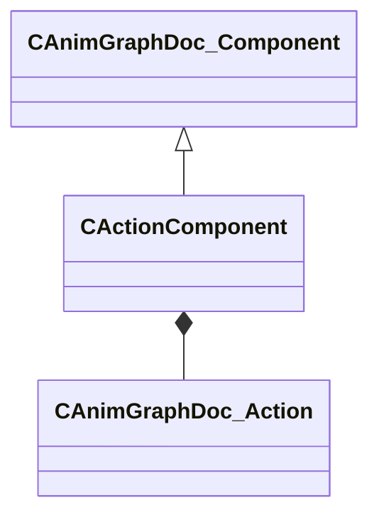

**Fields:**

| Name | Type | Annotations |
|------|------|-------------|
| `m_actions` | CUtlVector<CSmartPtr<[CAnimGraphDoc_Action](../schemas/animgraphdoclib.md#canimgraphdoc_action)>> |  |
| `m_sName` | CUtlString | `MPropertyFriendlyName "Name"` `MPropertySortPriority 100` |

### CAnimConflictBase

**Derived by:** [CAnimParameterConflict](animgraphdoclib.md#canimparameterconflict), [CAnimTagConflict](animgraphdoclib.md#canimtagconflict)

**Metadata:** `MGetKV3ClassDefaults Could not parse KV3 Defaults`

**Relationships:**

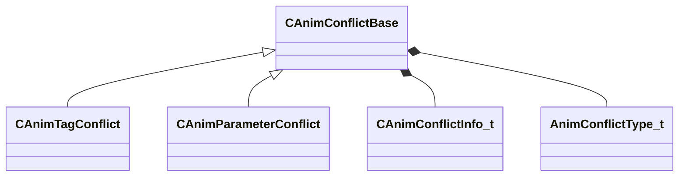

**Fields:**

| Name | Type | Annotations |
|------|------|-------------|
| `m_sConflictDesc` | CUtlString |  |
| `m_nResolveIdx` | int32 |  |
| `m_conflictData` | [CAnimConflictInfo_t](../schemas/animgraphdoclib.md#canimconflictinfo_t)[2] |  |
| `m_eConflictType` | [AnimConflictType_t](../schemas/animgraphdoclib.md#animconflicttype_t) |  |

### CAnimConflictInfo_t

**Metadata:** `MGetKV3ClassDefaults {
	"m_name": "",
	"m_groupName": "",
	"m_subgraphName": "",
	"m_id": <HIDDEN FOR DIFF>,
}`

**Fields:**

| Name | Type | Annotations |
|------|------|-------------|
| `m_name` | CUtlString |  |
| `m_groupName` | CUtlString |  |
| `m_subgraphName` | CUtlString |  |
| `m_id` | uint32 |  |

### CAnimGraphDoc_Action

**Derived by:** [CAnimGraphDoc_EmitTagAction](animgraphdoclib.md#canimgraphdoc_emittagaction), [CAnimGraphDoc_ExpressionAction](animgraphdoclib.md#canimgraphdoc_expressionaction), [CAnimGraphDoc_SetParameterAction](animgraphdoclib.md#canimgraphdoc_setparameteraction), [CAnimGraphDoc_ToggleComponentAction](animgraphdoclib.md#canimgraphdoc_togglecomponentaction)

**Metadata:** `MGetKV3ClassDefaults Could not parse KV3 Defaults`

**Relationships:**

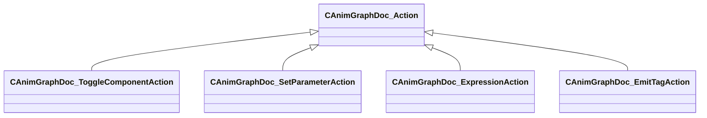

### CAnimGraphDoc_AddNode

**Inherits from:** [CAnimGraphDoc_Node](animgraphdoclib.md#canimgraphdoc_node)

**Metadata:** `MGetKV3ClassDefaults {
	"_class": "CAnimGraphDoc_AddNode",
	"m_sName": "Unnamed",
	"m_vecPosition":
	[
		0.000000,
		0.000000
	],
	"m_nNodeID":
	{
		"m_id": <HIDDEN FOR DIFF>,
	},
	"m_bDebugThisNode": false,
	"m_networkMode": "ServerAuthoritative",
	"m_baseInput":
	{
		"m_nodeID":
		{
			"m_id": <HIDDEN FOR DIFF>,
		},
		"m_outputID":
		{
			"m_id": <HIDDEN FOR DIFF>,
		}
	},
	"m_additiveInput":
	{
		"m_nodeID":
		{
			"m_id": <HIDDEN FOR DIFF>,
		},
		"m_outputID":
		{
			"m_id": <HIDDEN FOR DIFF>,
		}
	},
	"m_timingBehavior": "UseChild2",
	"m_flTimingBlend": 0.500000,
	"m_footMotionTiming": "Child1",
	"m_bApplyToFootMotion": true,
	"m_bResetBase": true,
	"m_bResetAdditive": true,
	"m_bApplyChannelsSeparately": true,
	"m_bUseModelSpace": false,
	"m_bApplyScale": false
}`, `MPropertyFriendlyName "Add"`

**Relationships:**

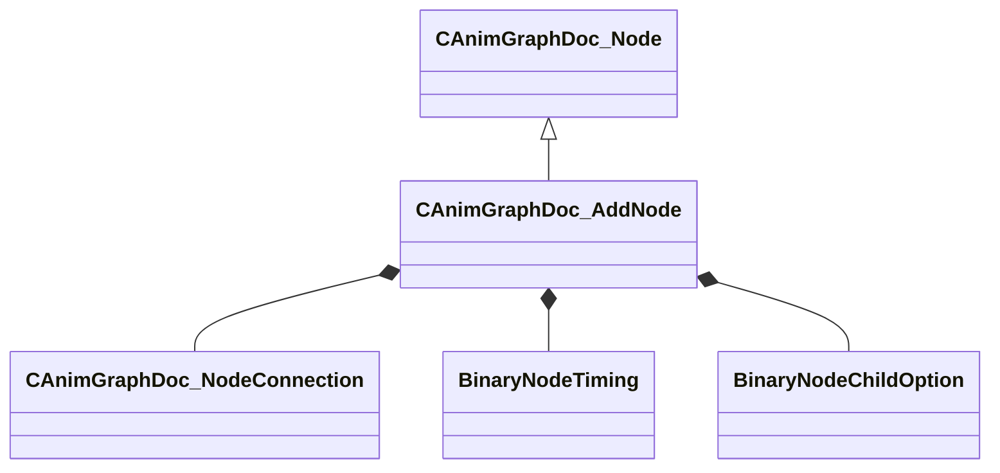

**Fields:**

| Name | Type | Annotations |
|------|------|-------------|
| `m_baseInput` | [CAnimGraphDoc_NodeConnection](../schemas/animgraphdoclib.md#canimgraphdoc_nodeconnection) | `MPropertySuppressField` |
| `m_additiveInput` | [CAnimGraphDoc_NodeConnection](../schemas/animgraphdoclib.md#canimgraphdoc_nodeconnection) | `MPropertySuppressField` |
| `m_timingBehavior` | [BinaryNodeTiming](../schemas/animgraphlib.md#binarynodetiming) | `MPropertyFriendlyName "Timing Control"` `MPropertyAutoRebuildOnChange` |
| `m_flTimingBlend` | float32 | `MPropertyFriendlyName "Timing Blend"` `MPropertyAttributeRange "0 1"` `MPropertyAttrStateCallback` |
| `m_footMotionTiming` | [BinaryNodeChildOption](../schemas/animgraphlib.md#binarynodechildoption) | `MPropertyFriendlyName "Foot Motion Timing"` |
| `m_bApplyToFootMotion` | bool | `MPropertyFriendlyName "Add Foot Motion"` |
| `m_bResetBase` | bool | `MPropertyFriendlyName "Reset Base Child"` |
| `m_bResetAdditive` | bool | `MPropertyFriendlyName "Reset Additive Child"` |
| `m_bApplyChannelsSeparately` | bool | `MPropertyFriendlyName "Treat Translation Separately"` |
| `m_bUseModelSpace` | bool | `MPropertyFriendlyName "Use Model Space"` |
| `m_bApplyScale` | bool | `MPropertyFriendlyName "Apply Scale"` `MPropertyDescription "Apply Scale Channels During Add.  Requires Treat Translation Separately."` |

### CAnimGraphDoc_AimCameraNode

**Inherits from:** [CAnimGraphDoc_Node](animgraphdoclib.md#canimgraphdoc_node)

**Metadata:** `MGetKV3ClassDefaults {
	"_class": "CAnimGraphDoc_AimCameraNode",
	"m_sName": "Unnamed",
	"m_vecPosition":
	[
		0.000000,
		0.000000
	],
	"m_nNodeID":
	{
		"m_id": <HIDDEN FOR DIFF>,
	},
	"m_bDebugThisNode": false,
	"m_networkMode": "ServerAuthoritative",
	"m_inputConnection":
	{
		"m_nodeID":
		{
			"m_id": <HIDDEN FOR DIFF>,
		},
		"m_outputID":
		{
			"m_id": <HIDDEN FOR DIFF>,
		}
	},
	"m_ikChain": "",
	"m_cameraJointName": "",
	"m_pelvisJointName": "",
	"m_clavicleLeftJointName": "",
	"m_clavicleRightJointName": "",
	"m_parameterNamePosition":
	{
		"m_id": <HIDDEN FOR DIFF>,
	},
	"m_parameterNameOrientation":
	{
		"m_id": <HIDDEN FOR DIFF>,
	},
	"m_parameterNamePelvisOffset":
	{
		"m_id": <HIDDEN FOR DIFF>,
	},
	"m_parameterCameraOnly":
	{
		"m_id": <HIDDEN FOR DIFF>,
	},
	"m_parameterCameraClearanceDistance":
	{
		"m_id": <HIDDEN FOR DIFF>,
	},
	"m_parameterWeaponDepenetrationDistance":
	{
		"m_id": <HIDDEN FOR DIFF>,
	},
	"m_parameterWeaponDepenetrationDelta":
	{
		"m_id": <HIDDEN FOR DIFF>,
	},
	"m_depenetrationJointName": "",
	"m_propJoints":
	[
	]
}`, `MPropertyFriendlyName "Aim Camera"`

**Relationships:**

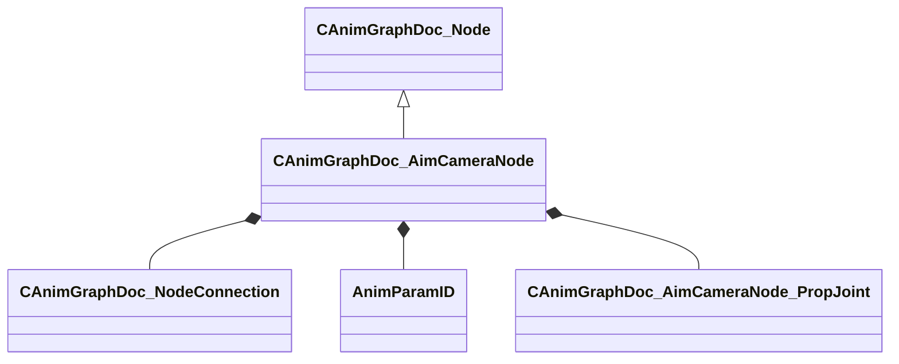

**Fields:**

| Name | Type | Annotations |
|------|------|-------------|
| `m_inputConnection` | [CAnimGraphDoc_NodeConnection](../schemas/animgraphdoclib.md#canimgraphdoc_nodeconnection) | `MPropertySuppressField` |
| `m_ikChain` | CUtlString | `MPropertyFriendlyName "Spine IK Chain"` `MPropertyAttributeChoiceName "IKChain"` |
| `m_cameraJointName` | CUtlString | `MPropertyFriendlyName "Camera Joint"` `MPropertyAttributeChoiceName "Bone"` |
| `m_pelvisJointName` | CUtlString | `MPropertyFriendlyName "Pelvis Joint"` `MPropertyAttributeChoiceName "Bone"` |
| `m_clavicleLeftJointName` | CUtlString | `MPropertyFriendlyName "Clavicle Left Joint"` `MPropertyAttributeChoiceName "Bone"` |
| `m_clavicleRightJointName` | CUtlString | `MPropertyFriendlyName "Clavicle Right Joint"` `MPropertyAttributeChoiceName "Bone"` |
| `m_parameterNamePosition` | [AnimParamID](../schemas/modellib.md#animparamid) | `MPropertyFriendlyName "Animgraph Position Parameter"` `MPropertyAttributeChoiceName "VectorParameter"` |
| `m_parameterNameOrientation` | [AnimParamID](../schemas/modellib.md#animparamid) | `MPropertyFriendlyName "Orientation Parameter"` `MPropertyAttributeChoiceName "QuaternionParameter"` |
| `m_parameterNamePelvisOffset` | [AnimParamID](../schemas/modellib.md#animparamid) | `MPropertyFriendlyName "Pelvis Offset Parameter"` `MPropertyAttributeChoiceName "FloatParameter"` |
| `m_parameterCameraOnly` | [AnimParamID](../schemas/modellib.md#animparamid) | `MPropertyFriendlyName "Camera Only Parameter"` `MPropertyAttributeChoiceName "BoolParameter"` |
| `m_parameterCameraClearanceDistance` | [AnimParamID](../schemas/modellib.md#animparamid) | `MPropertyFriendlyName "Clearance Distance"` `MPropertyAttributeChoiceName "FloatParameter"` |
| `m_parameterWeaponDepenetrationDistance` | [AnimParamID](../schemas/modellib.md#animparamid) | `MPropertyFriendlyName "Weapon De-Penetration Distance"` `MPropertyAttributeChoiceName "FloatParameter"` |
| `m_parameterWeaponDepenetrationDelta` | [AnimParamID](../schemas/modellib.md#animparamid) | `MPropertyFriendlyName "Weapon De-Penetration Delta"` `MPropertyAttributeChoiceName "VectorParameter"` |
| `m_depenetrationJointName` | CUtlString | `MPropertyFriendlyName "Depenetration Joint"` `MPropertyAttributeChoiceName "Bone"` |
| `m_propJoints` | CUtlVector<[CAnimGraphDoc_AimCameraNode_PropJoint](../schemas/animgraphdoclib.md#canimgraphdoc_aimcameranode_propjoint)> | `MPropertyFriendlyName "Prop Joints"` `MPropertyDescription "These joints will maintain their offset relative to the camera joint."` |

### CAnimGraphDoc_AimCameraNode_PropJoint

**Metadata:** `MGetKV3ClassDefaults {
	"_class": "CAnimGraphDoc_AimCameraNode_PropJoint",
	"m_jointName": ""
}`

**Fields:**

| Name | Type | Annotations |
|------|------|-------------|
| `m_jointName` | CUtlString | `MPropertyFriendlyName "Joint"` `MPropertyAttributeChoiceName "Bone"` |

### CAnimGraphDoc_AimMatrixNode

**Inherits from:** [CAnimGraphDoc_Node](animgraphdoclib.md#canimgraphdoc_node)

**Metadata:** `MGetKV3ClassDefaults {
	"_class": "CAnimGraphDoc_AimMatrixNode",
	"m_sName": "Unnamed",
	"m_vecPosition":
	[
		0.000000,
		0.000000
	],
	"m_nNodeID":
	{
		"m_id": <HIDDEN FOR DIFF>,
	},
	"m_bDebugThisNode": false,
	"m_networkMode": "ServerAuthoritative",
	"m_inputConnection":
	{
		"m_nodeID":
		{
			"m_id": <HIDDEN FOR DIFF>,
		},
		"m_outputID":
		{
			"m_id": <HIDDEN FOR DIFF>,
		}
	},
	"m_sequenceName": "",
	"m_flMaxYawAngle": 45.000000,
	"m_flMaxPitchAngle": 45.000000,
	"m_target": "LookTarget",
	"m_paramName": "",
	"m_param":
	{
		"m_id": <HIDDEN FOR DIFF>,
	},
	"m_bIsPosition": false,
	"m_attachmentName": "",
	"m_blendMode": "AimMatrixBlendMode_Additive",
	"m_boneMaskName": "",
	"m_bResetBase": true,
	"m_bLockWhenWaning": true,
	"m_bUseBiasAndClamp": false,
	"m_flBiasAndClampYawOffset": 1.000000,
	"m_flBiasAndClampPitchOffset": 1.000000,
	"m_biasAndClampBlendCurve":
	{
		"m_flControlPoint1": 0.000000,
		"m_flControlPoint2": 1.000000
	},
	"m_damping":
	{
		"_class": "CAnimInputDamping",
		"m_speedFunction": "NoDamping",
		"m_fSpeedScale": 1.000000,
		"m_fFallingSpeedScale": 1.000000
	}
}`, `MPropertyFriendlyName "Aim Matrix"`

**Relationships:**

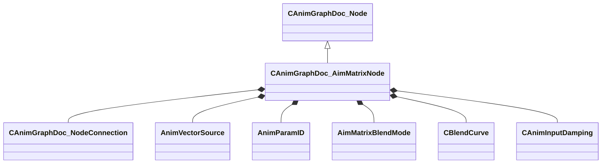

**Fields:**

| Name | Type | Annotations |
|------|------|-------------|
| `m_inputConnection` | [CAnimGraphDoc_NodeConnection](../schemas/animgraphdoclib.md#canimgraphdoc_nodeconnection) | `MPropertySuppressField` |
| `m_sequenceName` | CUtlString | `MPropertyFriendlyName "Sequence"` `MPropertyAttributeChoiceName "Sequence"` |
| `m_flMaxYawAngle` | float32 | `MPropertyFriendlyName "Max Yaw Angle"` |
| `m_flMaxPitchAngle` | float32 | `MPropertyFriendlyName "Max Pitch Angle"` |
| `m_target` | [AnimVectorSource](../schemas/animgraphlib.md#animvectorsource) | `MPropertyFriendlyName "Target"` `MPropertyAutoRebuildOnChange` |
| `m_paramName` | CUtlString | `MPropertySuppressField` |
| `m_param` | [AnimParamID](../schemas/modellib.md#animparamid) | `MPropertyFriendlyName "Parameter"` `MPropertyAttributeChoiceName "VectorParameter"` `MPropertyAttrStateCallback` |
| `m_bIsPosition` | bool | `MPropertyFriendlyName "Parameter is a Position"` `MPropertyAttrStateCallback` |
| `m_attachmentName` | CUtlString | `MPropertyFriendlyName "Aim Attachment"` `MPropertyAttributeChoiceName "Attachment"` |
| `m_blendMode` | [AimMatrixBlendMode](../schemas/animgraphlib.md#aimmatrixblendmode) | `MPropertyFriendlyName "Blend Mode"` `MPropertyAutoRebuildOnChange` |
| `m_boneMaskName` | CUtlString | `MPropertyFriendlyName "Bone Mask"` `MPropertyAttributeChoiceName "BoneMask"` `MPropertyAttrStateCallback` |
| `m_bResetBase` | bool | `MPropertyFriendlyName "Reset Child"` |
| `m_bLockWhenWaning` | bool | `MPropertyFriendlyName "Lock Blend When Waning"` |
| `m_bUseBiasAndClamp` | bool | `MPropertyFriendlyName "Use Bias + Clamp"` `MPropertyAutoRebuildOnChange` |
| `m_flBiasAndClampYawOffset` | float32 | `MPropertyFriendlyName "Yaw Offset Angle"` `MPropertyAttrStateCallback` |
| `m_flBiasAndClampPitchOffset` | float32 | `MPropertyFriendlyName "Pitch Offset Angle"` `MPropertyAttrStateCallback` |
| `m_biasAndClampBlendCurve` | [CBlendCurve](../schemas/animgraphlib.md#cblendcurve) | `MPropertyFriendlyName "Clamp Blend Curve"` `MPropertyAttributeEditor "AnimGraphBlendCurve()"` `MPropertyAttrStateCallback` |
| `m_damping` | [CAnimInputDamping](../schemas/animgraphlib.md#caniminputdamping) | `MPropertyFriendlyName "Damping"` |

### CAnimGraphDoc_AndCondition

**Inherits from:** [CAnimGraphDoc_Condition](animgraphdoclib.md#canimgraphdoc_condition), [CAnimGraphDoc_ConditionContainer](animgraphdoclib.md#canimgraphdoc_conditioncontainer)

**Metadata:** `MGetKV3ClassDefaults {
	"_class": "CAnimGraphDoc_AndCondition",
	"m_conditions":
	[
	]
}`

**Relationships:**

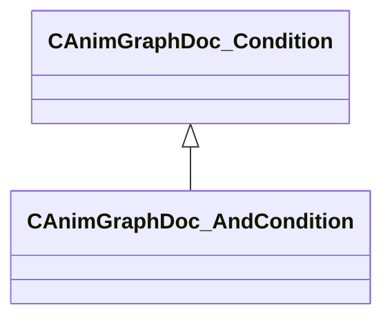

### CAnimGraphDoc_BindPoseNode

**Inherits from:** [CAnimGraphDoc_Node](animgraphdoclib.md#canimgraphdoc_node)

**Metadata:** `MGetKV3ClassDefaults {
	"_class": "CAnimGraphDoc_BindPoseNode",
	"m_sName": "Unnamed",
	"m_vecPosition":
	[
		0.000000,
		0.000000
	],
	"m_nNodeID":
	{
		"m_id": <HIDDEN FOR DIFF>,
	},
	"m_bDebugThisNode": false,
	"m_networkMode": "ServerAuthoritative"
}`, `MPropertyFriendlyName "Bind Pose"`

**Relationships:**

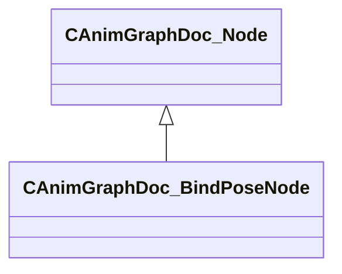

### CAnimGraphDoc_Blend2DItem

**Derived by:** [CAnimGraphDoc_NodeBlend2DItem](animgraphdoclib.md#canimgraphdoc_nodeblend2ditem), [CAnimGraphDoc_SequenceBlend2DItem](animgraphdoclib.md#canimgraphdoc_sequenceblend2ditem)

**Metadata:** `MGetKV3ClassDefaults Could not parse KV3 Defaults`, `MPropertyFriendlyName "Blend Item"`

**Relationships:**

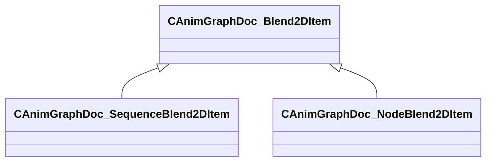

**Fields:**

| Name | Type | Annotations |
|------|------|-------------|
| `m_blendValue` | Vector2D | `MPropertyFriendlyName "Blend Value"` |
| `m_bUseCustomDuration` | bool | `MPropertyGroupName "+Duration Override"` `MPropertyFriendlyName "Use Custom Duration"` `MPropertyAutoRebuildOnChange` |
| `m_flCustomDuration` | float32 | `MPropertyGroupName "+Duration Override"` `MPropertyFriendlyName "Custom Duration"` `MPropertyAttrStateCallback` |

### CAnimGraphDoc_Blend2DNode

**Inherits from:** [CAnimGraphDoc_Node](animgraphdoclib.md#canimgraphdoc_node)

**Metadata:** `MGetKV3ClassDefaults {
	"_class": "CAnimGraphDoc_Blend2DNode",
	"m_sName": "Unnamed",
	"m_vecPosition":
	[
		0.000000,
		0.000000
	],
	"m_nNodeID":
	{
		"m_id": <HIDDEN FOR DIFF>,
	},
	"m_bDebugThisNode": false,
	"m_networkMode": "ServerAuthoritative",
	"m_items":
	[
	],
	"m_tagSpans":
	[
	],
	"m_paramSpans":
	[
	],
	"m_blendSourceX": "Parameter",
	"m_paramNameX": "",
	"m_paramX":
	{
		"m_id": <HIDDEN FOR DIFF>,
	},
	"m_blendSourceY": "Parameter",
	"m_paramNameY": "",
	"m_paramY":
	{
		"m_id": <HIDDEN FOR DIFF>,
	},
	"m_eBlendMode": "Blend2DMode_General",
	"m_bLoop": true,
	"m_bLockBlendOnReset": false,
	"m_bLockWhenWaning": true,
	"m_playbackSpeed": 1.000000,
	"m_damping":
	{
		"_class": "CAnimInputDamping",
		"m_speedFunction": "NoDamping",
		"m_fSpeedScale": 1.000000,
		"m_fFallingSpeedScale": 1.000000
	},
	"m_bAnimEventsAndTagsOnMostWeightedOnly": false
}`, `MPropertyFriendlyName "Blend 2D"`

**Relationships:**

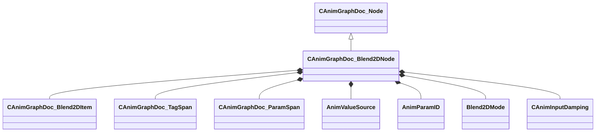

**Fields:**

| Name | Type | Annotations |
|------|------|-------------|
| `m_items` | CUtlVector<CSmartPtr<[CAnimGraphDoc_Blend2DItem](../schemas/animgraphdoclib.md#canimgraphdoc_blend2ditem)>> | `MPropertySuppressField` |
| `m_tagSpans` | CUtlVector<CSmartPtr<[CAnimGraphDoc_TagSpan](../schemas/animgraphdoclib.md#canimgraphdoc_tagspan)>> | `MPropertySuppressField` |
| `m_paramSpans` | CUtlVector<CSmartPtr<[CAnimGraphDoc_ParamSpan](../schemas/animgraphdoclib.md#canimgraphdoc_paramspan)>> | `MPropertySuppressField` |
| `m_blendSourceX` | [AnimValueSource](../schemas/animgraphlib.md#animvaluesource) | `MPropertyFriendlyName "Horizontal Axis"` `MPropertyAutoRebuildOnChange` `MPropertyAttrStateCallback` |
| `m_paramNameX` | CUtlString | `MPropertySuppressField` |
| `m_paramX` | [AnimParamID](../schemas/modellib.md#animparamid) | `MPropertyFriendlyName "Horizontal Parameter"` `MPropertyAttributeChoiceName "FloatParameter"` |
| `m_blendSourceY` | [AnimValueSource](../schemas/animgraphlib.md#animvaluesource) | `MPropertyFriendlyName "Vertical Axis"` `MPropertyAutoRebuildOnChange` `MPropertyAttrStateCallback` |
| `m_paramNameY` | CUtlString | `MPropertySuppressField` |
| `m_paramY` | [AnimParamID](../schemas/modellib.md#animparamid) | `MPropertyFriendlyName "Vertical Parameter"` `MPropertyAttributeChoiceName "FloatParameter"` |
| `m_eBlendMode` | [Blend2DMode](../schemas/animgraphlib.md#blend2dmode) | `MPropertyFriendlyName "Blend Mode"` |
| `m_bLoop` | bool | `MPropertyFriendlyName "Loop"` |
| `m_bLockBlendOnReset` | bool | `MPropertyFriendlyName "Lock Blend on Reset"` |
| `m_bLockWhenWaning` | bool | `MPropertyFriendlyName "Lock Blend When Waning"` |
| `m_playbackSpeed` | float32 | `MPropertyFriendlyName "Playback Speed"` |
| `m_damping` | [CAnimInputDamping](../schemas/animgraphlib.md#caniminputdamping) | `MPropertyFriendlyName "Damping"` |
| `m_bAnimEventsAndTagsOnMostWeightedOnly` | bool | `MPropertyFriendlyName "AnimEvents and Tags Exclusive To Most Weighted"` |

### CAnimGraphDoc_BlendNode

**Inherits from:** [CAnimGraphDoc_Node](animgraphdoclib.md#canimgraphdoc_node)

**Metadata:** `MGetKV3ClassDefaults {
	"_class": "CAnimGraphDoc_BlendNode",
	"m_sName": "Unnamed",
	"m_vecPosition":
	[
		0.000000,
		0.000000
	],
	"m_nNodeID":
	{
		"m_id": <HIDDEN FOR DIFF>,
	},
	"m_bDebugThisNode": false,
	"m_networkMode": "ServerAuthoritative",
	"m_children":
	[
	],
	"m_blendValueSource": "Parameter",
	"m_paramName": "",
	"m_param":
	{
		"m_id": <HIDDEN FOR DIFF>,
	},
	"m_blendKeyType": "BlendKey_UserValue",
	"m_bLockBlendOnReset": false,
	"m_bSyncCycles": true,
	"m_bLoop": true,
	"m_bLockWhenWaning": true,
	"m_bIsAngle": false,
	"m_damping":
	{
		"_class": "CAnimInputDamping",
		"m_speedFunction": "NoDamping",
		"m_fSpeedScale": 1.000000,
		"m_fFallingSpeedScale": 1.000000
	},
	"m_eLinearRootMotionBlendMode": "LERP"
}`, `MPropertyFriendlyName "Blend 1D"`

**Relationships:**

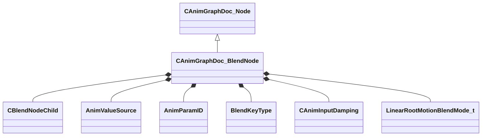

**Fields:**

| Name | Type | Annotations |
|------|------|-------------|
| `m_children` | CUtlVector<[CBlendNodeChild](../schemas/animgraphdoclib.md#cblendnodechild)> | `MPropertyFriendlyName "Blend Items"` `MPropertyAutoExpandSelf` |
| `m_blendValueSource` | [AnimValueSource](../schemas/animgraphlib.md#animvaluesource) | `MPropertyFriendlyName "Blend Source"` `MPropertyAttrStateCallback` |
| `m_paramName` | CUtlString | `MPropertySuppressField` |
| `m_param` | [AnimParamID](../schemas/modellib.md#animparamid) | `MPropertyFriendlyName "Parameter"` `MPropertyAttributeChoiceName "FloatParameter"` |
| `m_blendKeyType` | [BlendKeyType](../schemas/animgraphlib.md#blendkeytype) | `MPropertyFriendlyName "Blend Key Values"` |
| `m_bLockBlendOnReset` | bool | `MPropertyFriendlyName "Lock Blend on Reset"` |
| `m_bSyncCycles` | bool | `MPropertyFriendlyName "Sync Cycles"` |
| `m_bLoop` | bool | `MPropertyFriendlyName "Loop"` |
| `m_bLockWhenWaning` | bool | `MPropertyFriendlyName "Lock Blend When Waning"` |
| `m_bIsAngle` | bool | `MPropertyFriendlyName "Is Angle"` |
| `m_damping` | [CAnimInputDamping](../schemas/animgraphlib.md#caniminputdamping) | `MPropertyFriendlyName "Damping"` |
| `m_eLinearRootMotionBlendMode` | [LinearRootMotionBlendMode_t](../schemas/animgraphlib.md#linearrootmotionblendmode_t) | `MPropertyFriendlyName "Linear Root Motion Blend Mode"` |

### CAnimGraphDoc_BlockSelectionMetric

**Inherits from:** [CAnimGraphDoc_MotionMetric](animgraphdoclib.md#canimgraphdoc_motionmetric)

**Metadata:** `MGetKV3ClassDefaults {
	"_class": "CAnimGraphDoc_BlockSelectionMetric",
	"m_flWeight": 0.000000
}`, `MPropertyFriendlyName "Block Selection Metric"`

**Relationships:**

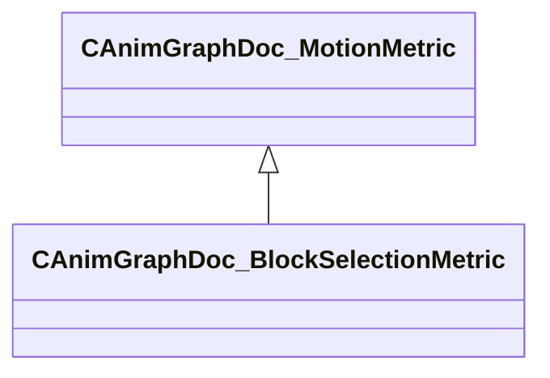

### CAnimGraphDoc_BoneMaskNode

**Inherits from:** [CAnimGraphDoc_Node](animgraphdoclib.md#canimgraphdoc_node)

**Metadata:** `MGetKV3ClassDefaults {
	"_class": "CAnimGraphDoc_BoneMaskNode",
	"m_sName": "Unnamed",
	"m_vecPosition":
	[
		0.000000,
		0.000000
	],
	"m_nNodeID":
	{
		"m_id": <HIDDEN FOR DIFF>,
	},
	"m_bDebugThisNode": false,
	"m_networkMode": "ServerAuthoritative",
	"m_weightListName": "",
	"m_inputConnection1":
	{
		"m_nodeID":
		{
			"m_id": <HIDDEN FOR DIFF>,
		},
		"m_outputID":
		{
			"m_id": <HIDDEN FOR DIFF>,
		}
	},
	"m_inputConnection2":
	{
		"m_nodeID":
		{
			"m_id": <HIDDEN FOR DIFF>,
		},
		"m_outputID":
		{
			"m_id": <HIDDEN FOR DIFF>,
		}
	},
	"m_blendSpace": "BlendSpace_Parent",
	"m_bUseBlendScale": false,
	"m_blendValueSource": "Parameter",
	"m_blendParameterName": "",
	"m_blendParameter":
	{
		"m_id": <HIDDEN FOR DIFF>,
	},
	"m_timingBehavior": "UseChild2",
	"m_flTimingBlend": 0.500000,
	"m_flRootMotionBlend": 0.000000,
	"m_footMotionTiming": "Child1",
	"m_bResetChild1": true,
	"m_bResetChild2": true
}`, `MPropertyFriendlyName "Bone Mask"`

**Relationships:**

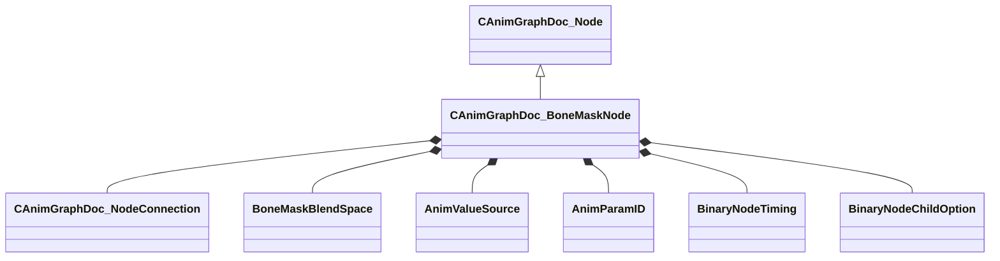

**Fields:**

| Name | Type | Annotations |
|------|------|-------------|
| `m_weightListName` | CUtlString | `MPropertyFriendlyName "Bone Mask"` `MPropertyAttributeChoiceName "BoneMask"` |
| `m_inputConnection1` | [CAnimGraphDoc_NodeConnection](../schemas/animgraphdoclib.md#canimgraphdoc_nodeconnection) | `MPropertySuppressField` |
| `m_inputConnection2` | [CAnimGraphDoc_NodeConnection](../schemas/animgraphdoclib.md#canimgraphdoc_nodeconnection) | `MPropertySuppressField` |
| `m_blendSpace` | [BoneMaskBlendSpace](../schemas/animgraphlib.md#bonemaskblendspace) | `MPropertyFriendlyName "Blend Space"` |
| `m_bUseBlendScale` | bool | `MPropertyFriendlyName "Use Blend Source"` `MPropertyAutoRebuildOnChange` |
| `m_blendValueSource` | [AnimValueSource](../schemas/animgraphlib.md#animvaluesource) | `MPropertyFriendlyName "Blend Source"` `MPropertyAutoRebuildOnChange` `MPropertyAttrStateCallback` |
| `m_blendParameterName` | CUtlString | `MPropertySuppressField` |
| `m_blendParameter` | [AnimParamID](../schemas/modellib.md#animparamid) | `MPropertyFriendlyName "Blend Parameter"` `MPropertyAttributeChoiceName "FloatParameter"` `MPropertyAttrStateCallback` |
| `m_timingBehavior` | [BinaryNodeTiming](../schemas/animgraphlib.md#binarynodetiming) | `MPropertyFriendlyName "Timing Control"` `MPropertyAutoRebuildOnChange` |
| `m_flTimingBlend` | float32 | `MPropertyFriendlyName "Timing Blend"` `MPropertyAttributeRange "0 1"` `MPropertyAttrStateCallback` |
| `m_flRootMotionBlend` | float32 | `MPropertyFriendlyName "Root Motion Blend"` `MPropertyAttributeRange "0 1"` |
| `m_footMotionTiming` | [BinaryNodeChildOption](../schemas/animgraphlib.md#binarynodechildoption) | `MPropertyFriendlyName "Foot Motion Timing"` |
| `m_bResetChild1` | bool | `MPropertyFriendlyName "Reset Child1"` |
| `m_bResetChild2` | bool | `MPropertyFriendlyName "Reset Child2"` |

### CAnimGraphDoc_BonePositionMetric

**Inherits from:** [CAnimGraphDoc_MotionMetric](animgraphdoclib.md#canimgraphdoc_motionmetric)

**Metadata:** `MGetKV3ClassDefaults {
	"_class": "CAnimGraphDoc_BonePositionMetric",
	"m_flWeight": 1.000000,
	"m_boneName": ""
}`, `MPropertyFriendlyName "Bone Position Metric"`

**Relationships:**

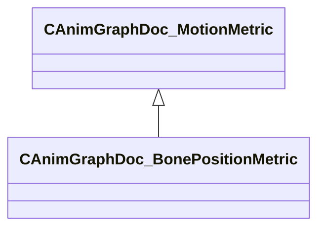

**Fields:**

| Name | Type | Annotations |
|------|------|-------------|
| `m_boneName` | CUtlString | `MPropertyFriendlyName "Bone"` `MPropertyAttributeChoiceName "Bone"` |

### CAnimGraphDoc_BoneVelocityMetric

**Inherits from:** [CAnimGraphDoc_MotionMetric](animgraphdoclib.md#canimgraphdoc_motionmetric)

**Metadata:** `MGetKV3ClassDefaults {
	"_class": "CAnimGraphDoc_BoneVelocityMetric",
	"m_flWeight": 1.000000,
	"m_boneName": ""
}`, `MPropertyFriendlyName "Bone Velocity Metric"`

**Relationships:**

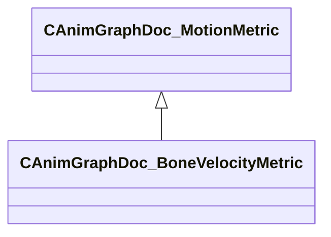

**Fields:**

| Name | Type | Annotations |
|------|------|-------------|
| `m_boneName` | CUtlString | `MPropertyFriendlyName "Bone"` `MPropertyAttributeChoiceName "Bone"` |

### CAnimGraphDoc_ChoiceNode

**Inherits from:** [CAnimGraphDoc_Node](animgraphdoclib.md#canimgraphdoc_node)

**Metadata:** `MGetKV3ClassDefaults {
	"_class": "CAnimGraphDoc_ChoiceNode",
	"m_sName": "Unnamed",
	"m_vecPosition":
	[
		0.000000,
		0.000000
	],
	"m_nNodeID":
	{
		"m_id": <HIDDEN FOR DIFF>,
	},
	"m_bDebugThisNode": false,
	"m_networkMode": "ServerAuthoritative",
	"m_children":
	[
	],
	"m_seed": <HIDDEN FOR DIFF>,
	"m_choiceMethod": "WeightedRandom",
	"m_choiceChangeMethod": "OnReset",
	"m_blendMethod": "SingleBlendTime",
	"m_blendTime": 0.200000,
	"m_bCrossFade": false,
	"m_bResetChosen": true,
	"m_bDontResetSameSelection": false
}`, `MPropertyFriendlyName "Choice"`

**Relationships:**

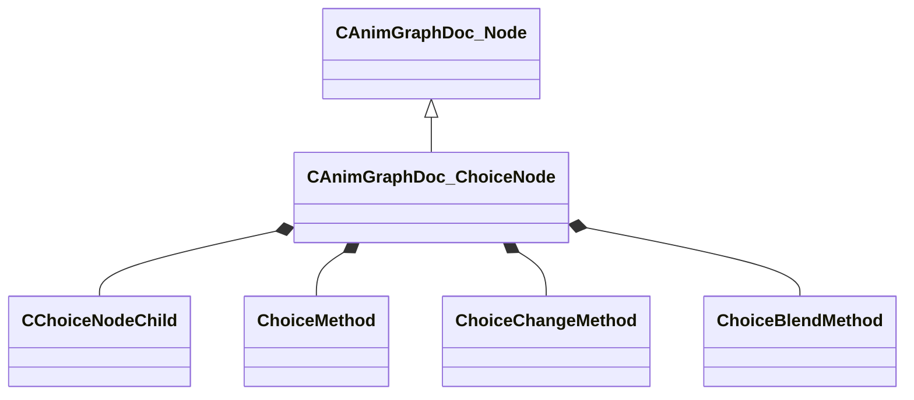

**Fields:**

| Name | Type | Annotations |
|------|------|-------------|
| `m_children` | CUtlVector<[CChoiceNodeChild](../schemas/animgraphdoclib.md#cchoicenodechild)> | `MPropertyFriendlyName "Options"` `MPropertyAutoExpandSelf` |
| `m_seed` | int32 | `MPropertySuppressField` |
| `m_choiceMethod` | [ChoiceMethod](../schemas/animgraphlib.md#choicemethod) | `MPropertyFriendlyName "Method"` |
| `m_choiceChangeMethod` | [ChoiceChangeMethod](../schemas/animgraphlib.md#choicechangemethod) | `MPropertyFriendlyName "Change Selection"` |
| `m_blendMethod` | [ChoiceBlendMethod](../schemas/animgraphlib.md#choiceblendmethod) | `MPropertyGroupName "Blending"` `MPropertyFriendlyName "Blend Method"` `MPropertyAutoRebuildOnChange` |
| `m_blendTime` | float32 | `MPropertyGroupName "Blending"` `MPropertyFriendlyName "Blend Duration"` `MPropertyAttrStateCallback` |
| `m_bCrossFade` | bool | `MPropertyGroupName "Blending"` `MPropertyFriendlyName "Cross Fade"` |
| `m_bResetChosen` | bool | `MPropertyFriendlyName "Reset On Selection"` `MPropertyAutoRebuildOnChange` |
| `m_bDontResetSameSelection` | bool | `MPropertyFriendlyName "Don't Reset Same Selection"` `MPropertyAttrStateCallback` |

### CAnimGraphDoc_ChoreoNode

**Inherits from:** [CAnimGraphDoc_Node](animgraphdoclib.md#canimgraphdoc_node)

**Metadata:** `MGetKV3ClassDefaults {
	"_class": "CAnimGraphDoc_ChoreoNode",
	"m_sName": "Unnamed",
	"m_vecPosition":
	[
		0.000000,
		0.000000
	],
	"m_nNodeID":
	{
		"m_id": <HIDDEN FOR DIFF>,
	},
	"m_bDebugThisNode": false,
	"m_networkMode": "ServerAuthoritative",
	"m_inputConnection":
	{
		"m_nodeID":
		{
			"m_id": <HIDDEN FOR DIFF>,
		},
		"m_outputID":
		{
			"m_id": <HIDDEN FOR DIFF>,
		}
	}
}`, `MPropertyFriendlyName "Choreo"`

**Relationships:**

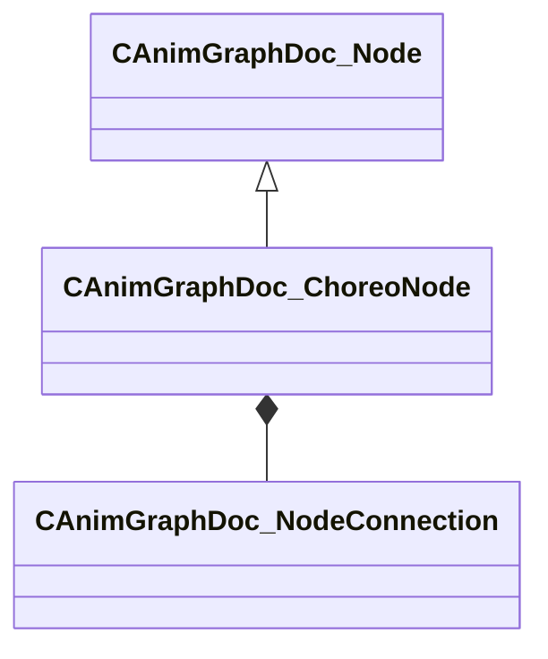

**Fields:**

| Name | Type | Annotations |
|------|------|-------------|
| `m_inputConnection` | [CAnimGraphDoc_NodeConnection](../schemas/animgraphdoclib.md#canimgraphdoc_nodeconnection) | `MPropertySuppressField` |

### CAnimGraphDoc_ClipData

**Metadata:** `MGetKV3ClassDefaults {
	"_class": "CAnimGraphDoc_ClipData",
	"m_tagSpans":
	[
	],
	"m_clipName": ""
}`, `MPropertyFriendlyName "Clip Data"`

**Relationships:**

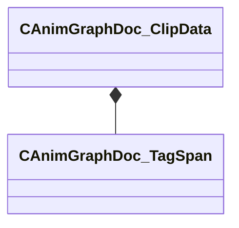

**Fields:**

| Name | Type | Annotations |
|------|------|-------------|
| `m_tagSpans` | CUtlVector<CSmartPtr<[CAnimGraphDoc_TagSpan](../schemas/animgraphdoclib.md#canimgraphdoc_tagspan)>> | `MPropertySuppressField` |
| `m_clipName` | CUtlString | `MPropertyFriendlyName "Sequence"` `MPropertyAttributeChoiceName "Sequence"` |

### CAnimGraphDoc_ClipDataManager

**Metadata:** `MGetKV3ClassDefaults {
	"_class": "CAnimGraphDoc_ClipDataManager",
	"m_itemTable":
	{
	}
}`, `MPropertyFriendlyName "Clip Data Manager"`

**Relationships:**

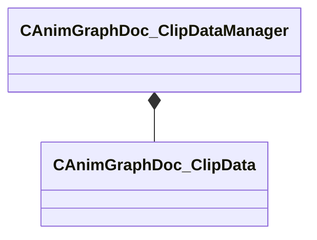

**Fields:**

| Name | Type | Annotations |
|------|------|-------------|
| `m_itemTable` | CUtlHashtable<CUtlString,CSmartPtr<[CAnimGraphDoc_ClipData](../schemas/animgraphdoclib.md#canimgraphdoc_clipdata)>> |  |

### CAnimGraphDoc_CommentNode

**Inherits from:** [CAnimGraphDoc_Node](animgraphdoclib.md#canimgraphdoc_node)

**Metadata:** `MGetKV3ClassDefaults {
	"_class": "CAnimGraphDoc_CommentNode",
	"m_sName": "Unnamed",
	"m_vecPosition":
	[
		0.000000,
		0.000000
	],
	"m_nNodeID":
	{
		"m_id": <HIDDEN FOR DIFF>,
	},
	"m_bDebugThisNode": false,
	"m_networkMode": "ServerAuthoritative",
	"m_commentText": "",
	"m_size":
	[
		375.000000,
		225.000000
	],
	"m_color":
	[
		49,
		139,
		146
	]
}`, `MPropertyFriendlyName "Comment"`

**Relationships:**

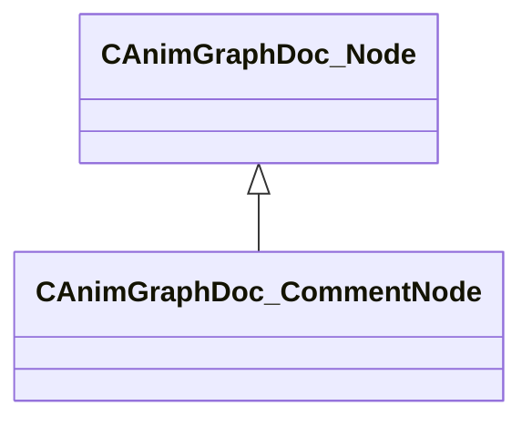

**Fields:**

| Name | Type | Annotations |
|------|------|-------------|
| `m_commentText` | CUtlString | `MPropertySuppressField` |
| `m_size` | Vector2D | `MPropertySuppressField` |
| `m_color` | Color | `MPropertyFriendlyName "Color"` |

### CAnimGraphDoc_Component

**Derived by:** [CActionComponent](animgraphdoclib.md#cactioncomponent), [CAnimScriptComponent](animgraphdoclib.md#canimscriptcomponent), [CCPPScriptComponent](animgraphdoclib.md#ccppscriptcomponent), [CDampedValueComponent](animgraphdoclib.md#cdampedvaluecomponent), [CDemoSettingsComponent](animgraphdoclib.md#cdemosettingscomponent), [CLODComponent](animgraphdoclib.md#clodcomponent), [CLookComponent](animgraphdoclib.md#clookcomponent), [CMovementComponent](animgraphdoclib.md#cmovementcomponent), [CPairedSequenceComponent](animgraphdoclib.md#cpairedsequencecomponent), [CRagdollComponent](animgraphdoclib.md#cragdollcomponent), [CRemapValueComponent](animgraphdoclib.md#cremapvaluecomponent), [CSlopeComponent](animgraphdoclib.md#cslopecomponent), [CStateMachineComponent](animgraphdoclib.md#cstatemachinecomponent)

**Metadata:** `MGetKV3ClassDefaults Could not parse KV3 Defaults`

**Relationships:**

```mermaid
classDiagram
    CAnimGraphDoc_Component <|-- CCPPScriptComponent
    CAnimGraphDoc_Component <|-- CMovementComponent
    CAnimGraphDoc_Component <|-- CActionComponent
    CAnimGraphDoc_Component <|-- CPairedSequenceComponent
    CAnimGraphDoc_Component <|-- CStateMachineComponent
    CAnimGraphDoc_Component <|-- CLODComponent
    CAnimGraphDoc_Component <|-- CDemoSettingsComponent
    CAnimGraphDoc_Component <|-- CRagdollComponent
    CAnimGraphDoc_Component <|-- CSlopeComponent
    CAnimGraphDoc_Component <|-- CLookComponent
    CAnimGraphDoc_Component <|-- CRemapValueComponent
    CAnimGraphDoc_Component <|-- CDampedValueComponent
    CAnimGraphDoc_Component <|-- CAnimScriptComponent
    CAnimGraphDoc_Component *-- AnimComponentID
    CAnimGraphDoc_Component *-- AnimNodeNetworkMode
```

**Fields:**

| Name | Type | Annotations |
|------|------|-------------|
| `m_group` | CUtlString | `MPropertySuppressField` |
| `m_id` | [AnimComponentID](../schemas/modellib.md#animcomponentid) | `MPropertySuppressField` |
| `m_bStartEnabled` | bool | `MPropertyFriendlyName "Start Enabled"` |
| `m_nPriority` | int32 | `MPropertyFriendlyName "Priority"` |
| `m_networkMode` | [AnimNodeNetworkMode](../schemas/animgraphlib.md#animnodenetworkmode) | `MPropertyFriendlyName "Network Mode"` |

### CAnimGraphDoc_ComponentManager

**Metadata:** `MGetKV3ClassDefaults {
	"_class": "CAnimGraphDoc_ComponentManager",
	"m_components":
	[
	]
}`

**Relationships:**

```mermaid
classDiagram
    CAnimGraphDoc_ComponentManager *-- CAnimGraphDoc_Component
```

**Fields:**

| Name | Type | Annotations |
|------|------|-------------|
| `m_components` | CUtlVector<CSmartPtr<[CAnimGraphDoc_Component](../schemas/animgraphdoclib.md#canimgraphdoc_component)>> |  |

### CAnimGraphDoc_ComponentState

**Inherits from:** [CAnimGraphDoc_State](animgraphdoclib.md#canimgraphdoc_state)

**Metadata:** `MGetKV3ClassDefaults {
	"_class": "CAnimGraphDoc_ComponentState",
	"m_transitions":
	[
	],
	"m_actions":
	[
	],
	"m_name": "Unnamed",
	"m_sComment": "",
	"m_stateID":
	{
		"m_id": <HIDDEN FOR DIFF>,
	},
	"m_position":
	[
		0.000000,
		0.000000
	],
	"m_bIsStartState": false,
	"m_bIsEndtState": false,
	"m_bIsInputToGraph": true,
	"m_bIsPassthrough": false,
	"m_bIsPassthroughRootMotion": false,
	"m_bPreEvaluatePassthroughTransitionPath": false
}`

**Relationships:**

```mermaid
classDiagram
    CAnimGraphDoc_State <|-- CAnimGraphDoc_ComponentState
```

### CAnimGraphDoc_ComponentStateTransition

**Inherits from:** [CAnimGraphDoc_StateTransition](animgraphdoclib.md#canimgraphdoc_statetransition)

**Metadata:** `MGetKV3ClassDefaults {
	"_class": "CAnimGraphDoc_ComponentStateTransition",
	"m_conditionList":
	{
		"_class": "CAnimGraphDoc_ConditionContainer",
		"m_conditions":
		[
		]
	},
	"m_srcState":
	{
		"m_id": <HIDDEN FOR DIFF>,
	},
	"m_destState":
	{
		"m_id": <HIDDEN FOR DIFF>,
	},
	"m_sComment": "",
	"m_bDisabled": false
}`

**Relationships:**

```mermaid
classDiagram
    CAnimGraphDoc_StateTransition <|-- CAnimGraphDoc_ComponentStateTransition
```

### CAnimGraphDoc_Condition

**Derived by:** [CAnimGraphDoc_AndCondition](animgraphdoclib.md#canimgraphdoc_andcondition), [CAnimGraphDoc_CycleCondition](animgraphdoclib.md#canimgraphdoc_cyclecondition), [CAnimGraphDoc_FinishedCondition](animgraphdoclib.md#canimgraphdoc_finishedcondition), [CAnimGraphDoc_OrCondition](animgraphdoclib.md#canimgraphdoc_orcondition), [CAnimGraphDoc_ParameterCondition](animgraphdoclib.md#canimgraphdoc_parametercondition), [CAnimGraphDoc_StateStatusCondition](animgraphdoclib.md#canimgraphdoc_statestatuscondition), [CAnimGraphDoc_TagCondition](animgraphdoclib.md#canimgraphdoc_tagcondition), [CAnimGraphDoc_TimeCondition](animgraphdoclib.md#canimgraphdoc_timecondition)

**Metadata:** `MGetKV3ClassDefaults Could not parse KV3 Defaults`

**Relationships:**

```mermaid
classDiagram
    CAnimGraphDoc_Condition <|-- CAnimGraphDoc_CycleCondition
    CAnimGraphDoc_Condition <|-- CAnimGraphDoc_FinishedCondition
    CAnimGraphDoc_Condition <|-- CAnimGraphDoc_AndCondition
    CAnimGraphDoc_Condition <|-- CAnimGraphDoc_OrCondition
    CAnimGraphDoc_Condition <|-- CAnimGraphDoc_StateStatusCondition
    CAnimGraphDoc_Condition <|-- CAnimGraphDoc_TimeCondition
    CAnimGraphDoc_Condition <|-- CAnimGraphDoc_TagCondition
    CAnimGraphDoc_Condition <|-- CAnimGraphDoc_ParameterCondition
```

### CAnimGraphDoc_ConditionContainer

**Derived by:** [CAnimGraphDoc_AndCondition](animgraphdoclib.md#canimgraphdoc_andcondition), [CAnimGraphDoc_OrCondition](animgraphdoclib.md#canimgraphdoc_orcondition)

**Metadata:** `MGetKV3ClassDefaults {
	"_class": "CAnimGraphDoc_ConditionContainer",
	"m_conditions":
	[
	]
}`

**Relationships:**

```mermaid
classDiagram
    CAnimGraphDoc_ConditionContainer <|-- CAnimGraphDoc_AndCondition
    CAnimGraphDoc_ConditionContainer <|-- CAnimGraphDoc_OrCondition
    CAnimGraphDoc_ConditionContainer *-- CAnimGraphDoc_Condition
```

**Fields:**

| Name | Type | Annotations |
|------|------|-------------|
| `m_conditions` | CUtlVector<CSmartPtr<[CAnimGraphDoc_Condition](../schemas/animgraphdoclib.md#canimgraphdoc_condition)>> | `MPropertySuppressField` |

### CAnimGraphDoc_ConflictManager

**Metadata:** `MGetKV3ClassDefaults {
	"_class": "CAnimGraphDoc_ConflictManager",
	"m_conflicts":
	[
	]
}`

**Relationships:**

```mermaid
classDiagram
    CAnimGraphDoc_ConflictManager *-- CAnimConflictBase
```

**Fields:**

| Name | Type | Annotations |
|------|------|-------------|
| `m_conflicts` | CUtlVector<CSmartPtr<[CAnimConflictBase](../schemas/animgraphdoclib.md#canimconflictbase)>> |  |

### CAnimGraphDoc_ContainerNodeBase

**Inherits from:** [CAnimGraphDoc_Node](animgraphdoclib.md#canimgraphdoc_node)

**Derived by:** [CAnimGraphDoc_GroupNode](animgraphdoclib.md#canimgraphdoc_groupnode), [CAnimGraphDoc_SubGraphNode](animgraphdoclib.md#canimgraphdoc_subgraphnode)

**Metadata:** `MGetKV3ClassDefaults Could not parse KV3 Defaults`

**Relationships:**

```mermaid
classDiagram
    CAnimGraphDoc_Node <|-- CAnimGraphDoc_ContainerNodeBase
    CAnimGraphDoc_ContainerNodeBase <|-- CAnimGraphDoc_SubGraphNode
    CAnimGraphDoc_ContainerNodeBase <|-- CAnimGraphDoc_GroupNode
    CAnimGraphDoc_ContainerNodeBase *-- AnimNodeID
    CAnimGraphDoc_ContainerNodeBase *-- AnimNodeOutputID
    CAnimGraphDoc_ContainerNodeBase *-- CAnimGraphDoc_NodeConnection
```

**Fields:**

| Name | Type | Annotations |
|------|------|-------------|
| `m_inputNodeID` | [AnimNodeID](../schemas/modellib.md#animnodeid) | `MPropertySuppressField` |
| `m_outputNodeID` | [AnimNodeID](../schemas/modellib.md#animnodeid) | `MPropertySuppressField` |
| `m_inputConnectionMap` | CUtlHashtable<[AnimNodeOutputID](../schemas/modellib.md#animnodeoutputid),[CAnimGraphDoc_NodeConnection](../schemas/animgraphdoclib.md#canimgraphdoc_nodeconnection)> | `MPropertySuppressField` |

### CAnimGraphDoc_CurrentRotationVelocityMetric

**Inherits from:** [CAnimGraphDoc_MotionMetric](animgraphdoclib.md#canimgraphdoc_motionmetric)

**Metadata:** `MGetKV3ClassDefaults {
	"_class": "CAnimGraphDoc_CurrentRotationVelocityMetric",
	"m_flWeight": 1.000000
}`, `MPropertyFriendlyName "Current Rotation Velocity Metric"`

**Relationships:**

```mermaid
classDiagram
    CAnimGraphDoc_MotionMetric <|-- CAnimGraphDoc_CurrentRotationVelocityMetric
```

### CAnimGraphDoc_CurrentVelocityMetric

**Inherits from:** [CAnimGraphDoc_MotionMetric](animgraphdoclib.md#canimgraphdoc_motionmetric)

**Metadata:** `MGetKV3ClassDefaults {
	"_class": "CAnimGraphDoc_CurrentVelocityMetric",
	"m_flWeight": 1.000000
}`, `MPropertyFriendlyName "Current Velocity Metric"`

**Relationships:**

```mermaid
classDiagram
    CAnimGraphDoc_MotionMetric <|-- CAnimGraphDoc_CurrentVelocityMetric
```

### CAnimGraphDoc_CycleCondition

**Inherits from:** [CAnimGraphDoc_Condition](animgraphdoclib.md#canimgraphdoc_condition)

**Metadata:** `MGetKV3ClassDefaults {
	"_class": "CAnimGraphDoc_CycleCondition",
	"m_comparisonOp": "COMPARISON_EQUALS",
	"m_comparisonString": "",
	"m_comparisonValue": 0.000000,
	"m_comparisonValueType": "COMPARISONVALUETYPE_FIXEDVALUE",
	"m_comparisonParamName": "",
	"m_comparisonParamID":
	{
		"m_id": <HIDDEN FOR DIFF>,
	}
}`, `MPropertyFriendlyName "Cycle Condition"`

**Relationships:**

```mermaid
classDiagram
    CAnimGraphDoc_Condition <|-- CAnimGraphDoc_CycleCondition
    CAnimGraphDoc_CycleCondition *-- Comparison_t
    CAnimGraphDoc_CycleCondition *-- ComparisonValueType
    CAnimGraphDoc_CycleCondition *-- AnimParamID
```

**Fields:**

| Name | Type | Annotations |
|------|------|-------------|
| `m_comparisonOp` | [Comparison_t](../schemas/animgraphdoclib.md#comparison_t) |  |
| `m_comparisonString` | CUtlString |  |
| `m_comparisonValue` | float32 |  |
| `m_comparisonValueType` | [ComparisonValueType](../schemas/animgraphdoclib.md#comparisonvaluetype) |  |
| `m_comparisonParamName` | CUtlString |  |
| `m_comparisonParamID` | [AnimParamID](../schemas/modellib.md#animparamid) |  |

### CAnimGraphDoc_CycleControlClipNode

**Inherits from:** [CAnimGraphDoc_Node](animgraphdoclib.md#canimgraphdoc_node)

**Metadata:** `MGetKV3ClassDefaults {
	"_class": "CAnimGraphDoc_CycleControlClipNode",
	"m_sName": "Unnamed",
	"m_vecPosition":
	[
		0.000000,
		0.000000
	],
	"m_nNodeID":
	{
		"m_id": <HIDDEN FOR DIFF>,
	},
	"m_bDebugThisNode": false,
	"m_networkMode": "ServerAuthoritative",
	"m_tagSpans":
	[
	],
	"m_sequenceName": "",
	"m_valueSource": "Parameter",
	"m_paramName": "",
	"m_param":
	{
		"m_id": <HIDDEN FOR DIFF>,
	},
	"m_bLockWhenWaning": false
}`, `MPropertyFriendlyName "Cycle Control Clip"`

**Relationships:**

```mermaid
classDiagram
    CAnimGraphDoc_Node <|-- CAnimGraphDoc_CycleControlClipNode
    CAnimGraphDoc_CycleControlClipNode *-- CAnimGraphDoc_TagSpan
    CAnimGraphDoc_CycleControlClipNode *-- AnimValueSource
    CAnimGraphDoc_CycleControlClipNode *-- AnimParamID
```

**Fields:**

| Name | Type | Annotations |
|------|------|-------------|
| `m_tagSpans` | CUtlVector<CSmartPtr<[CAnimGraphDoc_TagSpan](../schemas/animgraphdoclib.md#canimgraphdoc_tagspan)>> | `MPropertySuppressField` |
| `m_sequenceName` | CUtlString | `MPropertyFriendlyName "Sequence"` `MPropertyAttributeChoiceName "Sequence"` |
| `m_valueSource` | [AnimValueSource](../schemas/animgraphlib.md#animvaluesource) | `MPropertyFriendlyName "Blend Source"` `MPropertyAutoRebuildOnChange` `MPropertyAttrStateCallback` |
| `m_paramName` | CUtlString | `MPropertySuppressField` |
| `m_param` | [AnimParamID](../schemas/modellib.md#animparamid) | `MPropertyFriendlyName "Parameter"` `MPropertyAttributeChoiceName "FloatParameter"` |
| `m_bLockWhenWaning` | bool | `MPropertyFriendlyName "Lock When Waning"` |

### CAnimGraphDoc_CycleControlNode

**Inherits from:** [CAnimGraphDoc_Node](animgraphdoclib.md#canimgraphdoc_node)

**Metadata:** `MGetKV3ClassDefaults {
	"_class": "CAnimGraphDoc_CycleControlNode",
	"m_sName": "Unnamed",
	"m_vecPosition":
	[
		0.000000,
		0.000000
	],
	"m_nNodeID":
	{
		"m_id": <HIDDEN FOR DIFF>,
	},
	"m_bDebugThisNode": false,
	"m_networkMode": "ServerAuthoritative",
	"m_inputConnection":
	{
		"m_nodeID":
		{
			"m_id": <HIDDEN FOR DIFF>,
		},
		"m_outputID":
		{
			"m_id": <HIDDEN FOR DIFF>,
		}
	},
	"m_valueSource": "Parameter",
	"m_paramName": "",
	"m_param":
	{
		"m_id": <HIDDEN FOR DIFF>,
	},
	"m_bLockWhenWaning": false
}`, `MPropertyFriendlyName "Cycle Control"`

**Relationships:**

```mermaid
classDiagram
    CAnimGraphDoc_Node <|-- CAnimGraphDoc_CycleControlNode
    CAnimGraphDoc_CycleControlNode *-- CAnimGraphDoc_NodeConnection
    CAnimGraphDoc_CycleControlNode *-- AnimValueSource
    CAnimGraphDoc_CycleControlNode *-- AnimParamID
```

**Fields:**

| Name | Type | Annotations |
|------|------|-------------|
| `m_inputConnection` | [CAnimGraphDoc_NodeConnection](../schemas/animgraphdoclib.md#canimgraphdoc_nodeconnection) | `MPropertySuppressField` |
| `m_valueSource` | [AnimValueSource](../schemas/animgraphlib.md#animvaluesource) | `MPropertyFriendlyName "Blend Source"` `MPropertyAutoRebuildOnChange` `MPropertyAttrStateCallback` |
| `m_paramName` | CUtlString | `MPropertySuppressField` |
| `m_param` | [AnimParamID](../schemas/modellib.md#animparamid) | `MPropertyFriendlyName "Parameter"` `MPropertyAttributeChoiceName "FloatParameter"` |
| `m_bLockWhenWaning` | bool | `MPropertyFriendlyName "Lock When Waning"` |

### CAnimGraphDoc_DampedPathMotor

**Inherits from:** [CAnimGraphDoc_PathMotorBase](animgraphdoclib.md#canimgraphdoc_pathmotorbase)

**Metadata:** `MGetKV3ClassDefaults {
	"_class": "CAnimGraphDoc_DampedPathMotor",
	"m_name": "Unnamed Motor",
	"m_bDefault": false,
	"m_bLockToPath": true,
	"m_flAnticipationTime": 1.000000,
	"m_flMinSpeedScale": 0.250000,
	"m_anticipationPosParamName": "",
	"m_anticipationPosParam":
	{
		"m_id": <HIDDEN FOR DIFF>,
	},
	"m_anticipationHeadingParamName": "",
	"m_anticipationHeadingParam":
	{
		"m_id": <HIDDEN FOR DIFF>,
	},
	"m_flSpringConstant": 10.000000,
	"m_flMinSpringTension": 1.000000,
	"m_flMaxSpringTension": 100.000000
}`, `MPropertyFriendlyName "Damped Path Motor"`

**Relationships:**

```mermaid
classDiagram
    CAnimGraphDoc_PathMotorBase <|-- CAnimGraphDoc_DampedPathMotor
    CAnimGraphDoc_Motor <|-- CAnimGraphDoc_PathMotorBase
    CAnimGraphDoc_DampedPathMotor *-- AnimParamID
```

**Fields:**

| Name | Type | Annotations |
|------|------|-------------|
| `m_flAnticipationTime` | float32 | `MPropertyFriendlyName "Anticipation Time"` |
| `m_flMinSpeedScale` | float32 | `MPropertyFriendlyName "Minimum Speed Percentage"` |
| `m_anticipationPosParamName` | CUtlString | `MPropertySuppressField` |
| `m_anticipationPosParam` | [AnimParamID](../schemas/modellib.md#animparamid) | `MPropertyFriendlyName "Anticipation Position Parameter"` `MPropertyAttributeChoiceName "VectorParameter"` |
| `m_anticipationHeadingParamName` | CUtlString | `MPropertySuppressField` |
| `m_anticipationHeadingParam` | [AnimParamID](../schemas/modellib.md#animparamid) | `MPropertyFriendlyName "Anticipation Heading Parameter"` `MPropertyAttributeChoiceName "FloatParameter"` |
| `m_flSpringConstant` | float32 | `MPropertyFriendlyName "Spring Constant"` `MPropertyGroupName "+Stopping:Arrival Damping"` |
| `m_flMinSpringTension` | float32 | `MPropertyFriendlyName "Min Tension"` `MPropertyGroupName "+Stopping:Arrival Damping"` |
| `m_flMaxSpringTension` | float32 | `MPropertyFriendlyName "Max Tension"` `MPropertyGroupName "+Stopping:Arrival Damping"` |

### CAnimGraphDoc_DirectPlaybackNode

**Inherits from:** [CAnimGraphDoc_Node](animgraphdoclib.md#canimgraphdoc_node)

**Metadata:** `MGetKV3ClassDefaults {
	"_class": "CAnimGraphDoc_DirectPlaybackNode",
	"m_sName": "Unnamed",
	"m_vecPosition":
	[
		0.000000,
		0.000000
	],
	"m_nNodeID":
	{
		"m_id": <HIDDEN FOR DIFF>,
	},
	"m_bDebugThisNode": false,
	"m_networkMode": "ServerAuthoritative",
	"m_inputConnection":
	{
		"m_nodeID":
		{
			"m_id": <HIDDEN FOR DIFF>,
		},
		"m_outputID":
		{
			"m_id": <HIDDEN FOR DIFF>,
		}
	},
	"m_bFinishEarly": false,
	"m_bResetOnFinish": true
}`, `MPropertyFriendlyName "Direct Playback"`

**Relationships:**

```mermaid
classDiagram
    CAnimGraphDoc_Node <|-- CAnimGraphDoc_DirectPlaybackNode
    CAnimGraphDoc_DirectPlaybackNode *-- CAnimGraphDoc_NodeConnection
```

**Fields:**

| Name | Type | Annotations |
|------|------|-------------|
| `m_inputConnection` | [CAnimGraphDoc_NodeConnection](../schemas/animgraphdoclib.md#canimgraphdoc_nodeconnection) | `MPropertySuppressField` |
| `m_bFinishEarly` | bool | `MPropertyFriendlyName "Finish Early"` |
| `m_bResetOnFinish` | bool | `MPropertyFriendlyName "Reset Child On Finish"` |

### CAnimGraphDoc_DirectionalBlendNode

**Inherits from:** [CAnimGraphDoc_Node](animgraphdoclib.md#canimgraphdoc_node)

**Metadata:** `MGetKV3ClassDefaults {
	"_class": "CAnimGraphDoc_DirectionalBlendNode",
	"m_sName": "Unnamed",
	"m_vecPosition":
	[
		0.000000,
		0.000000
	],
	"m_nNodeID":
	{
		"m_id": <HIDDEN FOR DIFF>,
	},
	"m_bDebugThisNode": false,
	"m_networkMode": "ServerAuthoritative",
	"m_animNamePrefix": "",
	"m_blendValueSource": "Parameter",
	"m_paramName": "",
	"m_param":
	{
		"m_id": <HIDDEN FOR DIFF>,
	},
	"m_bLoop": true,
	"m_bLockBlendOnReset": false,
	"m_playbackSpeed": 1.000000,
	"m_damping":
	{
		"_class": "CAnimInputDamping",
		"m_speedFunction": "NoDamping",
		"m_fSpeedScale": 1.000000,
		"m_fFallingSpeedScale": 1.000000
	}
}`, `MPropertyFriendlyName "Directional Blend"`

**Relationships:**

```mermaid
classDiagram
    CAnimGraphDoc_Node <|-- CAnimGraphDoc_DirectionalBlendNode
    CAnimGraphDoc_DirectionalBlendNode *-- AnimValueSource
    CAnimGraphDoc_DirectionalBlendNode *-- AnimParamID
    CAnimGraphDoc_DirectionalBlendNode *-- CAnimInputDamping
```

**Fields:**

| Name | Type | Annotations |
|------|------|-------------|
| `m_animNamePrefix` | CUtlString | `MPropertyFriendlyName "Sequence Names Prefix"` |
| `m_blendValueSource` | [AnimValueSource](../schemas/animgraphlib.md#animvaluesource) | `MPropertyFriendlyName "Blend Source"` `MPropertyAutoRebuildOnChange` `MPropertyAttrStateCallback` |
| `m_paramName` | CUtlString | `MPropertySuppressField` |
| `m_param` | [AnimParamID](../schemas/modellib.md#animparamid) | `MPropertyFriendlyName "Parameter"` `MPropertyAttributeChoiceName "FloatParameter"` |
| `m_bLoop` | bool | `MPropertyFriendlyName "Loop"` |
| `m_bLockBlendOnReset` | bool | `MPropertyFriendlyName "Lock Blend on Reset"` |
| `m_playbackSpeed` | float32 | `MPropertyFriendlyName "Playback Speed"` |
| `m_damping` | [CAnimInputDamping](../schemas/animgraphlib.md#caniminputdamping) | `MPropertyFriendlyName "Damping"` |

### CAnimGraphDoc_DistanceRemainingMetric

**Inherits from:** [CAnimGraphDoc_MotionMetric](animgraphdoclib.md#canimgraphdoc_motionmetric)

**Metadata:** `MGetKV3ClassDefaults {
	"_class": "CAnimGraphDoc_DistanceRemainingMetric",
	"m_flWeight": 1.000000,
	"m_flMaxDistance": 300.000000,
	"m_bFilterFixedMinDistance": true,
	"m_flMinDistance": 0.000000,
	"m_bFilterGoalDistance": true,
	"m_flStartGoalFilterDistance": 150.000000,
	"m_bFilterGoalOvershoot": false,
	"m_flMaxGoalOvershootScale": 2.000000
}`, `MPropertyFriendlyName "Distance Remaining Metric"`

**Relationships:**

```mermaid
classDiagram
    CAnimGraphDoc_MotionMetric <|-- CAnimGraphDoc_DistanceRemainingMetric
```

**Fields:**

| Name | Type | Annotations |
|------|------|-------------|
| `m_flMaxDistance` | float32 | `MPropertyFriendlyName "Maximum Tracked Distance"` |
| `m_bFilterFixedMinDistance` | bool | `MPropertyFriendlyName "Filter By Fixed Distance"` `MPropertyAutoRebuildOnChange` |
| `m_flMinDistance` | float32 | `MPropertyFriendlyName "Min Distance"` `MPropertyAttrStateCallback` |
| `m_bFilterGoalDistance` | bool | `MPropertyFriendlyName "Filter By Goal Distance"` `MPropertyAutoRebuildOnChange` |
| `m_flStartGoalFilterDistance` | float32 | `MPropertyFriendlyName "Goal Filter Start Distance"` `MPropertyAttrStateCallback` |
| `m_bFilterGoalOvershoot` | bool | `MPropertyFriendlyName "Filter By Goal Overshoot"` `MPropertyAutoRebuildOnChange` `MPropertyAttrStateCallback` |
| `m_flMaxGoalOvershootScale` | float32 | `MPropertyFriendlyName "Max Goal Overshoot Scale"` `MPropertyAttrStateCallback` |

### CAnimGraphDoc_EmitTagAction

**Inherits from:** [CAnimGraphDoc_Action](animgraphdoclib.md#canimgraphdoc_action)

**Metadata:** `MGetKV3ClassDefaults {
	"_class": "CAnimGraphDoc_EmitTagAction",
	"m_tag":
	{
		"m_id": <HIDDEN FOR DIFF>,
	}
}`

**Relationships:**

```mermaid
classDiagram
    CAnimGraphDoc_Action <|-- CAnimGraphDoc_EmitTagAction
    CAnimGraphDoc_EmitTagAction *-- AnimTagID
```

**Fields:**

| Name | Type | Annotations |
|------|------|-------------|
| `m_tag` | [AnimTagID](../schemas/modellib.md#animtagid) | `MPropertyFriendlyName "Tag"` `MPropertyAttributeChoiceName "Tag"` |

### CAnimGraphDoc_ExpressionAction

**Inherits from:** [CAnimGraphDoc_Action](animgraphdoclib.md#canimgraphdoc_action)

**Metadata:** `MGetKV3ClassDefaults {
	"_class": "CAnimGraphDoc_ExpressionAction",
	"m_paramName": "",
	"m_param":
	{
		"m_id": <HIDDEN FOR DIFF>,
	},
	"m_expression": ""
}`

**Relationships:**

```mermaid
classDiagram
    CAnimGraphDoc_Action <|-- CAnimGraphDoc_ExpressionAction
    CAnimGraphDoc_ExpressionAction *-- AnimParamID
```

**Fields:**

| Name | Type | Annotations |
|------|------|-------------|
| `m_paramName` | CUtlString |  |
| `m_param` | [AnimParamID](../schemas/modellib.md#animparamid) |  |
| `m_expression` | CUtlString |  |

### CAnimGraphDoc_FinishedCondition

**Inherits from:** [CAnimGraphDoc_Condition](animgraphdoclib.md#canimgraphdoc_condition)

**Metadata:** `MGetKV3ClassDefaults {
	"_class": "CAnimGraphDoc_FinishedCondition",
	"m_option": "FinishedConditionOption_OnFinished",
	"m_bIsFinished": true
}`, `MPropertyFriendlyName "Finished Condition"`

**Relationships:**

```mermaid
classDiagram
    CAnimGraphDoc_Condition <|-- CAnimGraphDoc_FinishedCondition
    CAnimGraphDoc_FinishedCondition *-- FinishedConditionOption
```

**Fields:**

| Name | Type | Annotations |
|------|------|-------------|
| `m_option` | [FinishedConditionOption](../schemas/animgraphdoclib.md#finishedconditionoption) |  |
| `m_bIsFinished` | bool |  |

### CAnimGraphDoc_FollowAttachmentNode

**Inherits from:** [CAnimGraphDoc_Node](animgraphdoclib.md#canimgraphdoc_node)

**Metadata:** `MGetKV3ClassDefaults {
	"_class": "CAnimGraphDoc_FollowAttachmentNode",
	"m_sName": "Unnamed",
	"m_vecPosition":
	[
		0.000000,
		0.000000
	],
	"m_nNodeID":
	{
		"m_id": <HIDDEN FOR DIFF>,
	},
	"m_bDebugThisNode": false,
	"m_networkMode": "ServerAuthoritative",
	"m_inputConnection":
	{
		"m_nodeID":
		{
			"m_id": <HIDDEN FOR DIFF>,
		},
		"m_outputID":
		{
			"m_id": <HIDDEN FOR DIFF>,
		}
	},
	"m_boneName": "",
	"m_attachmentName": "",
	"m_bMatchTranslation": false,
	"m_bMatchRotation": false
}`, `MPropertyFriendlyName "Follow Attachment"`

**Relationships:**

```mermaid
classDiagram
    CAnimGraphDoc_Node <|-- CAnimGraphDoc_FollowAttachmentNode
    CAnimGraphDoc_FollowAttachmentNode *-- CAnimGraphDoc_NodeConnection
```

**Fields:**

| Name | Type | Annotations |
|------|------|-------------|
| `m_inputConnection` | [CAnimGraphDoc_NodeConnection](../schemas/animgraphdoclib.md#canimgraphdoc_nodeconnection) | `MPropertySuppressField` |
| `m_boneName` | CUtlString | `MPropertyFriendlyName "Bone"` `MPropertyAttributeChoiceName "Bone"` |
| `m_attachmentName` | CUtlString | `MPropertyFriendlyName "Target Attachment"` `MPropertyAttributeChoiceName "Attachment"` |
| `m_bMatchTranslation` | bool | `MPropertyFriendlyName "Match Translation"` |
| `m_bMatchRotation` | bool | `MPropertyFriendlyName "Match Rotation"` |

### CAnimGraphDoc_FollowPathNode

**Inherits from:** [CAnimGraphDoc_Node](animgraphdoclib.md#canimgraphdoc_node)

**Metadata:** `MGetKV3ClassDefaults {
	"_class": "CAnimGraphDoc_FollowPathNode",
	"m_sName": "Unnamed",
	"m_vecPosition":
	[
		0.000000,
		0.000000
	],
	"m_nNodeID":
	{
		"m_id": <HIDDEN FOR DIFF>,
	},
	"m_bDebugThisNode": false,
	"m_networkMode": "ServerAuthoritative",
	"m_inputConnection":
	{
		"m_nodeID":
		{
			"m_id": <HIDDEN FOR DIFF>,
		},
		"m_outputID":
		{
			"m_id": <HIDDEN FOR DIFF>,
		}
	},
	"m_flBlendOutTime": 0.300000,
	"m_bBlockNonPathMovement": false,
	"m_bStopFeetAtGoal": true,
	"m_bScaleSpeed": false,
	"m_flScale": 0.500000,
	"m_flMinAngle": 0.000000,
	"m_flMaxAngle": 180.000000,
	"m_flSpeedScaleBlending": 0.200000,
	"m_bTurnToFace": true,
	"m_facingTarget": "MoveHeading",
	"m_paramName": "",
	"m_param":
	{
		"m_id": <HIDDEN FOR DIFF>,
	},
	"m_flTurnToFaceOffset": 0.000000,
	"m_damping":
	{
		"_class": "CAnimInputDamping",
		"m_speedFunction": "NoDamping",
		"m_fSpeedScale": 1.000000,
		"m_fFallingSpeedScale": 1.000000
	}
}`, `MPropertyFriendlyName "Follow Path"`

**Relationships:**

```mermaid
classDiagram
    CAnimGraphDoc_Node <|-- CAnimGraphDoc_FollowPathNode
    CAnimGraphDoc_FollowPathNode *-- CAnimGraphDoc_NodeConnection
    CAnimGraphDoc_FollowPathNode *-- AnimValueSource
    CAnimGraphDoc_FollowPathNode *-- AnimParamID
    CAnimGraphDoc_FollowPathNode *-- CAnimInputDamping
```

**Fields:**

| Name | Type | Annotations |
|------|------|-------------|
| `m_inputConnection` | [CAnimGraphDoc_NodeConnection](../schemas/animgraphdoclib.md#canimgraphdoc_nodeconnection) | `MPropertySuppressField` |
| `m_flBlendOutTime` | float32 | `MPropertyFriendlyName "Blend Out Time"` |
| `m_bBlockNonPathMovement` | bool | `MPropertyFriendlyName "Block Non-Path Movement"` |
| `m_bStopFeetAtGoal` | bool | `MPropertyFriendlyName "Stop Feet at Goal"` |
| `m_bScaleSpeed` | bool | `MPropertyFriendlyName "Enable Speed Scaling"` `MPropertyGroupName "Speed Scaling"` `MPropertyAutoRebuildOnChange` |
| `m_flScale` | float32 | `MPropertyFriendlyName "Scale"` `MPropertyGroupName "Speed Scaling"` `MPropertyAttributeRange "0 1"` `MPropertyAttrStateCallback` |
| `m_flMinAngle` | float32 | `MPropertyFriendlyName "Min Angle"` `MPropertyGroupName "Speed Scaling"` `MPropertyAttributeRange "0 180"` `MPropertyAttrStateCallback` |
| `m_flMaxAngle` | float32 | `MPropertyFriendlyName "Max Angle"` `MPropertyGroupName "Speed Scaling"` `MPropertyAttributeRange "0 180"` `MPropertyAttrStateCallback` |
| `m_flSpeedScaleBlending` | float32 | `MPropertyFriendlyName "Blend Time"` `MPropertyGroupName "Speed Scaling"` `MPropertyAttrStateCallback` |
| `m_bTurnToFace` | bool | `MPropertyFriendlyName "Enable Turn to Face"` `MPropertyGroupName "Turn to Face"` `MPropertyAutoRebuildOnChange` |
| `m_facingTarget` | [AnimValueSource](../schemas/animgraphlib.md#animvaluesource) | `MPropertyFriendlyName "Target"` `MPropertyGroupName "Turn to Face"` `MPropertyAutoRebuildOnChange` `MPropertyAttrStateCallback` |
| `m_paramName` | CUtlString | `MPropertySuppressField` |
| `m_param` | [AnimParamID](../schemas/modellib.md#animparamid) | `MPropertyFriendlyName "Parameter"` `MPropertyGroupName "Turn to Face"` `MPropertyAttributeChoiceName "FloatParameter"` `MPropertyAttrStateCallback` |
| `m_flTurnToFaceOffset` | float32 | `MPropertyFriendlyName "Offset"` `MPropertyGroupName "Turn to Face"` `MPropertyAttributeRange "-180 180"` `MPropertyAttrStateCallback` |
| `m_damping` | [CAnimInputDamping](../schemas/animgraphlib.md#caniminputdamping) | `MPropertyFriendlyName "Damping"` `MPropertyGroupName "Turn to Face"` `MPropertyAttrStateCallback` |

### CAnimGraphDoc_FollowTargetNode

**Inherits from:** [CAnimGraphDoc_Node](animgraphdoclib.md#canimgraphdoc_node)

**Metadata:** `MGetKV3ClassDefaults {
	"_class": "CAnimGraphDoc_FollowTargetNode",
	"m_sName": "Unnamed",
	"m_vecPosition":
	[
		0.000000,
		0.000000
	],
	"m_nNodeID":
	{
		"m_id": <HIDDEN FOR DIFF>,
	},
	"m_bDebugThisNode": false,
	"m_networkMode": "ServerAuthoritative",
	"m_inputConnection":
	{
		"m_nodeID":
		{
			"m_id": <HIDDEN FOR DIFF>,
		},
		"m_outputID":
		{
			"m_id": <HIDDEN FOR DIFF>,
		}
	},
	"m_boneName": "",
	"m_TargetSettings":
	{
		"m_TargetSource": "Bone",
		"m_Bone":
		{
			"m_Name": ""
		},
		"m_AnimgraphParameterNamePosition":
		{
			"m_id": <HIDDEN FOR DIFF>,
		},
		"m_AnimgraphParameterNameOrientation":
		{
			"m_id": <HIDDEN FOR DIFF>,
		},
		"m_TargetCoordSystem": "World Space"
	},
	"m_bMatchTargetOrientation": false
}`, `MPropertyFriendlyName "Follow Target"`

**Relationships:**

```mermaid
classDiagram
    CAnimGraphDoc_Node <|-- CAnimGraphDoc_FollowTargetNode
    CAnimGraphDoc_FollowTargetNode *-- CAnimGraphDoc_NodeConnection
    CAnimGraphDoc_FollowTargetNode *-- IKTargetSettings_t
```

**Fields:**

| Name | Type | Annotations |
|------|------|-------------|
| `m_inputConnection` | [CAnimGraphDoc_NodeConnection](../schemas/animgraphdoclib.md#canimgraphdoc_nodeconnection) | `MPropertySuppressField` |
| `m_boneName` | CUtlString | `MPropertyFriendlyName "Bone"` `MPropertyAttributeChoiceName "Bone"` |
| `m_TargetSettings` | [IKTargetSettings_t](../schemas/animgraphlib.md#iktargetsettings_t) | `MPropertyFriendlyName "Target Settings"` `MPropertyAutoExpandSelf` |
| `m_bMatchTargetOrientation` | bool | `MPropertyFriendlyName "Match Target Orientation"` `MPropertyAutoRebuildOnChange` |

### CAnimGraphDoc_FootAdjustmentNode

**Inherits from:** [CAnimGraphDoc_Node](animgraphdoclib.md#canimgraphdoc_node)

**Metadata:** `MGetKV3ClassDefaults {
	"_class": "CAnimGraphDoc_FootAdjustmentNode",
	"m_sName": "Unnamed",
	"m_vecPosition":
	[
		0.000000,
		0.000000
	],
	"m_nNodeID":
	{
		"m_id": <HIDDEN FOR DIFF>,
	},
	"m_bDebugThisNode": false,
	"m_networkMode": "ServerAuthoritative",
	"m_inputConnection":
	{
		"m_nodeID":
		{
			"m_id": <HIDDEN FOR DIFF>,
		},
		"m_outputID":
		{
			"m_id": <HIDDEN FOR DIFF>,
		}
	},
	"m_facingTargetParam": "",
	"m_facingTarget":
	{
		"m_id": <HIDDEN FOR DIFF>,
	},
	"m_bResetChild": true,
	"m_bAnimationDriven": false,
	"m_baseClipName": "",
	"m_clips":
	[
	],
	"m_flTurnTimeMin": 1.500000,
	"m_flTurnTimeMax": 3.000000,
	"m_flStepHeightMax": 4.000000,
	"m_flStepHeightMaxAngle": 90.000000
}`, `MPropertyFriendlyName "Foot Adjustment"`

**Relationships:**

```mermaid
classDiagram
    CAnimGraphDoc_Node <|-- CAnimGraphDoc_FootAdjustmentNode
    CAnimGraphDoc_FootAdjustmentNode *-- CAnimGraphDoc_NodeConnection
    CAnimGraphDoc_FootAdjustmentNode *-- AnimParamID
```

**Fields:**

| Name | Type | Annotations |
|------|------|-------------|
| `m_inputConnection` | [CAnimGraphDoc_NodeConnection](../schemas/animgraphdoclib.md#canimgraphdoc_nodeconnection) | `MPropertySuppressField` |
| `m_facingTargetParam` | CUtlString | `MPropertySuppressField` |
| `m_facingTarget` | [AnimParamID](../schemas/modellib.md#animparamid) | `MPropertyFriendlyName "Turn to Face"` `MPropertyAttributeChoiceName "FloatParameter"` |
| `m_bResetChild` | bool | `MPropertyFriendlyName "Reset Child"` |
| `m_bAnimationDriven` | bool | `MPropertyFriendlyName "Animation Driven"` `MPropertyAutoRebuildOnChange` |
| `m_baseClipName` | CUtlString | `MPropertyFriendlyName "Base Anim Clips"` `MPropertyGroupName "Anim Driven Settings"` `MPropertyAttributeChoiceName "Sequence"` `MPropertyAttrStateCallback` |
| `m_clips` | CUtlVector<CUtlString> | `MPropertyFriendlyName "Clips"` `MPropertyGroupName "Anim Driven Settings"` `MPropertyAttributeChoiceName "Sequence"` `MPropertyAttrStateCallback` |
| `m_flTurnTimeMin` | float32 | `MPropertyFriendlyName "Turn Time Min"` `MPropertyGroupName "Procedural Settings"` `MPropertyAttrStateCallback` |
| `m_flTurnTimeMax` | float32 | `MPropertyFriendlyName "Turn Time Max"` `MPropertyGroupName "Procedural Settings"` `MPropertyAttrStateCallback` |
| `m_flStepHeightMax` | float32 | `MPropertyFriendlyName "Step Height Max"` `MPropertyGroupName "Procedural Settings"` `MPropertyAttrStateCallback` |
| `m_flStepHeightMaxAngle` | float32 | `MPropertyFriendlyName "Step Height Max Angle"` `MPropertyGroupName "Procedural Settings"` `MPropertyAttrStateCallback` |

### CAnimGraphDoc_FootCycleMetric

**Inherits from:** [CAnimGraphDoc_MotionMetric](animgraphdoclib.md#canimgraphdoc_motionmetric)

**Metadata:** `MGetKV3ClassDefaults {
	"_class": "CAnimGraphDoc_FootCycleMetric",
	"m_flWeight": 1.000000,
	"m_feet":
	[
	]
}`, `MPropertyFriendlyName "Foot Cycle Metric"`

**Relationships:**

```mermaid
classDiagram
    CAnimGraphDoc_MotionMetric <|-- CAnimGraphDoc_FootCycleMetric
```

**Fields:**

| Name | Type | Annotations |
|------|------|-------------|
| `m_feet` | CUtlVector<CUtlString> | `MPropertyFriendlyName "Foot"` `MPropertyAttributeChoiceName "Foot"` `MPropertyAutoExpandSelf` |

### CAnimGraphDoc_FootLockNode

**Inherits from:** [CAnimGraphDoc_Node](animgraphdoclib.md#canimgraphdoc_node)

**Metadata:** `MGetKV3ClassDefaults {
	"_class": "CAnimGraphDoc_FootLockNode",
	"m_sName": "Unnamed",
	"m_vecPosition":
	[
		0.000000,
		0.000000
	],
	"m_nNodeID":
	{
		"m_id": <HIDDEN FOR DIFF>,
	},
	"m_bDebugThisNode": false,
	"m_networkMode": "ServerAuthoritative",
	"m_inputConnection":
	{
		"m_nodeID":
		{
			"m_id": <HIDDEN FOR DIFF>,
		},
		"m_outputID":
		{
			"m_id": <HIDDEN FOR DIFF>,
		}
	},
	"m_items":
	[
	],
	"m_hipBoneName": "",
	"m_flBlendTime": 0.200000,
	"m_bApplyFootRotationLimits": true,
	"m_bResetChild": true,
	"m_ikSolverType": "IKSOLVER_TwoBone",
	"m_bAlwaysUseFallbackHinge": true,
	"m_bApplyLegTwistLimits": false,
	"m_flMaxLegTwist": 45.000000,
	"m_flStrideCurveScale": 1.000000,
	"m_flStrideCurveLimitScale": 0.250000,
	"m_bEnableVerticalCurvedPaths": false,
	"m_bModulateStepHeight": true,
	"m_flStepHeightIncreaseScale": 0.000000,
	"m_flStepHeightDecreaseScale": 1.000000,
	"m_bEnableHipShift": false,
	"m_flHipShiftScale": 0.500000,
	"m_hipShiftDamping":
	{
		"_class": "CAnimInputDamping",
		"m_speedFunction": "NoDamping",
		"m_fSpeedScale": 1.000000,
		"m_fFallingSpeedScale": 1.000000
	},
	"m_bApplyTilt": false,
	"m_flTiltPlanePitchSpringStrength": 5.000000,
	"m_flTiltPlaneRollSpringStrength": 5.000000,
	"m_bEnableLockBreaking": true,
	"m_flLockBreakTolerance": 0.200000,
	"m_flLockBreakBlendTime": 0.200000,
	"m_bEnableStretching": false,
	"m_flMaxStretchAmount": 2.000000,
	"m_flStretchExtensionScale": 0.998000,
	"m_bEnableGroundTracing": false,
	"m_flTraceAngleBlend": 0.000000,
	"m_bApplyHipDrop": false,
	"m_flMaxFootHeight": -12.000000,
	"m_flExtensionScale": 0.700000,
	"m_hipDampingSettings":
	{
		"_class": "CAnimInputDamping",
		"m_speedFunction": "NoDamping",
		"m_fSpeedScale": 1.000000,
		"m_fFallingSpeedScale": 1.000000
	},
	"m_bEnableRootHeightDamping": false,
	"m_rootHeightDamping":
	{
		"_class": "CAnimInputDamping",
		"m_speedFunction": "Spring",
		"m_fSpeedScale": 12.000000,
		"m_fFallingSpeedScale": 12.000000
	},
	"m_flMaxRootHeightOffset": 100.000000,
	"m_flMinRootHeightOffset": -100.000000
}`, `MPropertyFriendlyName "Stride Retargeting"`

**Relationships:**

```mermaid
classDiagram
    CAnimGraphDoc_Node <|-- CAnimGraphDoc_FootLockNode
    CAnimGraphDoc_FootLockNode *-- CAnimGraphDoc_NodeConnection
    CAnimGraphDoc_FootLockNode *-- CFootLockItem
    CAnimGraphDoc_FootLockNode *-- IKSolverType
    CAnimGraphDoc_FootLockNode *-- CAnimInputDamping
```

**Fields:**

| Name | Type | Annotations |
|------|------|-------------|
| `m_inputConnection` | [CAnimGraphDoc_NodeConnection](../schemas/animgraphdoclib.md#canimgraphdoc_nodeconnection) | `MPropertySuppressField` |
| `m_items` | CUtlVector<[CFootLockItem](../schemas/animgraphdoclib.md#cfootlockitem)> | `MPropertyFriendlyName "Feet"` `MPropertyAutoExpandSelf` |
| `m_hipBoneName` | CUtlString | `MPropertyFriendlyName "Hip Bone"` `MPropertyAttributeChoiceName "Bone"` |
| `m_flBlendTime` | float32 | `MPropertyFriendlyName "Blend Time"` |
| `m_bApplyFootRotationLimits` | bool | `MPropertyFriendlyName "Apply Foot Rotation Limits"` |
| `m_bResetChild` | bool | `MPropertyFriendlyName "Reset Child"` |
| `m_ikSolverType` | [IKSolverType](../schemas/animgraphlib.md#iksolvertype) | `MPropertyFriendlyName "IK Solver Type"` `MPropertyGroupName "IK"` `MPropertyAutoRebuildOnChange` |
| `m_bAlwaysUseFallbackHinge` | bool | `MPropertyFriendlyName "Always use fallback hinge"` `MPropertyGroupName "IK"` `MPropertyAttrStateCallback` |
| `m_bApplyLegTwistLimits` | bool | `MPropertyFriendlyName "Limit Leg Twist"` `MPropertyGroupName "IK"` `MPropertyAttrStateCallback` |
| `m_flMaxLegTwist` | float32 | `MPropertyFriendlyName "Max Leg Twist Angle"` `MPropertyGroupName "IK"` `MPropertyAttrStateCallback` |
| `m_flStrideCurveScale` | float32 | `MPropertyFriendlyName "Curve Foot Paths"` `MPropertyGroupName "Curve Paths"` `MPropertyAttributeRange "0 1"` |
| `m_flStrideCurveLimitScale` | float32 | `MPropertyFriendlyName "Curve Paths Limit"` `MPropertyGroupName "Curve Paths"` `MPropertyAttributeRange "0 1"` |
| `m_bEnableVerticalCurvedPaths` | bool | `MPropertyFriendlyName "Enable Vertical Curved Paths"` `MPropertyGroupName "Curve Paths"` |
| `m_bModulateStepHeight` | bool | `MPropertyFriendlyName "Modulate Step Height"` `MPropertyGroupName "Step Height"` `MPropertyAutoRebuildOnChange` |
| `m_flStepHeightIncreaseScale` | float32 | `MPropertyFriendlyName "Height Increase Scale"` `MPropertyGroupName "Step Height"` `MPropertyAttrStateCallback` |
| `m_flStepHeightDecreaseScale` | float32 | `MPropertyFriendlyName "Height Decrease Scale"` `MPropertyGroupName "Step Height"` `MPropertyAttrStateCallback` |
| `m_bEnableHipShift` | bool | `MPropertyFriendlyName "Enable Hip Shift"` `MPropertyGroupName "Hip Shift"` |
| `m_flHipShiftScale` | float32 | `MPropertyFriendlyName "Hip Shift Scale"` `MPropertyGroupName "Hip Shift"` `MPropertyAttributeRange "0 1"` |
| `m_hipShiftDamping` | [CAnimInputDamping](../schemas/animgraphlib.md#caniminputdamping) | `MPropertyFriendlyName "Damping"` `MPropertyGroupName "Hip Shift"` |
| `m_bApplyTilt` | bool | `MPropertyFriendlyName "Apply Tilt"` `MPropertyGroupName "Tilt"` |
| `m_flTiltPlanePitchSpringStrength` | float32 | `MPropertyFriendlyName "Tilt Plane Pitch Spring Strength"` `MPropertyGroupName "Tilt"` |
| `m_flTiltPlaneRollSpringStrength` | float32 | `MPropertyFriendlyName "Tilt Plane Roll Spring Strength"` `MPropertyGroupName "Tilt"` |
| `m_bEnableLockBreaking` | bool | `MPropertyFriendlyName "Enable Lock Breaking"` `MPropertyGroupName "Lock Breaking"` |
| `m_flLockBreakTolerance` | float32 | `MPropertyFriendlyName "Tolerance"` `MPropertyGroupName "Lock Breaking"` |
| `m_flLockBreakBlendTime` | float32 | `MPropertyFriendlyName "Blend Time"` `MPropertyGroupName "Lock Breaking"` |
| `m_bEnableStretching` | bool | `MPropertyFriendlyName "Enable Stretching"` `MPropertyGroupName "Stretch"` |
| `m_flMaxStretchAmount` | float32 | `MPropertyFriendlyName "Max Stretch Amount"` `MPropertyGroupName "Stretch"` |
| `m_flStretchExtensionScale` | float32 | `MPropertyFriendlyName "Extension Scale"` `MPropertyGroupName "Stretch"` `MPropertyAttributeRange "0 1"` |
| `m_bEnableGroundTracing` | bool | `MPropertyFriendlyName "Enable Ground Tracing"` `MPropertyGroupName "Ground IK"` `MPropertyAutoRebuildOnChange` |
| `m_flTraceAngleBlend` | float32 | `MPropertyFriendlyName "Angle Traces with Slope"` `MPropertyGroupName "Ground IK"` `MPropertyAttributeRange "0 1"` `MPropertyAttrStateCallback` |
| `m_bApplyHipDrop` | bool | `MPropertyFriendlyName "Apply Hip Drop"` `MPropertyGroupName "Ground IK"` `MPropertyAutoRebuildOnChange` `MPropertyAttrStateCallback` |
| `m_flMaxFootHeight` | float32 | `MPropertyFriendlyName "Max Foot Lift"` `MPropertyGroupName "Ground IK"` `MPropertyAttrStateCallback` |
| `m_flExtensionScale` | float32 | `MPropertyFriendlyName "Leg Extension Scale"` `MPropertyGroupName "Ground IK"` `MPropertyAttrStateCallback` |
| `m_hipDampingSettings` | [CAnimInputDamping](../schemas/animgraphlib.md#caniminputdamping) | `MPropertyFriendlyName "Hip Damping"` `MPropertyGroupName "Ground IK"` `MPropertyAttrStateCallback` |
| `m_bEnableRootHeightDamping` | bool | `MPropertyFriendlyName "Enable Root Height Damping"` `MPropertyGroupName "Root Height Damping"` `MPropertyAutoRebuildOnChange` |
| `m_rootHeightDamping` | [CAnimInputDamping](../schemas/animgraphlib.md#caniminputdamping) | `MPropertyFriendlyName "Damping Settings"` `MPropertyGroupName "Root Height Damping"` `MPropertyAttrStateCallback` |
| `m_flMaxRootHeightOffset` | float32 | `MPropertyFriendlyName "Max Offset"` `MPropertyGroupName "Root Height Damping"` `MPropertyAttrStateCallback` |
| `m_flMinRootHeightOffset` | float32 | `MPropertyFriendlyName "Min Offset"` `MPropertyGroupName "Root Height Damping"` `MPropertyAttrStateCallback` |

### CAnimGraphDoc_FootPinningNode

**Inherits from:** [CAnimGraphDoc_Node](animgraphdoclib.md#canimgraphdoc_node)

**Metadata:** `MGetKV3ClassDefaults {
	"_class": "CAnimGraphDoc_FootPinningNode",
	"m_sName": "Unnamed",
	"m_vecPosition":
	[
		0.000000,
		0.000000
	],
	"m_nNodeID":
	{
		"m_id": <HIDDEN FOR DIFF>,
	},
	"m_bDebugThisNode": false,
	"m_networkMode": "ServerAuthoritative",
	"m_inputConnection":
	{
		"m_nodeID":
		{
			"m_id": <HIDDEN FOR DIFF>,
		},
		"m_outputID":
		{
			"m_id": <HIDDEN FOR DIFF>,
		}
	},
	"m_items":
	[
	],
	"m_eTimingSource": "FootMotion",
	"m_flBlendTime": 0.200000,
	"m_flLockBreakDistance": 24.000000,
	"m_flMaxLegStraightAmount": 0.980000,
	"m_bApplyFootRotationLimits": false,
	"m_hipBoneName": "",
	"m_bApplyLegTwistLimits": false,
	"m_flMaxLegTwist": 25.000000,
	"m_bResetChild": true
}`, `MPropertyFriendlyName "Foot Pinning"`

**Relationships:**

```mermaid
classDiagram
    CAnimGraphDoc_Node <|-- CAnimGraphDoc_FootPinningNode
    CAnimGraphDoc_FootPinningNode *-- CAnimGraphDoc_NodeConnection
    CAnimGraphDoc_FootPinningNode *-- CFootPinningItem
    CAnimGraphDoc_FootPinningNode *-- FootPinningTimingSource
```

**Fields:**

| Name | Type | Annotations |
|------|------|-------------|
| `m_inputConnection` | [CAnimGraphDoc_NodeConnection](../schemas/animgraphdoclib.md#canimgraphdoc_nodeconnection) | `MPropertySuppressField` |
| `m_items` | CUtlVector<[CFootPinningItem](../schemas/animgraphdoclib.md#cfootpinningitem)> | `MPropertyFriendlyName "Feet"` `MPropertyAutoExpandSelf` |
| `m_eTimingSource` | [FootPinningTimingSource](../schemas/animgraphlib.md#footpinningtimingsource) | `MPropertyFriendlyName "Lock Timing Source"` |
| `m_flBlendTime` | float32 | `MPropertyFriendlyName "Blend Time"` |
| `m_flLockBreakDistance` | float32 | `MPropertyFriendlyName "Lock Break Distance"` |
| `m_flMaxLegStraightAmount` | float32 | `MPropertyFriendlyName "Max Leg Straight Amount"` `MPropertyAttributeRange "0 1"` |
| `m_bApplyFootRotationLimits` | bool | `MPropertyFriendlyName "Limit Foot Rotation"` `MPropertyGroupName "Foot Rotation Limits"` |
| `m_hipBoneName` | CUtlString | `MPropertyFriendlyName "Hip Bone"` `MPropertyAttributeChoiceName "Bone"` `MPropertyGroupName "Foot Rotation Limits"` |
| `m_bApplyLegTwistLimits` | bool | `MPropertyFriendlyName "Limit Leg Twist"` `MPropertyGroupName "Knee Twist Limits"` |
| `m_flMaxLegTwist` | float32 | `MPropertyFriendlyName "Max Leg Twist Angle"` `MPropertyGroupName "Knee Twist Limits"` |
| `m_bResetChild` | bool | `MPropertyFriendlyName "Reset Child"` |

### CAnimGraphDoc_FootPositionMetric

**Inherits from:** [CAnimGraphDoc_MotionMetric](animgraphdoclib.md#canimgraphdoc_motionmetric)

**Metadata:** `MGetKV3ClassDefaults {
	"_class": "CAnimGraphDoc_FootPositionMetric",
	"m_flWeight": 1.000000,
	"m_feet":
	[
	],
	"m_bIgnoreSlope": true
}`, `MPropertyFriendlyName "Foot Position Metric"`

**Relationships:**

```mermaid
classDiagram
    CAnimGraphDoc_MotionMetric <|-- CAnimGraphDoc_FootPositionMetric
```

**Fields:**

| Name | Type | Annotations |
|------|------|-------------|
| `m_feet` | CUtlVector<CUtlString> | `MPropertyFriendlyName "Foot"` `MPropertyAttributeChoiceName "Foot"` `MPropertyAutoExpandSelf` |
| `m_bIgnoreSlope` | bool | `MPropertyFriendlyName "Ignore Slope"` |

### CAnimGraphDoc_FootStepTriggerNode

**Inherits from:** [CAnimGraphDoc_Node](animgraphdoclib.md#canimgraphdoc_node)

**Metadata:** `MGetKV3ClassDefaults {
	"_class": "CAnimGraphDoc_FootStepTriggerNode",
	"m_sName": "Unnamed",
	"m_vecPosition":
	[
		0.000000,
		0.000000
	],
	"m_nNodeID":
	{
		"m_id": <HIDDEN FOR DIFF>,
	},
	"m_bDebugThisNode": false,
	"m_networkMode": "ServerAuthoritative",
	"m_inputConnection":
	{
		"m_nodeID":
		{
			"m_id": <HIDDEN FOR DIFF>,
		},
		"m_outputID":
		{
			"m_id": <HIDDEN FOR DIFF>,
		}
	},
	"m_flTolerance": 1.500000,
	"m_items":
	[
	]
}`, `MPropertyFriendlyName "Foot Step Trigger"`

**Relationships:**

```mermaid
classDiagram
    CAnimGraphDoc_Node <|-- CAnimGraphDoc_FootStepTriggerNode
    CAnimGraphDoc_FootStepTriggerNode *-- CAnimGraphDoc_NodeConnection
    CAnimGraphDoc_FootStepTriggerNode *-- CFootStepTriggerItem
```

**Fields:**

| Name | Type | Annotations |
|------|------|-------------|
| `m_inputConnection` | [CAnimGraphDoc_NodeConnection](../schemas/animgraphdoclib.md#canimgraphdoc_nodeconnection) | `MPropertySuppressField` |
| `m_flTolerance` | float32 | `MPropertyFriendlyName "Tolerance"` |
| `m_items` | CUtlVector<[CFootStepTriggerItem](../schemas/animgraphdoclib.md#cfootsteptriggeritem)> | `MPropertyFriendlyName "Feet"` `MPropertyAutoExpandSelf` |

### CAnimGraphDoc_FutureFacingMetric

**Inherits from:** [CAnimGraphDoc_MotionMetric](animgraphdoclib.md#canimgraphdoc_motionmetric)

**Metadata:** `MGetKV3ClassDefaults {
	"_class": "CAnimGraphDoc_FutureFacingMetric",
	"m_flWeight": 1.000000,
	"m_flDistance": 100.000000,
	"m_flTime": 1.000000
}`, `MPropertyFriendlyName "Future Facing Metric"`

**Relationships:**

```mermaid
classDiagram
    CAnimGraphDoc_MotionMetric <|-- CAnimGraphDoc_FutureFacingMetric
```

**Fields:**

| Name | Type | Annotations |
|------|------|-------------|
| `m_flDistance` | float32 | `MPropertyFriendlyName "Distance"` |
| `m_flTime` | float32 | `MPropertyFriendlyName "Time"` |

### CAnimGraphDoc_FutureVelocityMetric

**Inherits from:** [CAnimGraphDoc_MotionMetric](animgraphdoclib.md#canimgraphdoc_motionmetric)

**Metadata:** `MGetKV3ClassDefaults {
	"_class": "CAnimGraphDoc_FutureVelocityMetric",
	"m_flWeight": 1.000000,
	"m_flDistance": 100.000000,
	"m_flStoppingDistance": 100.000000,
	"m_eMode": "DirectionAndMagnitude",
	"m_bAutoTargetSpeed": true,
	"m_flManualTargetSpeed": 150.000000
}`, `MPropertyFriendlyName "Future Velocity Metric"`

**Relationships:**

```mermaid
classDiagram
    CAnimGraphDoc_MotionMetric <|-- CAnimGraphDoc_FutureVelocityMetric
    CAnimGraphDoc_FutureVelocityMetric *-- VelocityMetricMode
```

**Fields:**

| Name | Type | Annotations |
|------|------|-------------|
| `m_flDistance` | float32 | `MPropertyFriendlyName "Distance"` |
| `m_flStoppingDistance` | float32 | `MPropertyFriendlyName "Stopping Distance"` |
| `m_eMode` | [VelocityMetricMode](../schemas/animgraphlib.md#velocitymetricmode) | `MPropertyFriendlyName "Mode"` `MPropertyAutoRebuildOnChange` |
| `m_bAutoTargetSpeed` | bool | `MPropertyFriendlyName "Auto-Calculate target speed"` `MPropertyAutoRebuildOnChange` `MPropertyAttrStateCallback` |
| `m_flManualTargetSpeed` | float32 | `MPropertyFriendlyName "Target Speed"` `MPropertyAttrStateCallback` |

### CAnimGraphDoc_Graph

**Inherits from:** [CAnimGraphDoc_SubGraph](animgraphdoclib.md#canimgraphdoc_subgraph)

**Metadata:** `MGetKV3ClassDefaults {
	"_class": "CAnimGraphDoc_Graph",
	"m_nodeManager":
	{
		"_class": "CAnimGraphDoc_NodeManager",
		"m_nodes":
		[
		]
	},
	"m_componentManager":
	{
		"_class": "CAnimGraphDoc_ComponentManager",
		"m_components":
		[
		]
	},
	"m_localParameters":
	[
	],
	"m_localTags":
	[
	],
	"m_referencedParamGroups":
	[
	],
	"m_referencedTagGroups":
	[
	],
	"m_pSettingsManager":
	{
		"_class": "CAnimGraphSettingsManager",
		"m_settingsGroups":
		[
			{
				"_class": "CAnimGraphNetworkSettings",
				"m_bNetworkingEnabled": true
			}
		]
	},
	"m_clipDataManager":
	{
		"_class": "CAnimGraphDoc_ClipDataManager",
		"m_itemTable":
		{
		}
	},
	"m_modelName": "",
	"m_previewModelName": ""
}`

**Relationships:**

```mermaid
classDiagram
    CAnimGraphDoc_SubGraph <|-- CAnimGraphDoc_Graph
    CAnimGraphDoc_Graph *-- CAnimGraphSettingsManager
    CAnimGraphDoc_Graph *-- CAnimGraphDoc_ClipDataManager
```

**Fields:**

| Name | Type | Annotations |
|------|------|-------------|
| `m_pSettingsManager` | CSmartPtr<[CAnimGraphSettingsManager](../schemas/animgraphlib.md#canimgraphsettingsmanager)> |  |
| `m_clipDataManager` | [CAnimGraphDoc_ClipDataManager](../schemas/animgraphdoclib.md#canimgraphdoc_clipdatamanager) |  |
| `m_modelName` | CUtlString |  |
| `m_previewModelName` | CUtlString |  |

### CAnimGraphDoc_GraphMotionItem

**Inherits from:** [CAnimGraphDoc_MotionItem](animgraphdoclib.md#canimgraphdoc_motionitem)

**Metadata:** `MGetKV3ClassDefaults {
	"_class": "CAnimGraphDoc_GraphMotionItem",
	"m_paramManager":
	{
		"_class": "CAnimGraphDoc_MotionParameterManager",
		"m_params":
		[
		]
	},
	"m_blockSpans":
	[
	],
	"m_tagSpans":
	[
	],
	"m_paramSpans":
	[
	],
	"m_bLoop": false,
	"m_name": "New Graph",
	"m_nodeManager":
	{
		"_class": "CAnimGraphDoc_MotionNodeManager",
		"m_nodes":
		[
		]
	}
}`, `MPropertyFriendlyName "Motion Graph"`

**Relationships:**

```mermaid
classDiagram
    CAnimGraphDoc_MotionItem <|-- CAnimGraphDoc_GraphMotionItem
    CAnimGraphDoc_GraphMotionItem *-- CAnimGraphDoc_MotionNodeManager
```

**Fields:**

| Name | Type | Annotations |
|------|------|-------------|
| `m_name` | CUtlString | `MPropertyFriendlyName "Name"` |
| `m_nodeManager` | [CAnimGraphDoc_MotionNodeManager](../schemas/animgraphdoclib.md#canimgraphdoc_motionnodemanager) | `MPropertySuppressField` |

### CAnimGraphDoc_GroupInputNode

**Inherits from:** [CAnimGraphDoc_ProxyNodeBase](animgraphdoclib.md#canimgraphdoc_proxynodebase)

**Metadata:** `MGetKV3ClassDefaults {
	"_class": "CAnimGraphDoc_GroupInputNode",
	"m_sName": "Unnamed",
	"m_vecPosition":
	[
		0.000000,
		0.000000
	],
	"m_nNodeID":
	{
		"m_id": <HIDDEN FOR DIFF>,
	},
	"m_bDebugThisNode": false,
	"m_networkMode": "ServerAuthoritative",
	"m_proxyItems":
	[
	]
}`, `MPropertyFriendlyName "Group Input"`

**Relationships:**

```mermaid
classDiagram
    CAnimGraphDoc_ProxyNodeBase <|-- CAnimGraphDoc_GroupInputNode
    CAnimGraphDoc_Node <|-- CAnimGraphDoc_ProxyNodeBase
```

### CAnimGraphDoc_GroupNode

**Inherits from:** [CAnimGraphDoc_ContainerNodeBase](animgraphdoclib.md#canimgraphdoc_containernodebase)

**Metadata:** `MGetKV3ClassDefaults Could not parse KV3 Defaults`, `MPropertyFriendlyName "Group"`

**Relationships:**

```mermaid
classDiagram
    CAnimGraphDoc_ContainerNodeBase <|-- CAnimGraphDoc_GroupNode
    CAnimGraphDoc_Node <|-- CAnimGraphDoc_ContainerNodeBase
    CAnimGraphDoc_GroupNode *-- CAnimGraphDoc_NodeManager
```

**Fields:**

| Name | Type | Annotations |
|------|------|-------------|
| `m_nodeMgr` | [CAnimGraphDoc_NodeManager](../schemas/animgraphdoclib.md#canimgraphdoc_nodemanager) | `MPropertySuppressField` |

### CAnimGraphDoc_GroupOutputNode

**Inherits from:** [CAnimGraphDoc_ProxyNodeBase](animgraphdoclib.md#canimgraphdoc_proxynodebase)

**Metadata:** `MGetKV3ClassDefaults {
	"_class": "CAnimGraphDoc_GroupOutputNode",
	"m_sName": "Unnamed",
	"m_vecPosition":
	[
		0.000000,
		0.000000
	],
	"m_nNodeID":
	{
		"m_id": <HIDDEN FOR DIFF>,
	},
	"m_bDebugThisNode": false,
	"m_networkMode": "ServerAuthoritative",
	"m_proxyItems":
	[
	]
}`, `MPropertyFriendlyName "Group Output"`

**Relationships:**

```mermaid
classDiagram
    CAnimGraphDoc_ProxyNodeBase <|-- CAnimGraphDoc_GroupOutputNode
    CAnimGraphDoc_Node <|-- CAnimGraphDoc_ProxyNodeBase
```

### CAnimGraphDoc_HitReactNode

**Inherits from:** [CAnimGraphDoc_Node](animgraphdoclib.md#canimgraphdoc_node)

**Metadata:** `MGetKV3ClassDefaults {
	"_class": "CAnimGraphDoc_HitReactNode",
	"m_sName": "Unnamed",
	"m_vecPosition":
	[
		0.000000,
		0.000000
	],
	"m_nNodeID":
	{
		"m_id": <HIDDEN FOR DIFF>,
	},
	"m_bDebugThisNode": false,
	"m_networkMode": "ServerAuthoritative",
	"m_inputConnection":
	{
		"m_nodeID":
		{
			"m_id": <HIDDEN FOR DIFF>,
		},
		"m_outputID":
		{
			"m_id": <HIDDEN FOR DIFF>,
		}
	},
	"m_flMinDelayBetweenHits": 0.000000,
	"m_triggerParamName": "",
	"m_hitBoneParamName": "",
	"m_hitOffsetParamName": "",
	"m_hitDirectionParamName": "",
	"m_hitStrengthParamName": "",
	"m_triggerParam":
	{
		"m_id": <HIDDEN FOR DIFF>,
	},
	"m_hitBoneParam":
	{
		"m_id": <HIDDEN FOR DIFF>,
	},
	"m_hitOffsetParam":
	{
		"m_id": <HIDDEN FOR DIFF>,
	},
	"m_hitDirectionParam":
	{
		"m_id": <HIDDEN FOR DIFF>,
	},
	"m_hitStrengthParam":
	{
		"m_id": <HIDDEN FOR DIFF>,
	},
	"m_weightListName": "",
	"m_hipBoneName": "",
	"m_flHipBoneTranslationScale": 1.000000,
	"m_nEffectedBoneCount": 4,
	"m_flMaxImpactForce": 100.000000,
	"m_flMinImpactForce": 50.000000,
	"m_flWhipImpactScale": 1.000000,
	"m_flCounterRotationScale": 0.500000,
	"m_flDistanceFadeScale": 1.000000,
	"m_flPropagationScale": 1.000000,
	"m_flWhipDelay": 0.050000,
	"m_flSpringStrength": 15.000000,
	"m_flWhipSpringStrength": 10.000000,
	"m_flHipDipSpringStrength": 10.000000,
	"m_flHipDipImpactScale": 1.000000,
	"m_flHipDipDelay": 0.050000,
	"m_bResetBase": true
}`, `MPropertyFriendlyName "Procedural Hit Reacts"`

**Relationships:**

```mermaid
classDiagram
    CAnimGraphDoc_Node <|-- CAnimGraphDoc_HitReactNode
    CAnimGraphDoc_HitReactNode *-- CAnimGraphDoc_NodeConnection
    CAnimGraphDoc_HitReactNode *-- AnimParamID
```

**Fields:**

| Name | Type | Annotations |
|------|------|-------------|
| `m_inputConnection` | [CAnimGraphDoc_NodeConnection](../schemas/animgraphdoclib.md#canimgraphdoc_nodeconnection) | `MPropertySuppressField` |
| `m_flMinDelayBetweenHits` | float32 | `MPropertyFriendlyName "Minimum Delay Between Hits"` |
| `m_triggerParamName` | CUtlString | `MPropertySuppressField` |
| `m_hitBoneParamName` | CUtlString | `MPropertySuppressField` |
| `m_hitOffsetParamName` | CUtlString | `MPropertySuppressField` |
| `m_hitDirectionParamName` | CUtlString | `MPropertySuppressField` |
| `m_hitStrengthParamName` | CUtlString | `MPropertySuppressField` |
| `m_triggerParam` | [AnimParamID](../schemas/modellib.md#animparamid) | `MPropertyFriendlyName "Trigger Parameter"` `MPropertyAttributeChoiceName "BoolParameter"` |
| `m_hitBoneParam` | [AnimParamID](../schemas/modellib.md#animparamid) | `MPropertyFriendlyName "Hit Bone Parameter"` `MPropertyAttributeChoiceName "IntParameter"` |
| `m_hitOffsetParam` | [AnimParamID](../schemas/modellib.md#animparamid) | `MPropertyFriendlyName "Hit Offset Parameter"` `MPropertyAttributeChoiceName "VectorParameter"` |
| `m_hitDirectionParam` | [AnimParamID](../schemas/modellib.md#animparamid) | `MPropertyFriendlyName "Hit Direction Parameter"` `MPropertyAttributeChoiceName "VectorParameter"` |
| `m_hitStrengthParam` | [AnimParamID](../schemas/modellib.md#animparamid) | `MPropertyFriendlyName "Hit Strength Parameter"` `MPropertyAttributeChoiceName "FloatParameter"` |
| `m_weightListName` | CUtlString | `MPropertyFriendlyName "Bone Weights"` `MPropertyAttributeChoiceName "BoneMask"` |
| `m_hipBoneName` | CUtlString | `MPropertyFriendlyName "Hip Bone"` `MPropertyAttributeChoiceName "Bone"` |
| `m_flHipBoneTranslationScale` | float32 | `MPropertyFriendlyName "Hip Translation Scale"` |
| `m_nEffectedBoneCount` | int32 | `MPropertyFriendlyName "Number of bone effected"` |
| `m_flMaxImpactForce` | float32 | `MPropertyFriendlyName "Max Impact Force"` |
| `m_flMinImpactForce` | float32 | `MPropertyFriendlyName "Min Impact Force"` |
| `m_flWhipImpactScale` | float32 | `MPropertyFriendlyName "Whip Impact Scale"` |
| `m_flCounterRotationScale` | float32 | `MPropertyFriendlyName "Counter Rotation Scale"` |
| `m_flDistanceFadeScale` | float32 | `MPropertyFriendlyName "Distance Fade Scale"` |
| `m_flPropagationScale` | float32 | `MPropertyFriendlyName "Propagation Scale"` |
| `m_flWhipDelay` | float32 | `MPropertyFriendlyName "Whip Delay Time"` |
| `m_flSpringStrength` | float32 | `MPropertyFriendlyName "Spring Strength"` |
| `m_flWhipSpringStrength` | float32 | `MPropertyFriendlyName "Whip Spring Strength"` |
| `m_flHipDipSpringStrength` | float32 | `MPropertyFriendlyName "Hip Dip Spring Strength"` |
| `m_flHipDipImpactScale` | float32 | `MPropertyFriendlyName "Hip Dip Scale"` |
| `m_flHipDipDelay` | float32 | `MPropertyFriendlyName "Hip Dip Delay Time"` |
| `m_bResetBase` | bool | `MPropertyFriendlyName "Reset Child"` |

### CAnimGraphDoc_InputStreamNode

**Inherits from:** [CAnimGraphDoc_Node](animgraphdoclib.md#canimgraphdoc_node)

**Metadata:** `MGetKV3ClassDefaults {
	"_class": "CAnimGraphDoc_InputStreamNode",
	"m_sName": "Unnamed",
	"m_vecPosition":
	[
		0.000000,
		0.000000
	],
	"m_nNodeID":
	{
		"m_id": <HIDDEN FOR DIFF>,
	},
	"m_bDebugThisNode": false,
	"m_networkMode": "ServerAuthoritative"
}`, `MPropertyFriendlyName "Input Stream"`

**Relationships:**

```mermaid
classDiagram
    CAnimGraphDoc_Node <|-- CAnimGraphDoc_InputStreamNode
```

### CAnimGraphDoc_JiggleBoneNode

**Inherits from:** [CAnimGraphDoc_Node](animgraphdoclib.md#canimgraphdoc_node)

**Metadata:** `MGetKV3ClassDefaults {
	"_class": "CAnimGraphDoc_JiggleBoneNode",
	"m_sName": "Unnamed",
	"m_vecPosition":
	[
		0.000000,
		0.000000
	],
	"m_nNodeID":
	{
		"m_id": <HIDDEN FOR DIFF>,
	},
	"m_bDebugThisNode": false,
	"m_networkMode": "ServerAuthoritative",
	"m_inputConnection":
	{
		"m_nodeID":
		{
			"m_id": <HIDDEN FOR DIFF>,
		},
		"m_outputID":
		{
			"m_id": <HIDDEN FOR DIFF>,
		}
	},
	"m_items":
	[
	]
}`, `MPropertyFriendlyName "Jiggle Bone"`

**Relationships:**

```mermaid
classDiagram
    CAnimGraphDoc_Node <|-- CAnimGraphDoc_JiggleBoneNode
    CAnimGraphDoc_JiggleBoneNode *-- CAnimGraphDoc_NodeConnection
    CAnimGraphDoc_JiggleBoneNode *-- CJiggleBoneItem
```

**Fields:**

| Name | Type | Annotations |
|------|------|-------------|
| `m_inputConnection` | [CAnimGraphDoc_NodeConnection](../schemas/animgraphdoclib.md#canimgraphdoc_nodeconnection) | `MPropertySuppressField` |
| `m_items` | CUtlVector<[CJiggleBoneItem](../schemas/animgraphdoclib.md#cjiggleboneitem)> | `MPropertyFriendlyName "Jiggle Bones"` `MPropertyAutoExpandSelf` |

### CAnimGraphDoc_JumpHelperNode

**Inherits from:** [CAnimGraphDoc_SequenceNode](animgraphdoclib.md#canimgraphdoc_sequencenode)

**Metadata:** `MGetKV3ClassDefaults {
	"_class": "CAnimGraphDoc_JumpHelperNode",
	"m_sName": "Unnamed",
	"m_vecPosition":
	[
		0.000000,
		0.000000
	],
	"m_nNodeID":
	{
		"m_id": <HIDDEN FOR DIFF>,
	},
	"m_bDebugThisNode": false,
	"m_networkMode": "ServerAuthoritative",
	"m_tagSpans":
	[
	],
	"m_paramSpans":
	[
	],
	"m_sequenceName": "",
	"m_playbackSpeed": 1.000000,
	"m_bLoop": false,
	"m_targetParamName": "",
	"m_targetParamID":
	{
		"m_id": <HIDDEN FOR DIFF>,
	},
	"m_flJumpStartCycle": 0.000000,
	"m_flJumpDuration": 0.100000,
	"m_bTranslateX": true,
	"m_bTranslateY": true,
	"m_bTranslateZ": true,
	"m_bScaleSpeed": true,
	"m_eCorrectionMethod": "ScaleMotion"
}`, `MPropertyFriendlyName "Jump Helper"`

**Relationships:**

```mermaid
classDiagram
    CAnimGraphDoc_SequenceNode <|-- CAnimGraphDoc_JumpHelperNode
    CAnimGraphDoc_Node <|-- CAnimGraphDoc_SequenceNode
    CAnimGraphDoc_JumpHelperNode *-- AnimParamID
    CAnimGraphDoc_JumpHelperNode *-- JumpCorrectionMethod
```

**Fields:**

| Name | Type | Annotations |
|------|------|-------------|
| `m_targetParamName` | CUtlString | `MPropertySuppressField` |
| `m_targetParamID` | [AnimParamID](../schemas/modellib.md#animparamid) | `MPropertyFriendlyName "Target Parameter"` `MPropertyAttributeChoiceName "VectorParameter"` |
| `m_flJumpStartCycle` | float32 | `MPropertySuppressField` |
| `m_flJumpDuration` | float32 | `MPropertySuppressField` |
| `m_bTranslateX` | bool | `MPropertyFriendlyName "Translate X"` |
| `m_bTranslateY` | bool | `MPropertyFriendlyName "Translate Y"` |
| `m_bTranslateZ` | bool | `MPropertyFriendlyName "Translate Z"` |
| `m_bScaleSpeed` | bool | `MPropertyFriendlyName "Apply Speed Scale"` |
| `m_eCorrectionMethod` | [JumpCorrectionMethod](../schemas/animgraphlib.md#jumpcorrectionmethod) | `MPropertyFriendlyName "Correction Method"` |

### CAnimGraphDoc_LeanMatrixNode

**Inherits from:** [CAnimGraphDoc_Node](animgraphdoclib.md#canimgraphdoc_node)

**Metadata:** `MGetKV3ClassDefaults {
	"_class": "CAnimGraphDoc_LeanMatrixNode",
	"m_sName": "Unnamed",
	"m_vecPosition":
	[
		0.000000,
		0.000000
	],
	"m_nNodeID":
	{
		"m_id": <HIDDEN FOR DIFF>,
	},
	"m_bDebugThisNode": false,
	"m_networkMode": "ServerAuthoritative",
	"m_sequenceName": "",
	"m_flMaxValue": 1.000000,
	"m_blendSource": "MoveDirection",
	"m_paramName": "",
	"m_param":
	{
		"m_id": <HIDDEN FOR DIFF>,
	},
	"m_verticalAxisDirection":
	[
		1.000000,
		0.000000,
		0.000000
	],
	"m_horizontalAxisDirection":
	[
		0.000000,
		1.000000,
		0.000000
	],
	"m_damping":
	{
		"_class": "CAnimInputDamping",
		"m_speedFunction": "NoDamping",
		"m_fSpeedScale": 1.000000,
		"m_fFallingSpeedScale": 1.000000
	}
}`, `MPropertyFriendlyName "Lean Matrix"`

**Relationships:**

```mermaid
classDiagram
    CAnimGraphDoc_Node <|-- CAnimGraphDoc_LeanMatrixNode
    CAnimGraphDoc_LeanMatrixNode *-- AnimVectorSource
    CAnimGraphDoc_LeanMatrixNode *-- AnimParamID
    CAnimGraphDoc_LeanMatrixNode *-- CAnimInputDamping
```

**Fields:**

| Name | Type | Annotations |
|------|------|-------------|
| `m_sequenceName` | CUtlString | `MPropertyFriendlyName "Sequence"` `MPropertyAttributeChoiceName "Sequence"` |
| `m_flMaxValue` | float32 | `MPropertyFriendlyName "Max Value"` |
| `m_blendSource` | [AnimVectorSource](../schemas/animgraphlib.md#animvectorsource) | `MPropertyFriendlyName "Blend Source"` |
| `m_paramName` | CUtlString | `MPropertySuppressField` |
| `m_param` | [AnimParamID](../schemas/modellib.md#animparamid) | `MPropertyFriendlyName "Parameter"` `MPropertyAttributeChoiceName "VectorParameter"` |
| `m_verticalAxisDirection` | Vector | `MPropertyFriendlyName "Vertical Axis"` |
| `m_horizontalAxisDirection` | Vector | `MPropertyFriendlyName "Horizontal Axis"` |
| `m_damping` | [CAnimInputDamping](../schemas/animgraphlib.md#caniminputdamping) | `MPropertyFriendlyName "Damping"` |

### CAnimGraphDoc_LookAtNode

**Inherits from:** [CAnimGraphDoc_Node](animgraphdoclib.md#canimgraphdoc_node)

**Metadata:** `MGetKV3ClassDefaults {
	"_class": "CAnimGraphDoc_LookAtNode",
	"m_sName": "Unnamed",
	"m_vecPosition":
	[
		0.000000,
		0.000000
	],
	"m_nNodeID":
	{
		"m_id": <HIDDEN FOR DIFF>,
	},
	"m_bDebugThisNode": false,
	"m_networkMode": "ServerAuthoritative",
	"m_inputConnection":
	{
		"m_nodeID":
		{
			"m_id": <HIDDEN FOR DIFF>,
		},
		"m_outputID":
		{
			"m_id": <HIDDEN FOR DIFF>,
		}
	},
	"m_target": "VectorParameter",
	"m_paramName": "",
	"m_param":
	{
		"m_id": <HIDDEN FOR DIFF>,
	},
	"m_bIsPosition": false,
	"m_weightParamName": "",
	"m_weightParam":
	{
		"m_id": <HIDDEN FOR DIFF>,
	},
	"m_lookatChainName": "",
	"m_attachmentName": "",
	"m_bRotateYawForward": true,
	"m_flYawLimit": 45.000000,
	"m_flPitchLimit": 45.000000,
	"m_bMaintainUpDirection": false,
	"m_bResetBase": true,
	"m_bLockWhenWaning": true,
	"m_bUseHysteresis": false,
	"m_flHysteresisInnerAngle": 1.000000,
	"m_flHysteresisOuterAngle": 20.000000,
	"m_damping":
	{
		"_class": "CAnimInputDamping",
		"m_speedFunction": "NoDamping",
		"m_fSpeedScale": 1.000000,
		"m_fFallingSpeedScale": 1.000000
	}
}`, `MPropertyFriendlyName "Look At"`

**Relationships:**

```mermaid
classDiagram
    CAnimGraphDoc_Node <|-- CAnimGraphDoc_LookAtNode
    CAnimGraphDoc_LookAtNode *-- CAnimGraphDoc_NodeConnection
    CAnimGraphDoc_LookAtNode *-- AnimVectorSource
    CAnimGraphDoc_LookAtNode *-- AnimParamID
    CAnimGraphDoc_LookAtNode *-- CAnimInputDamping
```

**Fields:**

| Name | Type | Annotations |
|------|------|-------------|
| `m_inputConnection` | [CAnimGraphDoc_NodeConnection](../schemas/animgraphdoclib.md#canimgraphdoc_nodeconnection) | `MPropertySuppressField` |
| `m_target` | [AnimVectorSource](../schemas/animgraphlib.md#animvectorsource) | `MPropertyFriendlyName "Target"` `MPropertyAutoRebuildOnChange` |
| `m_paramName` | CUtlString | `MPropertySuppressField` |
| `m_param` | [AnimParamID](../schemas/modellib.md#animparamid) | `MPropertyFriendlyName "Target Parameter"` `MPropertyAttributeChoiceName "VectorParameter"` `MPropertyAttrStateCallback` |
| `m_bIsPosition` | bool | `MPropertyFriendlyName "Parameter is a Position"` `MPropertyAttrStateCallback` |
| `m_weightParamName` | CUtlString | `MPropertySuppressField` |
| `m_weightParam` | [AnimParamID](../schemas/modellib.md#animparamid) | `MPropertyFriendlyName "Weight Parameter"` `MPropertyAttributeChoiceName "FloatParameter"` |
| `m_lookatChainName` | CUtlString | `MPropertyFriendlyName "LookAt Chain"` `MPropertyAttributeChoiceName "LookAtChain"` |
| `m_attachmentName` | CUtlString | `MPropertyFriendlyName "Aim Attachment"` `MPropertyAttributeChoiceName "Attachment"` |
| `m_bRotateYawForward` | bool | `MPropertyFriendlyName "Rotate Through Forward"` `MPropertyGroupName "Rotation Limits"` `MPropertyAutoRebuildOnChange` |
| `m_flYawLimit` | float32 | `MPropertyFriendlyName "Yaw Limit"` `MPropertyAttributeRange "0 180"` `MPropertyGroupName "Rotation Limits"` `MPropertyAttrStateCallback` |
| `m_flPitchLimit` | float32 | `MPropertyFriendlyName "Pitch Limit"` `MPropertyAttributeRange "0 90"` `MPropertyGroupName "Rotation Limits"` |
| `m_bMaintainUpDirection` | bool | `MPropertyFriendlyName "Maintain Up Direction"` |
| `m_bResetBase` | bool | `MPropertyFriendlyName "Reset Child"` |
| `m_bLockWhenWaning` | bool | `MPropertyFriendlyName "Lock Blend When Waning"` |
| `m_bUseHysteresis` | bool | `MPropertyFriendlyName "Use Hysteresis"` `MPropertyGroupName "Hysteresis"` |
| `m_flHysteresisInnerAngle` | float32 | `MPropertyFriendlyName "Inner Angle"` `MPropertyGroupName "Hysteresis"` |
| `m_flHysteresisOuterAngle` | float32 | `MPropertyFriendlyName "Outer Angle"` `MPropertyGroupName "Hysteresis"` |
| `m_damping` | [CAnimInputDamping](../schemas/animgraphlib.md#caniminputdamping) | `MPropertyFriendlyName "Damping"` |

### CAnimGraphDoc_MotionItem

**Derived by:** [CAnimGraphDoc_GraphMotionItem](animgraphdoclib.md#canimgraphdoc_graphmotionitem), [CAnimGraphDoc_SequenceMotionItem](animgraphdoclib.md#canimgraphdoc_sequencemotionitem)

**Metadata:** `MGetKV3ClassDefaults Could not parse KV3 Defaults`

**Relationships:**

```mermaid
classDiagram
    CAnimGraphDoc_MotionItem <|-- CAnimGraphDoc_SequenceMotionItem
    CAnimGraphDoc_MotionItem <|-- CAnimGraphDoc_GraphMotionItem
    CAnimGraphDoc_MotionItem *-- CAnimGraphDoc_MotionParameterManager
    CAnimGraphDoc_MotionItem *-- CAnimGraphDoc_TagSpan
    CAnimGraphDoc_MotionItem *-- CAnimGraphDoc_ParamSpan
```

**Fields:**

| Name | Type | Annotations |
|------|------|-------------|
| `m_paramManager` | [CAnimGraphDoc_MotionParameterManager](../schemas/animgraphdoclib.md#canimgraphdoc_motionparametermanager) | `MPropertySuppressField` |
| `m_blockSpans` | CUtlVector<CSmartPtr<[CAnimGraphDoc_TagSpan](../schemas/animgraphdoclib.md#canimgraphdoc_tagspan)>> | `MPropertySuppressField` |
| `m_tagSpans` | CUtlVector<CSmartPtr<[CAnimGraphDoc_TagSpan](../schemas/animgraphdoclib.md#canimgraphdoc_tagspan)>> | `MPropertySuppressField` |
| `m_paramSpans` | CUtlVector<CSmartPtr<[CAnimGraphDoc_ParamSpan](../schemas/animgraphdoclib.md#canimgraphdoc_paramspan)>> | `MPropertySuppressField` |
| `m_bLoop` | bool | `MPropertyFriendlyName "Loop"` |

### CAnimGraphDoc_MotionItemGroup

**Metadata:** `MGetKV3ClassDefaults {
	"_class": "CAnimGraphDoc_MotionItemGroup",
	"m_motions":
	[
	],
	"m_name": "Unnamed Group",
	"m_conditions":
	{
		"_class": "CAnimGraphDoc_ConditionContainer",
		"m_conditions":
		[
		]
	}
}`, `MPropertyFriendlyName "Motion Clip Group"`

**Relationships:**

```mermaid
classDiagram
    CAnimGraphDoc_MotionItemGroup *-- CAnimGraphDoc_MotionItem
    CAnimGraphDoc_MotionItemGroup *-- CAnimGraphDoc_ConditionContainer
```

**Fields:**

| Name | Type | Annotations |
|------|------|-------------|
| `m_motions` | CUtlVector<CSmartPtr<[CAnimGraphDoc_MotionItem](../schemas/animgraphdoclib.md#canimgraphdoc_motionitem)>> | `MPropertySuppressField` |
| `m_name` | CUtlString | `MPropertyFriendlyName "Name"` |
| `m_conditions` | [CAnimGraphDoc_ConditionContainer](../schemas/animgraphdoclib.md#canimgraphdoc_conditioncontainer) |  |

### CAnimGraphDoc_MotionMatchingNode

**Inherits from:** [CAnimGraphDoc_Node](animgraphdoclib.md#canimgraphdoc_node)

**Metadata:** `MGetKV3ClassDefaults {
	"_class": "CAnimGraphDoc_MotionMatchingNode",
	"m_sName": "Unnamed",
	"m_vecPosition":
	[
		0.000000,
		0.000000
	],
	"m_nNodeID":
	{
		"m_id": <HIDDEN FOR DIFF>,
	},
	"m_bDebugThisNode": false,
	"m_networkMode": "ServerAuthoritative",
	"m_groups":
	[
	],
	"m_metrics":
	[
	],
	"m_blendCurve":
	{
		"m_flControlPoint1": 0.000000,
		"m_flControlPoint2": 1.000000
	},
	"m_nRandomSeed": <HIDDEN FOR DIFF>,
	"m_flSampleRate": 0.100000,
	"m_bSearchEveryTick": true,
	"m_flSearchInterval": 0.100000,
	"m_bSearchWhenMotionEnds": true,
	"m_bSearchWhenGoalChanges": true,
	"m_flBlendTime": 0.300000,
	"m_flSelectionThreshold": 0.000000,
	"m_flReselectionTimeWindow": 0.300000,
	"m_bLockSelectionWhenWaning": false,
	"m_bEnableRotationCorrection": true,
	"m_bGoalAssist": true,
	"m_flGoalAssistDistance": 40.000000,
	"m_flGoalAssistTolerance": 2.000000,
	"m_bEnableDistanceScaling": true,
	"m_flDistanceScale_OuterRadius": 120.000000,
	"m_flDistanceScale_InnerRadius": 40.000000,
	"m_flDistanceScale_MaxScale": 1.500000,
	"m_flDistanceScale_MinScale": 0.500000,
	"m_distanceScale_Damping":
	{
		"_class": "CAnimInputDamping",
		"m_speedFunction": "NoDamping",
		"m_fSpeedScale": 1.000000,
		"m_fFallingSpeedScale": 1.000000
	}
}`, `MPropertyFriendlyName "Motion Matching"`

**Relationships:**

```mermaid
classDiagram
    CAnimGraphDoc_Node <|-- CAnimGraphDoc_MotionMatchingNode
    CAnimGraphDoc_MotionMatchingNode *-- CAnimGraphDoc_MotionItemGroup
    CAnimGraphDoc_MotionMatchingNode *-- CAnimGraphDoc_MotionMetric
    CAnimGraphDoc_MotionMatchingNode *-- CBlendCurve
    CAnimGraphDoc_MotionMatchingNode *-- CAnimInputDamping
```

**Fields:**

| Name | Type | Annotations |
|------|------|-------------|
| `m_groups` | CUtlVector<CSmartPtr<[CAnimGraphDoc_MotionItemGroup](../schemas/animgraphdoclib.md#canimgraphdoc_motionitemgroup)>> | `MPropertySuppressField` |
| `m_metrics` | CUtlVector<CSmartPtr<[CAnimGraphDoc_MotionMetric](../schemas/animgraphdoclib.md#canimgraphdoc_motionmetric)>> | `MPropertySuppressField` |
| `m_blendCurve` | [CBlendCurve](../schemas/animgraphlib.md#cblendcurve) | `MPropertySuppressField` |
| `m_nRandomSeed` | int32 | `MPropertySuppressField` |
| `m_flSampleRate` | float32 | `MPropertyFriendlyName "Sample Rate"` `MPropertyAttributeRange "0.01 0.2"` |
| `m_bSearchEveryTick` | bool | `MPropertyFriendlyName "Search Every Update"` `MPropertyGroupName "Search Frequency"` `MPropertyAutoRebuildOnChange` |
| `m_flSearchInterval` | float32 | `MPropertyFriendlyName "Search Interval"` `MPropertyGroupName "Search Frequency"` `MPropertyAttrStateCallback` |
| `m_bSearchWhenMotionEnds` | bool | `MPropertyFriendlyName "Search when motion ends"` `MPropertyGroupName "Search Frequency"` `MPropertyAttrStateCallback` |
| `m_bSearchWhenGoalChanges` | bool | `MPropertyFriendlyName "Search when goal changes"` `MPropertyGroupName "Search Frequency"` `MPropertyAttrStateCallback` |
| `m_flBlendTime` | float32 | `MPropertyFriendlyName "Blend Time"` |
| `m_flSelectionThreshold` | float32 | `MPropertyFriendlyName "Selection Threshold"` |
| `m_flReselectionTimeWindow` | float32 | `MPropertyFriendlyName "Re-Selection Time Window"` |
| `m_bLockSelectionWhenWaning` | bool | `MPropertyFriendlyName "Lock Selection When Waning"` |
| `m_bEnableRotationCorrection` | bool | `MPropertyFriendlyName "Enable Rotation Correction"` |
| `m_bGoalAssist` | bool | `MPropertyFriendlyName "Enable Goal Assist"` `MPropertyGroupName "Goal Assist"` `MPropertyAutoRebuildOnChange` |
| `m_flGoalAssistDistance` | float32 | `MPropertyFriendlyName "Goal Assist Distance"` `MPropertyGroupName "Goal Assist"` `MPropertyAttrStateCallback` |
| `m_flGoalAssistTolerance` | float32 | `MPropertyFriendlyName "Goal Assist Tolerance"` `MPropertyGroupName "Goal Assist"` `MPropertyAttrStateCallback` |
| `m_bEnableDistanceScaling` | bool | `MPropertyFriendlyName "Enable Distance Scaling"` `MPropertyGroupName "Distance Scaling"` `MPropertyAutoRebuildOnChange` |
| `m_flDistanceScale_OuterRadius` | float32 | `MPropertyFriendlyName "Outer Stopping Radius"` `MPropertyGroupName "Distance Scaling"` `MPropertyAttrStateCallback` |
| `m_flDistanceScale_InnerRadius` | float32 | `MPropertyFriendlyName "Inner Stopping Radius"` `MPropertyGroupName "Distance Scaling"` `MPropertyAttrStateCallback` |
| `m_flDistanceScale_MaxScale` | float32 | `MPropertyFriendlyName "Maximum Speed Scale"` `MPropertyGroupName "Distance Scaling"` `MPropertyAttrStateCallback` |
| `m_flDistanceScale_MinScale` | float32 | `MPropertyFriendlyName "Minimum Speed Scale"` `MPropertyGroupName "Distance Scaling"` `MPropertyAttrStateCallback` |
| `m_distanceScale_Damping` | [CAnimInputDamping](../schemas/animgraphlib.md#caniminputdamping) | `MPropertyFriendlyName "Damping"` `MPropertyGroupName "Distance Scaling"` `MPropertyAttrStateCallback` |

### CAnimGraphDoc_MotionMetric

**Derived by:** [CAnimGraphDoc_BlockSelectionMetric](animgraphdoclib.md#canimgraphdoc_blockselectionmetric), [CAnimGraphDoc_BonePositionMetric](animgraphdoclib.md#canimgraphdoc_bonepositionmetric), [CAnimGraphDoc_BoneVelocityMetric](animgraphdoclib.md#canimgraphdoc_bonevelocitymetric), [CAnimGraphDoc_CurrentRotationVelocityMetric](animgraphdoclib.md#canimgraphdoc_currentrotationvelocitymetric), [CAnimGraphDoc_CurrentVelocityMetric](animgraphdoclib.md#canimgraphdoc_currentvelocitymetric), [CAnimGraphDoc_DistanceRemainingMetric](animgraphdoclib.md#canimgraphdoc_distanceremainingmetric), [CAnimGraphDoc_FootCycleMetric](animgraphdoclib.md#canimgraphdoc_footcyclemetric), [CAnimGraphDoc_FootPositionMetric](animgraphdoclib.md#canimgraphdoc_footpositionmetric), [CAnimGraphDoc_FutureFacingMetric](animgraphdoclib.md#canimgraphdoc_futurefacingmetric), [CAnimGraphDoc_FutureVelocityMetric](animgraphdoclib.md#canimgraphdoc_futurevelocitymetric), [CAnimGraphDoc_PathMetric](animgraphdoclib.md#canimgraphdoc_pathmetric), [CAnimGraphDoc_StepsRemainingMetric](animgraphdoclib.md#canimgraphdoc_stepsremainingmetric), [CAnimGraphDoc_TimeRemainingMetric](animgraphdoclib.md#canimgraphdoc_timeremainingmetric)

**Metadata:** `MGetKV3ClassDefaults Could not parse KV3 Defaults`

**Relationships:**

```mermaid
classDiagram
    CAnimGraphDoc_MotionMetric <|-- CAnimGraphDoc_CurrentRotationVelocityMetric
    CAnimGraphDoc_MotionMetric <|-- CAnimGraphDoc_FutureVelocityMetric
    CAnimGraphDoc_MotionMetric <|-- CAnimGraphDoc_TimeRemainingMetric
    CAnimGraphDoc_MotionMetric <|-- CAnimGraphDoc_StepsRemainingMetric
    CAnimGraphDoc_MotionMetric <|-- CAnimGraphDoc_PathMetric
    CAnimGraphDoc_MotionMetric <|-- CAnimGraphDoc_CurrentVelocityMetric
    CAnimGraphDoc_MotionMetric <|-- CAnimGraphDoc_BlockSelectionMetric
    CAnimGraphDoc_MotionMetric <|-- CAnimGraphDoc_DistanceRemainingMetric
    CAnimGraphDoc_MotionMetric <|-- CAnimGraphDoc_BonePositionMetric
    CAnimGraphDoc_MotionMetric <|-- CAnimGraphDoc_BoneVelocityMetric
    CAnimGraphDoc_MotionMetric <|-- CAnimGraphDoc_FutureFacingMetric
    CAnimGraphDoc_MotionMetric <|-- CAnimGraphDoc_FootPositionMetric
    CAnimGraphDoc_MotionMetric <|-- CAnimGraphDoc_FootCycleMetric
```

**Fields:**

| Name | Type | Annotations |
|------|------|-------------|
| `m_flWeight` | float32 | `MPropertySuppressField` |

### CAnimGraphDoc_MotionNodeManager

**Inherits from:** [CAnimGraphDoc_NodeManager](animgraphdoclib.md#canimgraphdoc_nodemanager)

**Metadata:** `MGetKV3ClassDefaults {
	"_class": "CAnimGraphDoc_MotionNodeManager",
	"m_nodes":
	[
	]
}`

**Relationships:**

```mermaid
classDiagram
    CAnimGraphDoc_NodeManager <|-- CAnimGraphDoc_MotionNodeManager
```

### CAnimGraphDoc_MotionParameter

**Metadata:** `MGetKV3ClassDefaults {
	"_class": "CAnimGraphDoc_MotionParameter",
	"m_name": "Unnamed",
	"m_id":
	{
		"m_id": <HIDDEN FOR DIFF>,
	},
	"m_flMinValue": 0.000000,
	"m_flMaxValue": 1.000000,
	"m_nSamples": 5
}`

**Relationships:**

```mermaid
classDiagram
    CAnimGraphDoc_MotionParameter *-- AnimParamID
```

**Fields:**

| Name | Type | Annotations |
|------|------|-------------|
| `m_name` | CUtlString |  |
| `m_id` | [AnimParamID](../schemas/modellib.md#animparamid) |  |
| `m_flMinValue` | float32 |  |
| `m_flMaxValue` | float32 |  |
| `m_nSamples` | int32 |  |

### CAnimGraphDoc_MotionParameterManager

**Metadata:** `MGetKV3ClassDefaults {
	"_class": "CAnimGraphDoc_MotionParameterManager",
	"m_params":
	[
	]
}`

**Relationships:**

```mermaid
classDiagram
    CAnimGraphDoc_MotionParameterManager *-- CAnimGraphDoc_MotionParameter
```

**Fields:**

| Name | Type | Annotations |
|------|------|-------------|
| `m_params` | CUtlVector<CSmartPtr<[CAnimGraphDoc_MotionParameter](../schemas/animgraphdoclib.md#canimgraphdoc_motionparameter)>> |  |

### CAnimGraphDoc_Motor

**Derived by:** [CAnimGraphDoc_PathMotorBase](animgraphdoclib.md#canimgraphdoc_pathmotorbase), [CAnimGraphDoc_PlayerInputMotor](animgraphdoclib.md#canimgraphdoc_playerinputmotor)

**Metadata:** `MGetKV3ClassDefaults Could not parse KV3 Defaults`

**Relationships:**

```mermaid
classDiagram
    CAnimGraphDoc_Motor <|-- CAnimGraphDoc_PlayerInputMotor
    CAnimGraphDoc_Motor <|-- CAnimGraphDoc_PathMotorBase
```

**Fields:**

| Name | Type | Annotations |
|------|------|-------------|
| `m_name` | CUtlString | `MPropertyFriendlyName "Name"` `MPropertySortPriority 100` |
| `m_bDefault` | bool | `MPropertyFriendlyName "Is Default"` |

### CAnimGraphDoc_MoverNode

**Inherits from:** [CAnimGraphDoc_Node](animgraphdoclib.md#canimgraphdoc_node)

**Metadata:** `MGetKV3ClassDefaults {
	"_class": "CAnimGraphDoc_MoverNode",
	"m_sName": "Unnamed",
	"m_vecPosition":
	[
		0.000000,
		0.000000
	],
	"m_nNodeID":
	{
		"m_id": <HIDDEN FOR DIFF>,
	},
	"m_bDebugThisNode": false,
	"m_networkMode": "ServerAuthoritative",
	"m_inputConnection":
	{
		"m_nodeID":
		{
			"m_id": <HIDDEN FOR DIFF>,
		},
		"m_outputID":
		{
			"m_id": <HIDDEN FOR DIFF>,
		}
	},
	"m_bApplyMovement": true,
	"m_moveVectorParamName": "",
	"m_moveVectorParam":
	{
		"m_id": <HIDDEN FOR DIFF>,
	},
	"m_bOrientMovement": false,
	"m_moveHeadingParamName": "",
	"m_moveHeadingParam":
	{
		"m_id": <HIDDEN FOR DIFF>,
	},
	"m_bAdditive": false,
	"m_bTurnToFace": false,
	"m_facingTarget": "Parameter",
	"m_paramName": "",
	"m_param":
	{
		"m_id": <HIDDEN FOR DIFF>,
	},
	"m_bLimitOnly": false,
	"m_flTurnToFaceOffset": 0.000000,
	"m_flTurnToFaceLimit": 180.000000,
	"m_damping":
	{
		"_class": "CAnimInputDamping",
		"m_speedFunction": "NoDamping",
		"m_fSpeedScale": 1.000000,
		"m_fFallingSpeedScale": 1.000000
	}
}`, `MPropertyFriendlyName "Mover"`

**Relationships:**

```mermaid
classDiagram
    CAnimGraphDoc_Node <|-- CAnimGraphDoc_MoverNode
    CAnimGraphDoc_MoverNode *-- CAnimGraphDoc_NodeConnection
    CAnimGraphDoc_MoverNode *-- AnimParamID
    CAnimGraphDoc_MoverNode *-- AnimValueSource
    CAnimGraphDoc_MoverNode *-- CAnimInputDamping
```

**Fields:**

| Name | Type | Annotations |
|------|------|-------------|
| `m_inputConnection` | [CAnimGraphDoc_NodeConnection](../schemas/animgraphdoclib.md#canimgraphdoc_nodeconnection) | `MPropertySuppressField` |
| `m_bApplyMovement` | bool | `MPropertyFriendlyName "Generate Movement"` `MPropertyGroupName "Generate Movement"` `MPropertyAutoRebuildOnChange` |
| `m_moveVectorParamName` | CUtlString | `MPropertySuppressField` |
| `m_moveVectorParam` | [AnimParamID](../schemas/modellib.md#animparamid) | `MPropertyFriendlyName "Movement Velocity Parameter"` `MPropertyGroupName "Generate Movement"` `MPropertyAttributeChoiceName "VectorParameter"` `MPropertyAttrStateCallback` |
| `m_bOrientMovement` | bool | `MPropertyFriendlyName "Orient Movement"` `MPropertyGroupName "Orient Movement"` `MPropertyAutoRebuildOnChange` |
| `m_moveHeadingParamName` | CUtlString | `MPropertySuppressField` |
| `m_moveHeadingParam` | [AnimParamID](../schemas/modellib.md#animparamid) | `MPropertyFriendlyName "Movement Heading Parameter"` `MPropertyGroupName "Orient Movement"` `MPropertyAttributeChoiceName "FloatParameter"` `MPropertyAttrStateCallback` |
| `m_bAdditive` | bool | `MPropertyFriendlyName "Additive"` |
| `m_bTurnToFace` | bool | `MPropertyFriendlyName "Turn to Face"` `MPropertyGroupName "Turn to Face"` `MPropertyAutoRebuildOnChange` |
| `m_facingTarget` | [AnimValueSource](../schemas/animgraphlib.md#animvaluesource) | `MPropertyFriendlyName "Face Direction"` `MPropertyGroupName "Turn to Face"` `MPropertyAutoRebuildOnChange` `MPropertyAttrStateCallback` |
| `m_paramName` | CUtlString | `MPropertySuppressField` |
| `m_param` | [AnimParamID](../schemas/modellib.md#animparamid) | `MPropertyFriendlyName "Facing Parameter"` `MPropertyGroupName "Turn to Face"` `MPropertyAttributeChoiceName "FloatParameter"` `MPropertyAttrStateCallback` |
| `m_bLimitOnly` | bool | `MPropertyFriendlyName "Turn Limit Only"` `MPropertyGroupName "Turn to Face"` `MPropertyAttrStateCallback` `MPropertyAutoRebuildOnChange` |
| `m_flTurnToFaceOffset` | float32 | `MPropertyFriendlyName "Turn to Face Offset"` `MPropertyAttributeRange "-180 180"` `MPropertyGroupName "Turn to Face"` `MPropertyAttrStateCallback` |
| `m_flTurnToFaceLimit` | float32 | `MPropertyFriendlyName "Turn to Face Limit"` `MPropertyAttributeRange "0 180"` `MPropertyGroupName "Turn to Face"` `MPropertyAttrStateCallback` |
| `m_damping` | [CAnimInputDamping](../schemas/animgraphlib.md#caniminputdamping) | `MPropertyFriendlyName "Damping"` `MPropertyGroupName "Turn to Face"` `MPropertyAttrStateCallback` |

### CAnimGraphDoc_Node

**Derived by:** [CAnimGraphDoc_AddNode](animgraphdoclib.md#canimgraphdoc_addnode), [CAnimGraphDoc_AimCameraNode](animgraphdoclib.md#canimgraphdoc_aimcameranode), [CAnimGraphDoc_AimMatrixNode](animgraphdoclib.md#canimgraphdoc_aimmatrixnode), [CAnimGraphDoc_BindPoseNode](animgraphdoclib.md#canimgraphdoc_bindposenode), [CAnimGraphDoc_Blend2DNode](animgraphdoclib.md#canimgraphdoc_blend2dnode), [CAnimGraphDoc_BlendNode](animgraphdoclib.md#canimgraphdoc_blendnode), [CAnimGraphDoc_BoneMaskNode](animgraphdoclib.md#canimgraphdoc_bonemasknode), [CAnimGraphDoc_ChoiceNode](animgraphdoclib.md#canimgraphdoc_choicenode), [CAnimGraphDoc_ChoreoNode](animgraphdoclib.md#canimgraphdoc_choreonode), [CAnimGraphDoc_CommentNode](animgraphdoclib.md#canimgraphdoc_commentnode), [CAnimGraphDoc_ContainerNodeBase](animgraphdoclib.md#canimgraphdoc_containernodebase), [CAnimGraphDoc_CycleControlClipNode](animgraphdoclib.md#canimgraphdoc_cyclecontrolclipnode), [CAnimGraphDoc_CycleControlNode](animgraphdoclib.md#canimgraphdoc_cyclecontrolnode), [CAnimGraphDoc_DirectPlaybackNode](animgraphdoclib.md#canimgraphdoc_directplaybacknode), [CAnimGraphDoc_DirectionalBlendNode](animgraphdoclib.md#canimgraphdoc_directionalblendnode), [CAnimGraphDoc_FollowAttachmentNode](animgraphdoclib.md#canimgraphdoc_followattachmentnode), [CAnimGraphDoc_FollowPathNode](animgraphdoclib.md#canimgraphdoc_followpathnode), [CAnimGraphDoc_FollowTargetNode](animgraphdoclib.md#canimgraphdoc_followtargetnode), [CAnimGraphDoc_FootAdjustmentNode](animgraphdoclib.md#canimgraphdoc_footadjustmentnode), [CAnimGraphDoc_FootLockNode](animgraphdoclib.md#canimgraphdoc_footlocknode), [CAnimGraphDoc_FootPinningNode](animgraphdoclib.md#canimgraphdoc_footpinningnode), [CAnimGraphDoc_FootStepTriggerNode](animgraphdoclib.md#canimgraphdoc_footsteptriggernode), [CAnimGraphDoc_HitReactNode](animgraphdoclib.md#canimgraphdoc_hitreactnode), [CAnimGraphDoc_InputStreamNode](animgraphdoclib.md#canimgraphdoc_inputstreamnode), [CAnimGraphDoc_JiggleBoneNode](animgraphdoclib.md#canimgraphdoc_jigglebonenode), [CAnimGraphDoc_LeanMatrixNode](animgraphdoclib.md#canimgraphdoc_leanmatrixnode), [CAnimGraphDoc_LookAtNode](animgraphdoclib.md#canimgraphdoc_lookatnode), [CAnimGraphDoc_MotionMatchingNode](animgraphdoclib.md#canimgraphdoc_motionmatchingnode), [CAnimGraphDoc_MoverNode](animgraphdoclib.md#canimgraphdoc_movernode), [CAnimGraphDoc_OrientationWarpNode](animgraphdoclib.md#canimgraphdoc_orientationwarpnode), [CAnimGraphDoc_PairedSequenceNode](animgraphdoclib.md#canimgraphdoc_pairedsequencenode), [CAnimGraphDoc_PathHelperNode](animgraphdoclib.md#canimgraphdoc_pathhelpernode), [CAnimGraphDoc_ProxyNodeBase](animgraphdoclib.md#canimgraphdoc_proxynodebase), [CAnimGraphDoc_RagdollNode](animgraphdoclib.md#canimgraphdoc_ragdollnode), [CAnimGraphDoc_RootNode](animgraphdoclib.md#canimgraphdoc_rootnode), [CAnimGraphDoc_SelectorNode](animgraphdoclib.md#canimgraphdoc_selectornode), [CAnimGraphDoc_SequenceNode](animgraphdoclib.md#canimgraphdoc_sequencenode), [CAnimGraphDoc_SingleFrameNode](animgraphdoclib.md#canimgraphdoc_singleframenode), [CAnimGraphDoc_SlowDownOnSlopesNode](animgraphdoclib.md#canimgraphdoc_slowdownonslopesnode), [CAnimGraphDoc_SolveIKChainNode](animgraphdoclib.md#canimgraphdoc_solveikchainnode), [CAnimGraphDoc_SpeedScaleNode](animgraphdoclib.md#canimgraphdoc_speedscalenode), [CAnimGraphDoc_StanceOverrideNode](animgraphdoclib.md#canimgraphdoc_stanceoverridenode), [CAnimGraphDoc_StanceScaleNode](animgraphdoclib.md#canimgraphdoc_stancescalenode), [CAnimGraphDoc_StateMachineNode](animgraphdoclib.md#canimgraphdoc_statemachinenode), [CAnimGraphDoc_StopAtGoalNode](animgraphdoclib.md#canimgraphdoc_stopatgoalnode), [CAnimGraphDoc_SubtractNode](animgraphdoclib.md#canimgraphdoc_subtractnode), [CAnimGraphDoc_TargetSelectorNode](animgraphdoclib.md#canimgraphdoc_targetselectornode), [CAnimGraphDoc_TargetWarpNode](animgraphdoclib.md#canimgraphdoc_targetwarpnode), [CAnimGraphDoc_TurnHelperNode](animgraphdoclib.md#canimgraphdoc_turnhelpernode), [CAnimGraphDoc_TwoBoneIKNode](animgraphdoclib.md#canimgraphdoc_twoboneiknode), [CAnimGraphDoc_WayPointHelperNode](animgraphdoclib.md#canimgraphdoc_waypointhelpernode), [CAnimGraphDoc_ZeroPoseNode](animgraphdoclib.md#canimgraphdoc_zeroposenode)

**Metadata:** `MGetKV3ClassDefaults Could not parse KV3 Defaults`

**Relationships:**

```mermaid
classDiagram
    CAnimGraphDoc_Node <|-- CAnimGraphDoc_PairedSequenceNode
    CAnimGraphDoc_Node <|-- CAnimGraphDoc_TargetSelectorNode
    CAnimGraphDoc_Node <|-- CAnimGraphDoc_HitReactNode
    CAnimGraphDoc_Node <|-- CAnimGraphDoc_SingleFrameNode
    CAnimGraphDoc_Node <|-- CAnimGraphDoc_BoneMaskNode
    CAnimGraphDoc_Node <|-- CAnimGraphDoc_Blend2DNode
    CAnimGraphDoc_Node <|-- CAnimGraphDoc_AddNode
    CAnimGraphDoc_Node <|-- CAnimGraphDoc_SubtractNode
    CAnimGraphDoc_Node <|-- CAnimGraphDoc_WayPointHelperNode
    CAnimGraphDoc_Node <|-- CAnimGraphDoc_BindPoseNode
    CAnimGraphDoc_Node <|-- CAnimGraphDoc_SelectorNode
    CAnimGraphDoc_Node <|-- CAnimGraphDoc_TurnHelperNode
    CAnimGraphDoc_Node <|-- CAnimGraphDoc_AimMatrixNode
    CAnimGraphDoc_Node <|-- CAnimGraphDoc_FollowPathNode
    CAnimGraphDoc_Node <|-- CAnimGraphDoc_RagdollNode
    CAnimGraphDoc_Node <|-- CAnimGraphDoc_LookAtNode
    CAnimGraphDoc_Node <|-- CAnimGraphDoc_OrientationWarpNode
    CAnimGraphDoc_Node <|-- CAnimGraphDoc_DirectionalBlendNode
    CAnimGraphDoc_Node <|-- CAnimGraphDoc_ZeroPoseNode
    CAnimGraphDoc_Node <|-- CAnimGraphDoc_StanceOverrideNode
    CAnimGraphDoc_Node <|-- CAnimGraphDoc_TargetWarpNode
    CAnimGraphDoc_Node <|-- CAnimGraphDoc_CycleControlNode
    CAnimGraphDoc_Node <|-- CAnimGraphDoc_MotionMatchingNode
    CAnimGraphDoc_Node <|-- CAnimGraphDoc_ChoiceNode
    CAnimGraphDoc_Node <|-- CAnimGraphDoc_FootStepTriggerNode
    CAnimGraphDoc_Node <|-- CAnimGraphDoc_ProxyNodeBase
    CAnimGraphDoc_Node <|-- CAnimGraphDoc_AimCameraNode
    CAnimGraphDoc_Node <|-- CAnimGraphDoc_SpeedScaleNode
    CAnimGraphDoc_Node <|-- CAnimGraphDoc_CycleControlClipNode
    CAnimGraphDoc_Node <|-- CAnimGraphDoc_CommentNode
    CAnimGraphDoc_Node <|-- CAnimGraphDoc_StateMachineNode
    CAnimGraphDoc_Node <|-- CAnimGraphDoc_FootAdjustmentNode
    CAnimGraphDoc_Node <|-- CAnimGraphDoc_RootNode
    CAnimGraphDoc_Node <|-- CAnimGraphDoc_ChoreoNode
    CAnimGraphDoc_Node <|-- CAnimGraphDoc_InputStreamNode
    CAnimGraphDoc_Node <|-- CAnimGraphDoc_TwoBoneIKNode
    CAnimGraphDoc_Node <|-- CAnimGraphDoc_FootLockNode
    CAnimGraphDoc_Node <|-- CAnimGraphDoc_LeanMatrixNode
    CAnimGraphDoc_Node <|-- CAnimGraphDoc_JiggleBoneNode
    CAnimGraphDoc_Node <|-- CAnimGraphDoc_BlendNode
    CAnimGraphDoc_Node <|-- CAnimGraphDoc_MoverNode
    CAnimGraphDoc_Node <|-- CAnimGraphDoc_SlowDownOnSlopesNode
    CAnimGraphDoc_Node <|-- CAnimGraphDoc_PathHelperNode
    CAnimGraphDoc_Node <|-- CAnimGraphDoc_FollowTargetNode
    CAnimGraphDoc_Node <|-- CAnimGraphDoc_SolveIKChainNode
    CAnimGraphDoc_Node <|-- CAnimGraphDoc_FollowAttachmentNode
    CAnimGraphDoc_Node <|-- CAnimGraphDoc_FootPinningNode
    CAnimGraphDoc_Node <|-- CAnimGraphDoc_DirectPlaybackNode
    CAnimGraphDoc_Node <|-- CAnimGraphDoc_ContainerNodeBase
    CAnimGraphDoc_Node <|-- CAnimGraphDoc_StanceScaleNode
    CAnimGraphDoc_Node <|-- CAnimGraphDoc_SequenceNode
    CAnimGraphDoc_Node <|-- CAnimGraphDoc_StopAtGoalNode
    CAnimGraphDoc_Node *-- AnimNodeID
    CAnimGraphDoc_Node *-- AnimNodeNetworkMode
```

**Fields:**

| Name | Type | Annotations |
|------|------|-------------|
| `m_sName` | CUtlString | `MPropertyFriendlyName "Name"` `MPropertySortPriority 100` |
| `m_vecPosition` | Vector2D | `MPropertyGroupName "Debug"` `MPropertySortPriority -100` |
| `m_nNodeID` | [AnimNodeID](../schemas/modellib.md#animnodeid) | `MPropertyGroupName "Debug"` `MPropertySortPriority -100` |
| `m_bDebugThisNode` | bool | `MPropertyGroupName "Debug"` `MPropertyFriendlyName "Debug This Node"` `MPropertySortPriority -100` |
| `m_networkMode` | [AnimNodeNetworkMode](../schemas/animgraphlib.md#animnodenetworkmode) | `MPropertyFriendlyName "Network Mode"` `MPropertySortPriority -110` |

### CAnimGraphDoc_NodeBlend2DItem

**Inherits from:** [CAnimGraphDoc_Blend2DItem](animgraphdoclib.md#canimgraphdoc_blend2ditem)

**Metadata:** `MGetKV3ClassDefaults {
	"_class": "CAnimGraphDoc_NodeBlend2DItem",
	"m_blendValue":
	[
		0.000000,
		0.000000
	],
	"m_bUseCustomDuration": false,
	"m_flCustomDuration": 0.000000,
	"m_inputConnection":
	{
		"m_nodeID":
		{
			"m_id": <HIDDEN FOR DIFF>,
		},
		"m_outputID":
		{
			"m_id": <HIDDEN FOR DIFF>,
		}
	},
	"m_name": "<Unnamed Item>"
}`, `MPropertyFriendlyName "Node Blend Item"`

**Relationships:**

```mermaid
classDiagram
    CAnimGraphDoc_Blend2DItem <|-- CAnimGraphDoc_NodeBlend2DItem
    CAnimGraphDoc_NodeBlend2DItem *-- CAnimGraphDoc_NodeConnection
```

**Fields:**

| Name | Type | Annotations |
|------|------|-------------|
| `m_inputConnection` | [CAnimGraphDoc_NodeConnection](../schemas/animgraphdoclib.md#canimgraphdoc_nodeconnection) | `MPropertySuppressField` |
| `m_name` | CUtlString | `MPropertyFriendlyName "Name"` |

### CAnimGraphDoc_NodeConnection

**Metadata:** `MGetKV3ClassDefaults {
	"m_nodeID":
	{
		"m_id": <HIDDEN FOR DIFF>,
	},
	"m_outputID":
	{
		"m_id": <HIDDEN FOR DIFF>,
	}
}`

**Relationships:**

```mermaid
classDiagram
    CAnimGraphDoc_NodeConnection *-- AnimNodeID
    CAnimGraphDoc_NodeConnection *-- AnimNodeOutputID
```

**Fields:**

| Name | Type | Annotations |
|------|------|-------------|
| `m_nodeID` | [AnimNodeID](../schemas/modellib.md#animnodeid) |  |
| `m_outputID` | [AnimNodeOutputID](../schemas/modellib.md#animnodeoutputid) |  |

### CAnimGraphDoc_NodeList

**Metadata:** `MGetKV3ClassDefaults {
	"_class": "CAnimGraphDoc_NodeList",
	"m_nodes":
	[
	]
}`

**Relationships:**

```mermaid
classDiagram
    CAnimGraphDoc_NodeList --> CAnimGraphDoc_Node
```

**Fields:**

| Name | Type | Annotations |
|------|------|-------------|
| `m_nodes` | CUtlVector<[CAnimGraphDoc_Node](../schemas/animgraphdoclib.md#canimgraphdoc_node)*> |  |

### CAnimGraphDoc_NodeManager

**Derived by:** [CAnimGraphDoc_MotionNodeManager](animgraphdoclib.md#canimgraphdoc_motionnodemanager)

**Metadata:** `MGetKV3ClassDefaults {
	"_class": "CAnimGraphDoc_NodeManager",
	"m_nodes":
	[
	]
}`

**Relationships:**

```mermaid
classDiagram
    CAnimGraphDoc_NodeManager <|-- CAnimGraphDoc_MotionNodeManager
    CAnimGraphDoc_NodeManager *-- AnimNodeID
    CAnimGraphDoc_NodeManager *-- CAnimGraphDoc_Node
```

**Fields:**

| Name | Type | Annotations |
|------|------|-------------|
| `m_nodes` | CUtlHashtable<[AnimNodeID](../schemas/modellib.md#animnodeid),CSmartPtr<[CAnimGraphDoc_Node](../schemas/animgraphdoclib.md#canimgraphdoc_node)>> | `MPropertySuppressField` |

### CAnimGraphDoc_NodeState

**Inherits from:** [CAnimGraphDoc_State](animgraphdoclib.md#canimgraphdoc_state)

**Metadata:** `MGetKV3ClassDefaults {
	"_class": "CAnimGraphDoc_NodeState",
	"m_transitions":
	[
	],
	"m_actions":
	[
	],
	"m_name": "Unnamed",
	"m_sComment": "",
	"m_stateID":
	{
		"m_id": <HIDDEN FOR DIFF>,
	},
	"m_position":
	[
		0.000000,
		0.000000
	],
	"m_bIsStartState": false,
	"m_bIsEndtState": false,
	"m_bIsInputToGraph": true,
	"m_bIsPassthrough": false,
	"m_bIsPassthroughRootMotion": false,
	"m_bPreEvaluatePassthroughTransitionPath": false,
	"m_inputConnection":
	{
		"m_nodeID":
		{
			"m_id": <HIDDEN FOR DIFF>,
		},
		"m_outputID":
		{
			"m_id": <HIDDEN FOR DIFF>,
		}
	},
	"m_bIsRootMotionExclusive": false,
	"m_bIsRootMotionExclusiveFirstFrame": false
}`

**Relationships:**

```mermaid
classDiagram
    CAnimGraphDoc_State <|-- CAnimGraphDoc_NodeState
    CAnimGraphDoc_NodeState *-- CAnimGraphDoc_NodeConnection
```

**Fields:**

| Name | Type | Annotations |
|------|------|-------------|
| `m_inputConnection` | [CAnimGraphDoc_NodeConnection](../schemas/animgraphdoclib.md#canimgraphdoc_nodeconnection) | `MPropertySuppressField` |
| `m_bIsRootMotionExclusive` | bool | `MPropertyFriendlyName "Exclusive Root Motion"` `MPropertySortPriority 0` |
| `m_bIsRootMotionExclusiveFirstFrame` | bool | `MPropertyFriendlyName "Exclusive Root Motion On First Frame"` `MPropertySortPriority 0` |

### CAnimGraphDoc_NodeStateTransition

**Inherits from:** [CAnimGraphDoc_StateTransition](animgraphdoclib.md#canimgraphdoc_statetransition)

**Metadata:** `MGetKV3ClassDefaults {
	"_class": "CAnimGraphDoc_NodeStateTransition",
	"m_conditionList":
	{
		"_class": "CAnimGraphDoc_ConditionContainer",
		"m_conditions":
		[
		]
	},
	"m_srcState":
	{
		"m_id": <HIDDEN FOR DIFF>,
	},
	"m_destState":
	{
		"m_id": <HIDDEN FOR DIFF>,
	},
	"m_sComment": "",
	"m_bDisabled": false,
	"m_blendDuration":
	{
		"_class": "CFloatAnimValue",
		"m_flConstValue": 0.200000,
		"m_paramName": "",
		"m_paramID":
		{
			"m_id": <HIDDEN FOR DIFF>,
		},
		"m_eSource": "Constant"
	},
	"m_bReset": true,
	"m_resetCycleOption": "Beginning",
	"m_flFixedCycleValue":
	{
		"_class": "CFloatAnimValue",
		"m_flConstValue": 0.000000,
		"m_paramName": "",
		"m_paramID":
		{
			"m_id": <HIDDEN FOR DIFF>,
		},
		"m_eSource": "Constant"
	},
	"m_blendCurve":
	{
		"m_flControlPoint1": 0.000000,
		"m_flControlPoint2": 1.000000
	}
}`

**Relationships:**

```mermaid
classDiagram
    CAnimGraphDoc_StateTransition <|-- CAnimGraphDoc_NodeStateTransition
    CAnimGraphDoc_NodeStateTransition *-- CFloatAnimValue
    CAnimGraphDoc_NodeStateTransition *-- ResetCycleOption
    CAnimGraphDoc_NodeStateTransition *-- CBlendCurve
```

**Fields:**

| Name | Type | Annotations |
|------|------|-------------|
| `m_blendDuration` | [CFloatAnimValue](../schemas/animgraphdoclib.md#cfloatanimvalue) | `MPropertyFriendlyName "Blend Duration"` |
| `m_bReset` | bool | `MPropertyFriendlyName "Reset Destination"` |
| `m_resetCycleOption` | [ResetCycleOption](../schemas/animgraphlib.md#resetcycleoption) | `MPropertyFriendlyName "Start Cycle At"` |
| `m_flFixedCycleValue` | [CFloatAnimValue](../schemas/animgraphdoclib.md#cfloatanimvalue) | `MPropertyFriendlyName "Fixed Start Cycle Value"` |
| `m_blendCurve` | [CBlendCurve](../schemas/animgraphlib.md#cblendcurve) | `MPropertySuppressField` |

### CAnimGraphDoc_OrCondition

**Inherits from:** [CAnimGraphDoc_Condition](animgraphdoclib.md#canimgraphdoc_condition), [CAnimGraphDoc_ConditionContainer](animgraphdoclib.md#canimgraphdoc_conditioncontainer)

**Metadata:** `MGetKV3ClassDefaults {
	"_class": "CAnimGraphDoc_OrCondition",
	"m_conditions":
	[
	]
}`

**Relationships:**

```mermaid
classDiagram
    CAnimGraphDoc_Condition <|-- CAnimGraphDoc_OrCondition
```

### CAnimGraphDoc_OrientationWarpNode

**Inherits from:** [CAnimGraphDoc_Node](animgraphdoclib.md#canimgraphdoc_node)

**Metadata:** `MGetKV3ClassDefaults {
	"_class": "CAnimGraphDoc_OrientationWarpNode",
	"m_sName": "Unnamed",
	"m_vecPosition":
	[
		0.000000,
		0.000000
	],
	"m_nNodeID":
	{
		"m_id": <HIDDEN FOR DIFF>,
	},
	"m_bDebugThisNode": false,
	"m_networkMode": "ServerAuthoritative",
	"m_inputConnection":
	{
		"m_nodeID":
		{
			"m_id": <HIDDEN FOR DIFF>,
		},
		"m_outputID":
		{
			"m_id": <HIDDEN FOR DIFF>,
		}
	},
	"m_eMode": "eAngle",
	"m_targetParamID":
	{
		"m_id": <HIDDEN FOR DIFF>,
	},
	"m_targetPositionParamID":
	{
		"m_id": <HIDDEN FOR DIFF>,
	},
	"m_fallbackTargetPositionParamID":
	{
		"m_id": <HIDDEN FOR DIFF>,
	},
	"m_eTargetOffsetMode": "eLiteralValue",
	"m_flTargetOffset": 0.000000,
	"m_targetOffsetParamID":
	{
		"m_id": <HIDDEN FOR DIFF>,
	},
	"m_flMaxRootMotionScale": 10.000000,
	"m_eRootMotionSource": "eAnimationOrProcedural",
	"m_damping":
	{
		"_class": "CAnimInputDamping",
		"m_speedFunction": "NoDamping",
		"m_fSpeedScale": 1.000000,
		"m_fFallingSpeedScale": 1.000000
	},
	"m_bEnablePreferredRotationDirection": false,
	"m_ePreferredRotationDirection": "FacingHeading",
	"m_flPreferredRotationThreshold": 190.000000
}`, `MPropertyFriendlyName "Orientation Warp"`

**Relationships:**

```mermaid
classDiagram
    CAnimGraphDoc_Node <|-- CAnimGraphDoc_OrientationWarpNode
    CAnimGraphDoc_OrientationWarpNode *-- CAnimGraphDoc_NodeConnection
    CAnimGraphDoc_OrientationWarpNode *-- OrientationWarpMode_t
    CAnimGraphDoc_OrientationWarpNode *-- AnimParamID
    CAnimGraphDoc_OrientationWarpNode *-- OrientationWarpTargetOffsetMode_t
    CAnimGraphDoc_OrientationWarpNode *-- OrientationWarpRootMotionSource_t
    CAnimGraphDoc_OrientationWarpNode *-- CAnimInputDamping
    CAnimGraphDoc_OrientationWarpNode *-- AnimValueSource
```

**Fields:**

| Name | Type | Annotations |
|------|------|-------------|
| `m_inputConnection` | [CAnimGraphDoc_NodeConnection](../schemas/animgraphdoclib.md#canimgraphdoc_nodeconnection) | `MPropertySuppressField` |
| `m_eMode` | [OrientationWarpMode_t](../schemas/animgraphlib.md#orientationwarpmode_t) | `MPropertyFriendlyName "Orient To"` `MPropertyAutoRebuildOnChange` |
| `m_targetParamID` | [AnimParamID](../schemas/modellib.md#animparamid) | `MPropertyFriendlyName "Angle Parameter"` `MPropertyAttributeChoiceName "FloatParameter"` `MPropertyAttrStateCallback` |
| `m_targetPositionParamID` | [AnimParamID](../schemas/modellib.md#animparamid) | `MPropertyFriendlyName "World Position"` `MPropertyAttributeChoiceName "VectorParameter"` `MPropertyAttrStateCallback` |
| `m_fallbackTargetPositionParamID` | [AnimParamID](../schemas/modellib.md#animparamid) | `MPropertyFriendlyName "Fallback World Position"` `MPropertyAttributeChoiceName "VectorParameter"` `MPropertyAttrStateCallback` |
| `m_eTargetOffsetMode` | [OrientationWarpTargetOffsetMode_t](../schemas/animgraphlib.md#orientationwarptargetoffsetmode_t) | `MPropertyFriendlyName "Offset Mode"` `MPropertyAutoRebuildOnChange` |
| `m_flTargetOffset` | float32 | `MPropertyFriendlyName "Offset"` `MPropertyAttrStateCallback` |
| `m_targetOffsetParamID` | [AnimParamID](../schemas/modellib.md#animparamid) | `MPropertyFriendlyName "Offset Parameter"` `MPropertyAttrStateCallback` `MPropertyAttributeChoiceName "FloatParameter"` |
| `m_flMaxRootMotionScale` | float32 | `MPropertyFriendlyName "Max Root Motion Scale"` |
| `m_eRootMotionSource` | [OrientationWarpRootMotionSource_t](../schemas/animgraphlib.md#orientationwarprootmotionsource_t) | `MPropertyFriendlyName "Root Motion Source"` |
| `m_damping` | [CAnimInputDamping](../schemas/animgraphlib.md#caniminputdamping) | `MPropertyFriendlyName "Damping"` `MPropertyAttrStateCallback` |
| `m_bEnablePreferredRotationDirection` | bool | `MPropertyFriendlyName "Enable Preferred Rotation Direction"` `MPropertyAutoRebuildOnChange` `MPropertyDescription "Normally the orientation warp will take the shortest arc to align entity's forward vector with the target. With this option enabled it will rotate in the direction that includes passing through the preferred rotation direction parameter unless the resulting rotion is larger than the threshold specified."` |
| `m_ePreferredRotationDirection` | [AnimValueSource](../schemas/animgraphlib.md#animvaluesource) | `MPropertyFriendlyName "Preferred Rotation Direction"` `MPropertyAttrStateCallback` `MPropertyDescription "An angle relative to the entity's forward. ( Facing Heading, Look Heading ... )"` |
| `m_flPreferredRotationThreshold` | float32 | `MPropertyFriendlyName "Preferred Rotation Threshold"` `MPropertyAttrStateCallback` `MPropertyDescription "Orientation warp will never rotate angle larger than this even if it means not passing through the preferred rotation direction"` |

### CAnimGraphDoc_PairedSequenceNode

**Inherits from:** [CAnimGraphDoc_Node](animgraphdoclib.md#canimgraphdoc_node)

**Metadata:** `MGetKV3ClassDefaults {
	"_class": "CAnimGraphDoc_PairedSequenceNode",
	"m_sName": "Unnamed",
	"m_vecPosition":
	[
		0.000000,
		0.000000
	],
	"m_nNodeID":
	{
		"m_id": <HIDDEN FOR DIFF>,
	},
	"m_bDebugThisNode": false,
	"m_networkMode": "ServerAuthoritative",
	"m_sPairedRole": "",
	"m_previewSequenceName": "",
	"m_flPlaybackSpeed": 1.000000,
	"m_bLoop": false
}`, `MPropertyFriendlyName "Paired Animation Clip"`

**Relationships:**

```mermaid
classDiagram
    CAnimGraphDoc_Node <|-- CAnimGraphDoc_PairedSequenceNode
```

**Fields:**

| Name | Type | Annotations |
|------|------|-------------|
| `m_sPairedRole` | CGlobalSymbol | `MPropertyFriendlyName "Paired Role"` |
| `m_previewSequenceName` | CUtlString | `MPropertyFriendlyName "Preview Sequence"` `MPropertyAttributeChoiceName "Sequence"` |
| `m_flPlaybackSpeed` | float32 | `MPropertyFriendlyName "Playback Speed"` |
| `m_bLoop` | bool | `MPropertyFriendlyName "Loop"` |

### CAnimGraphDoc_ParamSpan

**Metadata:** `MGetKV3ClassDefaults {
	"_class": "CAnimGraphDoc_ParamSpan",
	"m_samples":
	[
	],
	"m_paramName": "",
	"m_id":
	{
		"m_id": <HIDDEN FOR DIFF>,
	},
	"m_flStartCycle": 0.000000,
	"m_flEndCycle": 1.000000
}`

**Relationships:**

```mermaid
classDiagram
    CAnimGraphDoc_ParamSpan *-- CAnimGraphDoc_ParamSpanSample
    CAnimGraphDoc_ParamSpan *-- AnimParamID
```

**Fields:**

| Name | Type | Annotations |
|------|------|-------------|
| `m_samples` | CUtlVector<[CAnimGraphDoc_ParamSpanSample](../schemas/animgraphdoclib.md#canimgraphdoc_paramspansample)> |  |
| `m_paramName` | CUtlString | `MPropertyHideField` |
| `m_id` | [AnimParamID](../schemas/modellib.md#animparamid) |  |
| `m_flStartCycle` | float32 |  |
| `m_flEndCycle` | float32 |  |

### CAnimGraphDoc_ParamSpanSample

**Metadata:** `MGetKV3ClassDefaults {
	"m_value":
	{
		"m_nType": 0
	},
	"m_flCycle": 0.000000
}`

**Fields:**

| Name | Type | Annotations |
|------|------|-------------|
| `m_value` | CAnimVariant |  |
| `m_flCycle` | float32 |  |

### CAnimGraphDoc_ParameterCondition

**Inherits from:** [CAnimGraphDoc_Condition](animgraphdoclib.md#canimgraphdoc_condition)

**Metadata:** `MGetKV3ClassDefaults {
	"_class": "CAnimGraphDoc_ParameterCondition",
	"m_paramName": "",
	"m_paramID":
	{
		"m_id": <HIDDEN FOR DIFF>,
	},
	"m_comparisonOp": "COMPARISON_EQUALS",
	"m_comparisonValue":
	{
		"m_nType": 0
	},
	"m_comparisonString": ""
}`, `MPropertyFriendlyName "Parameter Condition"`

**Relationships:**

```mermaid
classDiagram
    CAnimGraphDoc_Condition <|-- CAnimGraphDoc_ParameterCondition
    CAnimGraphDoc_ParameterCondition *-- AnimParamID
    CAnimGraphDoc_ParameterCondition *-- Comparison_t
```

**Fields:**

| Name | Type | Annotations |
|------|------|-------------|
| `m_paramName` | CUtlString |  |
| `m_paramID` | [AnimParamID](../schemas/modellib.md#animparamid) |  |
| `m_comparisonOp` | [Comparison_t](../schemas/animgraphdoclib.md#comparison_t) |  |
| `m_comparisonValue` | CAnimVariant |  |
| `m_comparisonString` | CUtlString |  |

### CAnimGraphDoc_ParameterManager

**Metadata:** `MGetKV3ClassDefaults {
	"_class": "CAnimGraphDoc_ParameterManager",
	"m_Parameters":
	[
	]
}`

**Relationships:**

```mermaid
classDiagram
    CAnimGraphDoc_ParameterManager *-- CAnimParameterBase
```

**Fields:**

| Name | Type | Annotations |
|------|------|-------------|
| `m_Parameters` | CUtlVector<CSmartPtr<[CAnimParameterBase](../schemas/animgraphlib.md#canimparameterbase)>> |  |

### CAnimGraphDoc_PathHelperNode

**Inherits from:** [CAnimGraphDoc_Node](animgraphdoclib.md#canimgraphdoc_node)

**Metadata:** `MGetKV3ClassDefaults {
	"_class": "CAnimGraphDoc_PathHelperNode",
	"m_sName": "Unnamed",
	"m_vecPosition":
	[
		0.000000,
		0.000000
	],
	"m_nNodeID":
	{
		"m_id": <HIDDEN FOR DIFF>,
	},
	"m_bDebugThisNode": false,
	"m_networkMode": "ServerAuthoritative",
	"m_inputConnection":
	{
		"m_nodeID":
		{
			"m_id": <HIDDEN FOR DIFF>,
		},
		"m_outputID":
		{
			"m_id": <HIDDEN FOR DIFF>,
		}
	},
	"m_flStoppingRadius": 36.000000,
	"m_flStoppingSpeedScale": 1.000000
}`, `MPropertyFriendlyName "Path Helper"`

**Relationships:**

```mermaid
classDiagram
    CAnimGraphDoc_Node <|-- CAnimGraphDoc_PathHelperNode
    CAnimGraphDoc_PathHelperNode *-- CAnimGraphDoc_NodeConnection
```

**Fields:**

| Name | Type | Annotations |
|------|------|-------------|
| `m_inputConnection` | [CAnimGraphDoc_NodeConnection](../schemas/animgraphdoclib.md#canimgraphdoc_nodeconnection) | `MPropertySuppressField` |
| `m_flStoppingRadius` | float32 | `MPropertyFriendlyName "Stopping Radius"` |
| `m_flStoppingSpeedScale` | float32 | `MPropertyFriendlyName "Stopping Min Speed Scale"` |

### CAnimGraphDoc_PathMetric

**Inherits from:** [CAnimGraphDoc_MotionMetric](animgraphdoclib.md#canimgraphdoc_motionmetric)

**Metadata:** `MGetKV3ClassDefaults {
	"_class": "CAnimGraphDoc_PathMetric",
	"m_flWeight": 1.000000,
	"m_flDistance": 100.000000,
	"m_pathSamples":
	[
	],
	"m_bExtrapolateMovement": true,
	"m_flMinExtrapolationSpeed": 2.000000
}`, `MPropertyFriendlyName "Path Metric"`

**Relationships:**

```mermaid
classDiagram
    CAnimGraphDoc_MotionMetric <|-- CAnimGraphDoc_PathMetric
```

**Fields:**

| Name | Type | Annotations |
|------|------|-------------|
| `m_flDistance` | float32 | `MPropertyFriendlyName "Distance"` |
| `m_pathSamples` | CUtlVector<float32> | `MPropertyFriendlyName "Samples Times"` |
| `m_bExtrapolateMovement` | bool | `MPropertyFriendlyName "Extrapolate Movement"` `MPropertyAutoRebuildOnChange` |
| `m_flMinExtrapolationSpeed` | float32 | `MPropertyFriendlyName "Min Extrapolation Speed"` `MPropertyAttrStateCallback` |

### CAnimGraphDoc_PathMotor

**Inherits from:** [CAnimGraphDoc_PathMotorBase](animgraphdoclib.md#canimgraphdoc_pathmotorbase)

**Metadata:** `MGetKV3ClassDefaults {
	"_class": "CAnimGraphDoc_PathMotor",
	"m_name": "Unnamed Motor",
	"m_bDefault": false,
	"m_bLockToPath": true
}`, `MPropertyFriendlyName "Path Motor"`

**Relationships:**

```mermaid
classDiagram
    CAnimGraphDoc_PathMotorBase <|-- CAnimGraphDoc_PathMotor
    CAnimGraphDoc_Motor <|-- CAnimGraphDoc_PathMotorBase
```

### CAnimGraphDoc_PathMotorBase

**Inherits from:** [CAnimGraphDoc_Motor](animgraphdoclib.md#canimgraphdoc_motor)

**Derived by:** [CAnimGraphDoc_DampedPathMotor](animgraphdoclib.md#canimgraphdoc_dampedpathmotor), [CAnimGraphDoc_PathMotor](animgraphdoclib.md#canimgraphdoc_pathmotor)

**Metadata:** `MGetKV3ClassDefaults Could not parse KV3 Defaults`

**Relationships:**

```mermaid
classDiagram
    CAnimGraphDoc_Motor <|-- CAnimGraphDoc_PathMotorBase
    CAnimGraphDoc_PathMotorBase <|-- CAnimGraphDoc_DampedPathMotor
    CAnimGraphDoc_PathMotorBase <|-- CAnimGraphDoc_PathMotor
```

**Fields:**

| Name | Type | Annotations |
|------|------|-------------|
| `m_bLockToPath` | bool | `MPropertyFriendlyName "Lock To Path"` `MPropertySortPriority 90` |

### CAnimGraphDoc_PlayerInputMotor

**Inherits from:** [CAnimGraphDoc_Motor](animgraphdoclib.md#canimgraphdoc_motor)

**Metadata:** `MGetKV3ClassDefaults {
	"_class": "CAnimGraphDoc_PlayerInputMotor",
	"m_name": "Unnamed Motor",
	"m_bDefault": false,
	"m_sampleTimes":
	[
	],
	"m_bUseAcceleration": false,
	"m_flSpringConstant": 10.000000,
	"m_flAnticipationDistance": 0.000000,
	"m_anticipationPosParamName": "",
	"m_anticipationPosParam":
	{
		"m_id": <HIDDEN FOR DIFF>,
	},
	"m_anticipationHeadingParamName": "",
	"m_anticipationHeadingParam":
	{
		"m_id": <HIDDEN FOR DIFF>,
	}
}`, `MPropertyFriendlyName "Player Input Motor"`

**Relationships:**

```mermaid
classDiagram
    CAnimGraphDoc_Motor <|-- CAnimGraphDoc_PlayerInputMotor
    CAnimGraphDoc_PlayerInputMotor *-- AnimParamID
```

**Fields:**

| Name | Type | Annotations |
|------|------|-------------|
| `m_sampleTimes` | CUtlVector<float32> | `MPropertyFriendlyName "Sample Times"` |
| `m_bUseAcceleration` | bool | `MPropertyFriendlyName "Use Acceleration"` |
| `m_flSpringConstant` | float32 | `MPropertyFriendlyName "Spring Constant"` |
| `m_flAnticipationDistance` | float32 | `MPropertyFriendlyName "Anticipation Distance"` |
| `m_anticipationPosParamName` | CUtlString | `MPropertySuppressField` |
| `m_anticipationPosParam` | [AnimParamID](../schemas/modellib.md#animparamid) | `MPropertyFriendlyName "Anticipation Position Parameter"` `MPropertyAttributeChoiceName "VectorParameter"` |
| `m_anticipationHeadingParamName` | CUtlString | `MPropertySuppressField` |
| `m_anticipationHeadingParam` | [AnimParamID](../schemas/modellib.md#animparamid) | `MPropertyFriendlyName "Anticipation Heading Parameter"` `MPropertyAttributeChoiceName "FloatParameter"` |

### CAnimGraphDoc_ProxyNodeBase

**Inherits from:** [CAnimGraphDoc_Node](animgraphdoclib.md#canimgraphdoc_node)

**Derived by:** [CAnimGraphDoc_GroupInputNode](animgraphdoclib.md#canimgraphdoc_groupinputnode), [CAnimGraphDoc_GroupOutputNode](animgraphdoclib.md#canimgraphdoc_groupoutputnode)

**Metadata:** `MGetKV3ClassDefaults Could not parse KV3 Defaults`

**Relationships:**

```mermaid
classDiagram
    CAnimGraphDoc_Node <|-- CAnimGraphDoc_ProxyNodeBase
    CAnimGraphDoc_ProxyNodeBase <|-- CAnimGraphDoc_GroupOutputNode
    CAnimGraphDoc_ProxyNodeBase <|-- CAnimGraphDoc_GroupInputNode
    CAnimGraphDoc_ProxyNodeBase *-- CConnectionProxyItem
```

**Fields:**

| Name | Type | Annotations |
|------|------|-------------|
| `m_proxyItems` | CUtlVector<[CConnectionProxyItem](../schemas/animgraphdoclib.md#cconnectionproxyitem)> | `MPropertyFriendlyName "External Connections"` `MPropertyAutoExpandSelf` |

### CAnimGraphDoc_RagdollNode

**Inherits from:** [CAnimGraphDoc_Node](animgraphdoclib.md#canimgraphdoc_node)

**Metadata:** `MGetKV3ClassDefaults {
	"_class": "CAnimGraphDoc_RagdollNode",
	"m_sName": "Unnamed",
	"m_vecPosition":
	[
		0.000000,
		0.000000
	],
	"m_nNodeID":
	{
		"m_id": <HIDDEN FOR DIFF>,
	},
	"m_bDebugThisNode": false,
	"m_networkMode": "ServerAuthoritative",
	"m_weightListName": "",
	"m_poseControlMethod": "Absolute",
	"m_inputConnection":
	{
		"m_nodeID":
		{
			"m_id": <HIDDEN FOR DIFF>,
		},
		"m_outputID":
		{
			"m_id": <HIDDEN FOR DIFF>,
		}
	}
}`, `MPropertyFriendlyName "Ragdoll"`

**Relationships:**

```mermaid
classDiagram
    CAnimGraphDoc_Node <|-- CAnimGraphDoc_RagdollNode
    CAnimGraphDoc_RagdollNode *-- RagdollPoseControl
    CAnimGraphDoc_RagdollNode *-- CAnimGraphDoc_NodeConnection
```

**Fields:**

| Name | Type | Annotations |
|------|------|-------------|
| `m_weightListName` | CUtlString |  |
| `m_poseControlMethod` | [RagdollPoseControl](../schemas/animgraphlib.md#ragdollposecontrol) |  |
| `m_inputConnection` | [CAnimGraphDoc_NodeConnection](../schemas/animgraphdoclib.md#canimgraphdoc_nodeconnection) | `MPropertySuppressField` |

### CAnimGraphDoc_RigidBodyWeightList

**Metadata:** `MGetKV3ClassDefaults {
	"_class": "CAnimGraphDoc_RigidBodyWeightList",
	"m_name": "Unnamed",
	"m_weights":
	[
	]
}`

**Relationships:**

```mermaid
classDiagram
    CAnimGraphDoc_RigidBodyWeightList *-- CRigidBodyWeight
```

**Fields:**

| Name | Type | Annotations |
|------|------|-------------|
| `m_name` | CUtlString |  |
| `m_weights` | CUtlVector<[CRigidBodyWeight](../schemas/animgraphdoclib.md#crigidbodyweight)> |  |

### CAnimGraphDoc_RootNode

**Inherits from:** [CAnimGraphDoc_Node](animgraphdoclib.md#canimgraphdoc_node)

**Metadata:** `MGetKV3ClassDefaults {
	"_class": "CAnimGraphDoc_RootNode",
	"m_sName": "Unnamed",
	"m_vecPosition":
	[
		0.000000,
		0.000000
	],
	"m_nNodeID":
	{
		"m_id": <HIDDEN FOR DIFF>,
	},
	"m_bDebugThisNode": false,
	"m_networkMode": "ServerAuthoritative",
	"m_inputConnection":
	{
		"m_nodeID":
		{
			"m_id": <HIDDEN FOR DIFF>,
		},
		"m_outputID":
		{
			"m_id": <HIDDEN FOR DIFF>,
		}
	}
}`, `MPropertyFriendlyName "Final Pose"`

**Relationships:**

```mermaid
classDiagram
    CAnimGraphDoc_Node <|-- CAnimGraphDoc_RootNode
    CAnimGraphDoc_RootNode *-- CAnimGraphDoc_NodeConnection
```

**Fields:**

| Name | Type | Annotations |
|------|------|-------------|
| `m_inputConnection` | [CAnimGraphDoc_NodeConnection](../schemas/animgraphdoclib.md#canimgraphdoc_nodeconnection) | `MPropertySuppressField` |

### CAnimGraphDoc_SelectorNode

**Inherits from:** [CAnimGraphDoc_Node](animgraphdoclib.md#canimgraphdoc_node)

**Metadata:** `MGetKV3ClassDefaults {
	"_class": "CAnimGraphDoc_SelectorNode",
	"m_sName": "Unnamed",
	"m_vecPosition":
	[
		0.000000,
		0.000000
	],
	"m_nNodeID":
	{
		"m_id": <HIDDEN FOR DIFF>,
	},
	"m_bDebugThisNode": false,
	"m_networkMode": "ServerAuthoritative",
	"m_children":
	[
	],
	"m_fallbackChild":
	{
		"m_nodeID":
		{
			"m_id": <HIDDEN FOR DIFF>,
		},
		"m_outputID":
		{
			"m_id": <HIDDEN FOR DIFF>,
		}
	},
	"m_tags":
	[
	],
	"m_selectionSource": "SelectionSource_Enum",
	"m_boolParamName": "",
	"m_boolParamID":
	{
		"m_id": <HIDDEN FOR DIFF>,
	},
	"m_enumParamName": "",
	"m_enumParamID":
	{
		"m_id": <HIDDEN FOR DIFF>,
	},
	"m_tagID":
	{
		"m_id": <HIDDEN FOR DIFF>,
	},
	"m_blendDuration":
	{
		"_class": "CFloatAnimValue",
		"m_flConstValue": 0.200000,
		"m_paramName": "",
		"m_paramID":
		{
			"m_id": <HIDDEN FOR DIFF>,
		},
		"m_eSource": "Constant"
	},
	"m_tagBehavior": "SelectorTagBehavior_OffWhenFinished",
	"m_bResetOnChange": true,
	"m_bSyncCyclesOnChange": false,
	"m_bLockWhenWaning": false,
	"m_blendCurve":
	{
		"m_flControlPoint1": 0.000000,
		"m_flControlPoint2": 1.000000
	}
}`, `MPropertyFriendlyName "Selector"`

**Relationships:**

```mermaid
classDiagram
    CAnimGraphDoc_Node <|-- CAnimGraphDoc_SelectorNode
    CAnimGraphDoc_SelectorNode *-- CAnimGraphDoc_NodeConnection
    CAnimGraphDoc_SelectorNode *-- AnimTagID
    CAnimGraphDoc_SelectorNode *-- SelectionSource_t
    CAnimGraphDoc_SelectorNode *-- AnimParamID
    CAnimGraphDoc_SelectorNode *-- CFloatAnimValue
    CAnimGraphDoc_SelectorNode *-- SelectorTagBehavior_t
    CAnimGraphDoc_SelectorNode *-- CBlendCurve
```

**Fields:**

| Name | Type | Annotations |
|------|------|-------------|
| `m_children` | CUtlVector<[CAnimGraphDoc_NodeConnection](../schemas/animgraphdoclib.md#canimgraphdoc_nodeconnection)> | `MPropertySuppressField` |
| `m_fallbackChild` | [CAnimGraphDoc_NodeConnection](../schemas/animgraphdoclib.md#canimgraphdoc_nodeconnection) | `MPropertySuppressField` |
| `m_tags` | CUtlVector<[AnimTagID](../schemas/modellib.md#animtagid)> | `MPropertySuppressField` |
| `m_selectionSource` | [SelectionSource_t](../schemas/animgraphdoclib.md#selectionsource_t) | `MPropertyFriendlyName "Selection Source"` `MPropertyAutoRebuildOnChange` |
| `m_boolParamName` | CUtlString | `MPropertySuppressField` |
| `m_boolParamID` | [AnimParamID](../schemas/modellib.md#animparamid) | `MPropertyFriendlyName "Bool Parameter"` `MPropertyAttributeChoiceName "BoolParameter"` `MPropertyAutoRebuildOnChange` `MPropertyAttrStateCallback` |
| `m_enumParamName` | CUtlString | `MPropertySuppressField` |
| `m_enumParamID` | [AnimParamID](../schemas/modellib.md#animparamid) | `MPropertyFriendlyName "Enum Parameter"` `MPropertyAttributeChoiceName "EnumParameter"` `MPropertyAutoRebuildOnChange` `MPropertyAttrStateCallback` |
| `m_tagID` | [AnimTagID](../schemas/modellib.md#animtagid) | `MPropertyFriendlyName "Tag Parameter"` `MPropertyAttributeChoiceName "Tag"` `MPropertyAutoRebuildOnChange` `MPropertyAttrStateCallback` |
| `m_blendDuration` | [CFloatAnimValue](../schemas/animgraphdoclib.md#cfloatanimvalue) | `MPropertyFriendlyName "Blend Duration"` |
| `m_tagBehavior` | [SelectorTagBehavior_t](../schemas/animgraphlib.md#selectortagbehavior_t) | `MPropertyFriendlyName "Tag Behavior"` |
| `m_bResetOnChange` | bool | `MPropertyFriendlyName "Reset On Change"` |
| `m_bSyncCyclesOnChange` | bool | `MPropertyFriendlyName "Start new option at same cycle"` |
| `m_bLockWhenWaning` | bool | `MPropertyFriendlyName "Lock Selection When Waning"` |
| `m_blendCurve` | [CBlendCurve](../schemas/animgraphlib.md#cblendcurve) | `MPropertySuppressField` |

### CAnimGraphDoc_SequenceBlend2DItem

**Inherits from:** [CAnimGraphDoc_Blend2DItem](animgraphdoclib.md#canimgraphdoc_blend2ditem)

**Metadata:** `MGetKV3ClassDefaults {
	"_class": "CAnimGraphDoc_SequenceBlend2DItem",
	"m_blendValue":
	[
		0.000000,
		0.000000
	],
	"m_bUseCustomDuration": false,
	"m_flCustomDuration": 0.000000,
	"m_tagSpans":
	[
	],
	"m_sequenceName": ""
}`, `MPropertyFriendlyName "Sequence Blend Item"`, `MPropertyElementNameFn`

**Relationships:**

```mermaid
classDiagram
    CAnimGraphDoc_Blend2DItem <|-- CAnimGraphDoc_SequenceBlend2DItem
    CAnimGraphDoc_SequenceBlend2DItem *-- CAnimGraphDoc_TagSpan
```

**Fields:**

| Name | Type | Annotations |
|------|------|-------------|
| `m_tagSpans` | CUtlVector<CSmartPtr<[CAnimGraphDoc_TagSpan](../schemas/animgraphdoclib.md#canimgraphdoc_tagspan)>> | `MPropertySuppressField` |
| `m_sequenceName` | CUtlString | `MPropertyFriendlyName "Sequence"` `MPropertyAttributeChoiceName "Sequence"` |

### CAnimGraphDoc_SequenceMotionItem

**Inherits from:** [CAnimGraphDoc_MotionItem](animgraphdoclib.md#canimgraphdoc_motionitem)

**Metadata:** `MGetKV3ClassDefaults {
	"_class": "CAnimGraphDoc_SequenceMotionItem",
	"m_paramManager":
	{
		"_class": "CAnimGraphDoc_MotionParameterManager",
		"m_params":
		[
		]
	},
	"m_blockSpans":
	[
	],
	"m_tagSpans":
	[
	],
	"m_paramSpans":
	[
	],
	"m_bLoop": false,
	"m_sequenceName": ""
}`, `MPropertyFriendlyName "Sequence"`

**Relationships:**

```mermaid
classDiagram
    CAnimGraphDoc_MotionItem <|-- CAnimGraphDoc_SequenceMotionItem
```

**Fields:**

| Name | Type | Annotations |
|------|------|-------------|
| `m_sequenceName` | CUtlString | `MPropertyFriendlyName "Sequence"` `MPropertyAttributeChoiceName "Sequence"` |

### CAnimGraphDoc_SequenceNode

**Inherits from:** [CAnimGraphDoc_Node](animgraphdoclib.md#canimgraphdoc_node)

**Derived by:** [CAnimGraphDoc_JumpHelperNode](animgraphdoclib.md#canimgraphdoc_jumphelpernode)

**Metadata:** `MGetKV3ClassDefaults {
	"_class": "CAnimGraphDoc_SequenceNode",
	"m_sName": "Unnamed",
	"m_vecPosition":
	[
		0.000000,
		0.000000
	],
	"m_nNodeID":
	{
		"m_id": <HIDDEN FOR DIFF>,
	},
	"m_bDebugThisNode": false,
	"m_networkMode": "ServerAuthoritative",
	"m_tagSpans":
	[
	],
	"m_paramSpans":
	[
	],
	"m_sequenceName": "",
	"m_playbackSpeed": 1.000000,
	"m_bLoop": false
}`, `MPropertyFriendlyName "Animation Clip"`

**Relationships:**

```mermaid
classDiagram
    CAnimGraphDoc_Node <|-- CAnimGraphDoc_SequenceNode
    CAnimGraphDoc_SequenceNode <|-- CAnimGraphDoc_JumpHelperNode
    CAnimGraphDoc_SequenceNode *-- CAnimGraphDoc_TagSpan
    CAnimGraphDoc_SequenceNode *-- CAnimGraphDoc_ParamSpan
```

**Fields:**

| Name | Type | Annotations |
|------|------|-------------|
| `m_tagSpans` | CUtlVector<CSmartPtr<[CAnimGraphDoc_TagSpan](../schemas/animgraphdoclib.md#canimgraphdoc_tagspan)>> | `MPropertySuppressField` |
| `m_paramSpans` | CUtlVector<CSmartPtr<[CAnimGraphDoc_ParamSpan](../schemas/animgraphdoclib.md#canimgraphdoc_paramspan)>> | `MPropertySuppressField` |
| `m_sequenceName` | CUtlString | `MPropertyFriendlyName "Sequence"` `MPropertyAttributeChoiceName "Sequence"` |
| `m_playbackSpeed` | float32 | `MPropertyFriendlyName "Playback Speed"` |
| `m_bLoop` | bool | `MPropertyFriendlyName "Loop"` |

### CAnimGraphDoc_SetParameterAction

**Inherits from:** [CAnimGraphDoc_Action](animgraphdoclib.md#canimgraphdoc_action)

**Metadata:** `MGetKV3ClassDefaults {
	"_class": "CAnimGraphDoc_SetParameterAction",
	"m_paramName": "",
	"m_param":
	{
		"m_id": <HIDDEN FOR DIFF>,
	},
	"m_value":
	{
		"m_nType": 0
	}
}`

**Relationships:**

```mermaid
classDiagram
    CAnimGraphDoc_Action <|-- CAnimGraphDoc_SetParameterAction
    CAnimGraphDoc_SetParameterAction *-- AnimParamID
```

**Fields:**

| Name | Type | Annotations |
|------|------|-------------|
| `m_paramName` | CUtlString | `MPropertyHideField` |
| `m_param` | [AnimParamID](../schemas/modellib.md#animparamid) | `MPropertyFriendlyName "Parameter"` `MPropertyAttributeChoiceName "Parameter"` |
| `m_value` | CAnimVariant | `MPropertyFriendlyName "Value"` |

### CAnimGraphDoc_SingleFrameNode

**Inherits from:** [CAnimGraphDoc_Node](animgraphdoclib.md#canimgraphdoc_node)

**Metadata:** `MGetKV3ClassDefaults {
	"_class": "CAnimGraphDoc_SingleFrameNode",
	"m_sName": "Unnamed",
	"m_vecPosition":
	[
		0.000000,
		0.000000
	],
	"m_nNodeID":
	{
		"m_id": <HIDDEN FOR DIFF>,
	},
	"m_bDebugThisNode": false,
	"m_networkMode": "ServerAuthoritative",
	"m_sequenceName": "",
	"m_eFrameSelection": "SpecificFrame",
	"m_nFrameIndex": 0,
	"m_actions":
	[
	]
}`, `MPropertyFriendlyName "Single Frame"`

**Relationships:**

```mermaid
classDiagram
    CAnimGraphDoc_Node <|-- CAnimGraphDoc_SingleFrameNode
    CAnimGraphDoc_SingleFrameNode *-- SingleFrameSelection
    CAnimGraphDoc_SingleFrameNode *-- CAnimGraphDoc_Action
```

**Fields:**

| Name | Type | Annotations |
|------|------|-------------|
| `m_sequenceName` | CUtlString | `MPropertyFriendlyName "Sequence"` `MPropertyAttributeChoiceName "Sequence"` |
| `m_eFrameSelection` | [SingleFrameSelection](../schemas/animgraphdoclib.md#singleframeselection) | `MPropertyFriendlyName "Frame Selection"` `MPropertyAutoRebuildOnChange` |
| `m_nFrameIndex` | int32 | `MPropertyFriendlyName "Frame Index"` `MPropertyAttrStateCallback` |
| `m_actions` | CUtlVector<CSmartPtr<[CAnimGraphDoc_Action](../schemas/animgraphdoclib.md#canimgraphdoc_action)>> |  |

### CAnimGraphDoc_SlowDownOnSlopesNode

**Inherits from:** [CAnimGraphDoc_Node](animgraphdoclib.md#canimgraphdoc_node)

**Metadata:** `MGetKV3ClassDefaults {
	"_class": "CAnimGraphDoc_SlowDownOnSlopesNode",
	"m_sName": "Unnamed",
	"m_vecPosition":
	[
		0.000000,
		0.000000
	],
	"m_nNodeID":
	{
		"m_id": <HIDDEN FOR DIFF>,
	},
	"m_bDebugThisNode": false,
	"m_networkMode": "ServerAuthoritative",
	"m_inputConnection":
	{
		"m_nodeID":
		{
			"m_id": <HIDDEN FOR DIFF>,
		},
		"m_outputID":
		{
			"m_id": <HIDDEN FOR DIFF>,
		}
	},
	"m_flSlowDownStrength": 1.000000
}`, `MPropertyFriendlyName "Slow Down On Slopes"`

**Relationships:**

```mermaid
classDiagram
    CAnimGraphDoc_Node <|-- CAnimGraphDoc_SlowDownOnSlopesNode
    CAnimGraphDoc_SlowDownOnSlopesNode *-- CAnimGraphDoc_NodeConnection
```

**Fields:**

| Name | Type | Annotations |
|------|------|-------------|
| `m_inputConnection` | [CAnimGraphDoc_NodeConnection](../schemas/animgraphdoclib.md#canimgraphdoc_nodeconnection) | `MPropertySuppressField` |
| `m_flSlowDownStrength` | float32 | `MPropertyFriendlyName "Slow Down Strength"` `MPropertyAttributeRange "0.1 2"` |

### CAnimGraphDoc_SolveIKChainNode

**Inherits from:** [CAnimGraphDoc_Node](animgraphdoclib.md#canimgraphdoc_node)

**Metadata:** `MGetKV3ClassDefaults {
	"_class": "CAnimGraphDoc_SolveIKChainNode",
	"m_sName": "Unnamed",
	"m_vecPosition":
	[
		0.000000,
		0.000000
	],
	"m_nNodeID":
	{
		"m_id": <HIDDEN FOR DIFF>,
	},
	"m_bDebugThisNode": false,
	"m_networkMode": "ServerAuthoritative",
	"m_inputConnection":
	{
		"m_nodeID":
		{
			"m_id": <HIDDEN FOR DIFF>,
		},
		"m_outputID":
		{
			"m_id": <HIDDEN FOR DIFF>,
		}
	},
	"m_IkChains":
	[
	]
}`, `MPropertyFriendlyName "Solve IK Chain"`

**Relationships:**

```mermaid
classDiagram
    CAnimGraphDoc_Node <|-- CAnimGraphDoc_SolveIKChainNode
    CAnimGraphDoc_SolveIKChainNode *-- CAnimGraphDoc_NodeConnection
    CAnimGraphDoc_SolveIKChainNode *-- CSolveIKChainAnimNodeChainData
```

**Fields:**

| Name | Type | Annotations |
|------|------|-------------|
| `m_inputConnection` | [CAnimGraphDoc_NodeConnection](../schemas/animgraphdoclib.md#canimgraphdoc_nodeconnection) | `MPropertySuppressField` |
| `m_IkChains` | CUtlVector<[CSolveIKChainAnimNodeChainData](../schemas/animgraphdoclib.md#csolveikchainanimnodechaindata)> | `MPropertyFriendlyName "IK Chains"` `MPropertyAutoExpandSelf` |

### CAnimGraphDoc_SpeedScaleNode

**Inherits from:** [CAnimGraphDoc_Node](animgraphdoclib.md#canimgraphdoc_node)

**Metadata:** `MGetKV3ClassDefaults {
	"_class": "CAnimGraphDoc_SpeedScaleNode",
	"m_sName": "Unnamed",
	"m_vecPosition":
	[
		0.000000,
		0.000000
	],
	"m_nNodeID":
	{
		"m_id": <HIDDEN FOR DIFF>,
	},
	"m_bDebugThisNode": false,
	"m_networkMode": "ServerAuthoritative",
	"m_inputConnection":
	{
		"m_nodeID":
		{
			"m_id": <HIDDEN FOR DIFF>,
		},
		"m_outputID":
		{
			"m_id": <HIDDEN FOR DIFF>,
		}
	},
	"m_paramName": "",
	"m_param":
	{
		"m_id": <HIDDEN FOR DIFF>,
	}
}`, `MPropertyFriendlyName "Speed Scale"`

**Relationships:**

```mermaid
classDiagram
    CAnimGraphDoc_Node <|-- CAnimGraphDoc_SpeedScaleNode
    CAnimGraphDoc_SpeedScaleNode *-- CAnimGraphDoc_NodeConnection
    CAnimGraphDoc_SpeedScaleNode *-- AnimParamID
```

**Fields:**

| Name | Type | Annotations |
|------|------|-------------|
| `m_inputConnection` | [CAnimGraphDoc_NodeConnection](../schemas/animgraphdoclib.md#canimgraphdoc_nodeconnection) | `MPropertySuppressField` |
| `m_paramName` | CUtlString | `MPropertySuppressField` |
| `m_param` | [AnimParamID](../schemas/modellib.md#animparamid) | `MPropertyFriendlyName "Parameter"` `MPropertyAttributeChoiceName "FloatParameter"` |

### CAnimGraphDoc_StanceOverrideNode

**Inherits from:** [CAnimGraphDoc_Node](animgraphdoclib.md#canimgraphdoc_node)

**Metadata:** `MGetKV3ClassDefaults {
	"_class": "CAnimGraphDoc_StanceOverrideNode",
	"m_sName": "Unnamed",
	"m_vecPosition":
	[
		0.000000,
		0.000000
	],
	"m_nNodeID":
	{
		"m_id": <HIDDEN FOR DIFF>,
	},
	"m_bDebugThisNode": false,
	"m_networkMode": "ServerAuthoritative",
	"m_inputConnection":
	{
		"m_nodeID":
		{
			"m_id": <HIDDEN FOR DIFF>,
		},
		"m_outputID":
		{
			"m_id": <HIDDEN FOR DIFF>,
		}
	},
	"m_stanceSourceConnection":
	{
		"m_nodeID":
		{
			"m_id": <HIDDEN FOR DIFF>,
		},
		"m_outputID":
		{
			"m_id": <HIDDEN FOR DIFF>,
		}
	},
	"m_blendParamName": "",
	"m_blendParamID":
	{
		"m_id": <HIDDEN FOR DIFF>,
	},
	"m_eMode": "Sequence",
	"m_sequenceName": "",
	"m_nFrameIndex": 0
}`, `MPropertyFriendlyName "Stance Override"`

**Relationships:**

```mermaid
classDiagram
    CAnimGraphDoc_Node <|-- CAnimGraphDoc_StanceOverrideNode
    CAnimGraphDoc_StanceOverrideNode *-- CAnimGraphDoc_NodeConnection
    CAnimGraphDoc_StanceOverrideNode *-- AnimParamID
    CAnimGraphDoc_StanceOverrideNode *-- StanceOverrideMode
```

**Fields:**

| Name | Type | Annotations |
|------|------|-------------|
| `m_inputConnection` | [CAnimGraphDoc_NodeConnection](../schemas/animgraphdoclib.md#canimgraphdoc_nodeconnection) | `MPropertySuppressField` |
| `m_stanceSourceConnection` | [CAnimGraphDoc_NodeConnection](../schemas/animgraphdoclib.md#canimgraphdoc_nodeconnection) | `MPropertySuppressField` |
| `m_blendParamName` | CUtlString | `MPropertySuppressField` |
| `m_blendParamID` | [AnimParamID](../schemas/modellib.md#animparamid) | `MPropertyFriendlyName "Blend Parameter (optional)"` `MPropertyAttributeChoiceName "FloatParameter"` |
| `m_eMode` | [StanceOverrideMode](../schemas/animgraphlib.md#stanceoverridemode) | `MPropertyFriendlyName "Stance Source"` `MPropertyAutoRebuildOnChange` |
| `m_sequenceName` | CUtlString | `MPropertyFriendlyName "Sequence"` `MPropertyAttributeChoiceName "Sequence"` `MPropertyAttrStateCallback` |
| `m_nFrameIndex` | int32 | `MPropertyFriendlyName "Frame"` `MPropertyAttrStateCallback` |

### CAnimGraphDoc_StanceScaleNode

**Inherits from:** [CAnimGraphDoc_Node](animgraphdoclib.md#canimgraphdoc_node)

**Metadata:** `MGetKV3ClassDefaults {
	"_class": "CAnimGraphDoc_StanceScaleNode",
	"m_sName": "Unnamed",
	"m_vecPosition":
	[
		0.000000,
		0.000000
	],
	"m_nNodeID":
	{
		"m_id": <HIDDEN FOR DIFF>,
	},
	"m_bDebugThisNode": false,
	"m_networkMode": "ServerAuthoritative",
	"m_inputConnection":
	{
		"m_nodeID":
		{
			"m_id": <HIDDEN FOR DIFF>,
		},
		"m_outputID":
		{
			"m_id": <HIDDEN FOR DIFF>,
		}
	},
	"m_paramName": "",
	"m_param":
	{
		"m_id": <HIDDEN FOR DIFF>,
	}
}`, `MPropertyFriendlyName "Stance Scale"`

**Relationships:**

```mermaid
classDiagram
    CAnimGraphDoc_Node <|-- CAnimGraphDoc_StanceScaleNode
    CAnimGraphDoc_StanceScaleNode *-- CAnimGraphDoc_NodeConnection
    CAnimGraphDoc_StanceScaleNode *-- AnimParamID
```

**Fields:**

| Name | Type | Annotations |
|------|------|-------------|
| `m_inputConnection` | [CAnimGraphDoc_NodeConnection](../schemas/animgraphdoclib.md#canimgraphdoc_nodeconnection) | `MPropertySuppressField` |
| `m_paramName` | CUtlString | `MPropertySuppressField` |
| `m_param` | [AnimParamID](../schemas/modellib.md#animparamid) | `MPropertyFriendlyName "Parameter"` `MPropertyAttributeChoiceName "FloatParameter"` |

### CAnimGraphDoc_State

**Derived by:** [CAnimGraphDoc_ComponentState](animgraphdoclib.md#canimgraphdoc_componentstate), [CAnimGraphDoc_NodeState](animgraphdoclib.md#canimgraphdoc_nodestate)

**Metadata:** `MGetKV3ClassDefaults {
	"_class": "CAnimGraphDoc_State",
	"m_transitions":
	[
	],
	"m_actions":
	[
	],
	"m_name": "Unnamed",
	"m_sComment": "",
	"m_stateID":
	{
		"m_id": <HIDDEN FOR DIFF>,
	},
	"m_position":
	[
		0.000000,
		0.000000
	],
	"m_bIsStartState": false,
	"m_bIsEndtState": false,
	"m_bIsInputToGraph": true,
	"m_bIsPassthrough": false,
	"m_bIsPassthroughRootMotion": false,
	"m_bPreEvaluatePassthroughTransitionPath": false
}`, `MPropertyFriendlyName "Animation State"`

**Relationships:**

```mermaid
classDiagram
    CAnimGraphDoc_State <|-- CAnimGraphDoc_NodeState
    CAnimGraphDoc_State <|-- CAnimGraphDoc_ComponentState
    CAnimGraphDoc_State *-- CAnimGraphDoc_StateTransition
    CAnimGraphDoc_State *-- CStateAction
    CAnimGraphDoc_State *-- AnimStateID
```

**Fields:**

| Name | Type | Annotations |
|------|------|-------------|
| `m_transitions` | CUtlVector<CSmartPtr<[CAnimGraphDoc_StateTransition](../schemas/animgraphdoclib.md#canimgraphdoc_statetransition)>> | `MPropertySuppressField` |
| `m_actions` | CUtlVector<[CStateAction](../schemas/animgraphdoclib.md#cstateaction)> | `MPropertySuppressField` |
| `m_name` | CUtlString | `MPropertyFriendlyName "Name"` `MPropertySortPriority 100` |
| `m_sComment` | CUtlString | `MPropertyFriendlyName "Comment"` `MPropertyAttributeEditor "TextBlock()"` `MPropertySortPriority -100` |
| `m_stateID` | [AnimStateID](../schemas/modellib.md#animstateid) | `MPropertySuppressField` |
| `m_position` | Vector2D | `MPropertySuppressField` |
| `m_bIsStartState` | bool | `MPropertyFriendlyName "Start State"` |
| `m_bIsEndtState` | bool | `MPropertyFriendlyName "End State"` |
| `m_bIsInputToGraph` | bool | `MPropertyFriendlyName "Show Input To Graph"` |
| `m_bIsPassthrough` | bool | `MPropertyFriendlyName "Passthrough"` |
| `m_bIsPassthroughRootMotion` | bool | `MPropertyFriendlyName "Passthrough Root Motion"` |
| `m_bPreEvaluatePassthroughTransitionPath` | bool | `MPropertyFriendlyName "Pre Evaluate Passthrough Transition Path"` |

### CAnimGraphDoc_StateList

**Metadata:** `MGetKV3ClassDefaults {
	"_class": "CAnimGraphDoc_StateList",
	"m_states":
	[
	]
}`

**Relationships:**

```mermaid
classDiagram
    CAnimGraphDoc_StateList --> CAnimGraphDoc_State
```

**Fields:**

| Name | Type | Annotations |
|------|------|-------------|
| `m_states` | CUtlVector<[CAnimGraphDoc_State](../schemas/animgraphdoclib.md#canimgraphdoc_state)*> |  |

### CAnimGraphDoc_StateMachine

**Derived by:** [CAnimGraphDoc_StateMachineNode](animgraphdoclib.md#canimgraphdoc_statemachinenode), [CStateMachineComponent](animgraphdoclib.md#cstatemachinecomponent)

**Metadata:** `MGetKV3ClassDefaults {
	"_class": "CAnimGraphDoc_StateMachine",
	"m_states":
	[
	]
}`, `MPropertyFriendlyName "State Machine"`

**Relationships:**

```mermaid
classDiagram
    CAnimGraphDoc_StateMachine <|-- CStateMachineComponent
    CAnimGraphDoc_StateMachine <|-- CAnimGraphDoc_StateMachineNode
    CAnimGraphDoc_StateMachine *-- CAnimGraphDoc_State
```

**Fields:**

| Name | Type | Annotations |
|------|------|-------------|
| `m_states` | CUtlVector<CSmartPtr<[CAnimGraphDoc_State](../schemas/animgraphdoclib.md#canimgraphdoc_state)>> | `MPropertyHideField` |

### CAnimGraphDoc_StateMachineNode

**Inherits from:** [CAnimGraphDoc_Node](animgraphdoclib.md#canimgraphdoc_node), [CAnimGraphDoc_StateMachine](animgraphdoclib.md#canimgraphdoc_statemachine)

**Metadata:** `MGetKV3ClassDefaults {
	"_class": "CAnimGraphDoc_StateMachineNode",
	"m_sName": "Unnamed",
	"m_vecPosition":
	[
		0.000000,
		0.000000
	],
	"m_nNodeID":
	{
		"m_id": <HIDDEN FOR DIFF>,
	},
	"m_bDebugThisNode": false,
	"m_networkMode": "ServerAuthoritative",
	"m_states":
	[
	],
	"m_bBlockWaningTags": false,
	"m_bLockStateWhenWaning": false,
	"m_bResetWhenActivated": false
}`, `MPropertyFriendlyName "State Machine"`

**Relationships:**

```mermaid
classDiagram
    CAnimGraphDoc_Node <|-- CAnimGraphDoc_StateMachineNode
```

**Fields:**

| Name | Type | Annotations |
|------|------|-------------|
| `m_bBlockWaningTags` | bool | `MPropertyFriendlyName "Block Tags from Waning States"` |
| `m_bLockStateWhenWaning` | bool | `MPropertyFriendlyName "Lock When Waning"` |
| `m_bResetWhenActivated` | bool | `MPropertyFriendlyName "Reset When Activated"` |

### CAnimGraphDoc_StateStatusCondition

**Inherits from:** [CAnimGraphDoc_Condition](animgraphdoclib.md#canimgraphdoc_condition)

**Metadata:** `MGetKV3ClassDefaults {
	"_class": "CAnimGraphDoc_StateStatusCondition",
	"m_sourceValue": "SourceStateBlendWeight",
	"m_comparisonValueType": "StateComparisonValue_FixedValue",
	"m_comparisonFixedValue": 0.000000,
	"m_comparisonStateValue": "SourceStateBlendWeight",
	"m_comparisonParamName": "",
	"m_comparisonParamID":
	{
		"m_id": <HIDDEN FOR DIFF>,
	},
	"m_comparisonOp": "COMPARISON_EQUALS"
}`, `MPropertyFriendlyName "State Status Condition"`

**Relationships:**

```mermaid
classDiagram
    CAnimGraphDoc_Condition <|-- CAnimGraphDoc_StateStatusCondition
    CAnimGraphDoc_StateStatusCondition *-- StateValue
    CAnimGraphDoc_StateStatusCondition *-- StateComparisonValueType
    CAnimGraphDoc_StateStatusCondition *-- AnimParamID
    CAnimGraphDoc_StateStatusCondition *-- Comparison_t
```

**Fields:**

| Name | Type | Annotations |
|------|------|-------------|
| `m_sourceValue` | [StateValue](../schemas/animgraphdoclib.md#statevalue) |  |
| `m_comparisonValueType` | [StateComparisonValueType](../schemas/animgraphdoclib.md#statecomparisonvaluetype) |  |
| `m_comparisonFixedValue` | float32 |  |
| `m_comparisonStateValue` | [StateValue](../schemas/animgraphdoclib.md#statevalue) |  |
| `m_comparisonParamName` | CUtlString |  |
| `m_comparisonParamID` | [AnimParamID](../schemas/modellib.md#animparamid) |  |
| `m_comparisonOp` | [Comparison_t](../schemas/animgraphdoclib.md#comparison_t) |  |

### CAnimGraphDoc_StateTransition

**Derived by:** [CAnimGraphDoc_ComponentStateTransition](animgraphdoclib.md#canimgraphdoc_componentstatetransition), [CAnimGraphDoc_NodeStateTransition](animgraphdoclib.md#canimgraphdoc_nodestatetransition)

**Metadata:** `MGetKV3ClassDefaults {
	"_class": "CAnimGraphDoc_StateTransition",
	"m_conditionList":
	{
		"_class": "CAnimGraphDoc_ConditionContainer",
		"m_conditions":
		[
		]
	},
	"m_srcState":
	{
		"m_id": <HIDDEN FOR DIFF>,
	},
	"m_destState":
	{
		"m_id": <HIDDEN FOR DIFF>,
	},
	"m_sComment": "",
	"m_bDisabled": false
}`, `MPropertyFriendlyName "Transition"`

**Relationships:**

```mermaid
classDiagram
    CAnimGraphDoc_StateTransition <|-- CAnimGraphDoc_NodeStateTransition
    CAnimGraphDoc_StateTransition <|-- CAnimGraphDoc_ComponentStateTransition
    CAnimGraphDoc_StateTransition *-- CAnimGraphDoc_ConditionContainer
    CAnimGraphDoc_StateTransition *-- AnimStateID
```

**Fields:**

| Name | Type | Annotations |
|------|------|-------------|
| `m_conditionList` | [CAnimGraphDoc_ConditionContainer](../schemas/animgraphdoclib.md#canimgraphdoc_conditioncontainer) | `MPropertySuppressField` |
| `m_srcState` | [AnimStateID](../schemas/modellib.md#animstateid) | `MPropertySuppressField` |
| `m_destState` | [AnimStateID](../schemas/modellib.md#animstateid) | `MPropertySuppressField` |
| `m_sComment` | CUtlString | `MPropertyFriendlyName "Comment"` `MPropertyAttributeEditor "TextBlock()"` `MPropertySortPriority -100` |
| `m_bDisabled` | bool | `MPropertyFriendlyName "Disable"` |

### CAnimGraphDoc_StepsRemainingMetric

**Inherits from:** [CAnimGraphDoc_MotionMetric](animgraphdoclib.md#canimgraphdoc_motionmetric)

**Metadata:** `MGetKV3ClassDefaults {
	"_class": "CAnimGraphDoc_StepsRemainingMetric",
	"m_flWeight": 0.000000,
	"m_feet":
	[
	],
	"m_flMinStepsRemaining": 1.000000
}`, `MPropertyFriendlyName "Steps Remaining Metric"`

**Relationships:**

```mermaid
classDiagram
    CAnimGraphDoc_MotionMetric <|-- CAnimGraphDoc_StepsRemainingMetric
```

**Fields:**

| Name | Type | Annotations |
|------|------|-------------|
| `m_feet` | CUtlVector<CUtlString> | `MPropertyFriendlyName "Feet"` `MPropertyAttributeChoiceName "Foot"` `MPropertyAutoExpandSelf` |
| `m_flMinStepsRemaining` | float32 | `MPropertyFriendlyName "Min Steps Remaining"` |

### CAnimGraphDoc_StopAtGoalNode

**Inherits from:** [CAnimGraphDoc_Node](animgraphdoclib.md#canimgraphdoc_node)

**Metadata:** `MGetKV3ClassDefaults {
	"_class": "CAnimGraphDoc_StopAtGoalNode",
	"m_sName": "Unnamed",
	"m_vecPosition":
	[
		0.000000,
		0.000000
	],
	"m_nNodeID":
	{
		"m_id": <HIDDEN FOR DIFF>,
	},
	"m_bDebugThisNode": false,
	"m_networkMode": "ServerAuthoritative",
	"m_inputConnection":
	{
		"m_nodeID":
		{
			"m_id": <HIDDEN FOR DIFF>,
		},
		"m_outputID":
		{
			"m_id": <HIDDEN FOR DIFF>,
		}
	},
	"m_flOuterRadius": 120.000000,
	"m_flInnerRadius": 40.000000,
	"m_flMaxScale": 1.500000,
	"m_flMinScale": 0.500000,
	"m_damping":
	{
		"_class": "CAnimInputDamping",
		"m_speedFunction": "NoDamping",
		"m_fSpeedScale": 1.000000,
		"m_fFallingSpeedScale": 1.000000
	}
}`, `MPropertyFriendlyName "Stop At Goal"`

**Relationships:**

```mermaid
classDiagram
    CAnimGraphDoc_Node <|-- CAnimGraphDoc_StopAtGoalNode
    CAnimGraphDoc_StopAtGoalNode *-- CAnimGraphDoc_NodeConnection
    CAnimGraphDoc_StopAtGoalNode *-- CAnimInputDamping
```

**Fields:**

| Name | Type | Annotations |
|------|------|-------------|
| `m_inputConnection` | [CAnimGraphDoc_NodeConnection](../schemas/animgraphdoclib.md#canimgraphdoc_nodeconnection) | `MPropertySuppressField` |
| `m_flOuterRadius` | float32 | `MPropertyFriendlyName "Outer Stopping Radius"` |
| `m_flInnerRadius` | float32 | `MPropertyFriendlyName "Inner Stopping Radius"` |
| `m_flMaxScale` | float32 | `MPropertyFriendlyName "Maximum Speed Scale"` |
| `m_flMinScale` | float32 | `MPropertyFriendlyName "Minimum Speed Scale"` |
| `m_damping` | [CAnimInputDamping](../schemas/animgraphlib.md#caniminputdamping) | `MPropertyFriendlyName "Damping"` |

### CAnimGraphDoc_SubGraph

**Derived by:** [CAnimGraphDoc_Graph](animgraphdoclib.md#canimgraphdoc_graph)

**Metadata:** `MGetKV3ClassDefaults {
	"_class": "CAnimGraphDoc_SubGraph",
	"m_nodeManager":
	{
		"_class": "CAnimGraphDoc_NodeManager",
		"m_nodes":
		[
		]
	},
	"m_componentManager":
	{
		"_class": "CAnimGraphDoc_ComponentManager",
		"m_components":
		[
		]
	},
	"m_localParameters":
	[
	],
	"m_localTags":
	[
	],
	"m_referencedParamGroups":
	[
	],
	"m_referencedTagGroups":
	[
	]
}`

**Relationships:**

```mermaid
classDiagram
    CAnimGraphDoc_SubGraph <|-- CAnimGraphDoc_Graph
    CAnimGraphDoc_SubGraph *-- CAnimGraphDoc_NodeManager
    CAnimGraphDoc_SubGraph *-- CAnimGraphDoc_ComponentManager
    CAnimGraphDoc_SubGraph *-- CAnimParameterBase
    CAnimGraphDoc_SubGraph *-- CAnimTagBase
```

**Fields:**

| Name | Type | Annotations |
|------|------|-------------|
| `m_nodeManager` | [CAnimGraphDoc_NodeManager](../schemas/animgraphdoclib.md#canimgraphdoc_nodemanager) |  |
| `m_componentManager` | [CAnimGraphDoc_ComponentManager](../schemas/animgraphdoclib.md#canimgraphdoc_componentmanager) |  |
| `m_localParameters` | CUtlVector<CSmartPtr<[CAnimParameterBase](../schemas/animgraphlib.md#canimparameterbase)>> |  |
| `m_localTags` | CUtlVector<CSmartPtr<[CAnimTagBase](../schemas/animgraphlib.md#canimtagbase)>> |  |
| `m_referencedParamGroups` | CUtlVector<CUtlString> |  |
| `m_referencedTagGroups` | CUtlVector<CUtlString> |  |

### CAnimGraphDoc_SubGraphNode

**Inherits from:** [CAnimGraphDoc_ContainerNodeBase](animgraphdoclib.md#canimgraphdoc_containernodebase)

**Metadata:** `MGetKV3ClassDefaults {
	"_class": "CAnimGraphDoc_SubGraphNode",
	"m_sName": "Unnamed",
	"m_vecPosition":
	[
		0.000000,
		0.000000
	],
	"m_nNodeID":
	{
		"m_id": <HIDDEN FOR DIFF>,
	},
	"m_bDebugThisNode": false,
	"m_networkMode": "ServerAuthoritative",
	"m_inputNodeID":
	{
		"m_id": <HIDDEN FOR DIFF>,
	},
	"m_outputNodeID":
	{
		"m_id": <HIDDEN FOR DIFF>,
	},
	"m_inputConnectionMap":
	[
	],
	"m_subGraphFilename": "",
	"m_animNameMap":
	{
	}
}`, `MPropertyFriendlyName "SubGraph"`

**Relationships:**

```mermaid
classDiagram
    CAnimGraphDoc_ContainerNodeBase <|-- CAnimGraphDoc_SubGraphNode
    CAnimGraphDoc_Node <|-- CAnimGraphDoc_ContainerNodeBase
```

**Fields:**

| Name | Type | Annotations |
|------|------|-------------|
| `m_subGraphFilename` | CUtlString | `MPropertyFriendlyName "SubGraph File"` `MPropertyAttributeEditor "AssetBrowse( vsubgrph, *requiredoubleclick  )"` |
| `m_animNameMap` | CUtlHashtable<CUtlString,CUtlString> | `MPropertySuppressField` |

### CAnimGraphDoc_SubtractNode

**Inherits from:** [CAnimGraphDoc_Node](animgraphdoclib.md#canimgraphdoc_node)

**Metadata:** `MGetKV3ClassDefaults {
	"_class": "CAnimGraphDoc_SubtractNode",
	"m_sName": "Unnamed",
	"m_vecPosition":
	[
		0.000000,
		0.000000
	],
	"m_nNodeID":
	{
		"m_id": <HIDDEN FOR DIFF>,
	},
	"m_bDebugThisNode": false,
	"m_networkMode": "ServerAuthoritative",
	"m_baseInputConnection":
	{
		"m_nodeID":
		{
			"m_id": <HIDDEN FOR DIFF>,
		},
		"m_outputID":
		{
			"m_id": <HIDDEN FOR DIFF>,
		}
	},
	"m_subtractInputConnection":
	{
		"m_nodeID":
		{
			"m_id": <HIDDEN FOR DIFF>,
		},
		"m_outputID":
		{
			"m_id": <HIDDEN FOR DIFF>,
		}
	},
	"m_timingBehavior": "UseChild1",
	"m_flTimingBlend": 0.500000,
	"m_footMotionTiming": "Child1",
	"m_bApplyToFootMotion": true,
	"m_bResetBase": true,
	"m_bResetSubtract": true,
	"m_bApplyChannelsSeparately": true,
	"m_bUseModelSpace": false
}`, `MPropertyFriendlyName "Subtract"`

**Relationships:**

```mermaid
classDiagram
    CAnimGraphDoc_Node <|-- CAnimGraphDoc_SubtractNode
    CAnimGraphDoc_SubtractNode *-- CAnimGraphDoc_NodeConnection
    CAnimGraphDoc_SubtractNode *-- BinaryNodeTiming
    CAnimGraphDoc_SubtractNode *-- BinaryNodeChildOption
```

**Fields:**

| Name | Type | Annotations |
|------|------|-------------|
| `m_baseInputConnection` | [CAnimGraphDoc_NodeConnection](../schemas/animgraphdoclib.md#canimgraphdoc_nodeconnection) | `MPropertySuppressField` |
| `m_subtractInputConnection` | [CAnimGraphDoc_NodeConnection](../schemas/animgraphdoclib.md#canimgraphdoc_nodeconnection) | `MPropertySuppressField` |
| `m_timingBehavior` | [BinaryNodeTiming](../schemas/animgraphlib.md#binarynodetiming) | `MPropertyFriendlyName "Timing Control"` `MPropertyAutoRebuildOnChange` |
| `m_flTimingBlend` | float32 | `MPropertyFriendlyName "Timing Blend"` `MPropertyAttributeRange "0 1"` `MPropertyAttrStateCallback` |
| `m_footMotionTiming` | [BinaryNodeChildOption](../schemas/animgraphlib.md#binarynodechildoption) | `MPropertyFriendlyName "Foot Motion Timing"` |
| `m_bApplyToFootMotion` | bool | `MPropertyFriendlyName "Subtract Foot Motion"` |
| `m_bResetBase` | bool | `MPropertyFriendlyName "Reset Base Child"` |
| `m_bResetSubtract` | bool | `MPropertyFriendlyName "Reset Subtracted Child"` |
| `m_bApplyChannelsSeparately` | bool | `MPropertyFriendlyName "Treat Translation Separately"` |
| `m_bUseModelSpace` | bool | `MPropertyFriendlyName "Use Model Space"` |

### CAnimGraphDoc_TagCondition

**Inherits from:** [CAnimGraphDoc_Condition](animgraphdoclib.md#canimgraphdoc_condition)

**Metadata:** `MGetKV3ClassDefaults {
	"_class": "CAnimGraphDoc_TagCondition",
	"m_tagID":
	{
		"m_id": <HIDDEN FOR DIFF>,
	},
	"m_comparisonValue": true,
	"m_latestValue": false
}`, `MPropertyFriendlyName "Tag Condition"`

**Relationships:**

```mermaid
classDiagram
    CAnimGraphDoc_Condition <|-- CAnimGraphDoc_TagCondition
    CAnimGraphDoc_TagCondition *-- AnimTagID
```

**Fields:**

| Name | Type | Annotations |
|------|------|-------------|
| `m_tagID` | [AnimTagID](../schemas/modellib.md#animtagid) | `MPropertyFriendlyName "Tag"` `MPropertyAttributeChoiceName "Tag"` |
| `m_comparisonValue` | bool | `MPropertyFriendlyName "Value"` |
| `m_latestValue` | bool | `MPropertyFriendlyName "Lastest Value"` |

### CAnimGraphDoc_TagManager

**Metadata:** `MGetKV3ClassDefaults {
	"_class": "CAnimGraphDoc_TagManager",
	"m_tags":
	[
	]
}`

**Relationships:**

```mermaid
classDiagram
    CAnimGraphDoc_TagManager *-- CAnimTagBase
```

**Fields:**

| Name | Type | Annotations |
|------|------|-------------|
| `m_tags` | CUtlVector<CSmartPtr<[CAnimTagBase](../schemas/animgraphlib.md#canimtagbase)>> |  |

### CAnimGraphDoc_TagSpan

**Metadata:** `MGetKV3ClassDefaults {
	"_class": "CAnimGraphDoc_TagSpan",
	"m_id":
	{
		"m_id": <HIDDEN FOR DIFF>,
	},
	"m_fStartCycle": 0.000000,
	"m_fDuration": 0.100000
}`

**Relationships:**

```mermaid
classDiagram
    CAnimGraphDoc_TagSpan *-- AnimTagID
```

**Fields:**

| Name | Type | Annotations |
|------|------|-------------|
| `m_id` | [AnimTagID](../schemas/modellib.md#animtagid) |  |
| `m_fStartCycle` | float32 |  |
| `m_fDuration` | float32 |  |

### CAnimGraphDoc_TargetSelectorNode

**Inherits from:** [CAnimGraphDoc_Node](animgraphdoclib.md#canimgraphdoc_node)

**Metadata:** `MGetKV3ClassDefaults {
	"_class": "CAnimGraphDoc_TargetSelectorNode",
	"m_sName": "Unnamed",
	"m_vecPosition":
	[
		0.000000,
		0.000000
	],
	"m_nNodeID":
	{
		"m_id": <HIDDEN FOR DIFF>,
	},
	"m_bDebugThisNode": false,
	"m_networkMode": "ServerAuthoritative",
	"m_children":
	[
	],
	"m_eLinearRootMotionMode": "TargetWarpLinearRootMotionMode_Default",
	"m_eAngleMode": "eFacingHeading",
	"m_moveHeadingParamID":
	{
		"m_id": <HIDDEN FOR DIFF>,
	},
	"m_desiredMoveHeadingParamID":
	{
		"m_id": <HIDDEN FOR DIFF>,
	},
	"m_targetPositionParamID":
	{
		"m_id": <HIDDEN FOR DIFF>,
	},
	"m_bTargetPositionIsWorldSpace": false,
	"m_targetFacePositionParamID":
	{
		"m_id": <HIDDEN FOR DIFF>,
	},
	"m_bTargetFacePositionIsWorldSpace": false,
	"m_bEnablePhaseMatching": false,
	"m_flPhaseMatchingMaxRootMotionSkip": 0.400000
}`, `MPropertyFriendlyName "Target Selector"`

**Relationships:**

```mermaid
classDiagram
    CAnimGraphDoc_Node <|-- CAnimGraphDoc_TargetSelectorNode
    CAnimGraphDoc_TargetSelectorNode *-- CTargetSelectorChild
    CAnimGraphDoc_TargetSelectorNode *-- TargetWarpLinearRootMotionMode
    CAnimGraphDoc_TargetSelectorNode *-- TargetSelectorAngleMode_t
    CAnimGraphDoc_TargetSelectorNode *-- AnimParamID
```

**Fields:**

| Name | Type | Annotations |
|------|------|-------------|
| `m_children` | CUtlVector<[CTargetSelectorChild](../schemas/animgraphdoclib.md#ctargetselectorchild)> |  |
| `m_eLinearRootMotionMode` | [TargetWarpLinearRootMotionMode](../schemas/animgraphdoclib.md#targetwarplinearrootmotionmode) | `MPropertyFriendlyName "Linear Root Motion Mode"` `MPropertyAutoRebuildOnChange` |
| `m_eAngleMode` | [TargetSelectorAngleMode_t](../schemas/animgraphlib.md#targetselectoranglemode_t) | `MPropertyFriendlyName "Angle Mode"` |
| `m_moveHeadingParamID` | [AnimParamID](../schemas/modellib.md#animparamid) | `MPropertyFriendlyName "Move Heading"` `MPropertyAttributeChoiceName "FloatParameter"` |
| `m_desiredMoveHeadingParamID` | [AnimParamID](../schemas/modellib.md#animparamid) | `MPropertyFriendlyName "Desired Move Heading"` `MPropertyAttributeChoiceName "FloatParameter"` |
| `m_targetPositionParamID` | [AnimParamID](../schemas/modellib.md#animparamid) | `MPropertyFriendlyName "Target Position"` `MPropertyAttributeChoiceName "VectorParameter"` `MPropertyAttrStateCallback` |
| `m_bTargetPositionIsWorldSpace` | bool | `MPropertyFriendlyName "Target Position Is World Space"` `MPropertyAttrStateCallback` |
| `m_targetFacePositionParamID` | [AnimParamID](../schemas/modellib.md#animparamid) | `MPropertyFriendlyName "Target Face Position"` `MPropertyAttributeChoiceName "VectorParameter"` |
| `m_bTargetFacePositionIsWorldSpace` | bool | `MPropertyFriendlyName "Target Face Position Is World Space"` |
| `m_bEnablePhaseMatching` | bool |  |
| `m_flPhaseMatchingMaxRootMotionSkip` | float32 |  |

### CAnimGraphDoc_TargetWarpNode

**Inherits from:** [CAnimGraphDoc_Node](animgraphdoclib.md#canimgraphdoc_node)

**Metadata:** `MGetKV3ClassDefaults {
	"_class": "CAnimGraphDoc_TargetWarpNode",
	"m_sName": "Unnamed",
	"m_vecPosition":
	[
		0.000000,
		0.000000
	],
	"m_nNodeID":
	{
		"m_id": <HIDDEN FOR DIFF>,
	},
	"m_bDebugThisNode": false,
	"m_networkMode": "ServerAuthoritative",
	"m_inputConnection":
	{
		"m_nodeID":
		{
			"m_id": <HIDDEN FOR DIFF>,
		},
		"m_outputID":
		{
			"m_id": <HIDDEN FOR DIFF>,
		}
	},
	"m_eLinearRootMotionMode": "TargetWarpLinearRootMotionMode_Default",
	"m_eAngleMode": "eFacingHeading",
	"m_eCorrectionMethod": "ScaleMotion",
	"m_eTargetWarpTimingMethod": "ReachDestinationOnRootMotionEnd",
	"m_moveHeadingParamID":
	{
		"m_id": <HIDDEN FOR DIFF>,
	},
	"m_desiredMoveHeadingParamID":
	{
		"m_id": <HIDDEN FOR DIFF>,
	},
	"m_targetPositionParamID":
	{
		"m_id": <HIDDEN FOR DIFF>,
	},
	"m_bTargetPositionIsWorldSpace": false,
	"m_targetFacePositionParamID":
	{
		"m_id": <HIDDEN FOR DIFF>,
	},
	"m_bTargetFacePositionIsWorldSpace": false,
	"m_targetUpVectorParamID":
	{
		"m_id": <HIDDEN FOR DIFF>,
	},
	"m_bOnlyWarpWhenTagIsFound": false,
	"m_bWarpOrientationDuringTranslation": false,
	"m_flMaxAngle": 180.000000,
	"m_bWarpAroundCenter": false
}`, `MPropertyFriendlyName "Target Warp"`

**Relationships:**

```mermaid
classDiagram
    CAnimGraphDoc_Node <|-- CAnimGraphDoc_TargetWarpNode
    CAnimGraphDoc_TargetWarpNode *-- CAnimGraphDoc_NodeConnection
    CAnimGraphDoc_TargetWarpNode *-- TargetWarpLinearRootMotionMode
    CAnimGraphDoc_TargetWarpNode *-- TargetWarpAngleMode_t
    CAnimGraphDoc_TargetWarpNode *-- TargetWarpCorrectionMethod
    CAnimGraphDoc_TargetWarpNode *-- TargetWarpTimingMethod
    CAnimGraphDoc_TargetWarpNode *-- AnimParamID
```

**Fields:**

| Name | Type | Annotations |
|------|------|-------------|
| `m_inputConnection` | [CAnimGraphDoc_NodeConnection](../schemas/animgraphdoclib.md#canimgraphdoc_nodeconnection) | `MPropertySuppressField` |
| `m_eLinearRootMotionMode` | [TargetWarpLinearRootMotionMode](../schemas/animgraphdoclib.md#targetwarplinearrootmotionmode) | `MPropertyFriendlyName "Linear Root Motion Mode"` `MPropertyAutoRebuildOnChange` |
| `m_eAngleMode` | [TargetWarpAngleMode_t](../schemas/animgraphlib.md#targetwarpanglemode_t) | `MPropertyFriendlyName "Angle Mode"` |
| `m_eCorrectionMethod` | [TargetWarpCorrectionMethod](../schemas/animgraphlib.md#targetwarpcorrectionmethod) | `MPropertyFriendlyName "Correction Method"` |
| `m_eTargetWarpTimingMethod` | [TargetWarpTimingMethod](../schemas/animgraphlib.md#targetwarptimingmethod) | `MPropertyFriendlyName "Timing Method"` |
| `m_moveHeadingParamID` | [AnimParamID](../schemas/modellib.md#animparamid) | `MPropertyFriendlyName "Move Heading"` `MPropertyAttributeChoiceName "FloatParameter"` |
| `m_desiredMoveHeadingParamID` | [AnimParamID](../schemas/modellib.md#animparamid) | `MPropertyFriendlyName "Desired Move Heading"` `MPropertyAttributeChoiceName "FloatParameter"` |
| `m_targetPositionParamID` | [AnimParamID](../schemas/modellib.md#animparamid) | `MPropertyFriendlyName "Target Position"` `MPropertyAttributeChoiceName "VectorParameter"` `MPropertyAttrStateCallback` |
| `m_bTargetPositionIsWorldSpace` | bool | `MPropertyFriendlyName "Target Position Is World Space"` `MPropertyAttrStateCallback` |
| `m_targetFacePositionParamID` | [AnimParamID](../schemas/modellib.md#animparamid) | `MPropertyFriendlyName "Target Face Position"` `MPropertyAttributeChoiceName "VectorParameter"` |
| `m_bTargetFacePositionIsWorldSpace` | bool | `MPropertyFriendlyName "Target Face Position Is World Space"` |
| `m_targetUpVectorParamID` | [AnimParamID](../schemas/modellib.md#animparamid) | `MPropertyFriendlyName "Target Up Vector (World Space)"` `MPropertyAttributeChoiceName "VectorParameter"` |
| `m_bOnlyWarpWhenTagIsFound` | bool | `MPropertyFriendlyName "Require warp tag"` `MPropertyDescription "Only warp if there is a warp tag active. Otherwise this node will warp whenever it's active"` |
| `m_bWarpOrientationDuringTranslation` | bool | `MPropertyFriendlyName "Warp orientation during translation"` `MPropertyDescription "If the source animation has no rotation root motion and there is no tag present that specifies rotation warp section, rotation will be introduced only during linear root motion."` |
| `m_flMaxAngle` | float32 | `MPropertyFriendlyName "Max Angle"` `MPropertyDescription "If the angle delta between the current face direction and the target face direction is more than this angle, no warping will occur."` |
| `m_bWarpAroundCenter` | bool | `MPropertyFriendlyName "Warp orientation around center"` `MPropertyDescription "If set, orientation warp pivots around the model center instead of abs origin."` |

### CAnimGraphDoc_TimeCondition

**Inherits from:** [CAnimGraphDoc_Condition](animgraphdoclib.md#canimgraphdoc_condition)

**Metadata:** `MGetKV3ClassDefaults {
	"_class": "CAnimGraphDoc_TimeCondition",
	"m_comparisonOp": "COMPARISON_GREATER_OR_EQUAL",
	"m_comparisonString": ""
}`, `MPropertyFriendlyName "Time Condition"`

**Relationships:**

```mermaid
classDiagram
    CAnimGraphDoc_Condition <|-- CAnimGraphDoc_TimeCondition
    CAnimGraphDoc_TimeCondition *-- Comparison_t
```

**Fields:**

| Name | Type | Annotations |
|------|------|-------------|
| `m_comparisonOp` | [Comparison_t](../schemas/animgraphdoclib.md#comparison_t) |  |
| `m_comparisonString` | CUtlString |  |

### CAnimGraphDoc_TimeRemainingMetric

**Inherits from:** [CAnimGraphDoc_MotionMetric](animgraphdoclib.md#canimgraphdoc_motionmetric)

**Metadata:** `MGetKV3ClassDefaults {
	"_class": "CAnimGraphDoc_TimeRemainingMetric",
	"m_flWeight": 1.000000,
	"m_bMatchByTimeRemaining": false,
	"m_flMaxTimeRemaining": 1.000000,
	"m_bFilterByTimeRemaining": true,
	"m_flMinTimeRemaining": 0.300000
}`, `MPropertyFriendlyName "Time Remaining Metric"`

**Relationships:**

```mermaid
classDiagram
    CAnimGraphDoc_MotionMetric <|-- CAnimGraphDoc_TimeRemainingMetric
```

**Fields:**

| Name | Type | Annotations |
|------|------|-------------|
| `m_bMatchByTimeRemaining` | bool | `MPropertyFriendlyName "Match Time Remaining"` `MPropertyGroupName ""` `MPropertyAutoRebuildOnChange` |
| `m_flMaxTimeRemaining` | float32 | `MPropertyFriendlyName "Max Time Remaining"` `MPropertyAttrStateCallback` |
| `m_bFilterByTimeRemaining` | bool | `MPropertyFriendlyName "Filter By Time Remaining"` `MPropertyAutoRebuildOnChange` |
| `m_flMinTimeRemaining` | float32 | `MPropertyFriendlyName "Min Time Remaining"` `MPropertyAttrStateCallback` |

### CAnimGraphDoc_ToggleComponentAction

**Inherits from:** [CAnimGraphDoc_Action](animgraphdoclib.md#canimgraphdoc_action)

**Metadata:** `MGetKV3ClassDefaults {
	"_class": "CAnimGraphDoc_ToggleComponentAction",
	"m_componentID":
	{
		"m_id": <HIDDEN FOR DIFF>,
	},
	"m_bSetEnabled": true
}`

**Relationships:**

```mermaid
classDiagram
    CAnimGraphDoc_Action <|-- CAnimGraphDoc_ToggleComponentAction
    CAnimGraphDoc_ToggleComponentAction *-- AnimComponentID
```

**Fields:**

| Name | Type | Annotations |
|------|------|-------------|
| `m_componentID` | [AnimComponentID](../schemas/modellib.md#animcomponentid) | `MPropertyFriendlyName "Component"` `MPropertyAttributeChoiceName "Component"` |
| `m_bSetEnabled` | bool | `MPropertyFriendlyName "Set Enabled"` |

### CAnimGraphDoc_TurnHelperNode

**Inherits from:** [CAnimGraphDoc_Node](animgraphdoclib.md#canimgraphdoc_node)

**Metadata:** `MGetKV3ClassDefaults {
	"_class": "CAnimGraphDoc_TurnHelperNode",
	"m_sName": "Unnamed",
	"m_vecPosition":
	[
		0.000000,
		0.000000
	],
	"m_nNodeID":
	{
		"m_id": <HIDDEN FOR DIFF>,
	},
	"m_bDebugThisNode": false,
	"m_networkMode": "ServerAuthoritative",
	"m_inputConnection":
	{
		"m_nodeID":
		{
			"m_id": <HIDDEN FOR DIFF>,
		},
		"m_outputID":
		{
			"m_id": <HIDDEN FOR DIFF>,
		}
	},
	"m_facingTarget": "LookHeading",
	"m_turnStartTime": 0.000000,
	"m_turnDuration": 1.000000,
	"m_bMatchChildDuration": true,
	"m_bUseManualTurnOffset": false,
	"m_manualTurnOffset": 0.000000
}`, `MPropertyFriendlyName "Turn Helper"`

**Relationships:**

```mermaid
classDiagram
    CAnimGraphDoc_Node <|-- CAnimGraphDoc_TurnHelperNode
    CAnimGraphDoc_TurnHelperNode *-- CAnimGraphDoc_NodeConnection
    CAnimGraphDoc_TurnHelperNode *-- AnimValueSource
```

**Fields:**

| Name | Type | Annotations |
|------|------|-------------|
| `m_inputConnection` | [CAnimGraphDoc_NodeConnection](../schemas/animgraphdoclib.md#canimgraphdoc_nodeconnection) | `MPropertySuppressField` |
| `m_facingTarget` | [AnimValueSource](../schemas/animgraphlib.md#animvaluesource) | `MPropertyFriendlyName "Turn to Face"` |
| `m_turnStartTime` | float32 | `MPropertyFriendlyName "Turn Start Time"` |
| `m_turnDuration` | float32 | `MPropertyFriendlyName "Turn Duration"` |
| `m_bMatchChildDuration` | bool | `MPropertyFriendlyName "Match Child Duration"` |
| `m_bUseManualTurnOffset` | bool | `MPropertyFriendlyName "Use Manual Turn Offset"` |
| `m_manualTurnOffset` | float32 | `MPropertyFriendlyName "Manual Turn Offset"` |

### CAnimGraphDoc_TwoBoneIKNode

**Inherits from:** [CAnimGraphDoc_Node](animgraphdoclib.md#canimgraphdoc_node)

**Metadata:** `MGetKV3ClassDefaults {
	"_class": "CAnimGraphDoc_TwoBoneIKNode",
	"m_sName": "Unnamed",
	"m_vecPosition":
	[
		0.000000,
		0.000000
	],
	"m_nNodeID":
	{
		"m_id": <HIDDEN FOR DIFF>,
	},
	"m_bDebugThisNode": false,
	"m_networkMode": "ServerAuthoritative",
	"m_inputConnection":
	{
		"m_nodeID":
		{
			"m_id": <HIDDEN FOR DIFF>,
		},
		"m_outputID":
		{
			"m_id": <HIDDEN FOR DIFF>,
		}
	},
	"m_ikChainName": "",
	"m_bAutoDetectHingeAxis": true,
	"m_endEffectorType": "IkEndEffector_Bone",
	"m_endEffectorAttachmentName": "",
	"m_targetType": "IkTarget_Attachment",
	"m_attachmentName": "",
	"m_targetBoneName": "",
	"m_targetParamName": "",
	"m_targetParam":
	{
		"m_id": <HIDDEN FOR DIFF>,
	},
	"m_bMatchTargetOrientation": false,
	"m_rotationParamName": "",
	"m_rotationParam":
	{
		"m_id": <HIDDEN FOR DIFF>,
	},
	"m_bConstrainTwist": false,
	"m_flMaxTwist": 15.000000
}`, `MPropertyFriendlyName "Two-Bone IK"`

**Relationships:**

```mermaid
classDiagram
    CAnimGraphDoc_Node <|-- CAnimGraphDoc_TwoBoneIKNode
    CAnimGraphDoc_TwoBoneIKNode *-- CAnimGraphDoc_NodeConnection
    CAnimGraphDoc_TwoBoneIKNode *-- IkEndEffectorType
    CAnimGraphDoc_TwoBoneIKNode *-- IkTargetType
    CAnimGraphDoc_TwoBoneIKNode *-- AnimParamID
```

**Fields:**

| Name | Type | Annotations |
|------|------|-------------|
| `m_inputConnection` | [CAnimGraphDoc_NodeConnection](../schemas/animgraphdoclib.md#canimgraphdoc_nodeconnection) | `MPropertySuppressField` |
| `m_ikChainName` | CUtlString | `MPropertyFriendlyName "IK Chain"` `MPropertyAttributeChoiceName "IKChain"` |
| `m_bAutoDetectHingeAxis` | bool | `MPropertyFriendlyName "Auto-Detect Hinge Axis"` |
| `m_endEffectorType` | [IkEndEffectorType](../schemas/animgraphlib.md#ikendeffectortype) | `MPropertyGroupName "End Effector"` `MPropertyFriendlyName "End Effector Type"` `MPropertyAutoRebuildOnChange` |
| `m_endEffectorAttachmentName` | CUtlString | `MPropertyGroupName "End Effector"` `MPropertyFriendlyName "Attachment"` `MPropertyAttributeChoiceName "Attachment"` `MPropertyAttrStateCallback` |
| `m_targetType` | [IkTargetType](../schemas/animgraphlib.md#iktargettype) | `MPropertyGroupName "Target"` `MPropertyFriendlyName "Target Type"` `MPropertyAutoRebuildOnChange` |
| `m_attachmentName` | CUtlString | `MPropertyGroupName "Target"` `MPropertyFriendlyName "Attachment"` `MPropertyAttributeChoiceName "Attachment"` `MPropertyAttrStateCallback` |
| `m_targetBoneName` | CUtlString | `MPropertyGroupName "Target"` `MPropertyFriendlyName "Bone"` `MPropertyAttributeChoiceName "Bone"` `MPropertyAttrStateCallback` |
| `m_targetParamName` | CUtlString | `MPropertySuppressField` |
| `m_targetParam` | [AnimParamID](../schemas/modellib.md#animparamid) | `MPropertyGroupName "Target"` `MPropertyFriendlyName "Position Parameter"` `MPropertyAttributeChoiceName "VectorParameter"` `MPropertyAttrStateCallback` |
| `m_bMatchTargetOrientation` | bool | `MPropertyGroupName "Target"` `MPropertyFriendlyName "Match Target Orientation"` `MPropertyAutoRebuildOnChange` |
| `m_rotationParamName` | CUtlString | `MPropertySuppressField` |
| `m_rotationParam` | [AnimParamID](../schemas/modellib.md#animparamid) | `MPropertyGroupName "Target"` `MPropertyFriendlyName "Rotation Parameter"` `MPropertyAttributeChoiceName "QuaternionParameter"` `MPropertyAttrStateCallback` |
| `m_bConstrainTwist` | bool | `MPropertyGroupName "Target"` `MPropertyFriendlyName "Constrain Twist"` `MPropertyAttrStateCallback` |
| `m_flMaxTwist` | float32 | `MPropertyGroupName "Target"` `MPropertyFriendlyName "Max Twist"` `MPropertyAttrStateCallback` |

### CAnimGraphDoc_WayPointHelperNode

**Inherits from:** [CAnimGraphDoc_Node](animgraphdoclib.md#canimgraphdoc_node)

**Metadata:** `MGetKV3ClassDefaults {
	"_class": "CAnimGraphDoc_WayPointHelperNode",
	"m_sName": "Unnamed",
	"m_vecPosition":
	[
		0.000000,
		0.000000
	],
	"m_nNodeID":
	{
		"m_id": <HIDDEN FOR DIFF>,
	},
	"m_bDebugThisNode": false,
	"m_networkMode": "ServerAuthoritative",
	"m_inputConnection":
	{
		"m_nodeID":
		{
			"m_id": <HIDDEN FOR DIFF>,
		},
		"m_outputID":
		{
			"m_id": <HIDDEN FOR DIFF>,
		}
	},
	"m_flStartCycle": 0.000000,
	"m_flEndCycle": 0.000000,
	"m_bOnlyGoals": true,
	"m_bPreventOvershoot": true,
	"m_bPreventUndershoot": false
}`, `MPropertyFriendlyName "WayPoint Helper"`

**Relationships:**

```mermaid
classDiagram
    CAnimGraphDoc_Node <|-- CAnimGraphDoc_WayPointHelperNode
    CAnimGraphDoc_WayPointHelperNode *-- CAnimGraphDoc_NodeConnection
```

**Fields:**

| Name | Type | Annotations |
|------|------|-------------|
| `m_inputConnection` | [CAnimGraphDoc_NodeConnection](../schemas/animgraphdoclib.md#canimgraphdoc_nodeconnection) | `MPropertySuppressField` |
| `m_flStartCycle` | float32 | `MPropertyFriendlyName "Start Cycle"` `MPropertyAttributeRange "0 1"` |
| `m_flEndCycle` | float32 | `MPropertyFriendlyName "End Cycle"` `MPropertyAttributeRange "0 1"` |
| `m_bOnlyGoals` | bool | `MPropertyFriendlyName "Only align to Goals"` |
| `m_bPreventOvershoot` | bool | `MPropertyFriendlyName "Prevent Overshoot"` |
| `m_bPreventUndershoot` | bool | `MPropertyFriendlyName "Prevent Undershoot"` |

### CAnimGraphDoc_ZeroPoseNode

**Inherits from:** [CAnimGraphDoc_Node](animgraphdoclib.md#canimgraphdoc_node)

**Metadata:** `MGetKV3ClassDefaults {
	"_class": "CAnimGraphDoc_ZeroPoseNode",
	"m_sName": "Unnamed",
	"m_vecPosition":
	[
		0.000000,
		0.000000
	],
	"m_nNodeID":
	{
		"m_id": <HIDDEN FOR DIFF>,
	},
	"m_bDebugThisNode": false,
	"m_networkMode": "ServerAuthoritative"
}`, `MPropertyFriendlyName "Zero Pose"`

**Relationships:**

```mermaid
classDiagram
    CAnimGraphDoc_Node <|-- CAnimGraphDoc_ZeroPoseNode
```

### CAnimParameterConflict

**Inherits from:** [CAnimConflictBase](animgraphdoclib.md#canimconflictbase)

**Metadata:** `MGetKV3ClassDefaults {
	"_class": "CAnimParameterConflict",
	"m_sConflictDesc": "",
	"m_nResolveIdx": 2,
	"m_conflictData":
	[
		{
			"m_name": "",
			"m_groupName": "",
			"m_subgraphName": "",
			"m_id": <HIDDEN FOR DIFF>,
		},
		{
			"m_name": "",
			"m_groupName": "",
			"m_subgraphName": "",
			"m_id": <HIDDEN FOR DIFF>,
		}
	],
	"m_eConflictType": "NONE"
}`

**Relationships:**

```mermaid
classDiagram
    CAnimConflictBase <|-- CAnimParameterConflict
```

### CAnimScriptComponent

**Inherits from:** [CAnimGraphDoc_Component](animgraphdoclib.md#canimgraphdoc_component)

**Metadata:** `MGetKV3ClassDefaults {
	"_class": "CAnimScriptComponent",
	"m_group": "",
	"m_id":
	{
		"m_id": <HIDDEN FOR DIFF>,
	},
	"m_bStartEnabled": true,
	"m_nPriority": 100,
	"m_networkMode": "ServerAuthoritative",
	"m_sName": "Unnamed",
	"m_scriptFilename": ""
}`

**Relationships:**

```mermaid
classDiagram
    CAnimGraphDoc_Component <|-- CAnimScriptComponent
```

**Fields:**

| Name | Type | Annotations |
|------|------|-------------|
| `m_sName` | CUtlString | `MPropertyFriendlyName "Name"` `MPropertySortPriority 100` |
| `m_scriptFilename` | CUtlString | `MPropertyFriendlyName "Script File"` `MPropertyAttributeEditor "AssetBrowse( as )"` |

### CAnimTagConflict

**Inherits from:** [CAnimConflictBase](animgraphdoclib.md#canimconflictbase)

**Metadata:** `MGetKV3ClassDefaults {
	"_class": "CAnimTagConflict",
	"m_sConflictDesc": "",
	"m_nResolveIdx": 2,
	"m_conflictData":
	[
		{
			"m_name": "",
			"m_groupName": "",
			"m_subgraphName": "",
			"m_id": <HIDDEN FOR DIFF>,
		},
		{
			"m_name": "",
			"m_groupName": "",
			"m_subgraphName": "",
			"m_id": <HIDDEN FOR DIFF>,
		}
	],
	"m_eConflictType": "NONE"
}`

**Relationships:**

```mermaid
classDiagram
    CAnimConflictBase <|-- CAnimTagConflict
```

### CBlendNodeChild

**Metadata:** `MGetKV3ClassDefaults {
	"_class": "CBlendNodeChild",
	"m_inputConnection":
	{
		"m_nodeID":
		{
			"m_id": <HIDDEN FOR DIFF>,
		},
		"m_outputID":
		{
			"m_id": <HIDDEN FOR DIFF>,
		}
	},
	"m_name": "Unnamed",
	"m_blendValue": 0.000000
}`, `MPropertyFriendlyName "Blend Item"`

**Relationships:**

```mermaid
classDiagram
    CBlendNodeChild *-- CAnimGraphDoc_NodeConnection
```

**Fields:**

| Name | Type | Annotations |
|------|------|-------------|
| `m_inputConnection` | [CAnimGraphDoc_NodeConnection](../schemas/animgraphdoclib.md#canimgraphdoc_nodeconnection) | `MPropertySuppressField` |
| `m_name` | CUtlString | `MPropertyFriendlyName "Name"` |
| `m_blendValue` | float32 | `MPropertyFriendlyName "Blend Value"` |

### CCPPScriptComponent

**Inherits from:** [CAnimGraphDoc_Component](animgraphdoclib.md#canimgraphdoc_component)

**Metadata:** `MGetKV3ClassDefaults {
	"_class": "CCPPScriptComponent",
	"m_group": "",
	"m_id":
	{
		"m_id": <HIDDEN FOR DIFF>,
	},
	"m_bStartEnabled": true,
	"m_nPriority": 100,
	"m_networkMode": "ServerAuthoritative",
	"m_scriptsToRun":
	[
	]
}`

**Relationships:**

```mermaid
classDiagram
    CAnimGraphDoc_Component <|-- CCPPScriptComponent
```

**Fields:**

| Name | Type | Annotations |
|------|------|-------------|
| `m_scriptsToRun` | CUtlVector<CUtlString> | `MPropertyFriendlyName "Scripts"` |

### CChoiceNodeChild

**Metadata:** `MGetKV3ClassDefaults {
	"m_inputConnection":
	{
		"m_nodeID":
		{
			"m_id": <HIDDEN FOR DIFF>,
		},
		"m_outputID":
		{
			"m_id": <HIDDEN FOR DIFF>,
		}
	},
	"m_name": "",
	"m_weight": 0.000000,
	"m_blendTime": 0.200000
}`, `MPropertyFriendlyName "Choice Item"`, `MPropertyElementNameFn`

**Relationships:**

```mermaid
classDiagram
    CChoiceNodeChild *-- CAnimGraphDoc_NodeConnection
```

**Fields:**

| Name | Type | Annotations |
|------|------|-------------|
| `m_inputConnection` | [CAnimGraphDoc_NodeConnection](../schemas/animgraphdoclib.md#canimgraphdoc_nodeconnection) | `MPropertySuppressField` |
| `m_name` | CUtlString | `MPropertyFriendlyName "Name"` |
| `m_weight` | float32 | `MPropertyFriendlyName "Weight"` |
| `m_blendTime` | float32 | `MPropertyFriendlyName "Blend Time"` |

### CConnectionProxyItem

**Metadata:** `MGetKV3ClassDefaults {
	"m_name": "",
	"m_outputID":
	{
		"m_id": <HIDDEN FOR DIFF>,
	},
	"m_inputConnection":
	{
		"m_nodeID":
		{
			"m_id": <HIDDEN FOR DIFF>,
		},
		"m_outputID":
		{
			"m_id": <HIDDEN FOR DIFF>,
		}
	}
}`, `MPropertyFriendlyName "Input Item"`, `MPropertyElementNameFn`

**Relationships:**

```mermaid
classDiagram
    CConnectionProxyItem *-- AnimNodeOutputID
    CConnectionProxyItem *-- CAnimGraphDoc_NodeConnection
```

**Fields:**

| Name | Type | Annotations |
|------|------|-------------|
| `m_name` | CUtlString | `MPropertyFriendlyName "Name"` |
| `m_outputID` | [AnimNodeOutputID](../schemas/modellib.md#animnodeoutputid) | `MPropertySuppressField` |
| `m_inputConnection` | [CAnimGraphDoc_NodeConnection](../schemas/animgraphdoclib.md#canimgraphdoc_nodeconnection) | `MPropertySuppressField` |

### CDampedValueComponent

**Inherits from:** [CAnimGraphDoc_Component](animgraphdoclib.md#canimgraphdoc_component)

**Metadata:** `MGetKV3ClassDefaults {
	"_class": "CDampedValueComponent",
	"m_group": "",
	"m_id":
	{
		"m_id": <HIDDEN FOR DIFF>,
	},
	"m_bStartEnabled": true,
	"m_nPriority": 100,
	"m_networkMode": "ServerAuthoritative",
	"m_name": "",
	"m_items":
	[
	]
}`

**Relationships:**

```mermaid
classDiagram
    CAnimGraphDoc_Component <|-- CDampedValueComponent
    CDampedValueComponent *-- CDampedValueItem
```

**Fields:**

| Name | Type | Annotations |
|------|------|-------------|
| `m_name` | CUtlString | `MPropertyFriendlyName "Name"` |
| `m_items` | CUtlVector<[CDampedValueItem](../schemas/animgraphdoclib.md#cdampedvalueitem)> | `MPropertyFriendlyName "Items"` `MPropertyAutoExpandSelf` |

### CDampedValueItem

**Metadata:** `MGetKV3ClassDefaults {
	"m_valueType": "FloatParameter",
	"m_floatParamNameIn": "",
	"m_floatParamNameOut": "",
	"m_vectorParamNameIn": "",
	"m_vectorParamNameOut": "",
	"m_floatParamIn":
	{
		"m_id": <HIDDEN FOR DIFF>,
	},
	"m_floatParamOut":
	{
		"m_id": <HIDDEN FOR DIFF>,
	},
	"m_vectorParamIn":
	{
		"m_id": <HIDDEN FOR DIFF>,
	},
	"m_vectorParamOut":
	{
		"m_id": <HIDDEN FOR DIFF>,
	},
	"m_damping":
	{
		"_class": "CAnimInputDamping",
		"m_speedFunction": "NoDamping",
		"m_fSpeedScale": 1.000000,
		"m_fFallingSpeedScale": 1.000000
	}
}`, `MPropertyFriendlyName "Damped Value"`

**Relationships:**

```mermaid
classDiagram
    CDampedValueItem *-- DampedValueType
    CDampedValueItem *-- AnimParamID
    CDampedValueItem *-- CAnimInputDamping
```

**Fields:**

| Name | Type | Annotations |
|------|------|-------------|
| `m_valueType` | [DampedValueType](../schemas/animgraphdoclib.md#dampedvaluetype) | `MPropertyFriendlyName "Value Type"` `MPropertyAutoRebuildOnChange` |
| `m_floatParamNameIn` | CUtlString | `MPropertySuppressField` |
| `m_floatParamNameOut` | CUtlString | `MPropertySuppressField` |
| `m_vectorParamNameIn` | CUtlString | `MPropertySuppressField` |
| `m_vectorParamNameOut` | CUtlString | `MPropertySuppressField` |
| `m_floatParamIn` | [AnimParamID](../schemas/modellib.md#animparamid) | `MPropertyFriendlyName "Parameter In"` `MPropertyAttributeChoiceName "FloatParameter"` `MPropertyAttrStateCallback` |
| `m_floatParamOut` | [AnimParamID](../schemas/modellib.md#animparamid) | `MPropertyFriendlyName "Parameter Out"` `MPropertyAttributeChoiceName "PrivateFloatParameter"` `MPropertyAttrStateCallback` |
| `m_vectorParamIn` | [AnimParamID](../schemas/modellib.md#animparamid) | `MPropertyFriendlyName "Parameter In"` `MPropertyAttributeChoiceName "VectorParameter"` `MPropertyAttrStateCallback` |
| `m_vectorParamOut` | [AnimParamID](../schemas/modellib.md#animparamid) | `MPropertyFriendlyName "Parameter Out"` `MPropertyAttributeChoiceName "PrivateVectorParameter"` `MPropertyAttrStateCallback` |
| `m_damping` | [CAnimInputDamping](../schemas/animgraphlib.md#caniminputdamping) | `MPropertyFriendlyName "Damping"` |

### CDemoSettingsComponent

**Inherits from:** [CAnimGraphDoc_Component](animgraphdoclib.md#canimgraphdoc_component)

**Metadata:** `MGetKV3ClassDefaults {
	"_class": "CDemoSettingsComponent",
	"m_group": "",
	"m_id":
	{
		"m_id": <HIDDEN FOR DIFF>,
	},
	"m_bStartEnabled": false,
	"m_nPriority": 100,
	"m_networkMode": "ServerAuthoritative",
	"m_settings":
	{
		"m_vecErrorRangeSplineRotation":
		[
			0.100000,
			0.500000
		],
		"m_vecErrorRangeSplineTranslation":
		[
			0.100000,
			0.500000
		],
		"m_vecErrorRangeSplineScale":
		[
			0.100000,
			0.500000
		],
		"m_flIkRotation_MaxSplineError": 0.030000,
		"m_flIkTranslation_MaxSplineError": 0.300000,
		"m_vecErrorRangeQuantizationRotation":
		[
			0.100000,
			0.500000
		],
		"m_vecErrorRangeQuantizationTranslation":
		[
			0.100000,
			0.500000
		],
		"m_vecErrorRangeQuantizationScale":
		[
			0.100000,
			0.500000
		],
		"m_flIkRotation_MaxQuantizationError": 0.010000,
		"m_flIkTranslation_MaxQuantizationError": 0.100000,
		"m_baseSequence": "",
		"m_nBaseSequenceFrame": 0,
		"m_boneSelectionMode": "CaptureSelectedBones",
		"m_bones":
		[
		],
		"m_ikChains":
		[
		]
	}
}`

**Relationships:**

```mermaid
classDiagram
    CAnimGraphDoc_Component <|-- CDemoSettingsComponent
    CDemoSettingsComponent *-- CAnimDemoCaptureSettings
```

**Fields:**

| Name | Type | Annotations |
|------|------|-------------|
| `m_settings` | [CAnimDemoCaptureSettings](../schemas/animgraphlib.md#canimdemocapturesettings) | `MPropertyFriendlyName "Settings"` `MPropertyAutoExpandSelf` |

### CFloatAnimValue

**Metadata:** `MGetKV3ClassDefaults {
	"_class": "CFloatAnimValue",
	"m_flConstValue": 0.000000,
	"m_paramName": "",
	"m_paramID":
	{
		"m_id": <HIDDEN FOR DIFF>,
	},
	"m_eSource": "Constant"
}`

**Relationships:**

```mermaid
classDiagram
    CFloatAnimValue *-- AnimParamID
    CFloatAnimValue *-- EAnimValueSource
```

**Fields:**

| Name | Type | Annotations |
|------|------|-------------|
| `m_flConstValue` | float32 | `MPropertySuppressField` |
| `m_paramName` | CUtlString | `MPropertySuppressField` |
| `m_paramID` | [AnimParamID](../schemas/modellib.md#animparamid) | `MPropertySuppressField` |
| `m_eSource` | [EAnimValueSource](../schemas/animgraphdoclib.md#eanimvaluesource) | `MPropertySuppressField` |

### CFootLockItem

**Metadata:** `MGetKV3ClassDefaults {
	"m_footName": "",
	"m_targetBoneName": "",
	"m_ikChainName": "",
	"m_disableTagName": "",
	"m_disableTagID":
	{
		"m_id": <HIDDEN FOR DIFF>,
	},
	"m_flMaxRotationLeft": 90.000000,
	"m_flMaxRotationRight": 90.000000,
	"m_footstepLandedTagName": "",
	"m_footstepLandedTag":
	{
		"m_id": <HIDDEN FOR DIFF>,
	}
}`, `MPropertyFriendlyName "Item"`, `MPropertyElementNameFn`

**Relationships:**

```mermaid
classDiagram
    CFootLockItem *-- AnimTagID
```

**Fields:**

| Name | Type | Annotations |
|------|------|-------------|
| `m_footName` | CUtlString | `MPropertyFriendlyName "Foot"` `MPropertyAttributeChoiceName "Foot"` |
| `m_targetBoneName` | CUtlString | `MPropertyFriendlyName "Target Bone"` `MPropertyAttributeChoiceName "Bone"` |
| `m_ikChainName` | CUtlString | `MPropertyFriendlyName "IK Chain"` `MPropertyAttributeChoiceName "IKChain"` |
| `m_disableTagName` | CGlobalSymbol | `MPropertySuppressField` |
| `m_disableTagID` | [AnimTagID](../schemas/modellib.md#animtagid) | `MPropertyFriendlyName "Disable Tag"` `MPropertyAttributeChoiceName "Tag"` |
| `m_flMaxRotationLeft` | float32 | `MPropertyFriendlyName "Max Left Rotation"` `MPropertyAttributeRange "0 180"` |
| `m_flMaxRotationRight` | float32 | `MPropertyFriendlyName "Max Right Rotation"` `MPropertyAttributeRange "0 180"` |
| `m_footstepLandedTagName` | CGlobalSymbol | `MPropertySuppressField` |
| `m_footstepLandedTag` | [AnimTagID](../schemas/modellib.md#animtagid) | `MPropertyFriendlyName "Footstep Landed Tag"` `MPropertyAttributeChoiceName "Tag"` |

### CFootPinningItem

**Metadata:** `MGetKV3ClassDefaults {
	"m_footName": "",
	"m_targetBoneName": "",
	"m_ikChainName": "",
	"m_tag":
	{
		"m_id": <HIDDEN FOR DIFF>,
	},
	"m_paramName": "",
	"m_param":
	{
		"m_id": <HIDDEN FOR DIFF>,
	},
	"m_flMaxRotationLeft": 90.000000,
	"m_flMaxRotationRight": 90.000000
}`, `MPropertyFriendlyName "Item"`, `MPropertyElementNameFn`

**Relationships:**

```mermaid
classDiagram
    CFootPinningItem *-- AnimTagID
    CFootPinningItem *-- AnimParamID
```

**Fields:**

| Name | Type | Annotations |
|------|------|-------------|
| `m_footName` | CUtlString | `MPropertyFriendlyName "Foot"` `MPropertyAttributeChoiceName "Foot"` |
| `m_targetBoneName` | CUtlString | `MPropertyFriendlyName "Target Bone"` `MPropertyAttributeChoiceName "Bone"` |
| `m_ikChainName` | CUtlString | `MPropertyFriendlyName "IK Chain"` `MPropertyAttributeChoiceName "IKChain"` |
| `m_tag` | [AnimTagID](../schemas/modellib.md#animtagid) | `MPropertyFriendlyName "Tag"` `MPropertyAttributeChoiceName "Tag"` |
| `m_paramName` | CUtlString | `MPropertySuppressField` |
| `m_param` | [AnimParamID](../schemas/modellib.md#animparamid) | `MPropertyFriendlyName "Parameter"` `MPropertyAttributeChoiceName "BoolParameter"` |
| `m_flMaxRotationLeft` | float32 | `MPropertyFriendlyName "Max Left Rotation"` `MPropertyAttributeRange "0 180"` |
| `m_flMaxRotationRight` | float32 | `MPropertyFriendlyName "Max Right Rotation"` `MPropertyAttributeRange "0 180"` |

### CFootStepTriggerItem

**Metadata:** `MGetKV3ClassDefaults {
	"m_footName": "",
	"m_triggerPhase": "StepPhase_OnGround",
	"m_tagNames":
	[
	],
	"m_tagIDs":
	[
	]
}`, `MPropertyFriendlyName "Item"`, `MPropertyElementNameFn`

**Relationships:**

```mermaid
classDiagram
    CFootStepTriggerItem *-- StepPhase
    CFootStepTriggerItem *-- AnimTagID
```

**Fields:**

| Name | Type | Annotations |
|------|------|-------------|
| `m_footName` | CUtlString | `MPropertyFriendlyName "Foot"` `MPropertyAttributeChoiceName "Foot"` |
| `m_triggerPhase` | [StepPhase](../schemas/animgraphlib.md#stepphase) | `MPropertyFriendlyName "Trigger Phase"` |
| `m_tagNames` | CUtlVector<CGlobalSymbol> | `MPropertySuppressField` |
| `m_tagIDs` | CUtlVector<[AnimTagID](../schemas/modellib.md#animtagid)> | `MPropertyFriendlyName "Tags"` `MPropertyAttributeChoiceName "Tag"` |

### CJiggleBoneItem

**Metadata:** `MGetKV3ClassDefaults {
	"m_boneName": "",
	"m_flSpringStrength": 10.000000,
	"m_flSimRateFPS": 90.000000,
	"m_flDamping": 0.010000,
	"m_eSimSpace": "SimSpace_World",
	"m_vBoundsMaxLS":
	[
		10.000000,
		10.000000,
		10.000000
	],
	"m_vBoundsMinLS":
	[
		-10.000000,
		-10.000000,
		-10.000000
	]
}`, `MPropertyFriendlyName "Item"`, `MPropertyElementNameFn`

**Relationships:**

```mermaid
classDiagram
    CJiggleBoneItem *-- JiggleBoneSimSpace
```

**Fields:**

| Name | Type | Annotations |
|------|------|-------------|
| `m_boneName` | CUtlString | `MPropertyFriendlyName "Bone"` `MPropertyAttributeChoiceName "Bone"` |
| `m_flSpringStrength` | float32 | `MPropertyFriendlyName "Spring Strength"` |
| `m_flSimRateFPS` | float32 | `MPropertyFriendlyName "Sim Rate (FPS)"` |
| `m_flDamping` | float32 | `MPropertyFriendlyName "Damping"` `MPropertyAttributeRange "0 1"` |
| `m_eSimSpace` | [JiggleBoneSimSpace](../schemas/animgraphlib.md#jigglebonesimspace) | `MPropertyFriendlyName "Sim Space"` |
| `m_vBoundsMaxLS` | Vector | `MPropertyFriendlyName "Max"` `MPropertyGroupName "Movement Limits"` |
| `m_vBoundsMinLS` | Vector | `MPropertyFriendlyName "Min"` `MPropertyGroupName "Movement Limits"` |

### CLODComponent

**Inherits from:** [CAnimGraphDoc_Component](animgraphdoclib.md#canimgraphdoc_component)

**Metadata:** `MGetKV3ClassDefaults {
	"_class": "CLODComponent",
	"m_group": "",
	"m_id":
	{
		"m_id": <HIDDEN FOR DIFF>,
	},
	"m_bStartEnabled": true,
	"m_nPriority": 100,
	"m_networkMode": "ServerAuthoritative",
	"m_nServerLOD": -1
}`

**Relationships:**

```mermaid
classDiagram
    CAnimGraphDoc_Component <|-- CLODComponent
```

**Fields:**

| Name | Type | Annotations |
|------|------|-------------|
| `m_nServerLOD` | int32 |  |

### CLookComponent

**Inherits from:** [CAnimGraphDoc_Component](animgraphdoclib.md#canimgraphdoc_component)

**Metadata:** `MGetKV3ClassDefaults {
	"_class": "CLookComponent",
	"m_group": "",
	"m_id":
	{
		"m_id": <HIDDEN FOR DIFF>,
	},
	"m_bStartEnabled": true,
	"m_nPriority": 100,
	"m_networkMode": "ServerAuthoritative",
	"m_bNetworkLookTarget": true,
	"m_lookHeadingID":
	{
		"m_id": <HIDDEN FOR DIFF>,
	},
	"m_lookHeadingNormalizedID":
	{
		"m_id": <HIDDEN FOR DIFF>,
	},
	"m_lookHeadingVelocityID":
	{
		"m_id": <HIDDEN FOR DIFF>,
	},
	"m_lookPitchID":
	{
		"m_id": <HIDDEN FOR DIFF>,
	},
	"m_lookDistanceID":
	{
		"m_id": <HIDDEN FOR DIFF>,
	},
	"m_lookDirectionID":
	{
		"m_id": <HIDDEN FOR DIFF>,
	},
	"m_lookTargetID":
	{
		"m_id": <HIDDEN FOR DIFF>,
	},
	"m_lookTargetWorldSpaceID":
	{
		"m_id": <HIDDEN FOR DIFF>,
	}
}`

**Relationships:**

```mermaid
classDiagram
    CAnimGraphDoc_Component <|-- CLookComponent
    CLookComponent *-- AnimParamID
```

**Fields:**

| Name | Type | Annotations |
|------|------|-------------|
| `m_bNetworkLookTarget` | bool | `MPropertyFriendlyName "Network Look Target"` |
| `m_lookHeadingID` | [AnimParamID](../schemas/modellib.md#animparamid) | `MPropertySuppressField` |
| `m_lookHeadingNormalizedID` | [AnimParamID](../schemas/modellib.md#animparamid) | `MPropertySuppressField` |
| `m_lookHeadingVelocityID` | [AnimParamID](../schemas/modellib.md#animparamid) | `MPropertySuppressField` |
| `m_lookPitchID` | [AnimParamID](../schemas/modellib.md#animparamid) | `MPropertySuppressField` |
| `m_lookDistanceID` | [AnimParamID](../schemas/modellib.md#animparamid) | `MPropertySuppressField` |
| `m_lookDirectionID` | [AnimParamID](../schemas/modellib.md#animparamid) | `MPropertySuppressField` |
| `m_lookTargetID` | [AnimParamID](../schemas/modellib.md#animparamid) | `MPropertySuppressField` |
| `m_lookTargetWorldSpaceID` | [AnimParamID](../schemas/modellib.md#animparamid) | `MPropertySuppressField` |

### CMovementComponent

**Inherits from:** [CAnimGraphDoc_Component](animgraphdoclib.md#canimgraphdoc_component)

**Metadata:** `MGetKV3ClassDefaults {
	"_class": "CMovementComponent",
	"m_group": "",
	"m_id":
	{
		"m_id": <HIDDEN FOR DIFF>,
	},
	"m_bStartEnabled": true,
	"m_nPriority": 100,
	"m_networkMode": "ServerAuthoritative",
	"m_motors":
	[
	],
	"m_bNetworkPath": true,
	"m_facingDamping":
	{
		"_class": "CAnimInputDamping",
		"m_speedFunction": "NoDamping",
		"m_fSpeedScale": 1.000000,
		"m_fFallingSpeedScale": 1.000000
	},
	"m_bNetworkFacing": true,
	"m_paramIDs":
	[
		{
			"m_id": <HIDDEN FOR DIFF>,
		},
		{
			"m_id": <HIDDEN FOR DIFF>,
		},
		{
			"m_id": <HIDDEN FOR DIFF>,
		},
		{
			"m_id": <HIDDEN FOR DIFF>,
		},
		{
			"m_id": <HIDDEN FOR DIFF>,
		},
		{
			"m_id": <HIDDEN FOR DIFF>,
		},
		{
			"m_id": <HIDDEN FOR DIFF>,
		},
		{
			"m_id": <HIDDEN FOR DIFF>,
		},
		{
			"m_id": <HIDDEN FOR DIFF>,
		},
		{
			"m_id": <HIDDEN FOR DIFF>,
		},
		{
			"m_id": <HIDDEN FOR DIFF>,
		},
		{
			"m_id": <HIDDEN FOR DIFF>,
		},
		{
			"m_id": <HIDDEN FOR DIFF>,
		},
		{
			"m_id": <HIDDEN FOR DIFF>,
		},
		{
			"m_id": <HIDDEN FOR DIFF>,
		},
		{
			"m_id": <HIDDEN FOR DIFF>,
		},
		{
			"m_id": <HIDDEN FOR DIFF>,
		},
		{
			"m_id": <HIDDEN FOR DIFF>,
		},
		{
			"m_id": <HIDDEN FOR DIFF>,
		},
		{
			"m_id": <HIDDEN FOR DIFF>,
		},
		{
			"m_id": <HIDDEN FOR DIFF>,
		},
		{
			"m_id": <HIDDEN FOR DIFF>,
		},
		{
			"m_id": <HIDDEN FOR DIFF>,
		},
		{
			"m_id": <HIDDEN FOR DIFF>,
		},
		{
			"m_id": <HIDDEN FOR DIFF>,
		},
		{
			"m_id": <HIDDEN FOR DIFF>,
		},
		{
			"m_id": <HIDDEN FOR DIFF>,
		},
		{
			"m_id": <HIDDEN FOR DIFF>,
		},
		{
			"m_id": <HIDDEN FOR DIFF>,
		},
		{
			"m_id": <HIDDEN FOR DIFF>,
		},
		{
			"m_id": <HIDDEN FOR DIFF>,
		},
		{
			"m_id": <HIDDEN FOR DIFF>,
		},
		{
			"m_id": <HIDDEN FOR DIFF>,
		},
		{
			"m_id": <HIDDEN FOR DIFF>,
		}
	]
}`

**Relationships:**

```mermaid
classDiagram
    CAnimGraphDoc_Component <|-- CMovementComponent
    CMovementComponent *-- CAnimGraphDoc_Motor
    CMovementComponent *-- CAnimInputDamping
    CMovementComponent *-- AnimParamID
```

**Fields:**

| Name | Type | Annotations |
|------|------|-------------|
| `m_motors` | CUtlVector<CSmartPtr<[CAnimGraphDoc_Motor](../schemas/animgraphdoclib.md#canimgraphdoc_motor)>> | `MPropertySuppressField` |
| `m_bNetworkPath` | bool | `MPropertyFriendlyName "Network Path"` |
| `m_facingDamping` | [CAnimInputDamping](../schemas/animgraphlib.md#caniminputdamping) | `MPropertyGroupName "+Facing"` `MPropertyFriendlyName "Damping"` |
| `m_bNetworkFacing` | bool | `MPropertyGroupName "+Facing"` `MPropertyFriendlyName "Network Facing"` |
| `m_paramIDs` | [AnimParamID](../schemas/modellib.md#animparamid)[34] | `MPropertySuppressField` |

### CPairedSequenceComponent

**Inherits from:** [CAnimGraphDoc_Component](animgraphdoclib.md#canimgraphdoc_component)

**Metadata:** `MGetKV3ClassDefaults {
	"_class": "CPairedSequenceComponent",
	"m_group": "",
	"m_id":
	{
		"m_id": <HIDDEN FOR DIFF>,
	},
	"m_bStartEnabled": true,
	"m_nPriority": 100,
	"m_networkMode": "ServerAuthoritative"
}`

**Relationships:**

```mermaid
classDiagram
    CAnimGraphDoc_Component <|-- CPairedSequenceComponent
```

### CRagdollComponent

**Inherits from:** [CAnimGraphDoc_Component](animgraphdoclib.md#canimgraphdoc_component)

**Metadata:** `MGetKV3ClassDefaults {
	"_class": "CRagdollComponent",
	"m_group": "",
	"m_id":
	{
		"m_id": <HIDDEN FOR DIFF>,
	},
	"m_bStartEnabled": true,
	"m_nPriority": 100,
	"m_networkMode": "ServerAuthoritative",
	"m_weightLists":
	[
	],
	"m_flSpringFrequencyMin": 0.000000,
	"m_flSpringFrequencyMax": 15.000000,
	"m_flMaxStretch": 56.000000,
	"m_bSolidCollisionAtZeroWeight": false
}`

**Relationships:**

```mermaid
classDiagram
    CAnimGraphDoc_Component <|-- CRagdollComponent
    CRagdollComponent *-- CAnimGraphDoc_RigidBodyWeightList
```

**Fields:**

| Name | Type | Annotations |
|------|------|-------------|
| `m_weightLists` | CUtlVector<[CAnimGraphDoc_RigidBodyWeightList](../schemas/animgraphdoclib.md#canimgraphdoc_rigidbodyweightlist)> |  |
| `m_flSpringFrequencyMin` | float32 |  |
| `m_flSpringFrequencyMax` | float32 |  |
| `m_flMaxStretch` | float32 |  |
| `m_bSolidCollisionAtZeroWeight` | bool |  |

### CRemapValueComponent

**Inherits from:** [CAnimGraphDoc_Component](animgraphdoclib.md#canimgraphdoc_component)

**Metadata:** `MGetKV3ClassDefaults {
	"_class": "CRemapValueComponent",
	"m_group": "",
	"m_id":
	{
		"m_id": <HIDDEN FOR DIFF>,
	},
	"m_bStartEnabled": true,
	"m_nPriority": 100,
	"m_networkMode": "ServerAuthoritative",
	"m_name": "",
	"m_items":
	[
	]
}`

**Relationships:**

```mermaid
classDiagram
    CAnimGraphDoc_Component <|-- CRemapValueComponent
    CRemapValueComponent *-- CRemapValueItem
```

**Fields:**

| Name | Type | Annotations |
|------|------|-------------|
| `m_name` | CUtlString | `MPropertyFriendlyName "Name"` |
| `m_items` | CUtlVector<[CRemapValueItem](../schemas/animgraphdoclib.md#cremapvalueitem)> | `MPropertyFriendlyName "Items"` `MPropertyAutoExpandSelf` |

### CRemapValueItem

**Metadata:** `MGetKV3ClassDefaults {
	"m_valueType": "FloatParameter",
	"m_floatParamNameIn": "",
	"m_floatParamNameOut": "",
	"m_vectorParamNameIn": "",
	"m_vectorParamNameOut": "",
	"m_floatParamIn":
	{
		"m_id": <HIDDEN FOR DIFF>,
	},
	"m_floatParamOut":
	{
		"m_id": <HIDDEN FOR DIFF>,
	},
	"m_vectorParamIn":
	{
		"m_id": <HIDDEN FOR DIFF>,
	},
	"m_vectorParamOut":
	{
		"m_id": <HIDDEN FOR DIFF>,
	},
	"m_flMinInputValue": 0.000000,
	"m_flMaxInputValue": 1.000000,
	"m_flMinOutputValue": 0.000000,
	"m_flMaxOutputValue": 1.000000
}`, `MPropertyFriendlyName "Remap Value"`

**Relationships:**

```mermaid
classDiagram
    CRemapValueItem *-- RemapValueType
    CRemapValueItem *-- AnimParamID
```

**Fields:**

| Name | Type | Annotations |
|------|------|-------------|
| `m_valueType` | [RemapValueType](../schemas/animgraphdoclib.md#remapvaluetype) | `MPropertyFriendlyName "Value Type"` `MPropertyAutoRebuildOnChange` |
| `m_floatParamNameIn` | CUtlString | `MPropertySuppressField` |
| `m_floatParamNameOut` | CUtlString | `MPropertySuppressField` |
| `m_vectorParamNameIn` | CUtlString | `MPropertySuppressField` |
| `m_vectorParamNameOut` | CUtlString | `MPropertySuppressField` |
| `m_floatParamIn` | [AnimParamID](../schemas/modellib.md#animparamid) | `MPropertyFriendlyName "Parameter In"` `MPropertyAttributeChoiceName "FloatParameter"` `MPropertyAttrStateCallback` |
| `m_floatParamOut` | [AnimParamID](../schemas/modellib.md#animparamid) | `MPropertyFriendlyName "Parameter Out"` `MPropertyAttributeChoiceName "PrivateFloatParameter"` `MPropertyAttrStateCallback` |
| `m_vectorParamIn` | [AnimParamID](../schemas/modellib.md#animparamid) | `MPropertyFriendlyName "Parameter In"` `MPropertyAttributeChoiceName "VectorParameter"` `MPropertyAttrStateCallback` |
| `m_vectorParamOut` | [AnimParamID](../schemas/modellib.md#animparamid) | `MPropertyFriendlyName "Parameter Out"` `MPropertyAttributeChoiceName "PrivateVectorParameter"` `MPropertyAttrStateCallback` |
| `m_flMinInputValue` | float32 | `MPropertyFriendlyName "Min Input Value"` |
| `m_flMaxInputValue` | float32 | `MPropertyFriendlyName "Max Input Value"` |
| `m_flMinOutputValue` | float32 | `MPropertyFriendlyName "Min Output Value"` |
| `m_flMaxOutputValue` | float32 | `MPropertyFriendlyName "Max Output Value"` |

### CRigidBodyWeight

**Metadata:** `MGetKV3ClassDefaults {
	"m_name": "",
	"m_flWeight": 0.000000
}`

**Fields:**

| Name | Type | Annotations |
|------|------|-------------|
| `m_name` | CUtlString |  |
| `m_flWeight` | float32 |  |

### CSlopeComponent

**Inherits from:** [CAnimGraphDoc_Component](animgraphdoclib.md#canimgraphdoc_component)

**Metadata:** `MGetKV3ClassDefaults {
	"_class": "CSlopeComponent",
	"m_group": "",
	"m_id":
	{
		"m_id": <HIDDEN FOR DIFF>,
	},
	"m_bStartEnabled": true,
	"m_nPriority": 100,
	"m_networkMode": "ServerAuthoritative",
	"m_flTraceDistance": 36.000000,
	"m_slopeAngleID":
	{
		"m_id": <HIDDEN FOR DIFF>,
	},
	"m_slopeHeadingID":
	{
		"m_id": <HIDDEN FOR DIFF>,
	},
	"m_slopeAngleSideID":
	{
		"m_id": <HIDDEN FOR DIFF>,
	},
	"m_slopeAngleFrontID":
	{
		"m_id": <HIDDEN FOR DIFF>,
	},
	"m_slopeNormalID":
	{
		"m_id": <HIDDEN FOR DIFF>,
	},
	"m_slopeNormal_WorldSpaceID":
	{
		"m_id": <HIDDEN FOR DIFF>,
	}
}`

**Relationships:**

```mermaid
classDiagram
    CAnimGraphDoc_Component <|-- CSlopeComponent
    CSlopeComponent *-- AnimParamID
```

**Fields:**

| Name | Type | Annotations |
|------|------|-------------|
| `m_flTraceDistance` | float32 | `MPropertyFriendlyName "Trace Distance"` |
| `m_slopeAngleID` | [AnimParamID](../schemas/modellib.md#animparamid) | `MPropertySuppressField` |
| `m_slopeHeadingID` | [AnimParamID](../schemas/modellib.md#animparamid) | `MPropertySuppressField` |
| `m_slopeAngleSideID` | [AnimParamID](../schemas/modellib.md#animparamid) | `MPropertySuppressField` |
| `m_slopeAngleFrontID` | [AnimParamID](../schemas/modellib.md#animparamid) | `MPropertySuppressField` |
| `m_slopeNormalID` | [AnimParamID](../schemas/modellib.md#animparamid) | `MPropertySuppressField` |
| `m_slopeNormal_WorldSpaceID` | [AnimParamID](../schemas/modellib.md#animparamid) | `MPropertySuppressField` |

### CSolveIKChainAnimNodeChainData

**Metadata:** `MGetKV3ClassDefaults {
	"_class": "CSolveIKChainAnimNodeChainData",
	"m_IkChain": "",
	"m_SolverSettingSource": "SOLVEIKCHAINANIMNODESETTINGSOURCE_Default",
	"m_OverrideSolverSettings":
	{
		"m_SolverType": "IKSOLVER_TwoBone",
		"m_nNumIterations": 6,
		"m_EndEffectorRotationFixUpMode": "MatchTargetOrientation"
	},
	"m_TargetSettingSource": "SOLVEIKCHAINANIMNODESETTINGSOURCE_Default",
	"m_OverrideTargetSettings":
	{
		"m_TargetSource": "Bone",
		"m_Bone":
		{
			"m_Name": ""
		},
		"m_AnimgraphParameterNamePosition":
		{
			"m_id": <HIDDEN FOR DIFF>,
		},
		"m_AnimgraphParameterNameOrientation":
		{
			"m_id": <HIDDEN FOR DIFF>,
		},
		"m_TargetCoordSystem": "World Space"
	},
	"m_DebugSetting": "SOLVEIKCHAINANIMNODEDEBUGSETTING_None",
	"m_flDebugNormalizedLength": 1.000000,
	"m_vDebugOffset":
	[
		0.000000,
		0.000000,
		0.000000
	]
}`, `MPropertyElementNameFn`

**Relationships:**

```mermaid
classDiagram
    CSolveIKChainAnimNodeChainData *-- SolveIKChainAnimNodeSettingSource
    CSolveIKChainAnimNodeChainData *-- IKSolverSettings_t
    CSolveIKChainAnimNodeChainData *-- IKTargetSettings_t
    CSolveIKChainAnimNodeChainData *-- SolveIKChainAnimNodeDebugSetting
```

**Fields:**

| Name | Type | Annotations |
|------|------|-------------|
| `m_IkChain` | CUtlString | `MPropertyFriendlyName "IK Chain"` `MPropertyAttributeChoiceName "IKChain"` |
| `m_SolverSettingSource` | [SolveIKChainAnimNodeSettingSource](../schemas/animgraphdoclib.md#solveikchainanimnodesettingsource) | `MPropertyFriendlyName "Solver Setting Source"` `MPropertyAutoRebuildOnChange` |
| `m_OverrideSolverSettings` | [IKSolverSettings_t](../schemas/animgraphlib.md#iksolversettings_t) | `MPropertyFriendlyName "Override Solver Settings"` `MPropertyAutoExpandSelf` `MPropertyAttrStateCallback` |
| `m_TargetSettingSource` | [SolveIKChainAnimNodeSettingSource](../schemas/animgraphdoclib.md#solveikchainanimnodesettingsource) | `MPropertyFriendlyName "Target Setting Source"` `MPropertyAutoRebuildOnChange` |
| `m_OverrideTargetSettings` | [IKTargetSettings_t](../schemas/animgraphlib.md#iktargetsettings_t) | `MPropertyFriendlyName "Override Target Settings"` `MPropertyAutoExpandSelf` `MPropertyAttrStateCallback` |
| `m_DebugSetting` | [SolveIKChainAnimNodeDebugSetting](../schemas/animgraphlib.md#solveikchainanimnodedebugsetting) | `MPropertyFriendlyName "Debug Setting"` `MPropertyGroupName "Debug"` |
| `m_flDebugNormalizedLength` | float32 | `MPropertyFriendlyName "Debug Normalized Length"` `MPropertyGroupName "Debug"` |
| `m_vDebugOffset` | Vector | `MPropertyFriendlyName "Debug Offset"` `MPropertyGroupName "Debug"` |

### CStateAction

**Metadata:** `MGetKV3ClassDefaults {
	"_class": "CStateAction",
	"m_pAction": null,
	"m_eBehavior": "STATETAGBEHAVIOR_ACTIVE_WHILE_CURRENT"
}`

**Relationships:**

```mermaid
classDiagram
    CStateAction *-- CAnimGraphDoc_Action
    CStateAction *-- StateActionBehavior
```

**Fields:**

| Name | Type | Annotations |
|------|------|-------------|
| `m_pAction` | CSmartPtr<[CAnimGraphDoc_Action](../schemas/animgraphdoclib.md#canimgraphdoc_action)> |  |
| `m_eBehavior` | [StateActionBehavior](../schemas/animgraphlib.md#stateactionbehavior) |  |

### CStateMachineComponent

**Inherits from:** [CAnimGraphDoc_Component](animgraphdoclib.md#canimgraphdoc_component), [CAnimGraphDoc_StateMachine](animgraphdoclib.md#canimgraphdoc_statemachine)

**Metadata:** `MGetKV3ClassDefaults {
	"_class": "CStateMachineComponent",
	"m_group": "",
	"m_id":
	{
		"m_id": <HIDDEN FOR DIFF>,
	},
	"m_bStartEnabled": true,
	"m_nPriority": 100,
	"m_networkMode": "ServerAuthoritative",
	"m_states":
	[
	],
	"m_sName": "Unnamed"
}`

**Relationships:**

```mermaid
classDiagram
    CAnimGraphDoc_Component <|-- CStateMachineComponent
```

**Fields:**

| Name | Type | Annotations |
|------|------|-------------|
| `m_sName` | CUtlString | `MPropertyFriendlyName "Name"` `MPropertySortPriority 100` |

### CTargetSelectorChild

**Metadata:** `MGetKV3ClassDefaults {
	"_class": "CTargetSelectorChild",
	"m_name": "",
	"m_inputConnection":
	{
		"m_nodeID":
		{
			"m_id": <HIDDEN FOR DIFF>,
		},
		"m_outputID":
		{
			"m_id": <HIDDEN FOR DIFF>,
		}
	}
}`, `MPropertyFriendlyName "Input"`

**Relationships:**

```mermaid
classDiagram
    CTargetSelectorChild *-- CAnimGraphDoc_NodeConnection
```

**Fields:**

| Name | Type | Annotations |
|------|------|-------------|
| `m_name` | CUtlString | `MPropertyFriendlyName "Name"` |
| `m_inputConnection` | [CAnimGraphDoc_NodeConnection](../schemas/animgraphdoclib.md#canimgraphdoc_nodeconnection) | `MPropertySuppressField` |

### ComparisonValueType

**Values:**

| Name | Value | Description |
|------|-------|-------------|
| `COMPARISONVALUETYPE_FIXEDVALUE` | 0 |  |
| `COMPARISONVALUETYPE_PARAMETER` | 1 |  |

### Comparison_t

**Values:**

| Name | Value | Description |
|------|-------|-------------|
| `COMPARISON_EQUALS` | 0 |  |
| `COMPARISON_NOT_EQUALS` | 1 |  |
| `COMPARISON_GREATER` | 2 |  |
| `COMPARISON_GREATER_OR_EQUAL` | 3 |  |
| `COMPARISON_LESS` | 4 |  |
| `COMPARISON_LESS_OR_EQUAL` | 5 |  |
| `COMPARISON_COUNT` | 6 |  |

### DampedValueType

**Values:**

| Name | Value | Description |
|------|-------|-------------|
| `FloatParameter` | 0 | Float |
| `VectorParameter` | 1 | Vector |

### EAnimConflictIndex_t

**Values:**

| Name | Value | Description |
|------|-------|-------------|
| `EAC_FIRST` | 0 |  |
| `EAC_SECOND` | 1 |  |
| `EAC_COUNT` | 2 |  |
| `EAC_NONE` | 2 |  |

### EAnimValueSource

**Values:**

| Name | Value | Description |
|------|-------|-------------|
| `Constant` | 0 |  |
| `Parameter` | 1 |  |

### FinishedConditionOption

**Values:**

| Name | Value | Description |
|------|-------|-------------|
| `FinishedConditionOption_OnFinished` | 0 | On Finished |
| `FinishedConditionOption_OnAlmostFinished` | 1 | On Almost Finished |

### RemapValueType

**Values:**

| Name | Value | Description |
|------|-------|-------------|
| `FloatParameter` | 0 | Float |
| `VectorParameter` | 1 | Vector |

### SelectionSource_t

**Values:**

| Name | Value | Description |
|------|-------|-------------|
| `SelectionSource_Bool` | 0 | Bool |
| `SelectionSource_Enum` | 1 | Enum |
| `SelectionSource_Tag` | 2 | Tag |

### SingleFrameSelection

**Values:**

| Name | Value | Description |
|------|-------|-------------|
| `FirstFrame` | 0 | First Frame |
| `LastFrame` | 1 | Last Frame |
| `SpecificFrame` | 2 | Specific Frame |

### SolveIKChainAnimNodeSettingSource

**Values:**

| Name | Value | Description |
|------|-------|-------------|
| `SOLVEIKCHAINANIMNODESETTINGSOURCE_Default` | 0 | Default |
| `SOLVEIKCHAINANIMNODESETTINGSOURCE_Override` | 1 | Override |

### StateComparisonValueType

**Values:**

| Name | Value | Description |
|------|-------|-------------|
| `StateComparisonValue_FixedValue` | 0 |  |
| `StateComparisonValue_StateValue` | 1 |  |
| `StateComparisonValue_Parameter` | 2 |  |

### StateValue

**Values:**

| Name | Value | Description |
|------|-------|-------------|
| `TotalTranslation_SourceState` | 0 | Total Translation (Source State) |
| `TotalTranslation_TargetState` | 1 | Total Translation (Target State) |
| `SourceStateBlendWeight` | 2 | Source State Blend Weight |
| `TargetStateBlendWeight` | 3 | Target State Blend Weight |
| `Count` | 4 |  |

### TargetWarpLinearRootMotionMode

**Values:**

| Name | Value | Description |
|------|-------|-------------|
| `TargetWarpLinearRootMotionMode_Default` | 0 | Default |
| `TargetWarpLinearRootMotionMode_FollowPath` | 1 | Follow Path |
