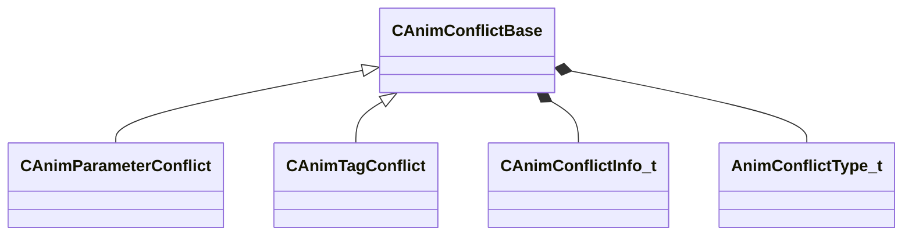

[Schemas](../../schemas.md) / [animgraphdoclib](../animgraphdoclib.md) / CAnimConflictBase

# CAnimConflictBase

**Kind:** class · **Size:** 112 bytes (`0x70`) · **Align:** 255 · **Module:** animgraphdoclib

**Derived by:** [CAnimParameterConflict](../animgraphdoclib/CAnimParameterConflict.md), [CAnimTagConflict](../animgraphdoclib/CAnimTagConflict.md)

**Relationships:**

## Memory layout

4 fields (4 declared here, 0 inherited). Offsets are absolute from the object base.

| Offset | Field | Type | From | Annotations |
|--------|-------|------|------|-------------|
| `0x18` | `m_sConflictDesc` | CUtlString |  |  |
| `0x20` | `m_nResolveIdx` | int32 |  |  |
| `0x28` | `m_conflictData` | [CAnimConflictInfo_t](../animgraphdoclib/CAnimConflictInfo_t.md)[2] |  |  |
| `0x68` | `m_eConflictType` | [AnimConflictType_t](../!GlobalTypes/AnimConflictType_t.md) |  |  |
