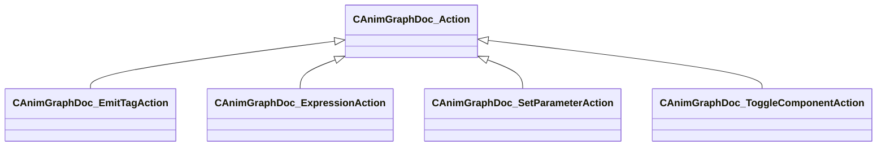

[Schemas](../../schemas.md) / [animgraphdoclib](../animgraphdoclib.md) / CAnimGraphDoc_Action

# CAnimGraphDoc_Action

**Kind:** class · **Size:** 40 bytes (`0x28`) · **Align:** 255 · **Module:** animgraphdoclib

**Derived by:** [CAnimGraphDoc_EmitTagAction](../animgraphdoclib/CAnimGraphDoc_EmitTagAction.md), [CAnimGraphDoc_ExpressionAction](../animgraphdoclib/CAnimGraphDoc_ExpressionAction.md), [CAnimGraphDoc_SetParameterAction](../animgraphdoclib/CAnimGraphDoc_SetParameterAction.md), [CAnimGraphDoc_ToggleComponentAction](../animgraphdoclib/CAnimGraphDoc_ToggleComponentAction.md)

**Relationships:**

