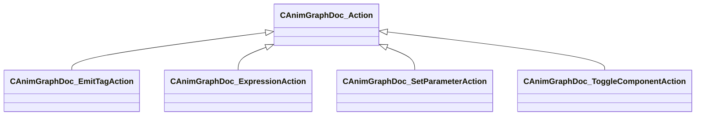

[Schemas](../../schemas.md) / [animgraphdoclib](../animgraphdoclib.md) / CAnimGraphDoc_Action

# CAnimGraphDoc_Action

> Source: **Build 25000182** · 2026-08-28 · `windows-x86_64` · schema `0.10.0`

**Kind:** class · **Size:** 40 bytes (`0x28`) · **Align:** n/a (unspecified) · **Module:** animgraphdoclib

**Derived by:** [CAnimGraphDoc_EmitTagAction](../animgraphdoclib/CAnimGraphDoc_EmitTagAction.md), [CAnimGraphDoc_ExpressionAction](../animgraphdoclib/CAnimGraphDoc_ExpressionAction.md), [CAnimGraphDoc_SetParameterAction](../animgraphdoclib/CAnimGraphDoc_SetParameterAction.md), [CAnimGraphDoc_ToggleComponentAction](../animgraphdoclib/CAnimGraphDoc_ToggleComponentAction.md)

**Relationships:**

## Memory layout

No schema-visible fields (40 bytes of opaque storage).
