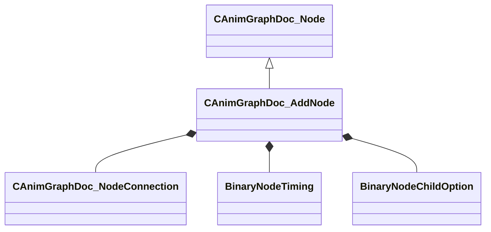

[Schemas](../../schemas.md) / [animgraphdoclib](../animgraphdoclib.md) / CAnimGraphDoc_AddNode

# CAnimGraphDoc_AddNode

**Kind:** class · **Size:** 104 bytes (`0x68`) · **Align:** 8 · **Module:** animgraphdoclib

**Inherits from:** [CAnimGraphDoc_Node](../animgraphdoclib/CAnimGraphDoc_Node.md)

**Metadata:** `MPropertyFriendlyName Add`

**Relationships:**

## Memory layout

16 fields (11 declared here, 5 inherited). Offsets are absolute from the object base.

| Offset | Field | Type | From | Annotations |
|--------|-------|------|------|-------------|
| `0x20` | `m_sName` | CUtlString | [CAnimGraphDoc_Node](../animgraphdoclib/CAnimGraphDoc_Node.md) | `MPropertyFriendlyName Name` `MPropertySortPriority 100` |
| `0x28` | `m_vecPosition` | Vector2D | [CAnimGraphDoc_Node](../animgraphdoclib/CAnimGraphDoc_Node.md) | `MPropertyGroupName Debug` `MPropertySortPriority -100` |
| `0x30` | `m_nNodeID` | [AnimNodeID](../modellib/AnimNodeID.md) | [CAnimGraphDoc_Node](../animgraphdoclib/CAnimGraphDoc_Node.md) | `MPropertyGroupName Debug` `MPropertySortPriority -100` |
| `0x34` | `m_bDebugThisNode` | bool | [CAnimGraphDoc_Node](../animgraphdoclib/CAnimGraphDoc_Node.md) | `MPropertyFriendlyName Debug This Node` `MPropertyGroupName Debug` `MPropertySortPriority -100` |
| `0x38` | `m_networkMode` | [AnimNodeNetworkMode](../!GlobalTypes/AnimNodeNetworkMode.md) | [CAnimGraphDoc_Node](../animgraphdoclib/CAnimGraphDoc_Node.md) | `MPropertyFriendlyName Network Mode` `MPropertySortPriority -110` |
| `0x40` | `m_baseInput` | [CAnimGraphDoc_NodeConnection](../animgraphdoclib/CAnimGraphDoc_NodeConnection.md) |  | `MPropertySuppressField` |
| `0x48` | `m_additiveInput` | [CAnimGraphDoc_NodeConnection](../animgraphdoclib/CAnimGraphDoc_NodeConnection.md) |  | `MPropertySuppressField` |
| `0x50` | `m_timingBehavior` | [BinaryNodeTiming](../!GlobalTypes/BinaryNodeTiming.md) |  | `MPropertyAutoRebuildOnChange` `MPropertyFriendlyName Timing Control` |
| `0x54` | `m_flTimingBlend` | float32 |  | `MPropertyAttrStateCallback` `MPropertyAttributeRange 0 1` `MPropertyFriendlyName Timing Blend` |
| `0x58` | `m_footMotionTiming` | [BinaryNodeChildOption](../!GlobalTypes/BinaryNodeChildOption.md) |  | `MPropertyFriendlyName Foot Motion Timing` |
| `0x5c` | `m_bApplyToFootMotion` | bool |  | `MPropertyFriendlyName Add Foot Motion` |
| `0x5d` | `m_bResetBase` | bool |  | `MPropertyFriendlyName Reset Base Child` |
| `0x5e` | `m_bResetAdditive` | bool |  | `MPropertyFriendlyName Reset Additive Child` |
| `0x5f` | `m_bApplyChannelsSeparately` | bool |  | `MPropertyFriendlyName Treat Translation Separately` |
| `0x60` | `m_bUseModelSpace` | bool |  | `MPropertyFriendlyName Use Model Space` |
| `0x61` | `m_bApplyScale` | bool |  | `MPropertyDescription Apply Scale Channels During Add.  Requires Treat Translation Separately.` `MPropertyFriendlyName Apply Scale` |

KV3 class defaults

<pre>{
	&quot;_class&quot;: &quot;CAnimGraphDoc_AddNode&quot;,
	&quot;m_sName&quot;: &quot;Unnamed&quot;,
	&quot;m_vecPosition&quot;:
	[
		0.000000,
		0.000000
	],
	&quot;m_nNodeID&quot;:
	{
		&quot;m_id&quot;: &lt;HIDDEN FOR DIFF&gt;,
	},
	&quot;m_bDebugThisNode&quot;: false,
	&quot;m_networkMode&quot;: &quot;ServerAuthoritative&quot;,
	&quot;m_baseInput&quot;:
	{
		&quot;m_nodeID&quot;:
		{
			&quot;m_id&quot;: &lt;HIDDEN FOR DIFF&gt;,
		},
		&quot;m_outputID&quot;:
		{
			&quot;m_id&quot;: &lt;HIDDEN FOR DIFF&gt;,
		}
	},
	&quot;m_additiveInput&quot;:
	{
		&quot;m_nodeID&quot;:
		{
			&quot;m_id&quot;: &lt;HIDDEN FOR DIFF&gt;,
		},
		&quot;m_outputID&quot;:
		{
			&quot;m_id&quot;: &lt;HIDDEN FOR DIFF&gt;,
		}
	},
	&quot;m_timingBehavior&quot;: &quot;UseChild2&quot;,
	&quot;m_flTimingBlend&quot;: 0.500000,
	&quot;m_footMotionTiming&quot;: &quot;Child1&quot;,
	&quot;m_bApplyToFootMotion&quot;: true,
	&quot;m_bResetBase&quot;: true,
	&quot;m_bResetAdditive&quot;: true,
	&quot;m_bApplyChannelsSeparately&quot;: true,
	&quot;m_bUseModelSpace&quot;: false,
	&quot;m_bApplyScale&quot;: false
}</pre>

