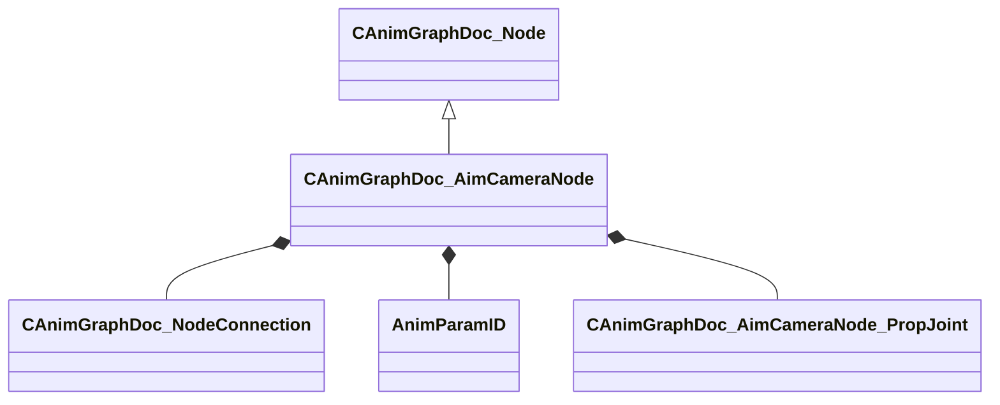

[Schemas](../../schemas.md) / [animgraphdoclib](../animgraphdoclib.md) / CAnimGraphDoc_AimCameraNode

# CAnimGraphDoc_AimCameraNode

**Kind:** class · **Size:** 176 bytes (`0xb0`) · **Align:** 8 · **Module:** animgraphdoclib

**Inherits from:** [CAnimGraphDoc_Node](../animgraphdoclib/CAnimGraphDoc_Node.md)

**Metadata:** `MPropertyFriendlyName Aim Camera`

**Relationships:**

## Memory layout

20 fields (15 declared here, 5 inherited). Offsets are absolute from the object base.

| Offset | Field | Type | From | Annotations |
|--------|-------|------|------|-------------|
| `0x20` | `m_sName` | CUtlString | [CAnimGraphDoc_Node](../animgraphdoclib/CAnimGraphDoc_Node.md) | `MPropertyFriendlyName Name` `MPropertySortPriority 100` |
| `0x28` | `m_vecPosition` | Vector2D | [CAnimGraphDoc_Node](../animgraphdoclib/CAnimGraphDoc_Node.md) | `MPropertyGroupName Debug` `MPropertySortPriority -100` |
| `0x30` | `m_nNodeID` | [AnimNodeID](../modellib/AnimNodeID.md) | [CAnimGraphDoc_Node](../animgraphdoclib/CAnimGraphDoc_Node.md) | `MPropertyGroupName Debug` `MPropertySortPriority -100` |
| `0x34` | `m_bDebugThisNode` | bool | [CAnimGraphDoc_Node](../animgraphdoclib/CAnimGraphDoc_Node.md) | `MPropertyFriendlyName Debug This Node` `MPropertyGroupName Debug` `MPropertySortPriority -100` |
| `0x38` | `m_networkMode` | [AnimNodeNetworkMode](../animgraphlib/AnimNodeNetworkMode.md) | [CAnimGraphDoc_Node](../animgraphdoclib/CAnimGraphDoc_Node.md) | `MPropertyFriendlyName Network Mode` `MPropertySortPriority -110` |
| `0x40` | `m_inputConnection` | [CAnimGraphDoc_NodeConnection](../animgraphdoclib/CAnimGraphDoc_NodeConnection.md) |  | `MPropertySuppressField` |
| `0x48` | `m_ikChain` | CUtlString |  | `MPropertyAttributeChoiceName IKChain` `MPropertyFriendlyName Spine IK Chain` |
| `0x50` | `m_cameraJointName` | CUtlString |  | `MPropertyAttributeChoiceName Bone` `MPropertyFriendlyName Camera Joint` |
| `0x58` | `m_pelvisJointName` | CUtlString |  | `MPropertyAttributeChoiceName Bone` `MPropertyFriendlyName Pelvis Joint` |
| `0x60` | `m_clavicleLeftJointName` | CUtlString |  | `MPropertyAttributeChoiceName Bone` `MPropertyFriendlyName Clavicle Left Joint` |
| `0x68` | `m_clavicleRightJointName` | CUtlString |  | `MPropertyAttributeChoiceName Bone` `MPropertyFriendlyName Clavicle Right Joint` |
| `0x70` | `m_parameterNamePosition` | [AnimParamID](../modellib/AnimParamID.md) |  | `MPropertyAttributeChoiceName VectorParameter` `MPropertyFriendlyName Animgraph Position Parameter` |
| `0x74` | `m_parameterNameOrientation` | [AnimParamID](../modellib/AnimParamID.md) |  | `MPropertyAttributeChoiceName QuaternionParameter` `MPropertyFriendlyName Orientation Parameter` |
| `0x78` | `m_parameterNamePelvisOffset` | [AnimParamID](../modellib/AnimParamID.md) |  | `MPropertyAttributeChoiceName FloatParameter` `MPropertyFriendlyName Pelvis Offset Parameter` |
| `0x7c` | `m_parameterCameraOnly` | [AnimParamID](../modellib/AnimParamID.md) |  | `MPropertyAttributeChoiceName BoolParameter` `MPropertyFriendlyName Camera Only Parameter` |
| `0x80` | `m_parameterCameraClearanceDistance` | [AnimParamID](../modellib/AnimParamID.md) |  | `MPropertyAttributeChoiceName FloatParameter` `MPropertyFriendlyName Clearance Distance` |
| `0x84` | `m_parameterWeaponDepenetrationDistance` | [AnimParamID](../modellib/AnimParamID.md) |  | `MPropertyAttributeChoiceName FloatParameter` `MPropertyFriendlyName Weapon De-Penetration Distance` |
| `0x88` | `m_parameterWeaponDepenetrationDelta` | [AnimParamID](../modellib/AnimParamID.md) |  | `MPropertyAttributeChoiceName VectorParameter` `MPropertyFriendlyName Weapon De-Penetration Delta` |
| `0x90` | `m_depenetrationJointName` | CUtlString |  | `MPropertyAttributeChoiceName Bone` `MPropertyFriendlyName Depenetration Joint` |
| `0x98` | `m_propJoints` | CUtlVector< [CAnimGraphDoc_AimCameraNode_PropJoint](../animgraphdoclib/CAnimGraphDoc_AimCameraNode_PropJoint.md) > |  | `MPropertyDescription These joints will maintain their offset relative to the camera joint.` `MPropertyFriendlyName Prop Joints` |

KV3 class defaults

<pre>{
	&quot;_class&quot;: &quot;CAnimGraphDoc_AimCameraNode&quot;,
	&quot;m_sName&quot;: &quot;Unnamed&quot;,
	&quot;m_vecPosition&quot;:
	[
		0.000000,
		0.000000
	],
	&quot;m_nNodeID&quot;:
	{
		&quot;m_id&quot;: &lt;HIDDEN FOR DIFF&gt;,
	},
	&quot;m_bDebugThisNode&quot;: false,
	&quot;m_networkMode&quot;: &quot;ServerAuthoritative&quot;,
	&quot;m_inputConnection&quot;:
	{
		&quot;m_nodeID&quot;:
		{
			&quot;m_id&quot;: &lt;HIDDEN FOR DIFF&gt;,
		},
		&quot;m_outputID&quot;:
		{
			&quot;m_id&quot;: &lt;HIDDEN FOR DIFF&gt;,
		}
	},
	&quot;m_ikChain&quot;: &quot;&quot;,
	&quot;m_cameraJointName&quot;: &quot;&quot;,
	&quot;m_pelvisJointName&quot;: &quot;&quot;,
	&quot;m_clavicleLeftJointName&quot;: &quot;&quot;,
	&quot;m_clavicleRightJointName&quot;: &quot;&quot;,
	&quot;m_parameterNamePosition&quot;:
	{
		&quot;m_id&quot;: &lt;HIDDEN FOR DIFF&gt;,
	},
	&quot;m_parameterNameOrientation&quot;:
	{
		&quot;m_id&quot;: &lt;HIDDEN FOR DIFF&gt;,
	},
	&quot;m_parameterNamePelvisOffset&quot;:
	{
		&quot;m_id&quot;: &lt;HIDDEN FOR DIFF&gt;,
	},
	&quot;m_parameterCameraOnly&quot;:
	{
		&quot;m_id&quot;: &lt;HIDDEN FOR DIFF&gt;,
	},
	&quot;m_parameterCameraClearanceDistance&quot;:
	{
		&quot;m_id&quot;: &lt;HIDDEN FOR DIFF&gt;,
	},
	&quot;m_parameterWeaponDepenetrationDistance&quot;:
	{
		&quot;m_id&quot;: &lt;HIDDEN FOR DIFF&gt;,
	},
	&quot;m_parameterWeaponDepenetrationDelta&quot;:
	{
		&quot;m_id&quot;: &lt;HIDDEN FOR DIFF&gt;,
	},
	&quot;m_depenetrationJointName&quot;: &quot;&quot;,
	&quot;m_propJoints&quot;:
	[
	]
}</pre>

