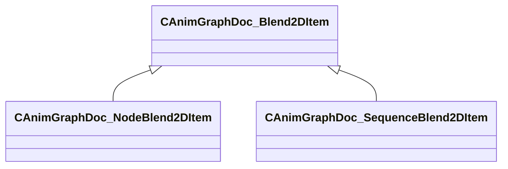

[Schemas](../../schemas.md) / [animgraphdoclib](../animgraphdoclib.md) / CAnimGraphDoc_Blend2DItem

# CAnimGraphDoc_Blend2DItem

> Source: **Build 25000182** · 2026-08-28 · `windows-x86_64` · schema `0.10.0`

**Kind:** class · **Size:** 48 bytes (`0x30`) · **Align:** n/a (unspecified) · **Module:** animgraphdoclib

**Derived by:** [CAnimGraphDoc_NodeBlend2DItem](../animgraphdoclib/CAnimGraphDoc_NodeBlend2DItem.md), [CAnimGraphDoc_SequenceBlend2DItem](../animgraphdoclib/CAnimGraphDoc_SequenceBlend2DItem.md)

**Metadata:** `MPropertyFriendlyName Blend Item`

**Relationships:**

## Memory layout

3 fields (3 declared here, 0 inherited). Offsets are absolute from the object base.

| Offset | Field | Type | From | Annotations |
|--------|-------|------|------|-------------|
| `0x18` | `m_blendValue` | Vector2D |  | `MPropertyFriendlyName Blend Value` |
| `0x28` | `m_bUseCustomDuration` | bool |  | `MPropertyAutoRebuildOnChange` `MPropertyFriendlyName Use Custom Duration` `MPropertyGroupName +Duration Override` |
| `0x2c` | `m_flCustomDuration` | float32 |  | `MPropertyAttrStateCallback` `MPropertyFriendlyName Custom Duration` `MPropertyGroupName +Duration Override` |
