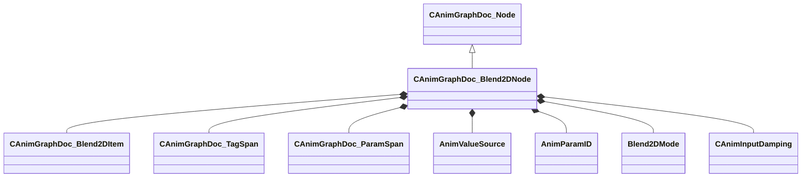

[Schemas](../../schemas.md) / [animgraphdoclib](../animgraphdoclib.md) / CAnimGraphDoc_Blend2DNode

# CAnimGraphDoc_Blend2DNode

**Kind:** class · **Size:** 240 bytes (`0xf0`) · **Align:** 8 · **Module:** animgraphdoclib

**Inherits from:** [CAnimGraphDoc_Node](../animgraphdoclib/CAnimGraphDoc_Node.md)

**Metadata:** `MPropertyFriendlyName Blend 2D`

**Relationships:**

## Memory layout

21 fields (16 declared here, 5 inherited). Offsets are absolute from the object base.

| Offset | Field | Type | From | Annotations |
|--------|-------|------|------|-------------|
| `0x20` | `m_sName` | CUtlString | [CAnimGraphDoc_Node](../animgraphdoclib/CAnimGraphDoc_Node.md) | `MPropertyFriendlyName Name` `MPropertySortPriority 100` |
| `0x28` | `m_vecPosition` | Vector2D | [CAnimGraphDoc_Node](../animgraphdoclib/CAnimGraphDoc_Node.md) | `MPropertyGroupName Debug` `MPropertySortPriority -100` |
| `0x30` | `m_nNodeID` | [AnimNodeID](../modellib/AnimNodeID.md) | [CAnimGraphDoc_Node](../animgraphdoclib/CAnimGraphDoc_Node.md) | `MPropertyGroupName Debug` `MPropertySortPriority -100` |
| `0x34` | `m_bDebugThisNode` | bool | [CAnimGraphDoc_Node](../animgraphdoclib/CAnimGraphDoc_Node.md) | `MPropertyFriendlyName Debug This Node` `MPropertyGroupName Debug` `MPropertySortPriority -100` |
| `0x38` | `m_networkMode` | [AnimNodeNetworkMode](../animgraphlib/AnimNodeNetworkMode.md) | [CAnimGraphDoc_Node](../animgraphdoclib/CAnimGraphDoc_Node.md) | `MPropertyFriendlyName Network Mode` `MPropertySortPriority -110` |
| `0x58` | `m_items` | CUtlVector< CSmartPtr< [CAnimGraphDoc_Blend2DItem](../animgraphdoclib/CAnimGraphDoc_Blend2DItem.md) > > |  | `MPropertySuppressField` |
| `0x70` | `m_tagSpans` | CUtlVector< CSmartPtr< [CAnimGraphDoc_TagSpan](../animgraphdoclib/CAnimGraphDoc_TagSpan.md) > > |  | `MPropertySuppressField` |
| `0x88` | `m_paramSpans` | CUtlVector< CSmartPtr< [CAnimGraphDoc_ParamSpan](../animgraphdoclib/CAnimGraphDoc_ParamSpan.md) > > |  | `MPropertySuppressField` |
| `0xa0` | `m_blendSourceX` | [AnimValueSource](../animgraphlib/AnimValueSource.md) |  | `MPropertyAttrStateCallback` `MPropertyAutoRebuildOnChange` `MPropertyFriendlyName Horizontal Axis` |
| `0xa8` | `m_paramNameX` | CUtlString |  | `MPropertySuppressField` |
| `0xb0` | `m_paramX` | [AnimParamID](../modellib/AnimParamID.md) |  | `MPropertyAttributeChoiceName FloatParameter` `MPropertyFriendlyName Horizontal Parameter` |
| `0xb4` | `m_blendSourceY` | [AnimValueSource](../animgraphlib/AnimValueSource.md) |  | `MPropertyAttrStateCallback` `MPropertyAutoRebuildOnChange` `MPropertyFriendlyName Vertical Axis` |
| `0xb8` | `m_paramNameY` | CUtlString |  | `MPropertySuppressField` |
| `0xc0` | `m_paramY` | [AnimParamID](../modellib/AnimParamID.md) |  | `MPropertyAttributeChoiceName FloatParameter` `MPropertyFriendlyName Vertical Parameter` |
| `0xc4` | `m_eBlendMode` | [Blend2DMode](../animgraphlib/Blend2DMode.md) |  | `MPropertyFriendlyName Blend Mode` |
| `0xc8` | `m_bLoop` | bool |  | `MPropertyFriendlyName Loop` |
| `0xc9` | `m_bLockBlendOnReset` | bool |  | `MPropertyFriendlyName Lock Blend on Reset` |
| `0xca` | `m_bLockWhenWaning` | bool |  | `MPropertyFriendlyName Lock Blend When Waning` |
| `0xcc` | `m_playbackSpeed` | float32 |  | `MPropertyFriendlyName Playback Speed` |
| `0xd0` | `m_damping` | [CAnimInputDamping](../animgraphlib/CAnimInputDamping.md) |  | `MPropertyFriendlyName Damping` |
| `0xe8` | `m_bAnimEventsAndTagsOnMostWeightedOnly` | bool |  | `MPropertyFriendlyName AnimEvents and Tags Exclusive To Most Weighted` |

KV3 class defaults

<pre>{
	&quot;_class&quot;: &quot;CAnimGraphDoc_Blend2DNode&quot;,
	&quot;m_sName&quot;: &quot;Unnamed&quot;,
	&quot;m_vecPosition&quot;:
	[
		0.000000,
		0.000000
	],
	&quot;m_nNodeID&quot;:
	{
		&quot;m_id&quot;: &lt;HIDDEN FOR DIFF&gt;,
	},
	&quot;m_bDebugThisNode&quot;: false,
	&quot;m_networkMode&quot;: &quot;ServerAuthoritative&quot;,
	&quot;m_items&quot;:
	[
	],
	&quot;m_tagSpans&quot;:
	[
	],
	&quot;m_paramSpans&quot;:
	[
	],
	&quot;m_blendSourceX&quot;: &quot;Parameter&quot;,
	&quot;m_paramNameX&quot;: &quot;&quot;,
	&quot;m_paramX&quot;:
	{
		&quot;m_id&quot;: &lt;HIDDEN FOR DIFF&gt;,
	},
	&quot;m_blendSourceY&quot;: &quot;Parameter&quot;,
	&quot;m_paramNameY&quot;: &quot;&quot;,
	&quot;m_paramY&quot;:
	{
		&quot;m_id&quot;: &lt;HIDDEN FOR DIFF&gt;,
	},
	&quot;m_eBlendMode&quot;: &quot;Blend2DMode_General&quot;,
	&quot;m_bLoop&quot;: true,
	&quot;m_bLockBlendOnReset&quot;: false,
	&quot;m_bLockWhenWaning&quot;: true,
	&quot;m_playbackSpeed&quot;: 1.000000,
	&quot;m_damping&quot;:
	{
		&quot;_class&quot;: &quot;CAnimInputDamping&quot;,
		&quot;m_speedFunction&quot;: &quot;NoDamping&quot;,
		&quot;m_fSpeedScale&quot;: 1.000000,
		&quot;m_fFallingSpeedScale&quot;: 1.000000
	},
	&quot;m_bAnimEventsAndTagsOnMostWeightedOnly&quot;: false
}</pre>

