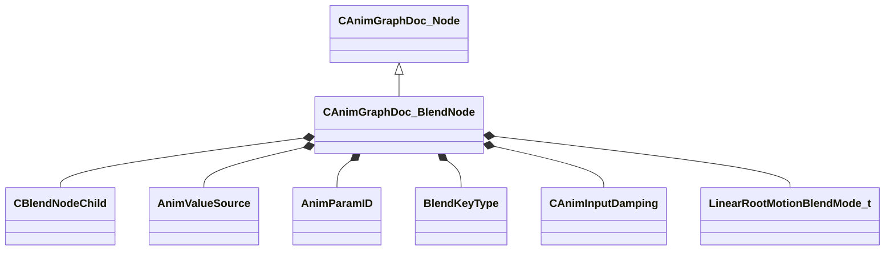

[Schemas](../../schemas.md) / [animgraphdoclib](../animgraphdoclib.md) / CAnimGraphDoc_BlendNode

# CAnimGraphDoc_BlendNode

> Source: **Build 25000182** · 2026-08-28 · `windows-x86_64` · schema `0.10.0`

**Kind:** class · **Size:** 168 bytes (`0xa8`) · **Align:** 8 · **Module:** animgraphdoclib

**Inherits from:** [CAnimGraphDoc_Node](../animgraphdoclib/CAnimGraphDoc_Node.md)

**Metadata:** `MPropertyFriendlyName Blend 1D`

**Relationships:**

## Memory layout

17 fields (12 declared here, 5 inherited). Offsets are absolute from the object base.

| Offset | Field | Type | From | Annotations |
|--------|-------|------|------|-------------|
| `0x20` | `m_sName` | CUtlString | [CAnimGraphDoc_Node](../animgraphdoclib/CAnimGraphDoc_Node.md) | `MPropertyFriendlyName Name` `MPropertySortPriority 100` |
| `0x28` | `m_vecPosition` | Vector2D | [CAnimGraphDoc_Node](../animgraphdoclib/CAnimGraphDoc_Node.md) | `MPropertyGroupName Debug` `MPropertySortPriority -100` |
| `0x30` | `m_nNodeID` | [AnimNodeID](../modellib/AnimNodeID.md) | [CAnimGraphDoc_Node](../animgraphdoclib/CAnimGraphDoc_Node.md) | `MPropertyGroupName Debug` `MPropertySortPriority -100` |
| `0x34` | `m_bDebugThisNode` | bool | [CAnimGraphDoc_Node](../animgraphdoclib/CAnimGraphDoc_Node.md) | `MPropertyFriendlyName Debug This Node` `MPropertyGroupName Debug` `MPropertySortPriority -100` |
| `0x38` | `m_networkMode` | [AnimNodeNetworkMode](../animgraphlib/AnimNodeNetworkMode.md) | [CAnimGraphDoc_Node](../animgraphdoclib/CAnimGraphDoc_Node.md) | `MPropertyFriendlyName Network Mode` `MPropertySortPriority -110` |
| `0x50` | `m_children` | CUtlVector< [CBlendNodeChild](../animgraphdoclib/CBlendNodeChild.md) > |  | `MPropertyAutoExpandSelf` `MPropertyFriendlyName Blend Items` |
| `0x68` | `m_blendValueSource` | [AnimValueSource](../animgraphlib/AnimValueSource.md) |  | `MPropertyAttrStateCallback` `MPropertyFriendlyName Blend Source` |
| `0x70` | `m_paramName` | CUtlString |  | `MPropertySuppressField` |
| `0x78` | `m_param` | [AnimParamID](../modellib/AnimParamID.md) |  | `MPropertyAttributeChoiceName FloatParameter` `MPropertyFriendlyName Parameter` |
| `0x7c` | `m_blendKeyType` | [BlendKeyType](../animgraphlib/BlendKeyType.md) |  | `MPropertyFriendlyName Blend Key Values` |
| `0x80` | `m_bLockBlendOnReset` | bool |  | `MPropertyFriendlyName Lock Blend on Reset` |
| `0x81` | `m_bSyncCycles` | bool |  | `MPropertyFriendlyName Sync Cycles` |
| `0x82` | `m_bLoop` | bool |  | `MPropertyFriendlyName Loop` |
| `0x83` | `m_bLockWhenWaning` | bool |  | `MPropertyFriendlyName Lock Blend When Waning` |
| `0x84` | `m_bIsAngle` | bool |  | `MPropertyFriendlyName Is Angle` |
| `0x88` | `m_damping` | [CAnimInputDamping](../animgraphlib/CAnimInputDamping.md) |  | `MPropertyFriendlyName Damping` |
| `0xa0` | `m_eLinearRootMotionBlendMode` | [LinearRootMotionBlendMode_t](../animgraphlib/LinearRootMotionBlendMode_t.md) |  | `MPropertyFriendlyName Linear Root Motion Blend Mode` |

KV3 class defaults

<pre>{
	&quot;_class&quot;: &quot;CAnimGraphDoc_BlendNode&quot;,
	&quot;m_sName&quot;: &quot;Unnamed&quot;,
	&quot;m_vecPosition&quot;:
	[
		0.000000,
		0.000000
	],
	&quot;m_nNodeID&quot;:
	{
		&quot;m_id&quot;: &lt;HIDDEN FOR DIFF&gt;,
	},
	&quot;m_bDebugThisNode&quot;: false,
	&quot;m_networkMode&quot;: &quot;ServerAuthoritative&quot;,
	&quot;m_children&quot;:
	[
	],
	&quot;m_blendValueSource&quot;: &quot;Parameter&quot;,
	&quot;m_paramName&quot;: &quot;&quot;,
	&quot;m_param&quot;:
	{
		&quot;m_id&quot;: &lt;HIDDEN FOR DIFF&gt;,
	},
	&quot;m_blendKeyType&quot;: &quot;BlendKey_UserValue&quot;,
	&quot;m_bLockBlendOnReset&quot;: false,
	&quot;m_bSyncCycles&quot;: true,
	&quot;m_bLoop&quot;: true,
	&quot;m_bLockWhenWaning&quot;: true,
	&quot;m_bIsAngle&quot;: false,
	&quot;m_damping&quot;:
	{
		&quot;_class&quot;: &quot;CAnimInputDamping&quot;,
		&quot;m_speedFunction&quot;: &quot;NoDamping&quot;,
		&quot;m_fSpeedScale&quot;: 1.000000,
		&quot;m_fFallingSpeedScale&quot;: 1.000000
	},
	&quot;m_eLinearRootMotionBlendMode&quot;: &quot;LERP&quot;
}</pre>

