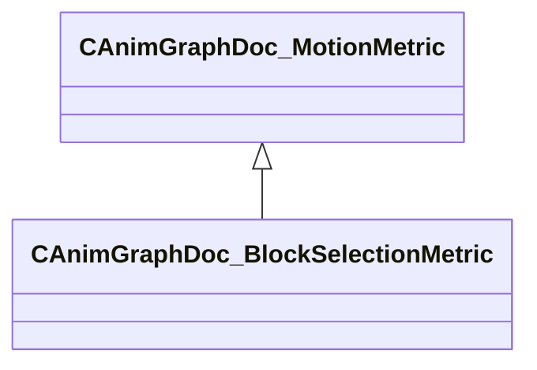

[Schemas](../../schemas.md) / [animgraphdoclib](../animgraphdoclib.md) / CAnimGraphDoc_BlockSelectionMetric

# CAnimGraphDoc_BlockSelectionMetric

**Kind:** class · **Size:** 40 bytes (`0x28`) · **Align:** 8 · **Module:** animgraphdoclib

**Inherits from:** [CAnimGraphDoc_MotionMetric](../animgraphdoclib/CAnimGraphDoc_MotionMetric.md)

**Metadata:** `MPropertyFriendlyName Block Selection Metric`

**Relationships:**

## Memory layout

1 fields (0 declared here, 1 inherited). Offsets are absolute from the object base.

| Offset | Field | Type | From | Annotations |
|--------|-------|------|------|-------------|
| `0x20` | `m_flWeight` | float32 | [CAnimGraphDoc_MotionMetric](../animgraphdoclib/CAnimGraphDoc_MotionMetric.md) | `MPropertySuppressField` |

KV3 class defaults

<pre>{
	&quot;_class&quot;: &quot;CAnimGraphDoc_BlockSelectionMetric&quot;,
	&quot;m_flWeight&quot;: 0.000000
}</pre>

