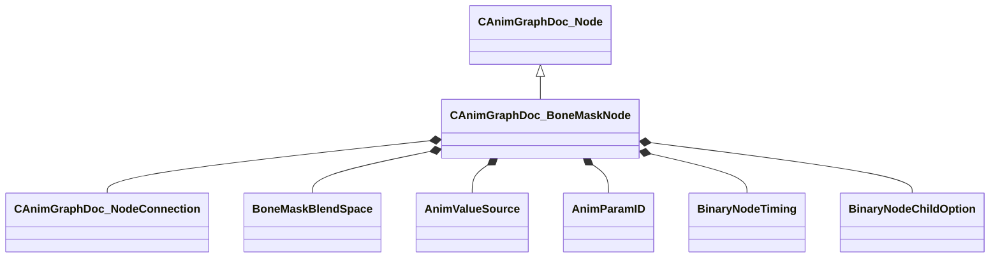

[Schemas](../../schemas.md) / [animgraphdoclib](../animgraphdoclib.md) / CAnimGraphDoc_BoneMaskNode

# CAnimGraphDoc_BoneMaskNode

> Source: **Build 25000182** · 2026-08-28 · `windows-x86_64` · schema `0.10.0`

**Kind:** class · **Size:** 136 bytes (`0x88`) · **Align:** 8 · **Module:** animgraphdoclib

**Inherits from:** [CAnimGraphDoc_Node](../animgraphdoclib/CAnimGraphDoc_Node.md)

**Metadata:** `MPropertyFriendlyName Bone Mask`

**Relationships:**

## Memory layout

19 fields (14 declared here, 5 inherited). Offsets are absolute from the object base.

| Offset | Field | Type | From | Annotations |
|--------|-------|------|------|-------------|
| `0x20` | `m_sName` | CUtlString | [CAnimGraphDoc_Node](../animgraphdoclib/CAnimGraphDoc_Node.md) | `MPropertyFriendlyName Name` `MPropertySortPriority 100` |
| `0x28` | `m_vecPosition` | Vector2D | [CAnimGraphDoc_Node](../animgraphdoclib/CAnimGraphDoc_Node.md) | `MPropertyGroupName Debug` `MPropertySortPriority -100` |
| `0x30` | `m_nNodeID` | [AnimNodeID](../modellib/AnimNodeID.md) | [CAnimGraphDoc_Node](../animgraphdoclib/CAnimGraphDoc_Node.md) | `MPropertyGroupName Debug` `MPropertySortPriority -100` |
| `0x34` | `m_bDebugThisNode` | bool | [CAnimGraphDoc_Node](../animgraphdoclib/CAnimGraphDoc_Node.md) | `MPropertyFriendlyName Debug This Node` `MPropertyGroupName Debug` `MPropertySortPriority -100` |
| `0x38` | `m_networkMode` | [AnimNodeNetworkMode](../animgraphlib/AnimNodeNetworkMode.md) | [CAnimGraphDoc_Node](../animgraphdoclib/CAnimGraphDoc_Node.md) | `MPropertyFriendlyName Network Mode` `MPropertySortPriority -110` |
| `0x40` | `m_weightListName` | CUtlString |  | `MPropertyAttributeChoiceName BoneMask` `MPropertyFriendlyName Bone Mask` |
| `0x48` | `m_inputConnection1` | [CAnimGraphDoc_NodeConnection](../animgraphdoclib/CAnimGraphDoc_NodeConnection.md) |  | `MPropertySuppressField` |
| `0x50` | `m_inputConnection2` | [CAnimGraphDoc_NodeConnection](../animgraphdoclib/CAnimGraphDoc_NodeConnection.md) |  | `MPropertySuppressField` |
| `0x58` | `m_blendSpace` | [BoneMaskBlendSpace](../animgraphlib/BoneMaskBlendSpace.md) |  | `MPropertyFriendlyName Blend Space` |
| `0x5c` | `m_bUseBlendScale` | bool |  | `MPropertyAutoRebuildOnChange` `MPropertyFriendlyName Use Blend Source` |
| `0x60` | `m_blendValueSource` | [AnimValueSource](../animgraphlib/AnimValueSource.md) |  | `MPropertyAttrStateCallback` `MPropertyAutoRebuildOnChange` `MPropertyFriendlyName Blend Source` |
| `0x68` | `m_blendParameterName` | CUtlString |  | `MPropertySuppressField` |
| `0x70` | `m_blendParameter` | [AnimParamID](../modellib/AnimParamID.md) |  | `MPropertyAttrStateCallback` `MPropertyAttributeChoiceName FloatParameter` `MPropertyFriendlyName Blend Parameter` |
| `0x74` | `m_timingBehavior` | [BinaryNodeTiming](../animgraphlib/BinaryNodeTiming.md) |  | `MPropertyAutoRebuildOnChange` `MPropertyFriendlyName Timing Control` |
| `0x78` | `m_flTimingBlend` | float32 |  | `MPropertyAttrStateCallback` `MPropertyAttributeRange 0 1` `MPropertyFriendlyName Timing Blend` |
| `0x7c` | `m_flRootMotionBlend` | float32 |  | `MPropertyAttributeRange 0 1` `MPropertyFriendlyName Root Motion Blend` |
| `0x80` | `m_footMotionTiming` | [BinaryNodeChildOption](../animgraphlib/BinaryNodeChildOption.md) |  | `MPropertyFriendlyName Foot Motion Timing` |
| `0x84` | `m_bResetChild1` | bool |  | `MPropertyFriendlyName Reset Child1` |
| `0x85` | `m_bResetChild2` | bool |  | `MPropertyFriendlyName Reset Child2` |

KV3 class defaults

<pre>{
	&quot;_class&quot;: &quot;CAnimGraphDoc_BoneMaskNode&quot;,
	&quot;m_sName&quot;: &quot;Unnamed&quot;,
	&quot;m_vecPosition&quot;:
	[
		0.000000,
		0.000000
	],
	&quot;m_nNodeID&quot;:
	{
		&quot;m_id&quot;: &lt;HIDDEN FOR DIFF&gt;,
	},
	&quot;m_bDebugThisNode&quot;: false,
	&quot;m_networkMode&quot;: &quot;ServerAuthoritative&quot;,
	&quot;m_weightListName&quot;: &quot;&quot;,
	&quot;m_inputConnection1&quot;:
	{
		&quot;m_nodeID&quot;:
		{
			&quot;m_id&quot;: &lt;HIDDEN FOR DIFF&gt;,
		},
		&quot;m_outputID&quot;:
		{
			&quot;m_id&quot;: &lt;HIDDEN FOR DIFF&gt;,
		}
	},
	&quot;m_inputConnection2&quot;:
	{
		&quot;m_nodeID&quot;:
		{
			&quot;m_id&quot;: &lt;HIDDEN FOR DIFF&gt;,
		},
		&quot;m_outputID&quot;:
		{
			&quot;m_id&quot;: &lt;HIDDEN FOR DIFF&gt;,
		}
	},
	&quot;m_blendSpace&quot;: &quot;BlendSpace_Parent&quot;,
	&quot;m_bUseBlendScale&quot;: false,
	&quot;m_blendValueSource&quot;: &quot;Parameter&quot;,
	&quot;m_blendParameterName&quot;: &quot;&quot;,
	&quot;m_blendParameter&quot;:
	{
		&quot;m_id&quot;: &lt;HIDDEN FOR DIFF&gt;,
	},
	&quot;m_timingBehavior&quot;: &quot;UseChild2&quot;,
	&quot;m_flTimingBlend&quot;: 0.500000,
	&quot;m_flRootMotionBlend&quot;: 0.000000,
	&quot;m_footMotionTiming&quot;: &quot;Child1&quot;,
	&quot;m_bResetChild1&quot;: true,
	&quot;m_bResetChild2&quot;: true
}</pre>

