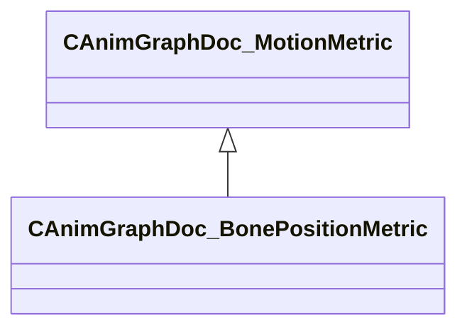

[Schemas](../../schemas.md) / [animgraphdoclib](../animgraphdoclib.md) / CAnimGraphDoc_BonePositionMetric

# CAnimGraphDoc_BonePositionMetric

> Source: **Build 25000182** · 2026-08-28 · `windows-x86_64` · schema `0.10.0`

**Kind:** class · **Size:** 48 bytes (`0x30`) · **Align:** 8 · **Module:** animgraphdoclib

**Inherits from:** [CAnimGraphDoc_MotionMetric](../animgraphdoclib/CAnimGraphDoc_MotionMetric.md)

**Metadata:** `MPropertyFriendlyName Bone Position Metric`

**Relationships:**

## Memory layout

2 fields (1 declared here, 1 inherited). Offsets are absolute from the object base.

| Offset | Field | Type | From | Annotations |
|--------|-------|------|------|-------------|
| `0x20` | `m_flWeight` | float32 | [CAnimGraphDoc_MotionMetric](../animgraphdoclib/CAnimGraphDoc_MotionMetric.md) | `MPropertySuppressField` |
| `0x28` | `m_boneName` | CUtlString |  | `MPropertyAttributeChoiceName Bone` `MPropertyFriendlyName Bone` |

KV3 class defaults

<pre>{
	&quot;_class&quot;: &quot;CAnimGraphDoc_BonePositionMetric&quot;,
	&quot;m_flWeight&quot;: 1.000000,
	&quot;m_boneName&quot;: &quot;&quot;
}</pre>

