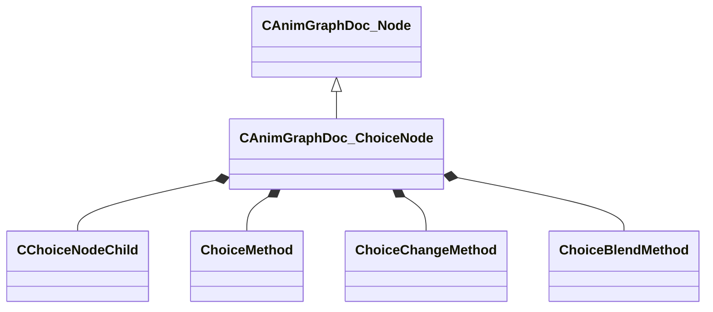

[Schemas](../../schemas.md) / [animgraphdoclib](../animgraphdoclib.md) / CAnimGraphDoc_ChoiceNode

# CAnimGraphDoc_ChoiceNode

> Source: **Build 25000182** · 2026-08-28 · `windows-x86_64` · schema `0.10.0`

**Kind:** class · **Size:** 112 bytes (`0x70`) · **Align:** 8 · **Module:** animgraphdoclib

**Inherits from:** [CAnimGraphDoc_Node](../animgraphdoclib/CAnimGraphDoc_Node.md)

**Metadata:** `MPropertyFriendlyName Choice`

**Relationships:**

## Memory layout

14 fields (9 declared here, 5 inherited). Offsets are absolute from the object base.

| Offset | Field | Type | From | Annotations |
|--------|-------|------|------|-------------|
| `0x20` | `m_sName` | CUtlString | [CAnimGraphDoc_Node](../animgraphdoclib/CAnimGraphDoc_Node.md) | `MPropertyFriendlyName Name` `MPropertySortPriority 100` |
| `0x28` | `m_vecPosition` | Vector2D | [CAnimGraphDoc_Node](../animgraphdoclib/CAnimGraphDoc_Node.md) | `MPropertyGroupName Debug` `MPropertySortPriority -100` |
| `0x30` | `m_nNodeID` | [AnimNodeID](../modellib/AnimNodeID.md) | [CAnimGraphDoc_Node](../animgraphdoclib/CAnimGraphDoc_Node.md) | `MPropertyGroupName Debug` `MPropertySortPriority -100` |
| `0x34` | `m_bDebugThisNode` | bool | [CAnimGraphDoc_Node](../animgraphdoclib/CAnimGraphDoc_Node.md) | `MPropertyFriendlyName Debug This Node` `MPropertyGroupName Debug` `MPropertySortPriority -100` |
| `0x38` | `m_networkMode` | [AnimNodeNetworkMode](../animgraphlib/AnimNodeNetworkMode.md) | [CAnimGraphDoc_Node](../animgraphdoclib/CAnimGraphDoc_Node.md) | `MPropertyFriendlyName Network Mode` `MPropertySortPriority -110` |
| `0x40` | `m_children` | CUtlVector< [CChoiceNodeChild](../animgraphdoclib/CChoiceNodeChild.md) > |  | `MPropertyAutoExpandSelf` `MPropertyFriendlyName Options` |
| `0x58` | `m_seed` | int32 |  | `MPropertySuppressField` |
| `0x5c` | `m_choiceMethod` | [ChoiceMethod](../animgraphlib/ChoiceMethod.md) |  | `MPropertyFriendlyName Method` |
| `0x60` | `m_choiceChangeMethod` | [ChoiceChangeMethod](../animgraphlib/ChoiceChangeMethod.md) |  | `MPropertyFriendlyName Change Selection` |
| `0x64` | `m_blendMethod` | [ChoiceBlendMethod](../animgraphlib/ChoiceBlendMethod.md) |  | `MPropertyAutoRebuildOnChange` `MPropertyFriendlyName Blend Method` `MPropertyGroupName Blending` |
| `0x68` | `m_blendTime` | float32 |  | `MPropertyAttrStateCallback` `MPropertyFriendlyName Blend Duration` `MPropertyGroupName Blending` |
| `0x6c` | `m_bCrossFade` | bool |  | `MPropertyFriendlyName Cross Fade` `MPropertyGroupName Blending` |
| `0x6d` | `m_bResetChosen` | bool |  | `MPropertyAutoRebuildOnChange` `MPropertyFriendlyName Reset On Selection` |
| `0x6e` | `m_bDontResetSameSelection` | bool |  | `MPropertyAttrStateCallback` `MPropertyFriendlyName Don't Reset Same Selection` |

KV3 class defaults

<pre>{
	&quot;_class&quot;: &quot;CAnimGraphDoc_ChoiceNode&quot;,
	&quot;m_sName&quot;: &quot;Unnamed&quot;,
	&quot;m_vecPosition&quot;:
	[
		0.000000,
		0.000000
	],
	&quot;m_nNodeID&quot;:
	{
		&quot;m_id&quot;: &lt;HIDDEN FOR DIFF&gt;,
	},
	&quot;m_bDebugThisNode&quot;: false,
	&quot;m_networkMode&quot;: &quot;ServerAuthoritative&quot;,
	&quot;m_children&quot;:
	[
	],
	&quot;m_seed&quot;: &lt;HIDDEN FOR DIFF&gt;,
	&quot;m_choiceMethod&quot;: &quot;WeightedRandom&quot;,
	&quot;m_choiceChangeMethod&quot;: &quot;OnReset&quot;,
	&quot;m_blendMethod&quot;: &quot;SingleBlendTime&quot;,
	&quot;m_blendTime&quot;: 0.200000,
	&quot;m_bCrossFade&quot;: false,
	&quot;m_bResetChosen&quot;: true,
	&quot;m_bDontResetSameSelection&quot;: false
}</pre>

