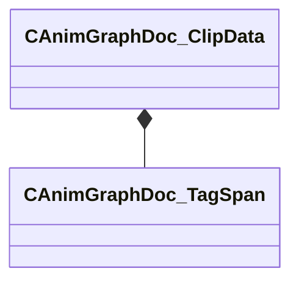

[Schemas](../../schemas.md) / [animgraphdoclib](../animgraphdoclib.md) / CAnimGraphDoc_ClipData

# CAnimGraphDoc_ClipData

**Kind:** class · **Size:** 72 bytes (`0x48`) · **Align:** 8 · **Module:** animgraphdoclib

**Metadata:** `MPropertyFriendlyName Clip Data`

**Relationships:**

## Memory layout

2 fields (2 declared here, 0 inherited). Offsets are absolute from the object base.

| Offset | Field | Type | From | Annotations |
|--------|-------|------|------|-------------|
| `0x20` | `m_tagSpans` | CUtlVector< CSmartPtr< [CAnimGraphDoc_TagSpan](../animgraphdoclib/CAnimGraphDoc_TagSpan.md) > > |  | `MPropertySuppressField` |
| `0x38` | `m_clipName` | CUtlString |  | `MPropertyAttributeChoiceName Sequence` `MPropertyFriendlyName Sequence` |

KV3 class defaults

<pre>{
	&quot;_class&quot;: &quot;CAnimGraphDoc_ClipData&quot;,
	&quot;m_tagSpans&quot;:
	[
	],
	&quot;m_clipName&quot;: &quot;&quot;
}</pre>

