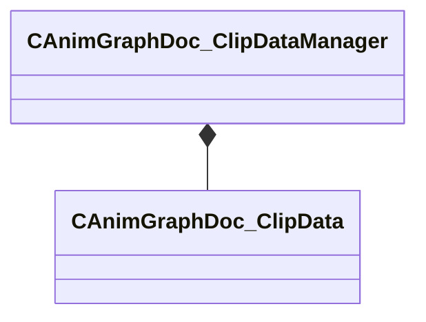

[Schemas](../../schemas.md) / [animgraphdoclib](../animgraphdoclib.md) / CAnimGraphDoc_ClipDataManager

# CAnimGraphDoc_ClipDataManager

> Source: **Build 25000182** · 2026-08-28 · `windows-x86_64` · schema `0.10.0`

**Kind:** class · **Size:** 48 bytes (`0x30`) · **Align:** 8 · **Module:** animgraphdoclib

**Metadata:** `MPropertyFriendlyName Clip Data Manager`

**Relationships:**

## Memory layout

1 field (1 declared here, 0 inherited). Offsets are absolute from the object base.

| Offset | Field | Type | From | Annotations |
|--------|-------|------|------|-------------|
| `0x10` | `m_itemTable` | CUtlHashtable< CUtlString, CSmartPtr< [CAnimGraphDoc_ClipData](../animgraphdoclib/CAnimGraphDoc_ClipData.md) > > |  |  |

KV3 class defaults

<pre>{
	&quot;_class&quot;: &quot;CAnimGraphDoc_ClipDataManager&quot;,
	&quot;m_itemTable&quot;:
	{
	}
}</pre>

