[Schemas](../../schemas.md) / [animgraphdoclib](../animgraphdoclib.md) / CAnimGraphDoc_Component

# CAnimGraphDoc_Component

> Source: **Build 25000182** · 2026-08-28 · `windows-x86_64` · schema `0.10.0`

**Kind:** class · **Size:** 56 bytes (`0x38`) · **Align:** n/a (unspecified) · **Module:** animgraphdoclib

**Derived by:** [CActionComponent](../animgraphdoclib/CActionComponent.md), [CAnimScriptComponent](../animgraphdoclib/CAnimScriptComponent.md), [CCPPScriptComponent](../animgraphdoclib/CCPPScriptComponent.md), [CDampedValueComponent](../animgraphdoclib/CDampedValueComponent.md), [CDemoSettingsComponent](../animgraphdoclib/CDemoSettingsComponent.md), [CLODComponent](../animgraphdoclib/CLODComponent.md), [CLookComponent](../animgraphdoclib/CLookComponent.md), [CMovementComponent](../animgraphdoclib/CMovementComponent.md), [CPairedSequenceComponent](../animgraphdoclib/CPairedSequenceComponent.md), [CRagdollComponent](../animgraphdoclib/CRagdollComponent.md), [CRemapValueComponent](../animgraphdoclib/CRemapValueComponent.md), [CSlopeComponent](../animgraphdoclib/CSlopeComponent.md), [CStateMachineComponent](../animgraphdoclib/CStateMachineComponent.md)

**Relationships:**

```mermaid
classDiagram
    CAnimGraphDoc_Component <|-- CActionComponent
    CAnimGraphDoc_Component <|-- CAnimScriptComponent
    CAnimGraphDoc_Component <|-- CCPPScriptComponent
    CAnimGraphDoc_Component <|-- CDampedValueComponent
    CAnimGraphDoc_Component <|-- CDemoSettingsComponent
    CAnimGraphDoc_Component <|-- CLODComponent
    CAnimGraphDoc_Component <|-- CLookComponent
    CAnimGraphDoc_Component <|-- CMovementComponent
    CAnimGraphDoc_Component <|-- CPairedSequenceComponent
    CAnimGraphDoc_Component <|-- CRagdollComponent
    CAnimGraphDoc_Component <|-- CRemapValueComponent
    CAnimGraphDoc_Component <|-- CSlopeComponent
    CAnimGraphDoc_Component <|-- CStateMachineComponent
    CAnimGraphDoc_Component *-- AnimComponentID
    CAnimGraphDoc_Component *-- AnimNodeNetworkMode
```

## Memory layout

5 fields (5 declared here, 0 inherited). Offsets are absolute from the object base.

| Offset | Field | Type | From | Annotations |
|--------|-------|------|------|-------------|
| `0x18` | `m_group` | CUtlString |  | `MPropertySuppressField` |
| `0x28` | `m_id` | [AnimComponentID](../modellib/AnimComponentID.md) |  | `MPropertySuppressField` |
| `0x2c` | `m_bStartEnabled` | bool |  | `MPropertyFriendlyName Start Enabled` |
| `0x30` | `m_nPriority` | int32 |  | `MPropertyFriendlyName Priority` |
| `0x34` | `m_networkMode` | [AnimNodeNetworkMode](../animgraphlib/AnimNodeNetworkMode.md) |  | `MPropertyFriendlyName Network Mode` |
