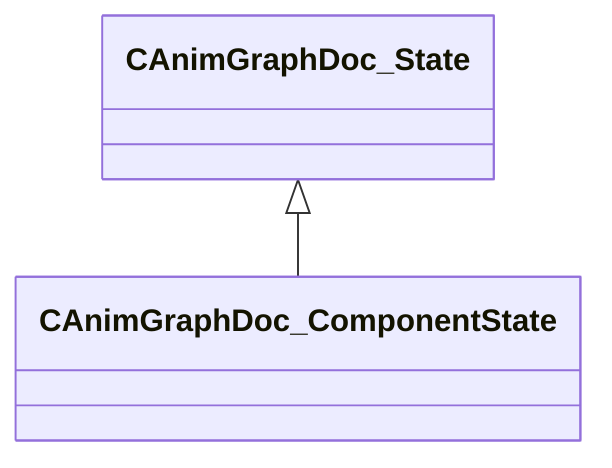

[Schemas](../../schemas.md) / [animgraphdoclib](../animgraphdoclib.md) / CAnimGraphDoc_ComponentState

# CAnimGraphDoc_ComponentState

> Source: **Build 25000182** · 2026-08-28 · `windows-x86_64` · schema `0.10.0`

**Kind:** class · **Size:** 128 bytes (`0x80`) · **Align:** 8 · **Module:** animgraphdoclib

**Inherits from:** [CAnimGraphDoc_State](../animgraphdoclib/CAnimGraphDoc_State.md)

**Relationships:**

## Memory layout

12 fields (0 declared here, 12 inherited). Offsets are absolute from the object base.

| Offset | Field | Type | From | Annotations |
|--------|-------|------|------|-------------|
| `0x28` | `m_transitions` | CUtlVector< CSmartPtr< [CAnimGraphDoc_StateTransition](../animgraphdoclib/CAnimGraphDoc_StateTransition.md) > > | [CAnimGraphDoc_State](../animgraphdoclib/CAnimGraphDoc_State.md) | `MPropertySuppressField` |
| `0x40` | `m_actions` | CUtlVector< [CStateAction](../animgraphdoclib/CStateAction.md) > | [CAnimGraphDoc_State](../animgraphdoclib/CAnimGraphDoc_State.md) | `MPropertySuppressField` |
| `0x58` | `m_name` | CUtlString | [CAnimGraphDoc_State](../animgraphdoclib/CAnimGraphDoc_State.md) | `MPropertyFriendlyName Name` `MPropertySortPriority 100` |
| `0x60` | `m_sComment` | CUtlString | [CAnimGraphDoc_State](../animgraphdoclib/CAnimGraphDoc_State.md) | `MPropertyAttributeEditor TextBlock()` `MPropertyFriendlyName Comment` `MPropertySortPriority -100` |
| `0x68` | `m_stateID` | [AnimStateID](../modellib/AnimStateID.md) | [CAnimGraphDoc_State](../animgraphdoclib/CAnimGraphDoc_State.md) | `MPropertySuppressField` |
| `0x6c` | `m_position` | Vector2D | [CAnimGraphDoc_State](../animgraphdoclib/CAnimGraphDoc_State.md) | `MPropertySuppressField` |
| `0x74` | `m_bIsStartState` | bool | [CAnimGraphDoc_State](../animgraphdoclib/CAnimGraphDoc_State.md) | `MPropertyFriendlyName Start State` |
| `0x75` | `m_bIsEndtState` | bool | [CAnimGraphDoc_State](../animgraphdoclib/CAnimGraphDoc_State.md) | `MPropertyFriendlyName End State` |
| `0x76` | `m_bIsInputToGraph` | bool | [CAnimGraphDoc_State](../animgraphdoclib/CAnimGraphDoc_State.md) | `MPropertyFriendlyName Show Input To Graph` |
| `0x77` | `m_bIsPassthrough` | bool | [CAnimGraphDoc_State](../animgraphdoclib/CAnimGraphDoc_State.md) | `MPropertyFriendlyName Passthrough` |
| `0x78` | `m_bIsPassthroughRootMotion` | bool | [CAnimGraphDoc_State](../animgraphdoclib/CAnimGraphDoc_State.md) | `MPropertyFriendlyName Passthrough Root Motion` |
| `0x79` | `m_bPreEvaluatePassthroughTransitionPath` | bool | [CAnimGraphDoc_State](../animgraphdoclib/CAnimGraphDoc_State.md) | `MPropertyFriendlyName Pre Evaluate Passthrough Transition Path` |

KV3 class defaults

<pre>{
	&quot;_class&quot;: &quot;CAnimGraphDoc_ComponentState&quot;,
	&quot;m_transitions&quot;:
	[
	],
	&quot;m_actions&quot;:
	[
	],
	&quot;m_name&quot;: &quot;Unnamed&quot;,
	&quot;m_sComment&quot;: &quot;&quot;,
	&quot;m_stateID&quot;:
	{
		&quot;m_id&quot;: &lt;HIDDEN FOR DIFF&gt;,
	},
	&quot;m_position&quot;:
	[
		0.000000,
		0.000000
	],
	&quot;m_bIsStartState&quot;: false,
	&quot;m_bIsEndtState&quot;: false,
	&quot;m_bIsInputToGraph&quot;: true,
	&quot;m_bIsPassthrough&quot;: false,
	&quot;m_bIsPassthroughRootMotion&quot;: false,
	&quot;m_bPreEvaluatePassthroughTransitionPath&quot;: false
}</pre>

