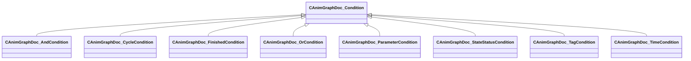

[Schemas](../../schemas.md) / [animgraphdoclib](../animgraphdoclib.md) / CAnimGraphDoc_Condition

# CAnimGraphDoc_Condition

**Kind:** class · **Size:** 40 bytes (`0x28`) · **Align:** 255 · **Module:** animgraphdoclib

**Derived by:** [CAnimGraphDoc_AndCondition](../animgraphdoclib/CAnimGraphDoc_AndCondition.md), [CAnimGraphDoc_CycleCondition](../animgraphdoclib/CAnimGraphDoc_CycleCondition.md), [CAnimGraphDoc_FinishedCondition](../animgraphdoclib/CAnimGraphDoc_FinishedCondition.md), [CAnimGraphDoc_OrCondition](../animgraphdoclib/CAnimGraphDoc_OrCondition.md), [CAnimGraphDoc_ParameterCondition](../animgraphdoclib/CAnimGraphDoc_ParameterCondition.md), [CAnimGraphDoc_StateStatusCondition](../animgraphdoclib/CAnimGraphDoc_StateStatusCondition.md), [CAnimGraphDoc_TagCondition](../animgraphdoclib/CAnimGraphDoc_TagCondition.md), [CAnimGraphDoc_TimeCondition](../animgraphdoclib/CAnimGraphDoc_TimeCondition.md)

**Relationships:**

