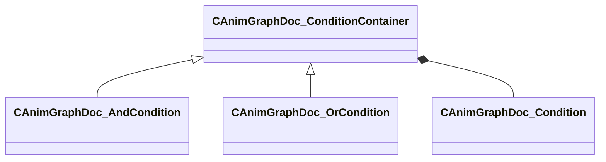

[Schemas](../../schemas.md) / [animgraphdoclib](../animgraphdoclib.md) / CAnimGraphDoc_ConditionContainer

# CAnimGraphDoc_ConditionContainer

> Source: **Build 25000182** · 2026-08-28 · `windows-x86_64` · schema `0.10.0`

**Kind:** class · **Size:** 48 bytes (`0x30`) · **Align:** 8 · **Module:** animgraphdoclib

**Derived by:** [CAnimGraphDoc_AndCondition](../animgraphdoclib/CAnimGraphDoc_AndCondition.md), [CAnimGraphDoc_OrCondition](../animgraphdoclib/CAnimGraphDoc_OrCondition.md)

**Relationships:**

## Memory layout

1 field (1 declared here, 0 inherited). Offsets are absolute from the object base.

| Offset | Field | Type | From | Annotations |
|--------|-------|------|------|-------------|
| `0x8` | `m_conditions` | CUtlVector< CSmartPtr< [CAnimGraphDoc_Condition](../animgraphdoclib/CAnimGraphDoc_Condition.md) > > |  | `MPropertySuppressField` |

KV3 class defaults

<pre>{
	&quot;_class&quot;: &quot;CAnimGraphDoc_ConditionContainer&quot;,
	&quot;m_conditions&quot;:
	[
	]
}</pre>

